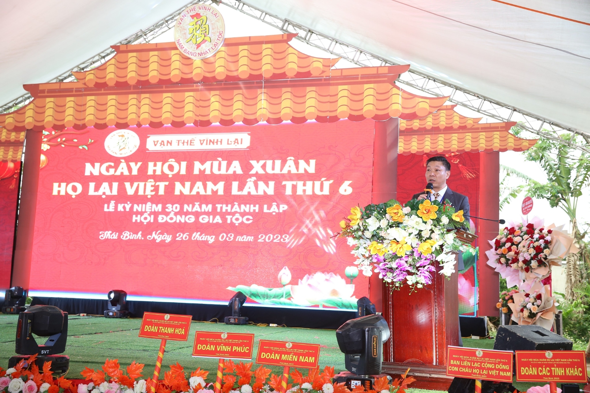

**LỄ KỶ NIỆM 30 NĂM THÀNH LẬP HĐGT VÀ NGÀY HỘI MÙA XUÂN HỌ LẠI VIỆT NAM LẦN THỨ 6**  
**____________**  
**BÀI PHÁT BIỂU CỦA TRƯỞNG BAN LIÊN LẠC CỘNG ĐỒNG CON CHÁU HỌ LẠI VIỆT NAM**

Kính lạy anh linh các bậc Tiên tổ họ Lại  Kính thưa các vị Lãnh đạo địa phương  Kính thưa các Cụ, các ông bà, các Bác, các Cô chú, các anh chị em trong họ Lại Việt Nam  

Lời đầu tiên cho Cháu/em thay mặt cho ban Liên lạc con cháu họ Lại VN (bộ phận trực thuộc HĐGT họ Lại VN) xin gửi lời chào trân trọng nhất tới các vị quan khách, các Cụ, các ông bà, các Bác, các Cô chú, các anh chị em trong họ Lại Việt Nam có mặt trong ngày hội hôm nay cũng như toàn thể các Gia đình họ Lại VN trên mọi miền tổ quốc.  Với Cháu, Được sinh ra trên đời này là một niềm hạnh phúc, được sinh ra là con cháu Họ Lại Việt Nam là đặc ân và hạnh phúc vô bờ.  Hôm nay trong ngày Hội mùa xuân họ Lại Việt Nam lần thứ 6 và kỷ niệm 30 năm ngày thành lập Hội đồng gia tộc cho phép cháu/em điểm lại quá trình hình thành của Ban liên lạc và Ngày hội mùa xuân:  **1. Quá trình hình thành và hoạt động:**

- Ngày 16/6/2013 một nhóm nhỏ gần 10 người con Họ Lại thông qua mạng xã hội Facebook kết nối, thông tin với nhau sau đó ông Lại Huy Anh, anh Lại Anh Tuấn và Lại Tuân khởi xướng hẹn gặp mặt nhau cà phê gặp gỡ với mong muốn kết nối tìm hiểu về dòng họ của mình, hướng về cội nguồn đoàn kết với nhau, hỗ trợ cùng nhau phát triển. Sau một vài lầm gặp gỡ bàn bạc nhóm đi đến thống nhất tổ chức một buổi gặp mặt đầu xuân con cháu họ Lại xuân Giáp Ngọ 23/3/2014 (đây là khởi điểm lần thứ nhất Ngày hội mùa xuân) tại nhà Hàng Phúc Hương Viên cơ sở có Lại Trung là một người con họ Lại là quản lý. Buổi họp mặt vinh dự được đón cụ Lại Thế Tác chủ tịch HĐGT họ Lại Việt Nam, Các cụ các ông bà, cô dì chú bác, anh chị em từ các chi họ Lại VN các tỉnh về dự với số lượng gần 150 người. Và Ban liên lạc lâm thời cũng được hình thành từ thời điểm này. Tại buổi gặp này ban Tổ chức đã tổ chức được buổi giao lưu vui vẻ hạnh phúc. Và cũng thể hiện lòng tôn kính mừng thọ tri ân với các Cụ cao niên trong dòng họ có mặt trong buổi gặp mặt.
- Lần Gặp mặt đầu xuân con cháu họ lại lần thứ 2, 3, 4 được tổ chức vào năm 2015 đến 2017 tại nhà Hàng Sen Hồng Hà Nội do một người con gái họ Lại là chị Lại Thị Hải là chủ nhà hàng hỗ trợ tổ chức. Lần gặp này cũng vinh dự được đón Lại Thế Tác chủ tịch HĐGT họ Lại Việt Nam, Các cụ các ông bà, cô dì chú bác, anh chị em từ các chi họ Lại VN các tỉnh về dự với số lượng 300 người. Lần gặp mặt thứ 4 ngày 12/3/2017 Ban liên lạc cũng chính thức được HĐGT quyết định thành lập chính thức và buổi Gặp mặt đầu xuân con cháu họ Lại được chính thức đổi thành NGÀY HỘI MÙA XUÂN HỌ LẠI VIỆT NAM và được tổ chức 2 năm một lần.
- Ngày hội mùa xuân họ Lại Việt Nam lần thứ 5 ngày 6 mùng 7/4/2019 tại Nam Định do chi Hải Hậu đăng cai tổ chức với hơn 1000 người con họ lại từ khắp miền tổ quốc về tham dự và được các đơn vị thông tin truyền thông của địa phương tham dự đăng tin như một sự kiện văn hóa có tiếng vang lớn tại địa phương. Sự kiện thể hiện sự đoàn kết dòng họ để các dòng họ khác học tập góp phần đoàn kết các dòng họ tại địa phương cùng nhau xây dựng phát triển
- Do dịch bệnh Covid 19 nên Ngày hội mùa xuân họ Lại VN mất 4 năm mới tổ chức lần thứ 6 ngày 25,26/3/2023 tại nơi đây vùng đất tươi đẹp xã Vũ Ninh, Kiến Xương tỉnh Thái Bình với gần 3000 con cháu từ 63 tỉnh thành khắp các miền tổ quốc về tham dự. Thật tự hào xúc động.

**2. Công việc, kết quả Ban liên lạc đã làm từ khi thành lập 2014 đến nay:**

- Trong các lần tổ chức Gặp mặt đầu xuân con cháu họ Lại, Ban LL, ban Tổ chức đã tổ chức tri ân, mừng thọ các bậc cao niên trong dòng họ, khen thưởng khuyến khích con em họ Lại có thành tích học tập tốt .
- Tham gia gặp mặt con cháu họ lại khu vực miền Nam tại TP HCM ngày 23/3/2015.
- Thành lập đội bóng FC Họ Lại Việt Nam , tổ chức giao lưu bóng đá.
- Phát động phong trào lá lành đùm lá rách trong Cộng đồng con cháy Họ Lại Việt Nam
- *Tham gia họp mở rộng với hội đồng gia tộc ngày 25/5/2015, tổ chức dâng hương đền thờ các bậc tiền bối tại một số tỉnh, tổ chức hành hương về đất tổ Thanh Hóa cho con cháu họ lại chưa được về đất tổ*
- Tham gia cùng với Cụ Lại Cao Nguyện, Bác Lại Hồng Khánh cùng các nhà sử học về tham quan, nghiên cứu về Đô úy phò mã Lại Văn Thanh tại Thủy Nguyên Hải Phòng
- Góp công sức số hóa phả họ Lại Việt Nam 2003 để giúp ban tu phả họ Lại năm 2015.
- Hỗ trợ phát hành sách nghiên cứ về cụ Lại Linh
- Kêu gọi quyên góp tiền gửi về tổ ở Thanh Hóa góp phần cùng HĐGT chỉnh trang khu thờ Tổ, chuộc đất nhà thờ, xây dựng chỉnh trang mộ Tổ…)
- Cùng với Ban truyền thông, Hội doanh nhân Lại Việt tham gia tổ chức Lễ cầu siêu tại Tổ ở Thanh Hóa, Ngày hội mùa xuân họ Lại Việt Nam lần thứ 5 ngày 6 mùng 7/4/2019 tại Nam Định, Lễ kỷ niệm 70 năm đón nhận thư khen của Bác Hồ chi họ Lại Phù Vân tại Hà Nam vào tháng 11/2020.
- Đó là những công việc mà BLL đã làm được trong thời gian qua.

**3. Phương hướng hoạt động trong thời gian tới:**

- Tiếp tục hoạt động dưới sự chỉ đạo của HĐGT họ Lại VN theo nhiệm vụ được giao
- Cùng với Ban truyền thông, Hội Doanh nhân họ Lại VN đoàn kết, kết nối tham gia hỗ trợ dòng họ, các chi họ trong công việc và tổ chức các sự kiện
- Kiến nghị HĐGT để bổ sung củng cố nhân sự của Ban LL và mong muốn thành viên trong Ban LL có các nhân sự từ các chi họ, BLL ở các tỉnh, các vùng miền nhằm liên lạc hoạt động tốt hơn, hiệu quả hơn
- Nắm rõ nhân sự Ban Liên Lạc, Hội đồng gia tộc các chi họ ở các địa phương để xây dựng mối quan hệ đoàn kết gắn bó. Động viên con cháu tích cực tham gia các hoạt động xây dựng dòng họ.
- Phấn đấu có được địa điểm (hay có thể gọi là Trụ sở của Ban LL) ở Hà Nội.

Thưa các Cụ, các ông bà, các Bác, các Cô chú, các anh chị em trong họ Lại Việt Nam. Để BLL hoạt động tốt từ khi thành lập đến nay Cháu/em thay mặt cho Ban LL từ trái tim mình trân trọng cảm ơn các bậc Tiền nhân đã lập nước, mở mang bờ cõi, xây dựng đất nước, chiến đấy hy sinh máu xương để bảo vệ biên cương biển đảo đẻ cho 100 họ (trong đó có họ Lại VN) được sống trong thái bình, hạnh phúc. Cảm ơn sự chỉ đạo trực tiếp, quan tâm sâu sát của HĐGT. Sự ủng hộ của các cấp chính quyền địa phương nơi con cháu các chi họ Lại VN sinh sống, làm việc. Sự Kết hợp hiệu quả giữa các tổ chức của dòng họ như ban Truyền thông, Hội doanh nhân Lại Việt. Sự chỉ bảo hướng dẫn, truyền đạt kinh nghiệm của các chú, các anh đi trước, sự nhiệt huyết, năng động đầy trách nhiệm của thế hệ trẻ thanh niên họ Lại. Đặc biệt là sự đóng góp công sức, của cải vật chất, tinh thần của các con, cháu, dâu rể, doanh nghiệp của con cháu họ Lại VN trên cả nước.  Cuối cùng xin chúc toàn thể con cháu họ Lại VN luôn mạnh khỏe, hạnh phúc, đoàn kết, phát triển thịnh vượng và trường tồn mãi mãi.
