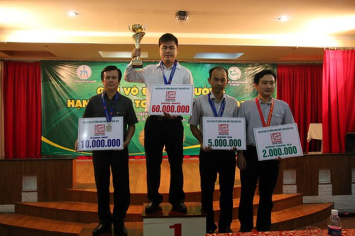

Cho đến nay, việc đại kiện tướng cờ vua Lê Quang Liêm giành hơn 70.000 USD tiền thưởng từ ba giải đấu quốc tế trong năm 2015 vẫn là kỷ lục khó phá của làng thể thao Việt Nam. Cờ vua rất phổ biến trên thế giới, đến mức các giải thi đấu ở mọi cấp độ đều không khó để vận động tài trợ từ nhiều nguồn khác nhau. Những kỳ thủ tên tuổi vì thế cũng đủ sức “sống khỏe” với nghề bằng chính tài năng của mình như trường hợp của Lê Quang Liêm.

*Kỳ thủ Lại Lý Huynh*

Cờ tướng có phần hiu hắt hơn khi số lượng người chơi ít, đa phần chỉ tập trung ở châu Á nên việc tìm kiếm kinh phí dành cho loại hình thể thao trí tuệ này cũng theo đó mà gian nan hơn rất nhiều so với người anh em cờ vua. Tuy vậy, tương tự Lê Quang Liêm, danh kỳ số 1 Việt Nam Lại Lý Huynh cũng cho thấy cứ hết lòng với niềm đam mê của mình, thường xuyên trau dồi kỳ nghệ, cờ sẽ không phụ lòng người chơi.

*Lại Lý Huynh nhận phần thưởng danh hiệu á quân Hàn Tín bôi 2016*

Năm 2016 vừa qua, kỳ thủ quê Cà Mau đang khoác áo đội tuyển Bình Dương này liên tiếp gặt hái thành công ở các giải quốc tế như Dương Quan Lân bôi (vô địch bảng hải ngoại), Hàn Tín bôi (á quân), Cúp các danh thủ Phương Trang (á quân), Giải cờ tướng Trí lực thế giới (hạng 4), Giải vô địch đồng đội châu Á (HCB) cùng với tấm HCV Giải Vô địch quốc gia và ngôi vô địch Kỳ vương ở mặt trận quốc nội. Tiền thưởng đến từ những chiến tích kể trên vượt mức nửa tỉ đồng, chưa kể các khoản thu nhập từ việc đấu thuê cho CLB cờ Hàng Châu tập đoàn trong thời gian gần nửa năm (bao gồm tiền bồi dưỡng hàng tháng, tiền thưởng cho từng trận đấu tại Giải Vô địch đồng đội Trung Quốc – Giáp cấp liên tái), từ nguồn tài trợ của các mạnh thường quân giấu tên và từ chế độ của ngành thể thao Bình Dương, cũng xấp xỉ nửa tỉ đồng!

*Lại Lý Huynh lần thứ ba giành ngôi vô địch Việt Nam*

Không ai nghĩ cách đây chừng 5 năm, kỳ thủ trẻ tài năng bậc nhất của cờ tướng Việt Nam suýt phải giải nghệ vì những vướng mắc với cơ quan chủ quản lúc bấy giờ là ngành TDTT Cà Mau. Mảnh đất quê hương cưu mang Huynh rất nhiều, kể cả nâng bước anh trong nghiệp cờ nhưng chắc chắn đấy không thể là nơi đưa tài năng của anh lên đỉnh cao khi thiếu thốn mọi điều kiện hỗ trợ chuyên môn. Tha thiết xin ra đi để tìm kiếm bến đỗ mới nhưng cách làm có phần tiêu cực của chàng trai mới 21 tuổi non nớt kinh nghiệm đường đời đã khiến anh phải trả giá bằng hai năm bị cấm thi đấu, kể cả khi được triệu tập vào đội tuyển quốc gia.

Để lo chuyện sinh kế cho bản thân và gia đình, Lại Lý Huynh không còn cách nào khác ngoài việc phải vừa đi dạy cờ, vừa tranh thủ tham gia các giải phong trào kiếm giải thưởng độ nhật. Cũng đã có lúc, anh nghĩ đến việc nghỉ chơi cờ, dự định vay mượn người quen để “xoay” chuyện kinh doanh.

*Lại Lý Huynh nổi tiếng về phong thái thi đấu tự tin, lịch lãm*

Mê cờ từ bé với người thầy đầu tiên là cha của mình, lại được tập luyện ở đội tuyển trẻ Cà Mau từ rất sớm, thành tích đầu tiên của Huynh là chức vô địch giải trẻ toàn quốc 2003 khi mới 14 tuổi. Không dễ dàng dứt bỏ niềm đam mê này, Lại Lý Huynh nhận lời đầu quân cho Bình Dương năm 2012 và từ đây, một chặng mới trong cuộc đời anh được mở ra. Có nguồn thu nhập ổn định, môi trường phát triển lý tưởng, Huynh tập trung “dùi mài kinh sử” chờ ngày trở lại đấu trường đỉnh cao thay vì lê la ở các sân đấu phủi.

Anh giành HCV cá nhân tại Giải Vô địch đồng đội toàn quốc 2012, giành chức vô địch toàn quốc các năm 2013, 2014, 2016. Theo giới chuyên môn, sau thời kỳ của các đại cao thủ như Mai Thanh Minh, Trềnh A Sáng, Trương Á Minh và Nguyễn Thành Bảo, kỳ thủ 26 tuổi Lại Lý Huynh hội đủ mọi yếu tố để thống lĩnh kỳ đài Việt trong nhiều năm nữa. Anh thuộc làu cũng như nắm vững những điểm mạnh, yếu của nhiều ván cờ hay thông qua việc nghiên cứu có chiều sâu và hết sức khoa học. Khả năng khai, trung và tàn cuộc được đồng nghiệp đánh giá rất cao, Lại Lý Huynh còn thể hiện được phong cách thi đấu điềm tĩnh, vững vàng nhưng cực kỳ sâu sắc với kỹ thuật công thủ toàn diện.

*Tham dự giải vô địch thế giới*

Trong rủi có may… Giới cờ vẫn đồng ý với nhau rằng, ngoài sự cố bị kỷ luật năm nào, Lại Lý Huynh chính là kỳ thủ có “quới nhân độ mệnh”. Nhiều câu chuyện ngỡ như giai thoại để nhắc đến những mạnh thường quân giấu tên thường xuyên bảo trợ cho Huynh, giúp anh không phải bận tâm đến việc sinh kế hầu chuyên tâm vào việc trau dồi kỳ nghệ. Trong căn nhà nhỏ nhưng đầy đủ tiện nghi tại Bình Dương, Huynh thường xuyên tập luyện với đầy đủ phương tiện hỗ trợ, từ máy tính cấu hình cực mạnh cùng các phần mềm cờ tướng hiện đại nhất được đặt mua khá tốn kém.

*Lại Lý Huynh: Đam mê, nghề không phụ người*

Đó là lý do để giờ đây, anh không có đối thủ xứng tầm trong nước với sức cờ ngang ngửa các kỳ thủ thuộc Top 30 Trung Quốc, đủ để khiến một đội cờ nước này phải mời đích danh anh sang góp sức, điều chưa từng có trong lịch sử! Như chính Huynh tâm sự, anh cần rèn thêm các thế tàn cuộc, vốn là sở trường của các “dị nhân” của làng cờ Hoa lục, để có thể khắc chế chính họ mỗi lần có cơ hội đối mặt. Không nói đâu xa, tại Giải Các danh thủ Phương Trang vừa qua, anh buộc phải nhường ngôi vô địch cho Trịnh Nhất Hoằng, người có lối đánh khai cuộc khá tệ nhưng tàn cuộc cực kỳ siêu đẳng, thứ vũ khí giúp đội trưởng CLB cờ tỉnh Hạ Môn (Trung Quốc) loại bỏ mọi đối thủ trên đường tiến vào trận chung kết với chính Lại Lý Huynh.

*Lại Lý Huynh tại Giải Liên minh trí lực thế giới 2016*

Nếu chỉ có thế, hẳn Lại Lý Huynh khó có thể được xem như là “báu vật làng cờ”… Không chỉ tỏa sáng trên kỳ đài, cuộc sống đời thường của nhà vô địch này hầu như không vướng điều tiếng gì khi chẳng sa đà vào chuyện rượu chè, cờ bạc hay quan hệ tình cảm phức tạp. Đây mới chính là điều khiến đồng đạo làng cờ nể phục bản lĩnh sống của chàng trai 26 tuổi này.

Dẫu còn nhiều điều thị phi nhưng ít ra, trong mắt người hâm mộ trong và ngoài nước, cờ tướng Việt vẫn có những chuẩn mực vô giá, trong đó có cả tư cách và kỳ nghệ của nhà vô địch Lại Lý Huynh.

**Đào Tùng - Ảnh: Đ.Linh - P.Trung (Báo mới)**
