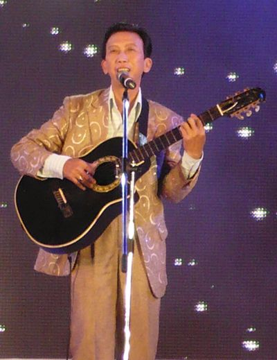
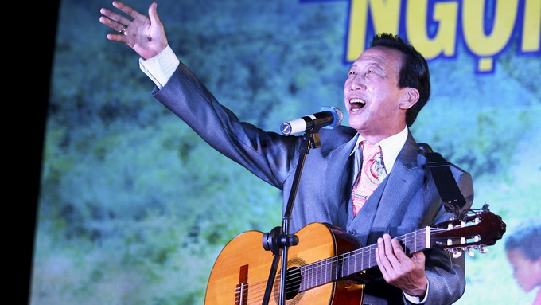
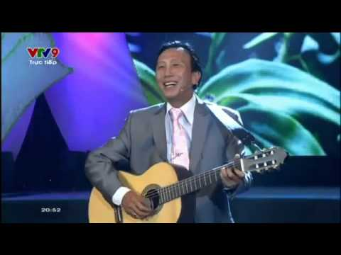

Việc học của ông bị gián đoạn sau [sự kiện 30 tháng 4 năm 1975](https://vi.wikipedia.org/wiki/S%E1%BB%B1_ki%E1%BB%87n_30_th%C3%A1ng_4_n%C4%83m_1975 "Sự kiện 30 tháng 4 năm 1975"). Với tính cách thiên về [hoạt động xã hội](https://vi.wikipedia.org/wiki/Ho%E1%BA%A1t_%C4%91%E1%BB%99ng_x%C3%A3_h%E1%BB%99i "Hoạt động xã hội") và đam mê ca hát, ông bắt đầu tham gia hoạt động phong trào văn nghệ quần chúng. Năm 1977, ông theo học chương trình [Trung cấp Thanh nhạc](https://vi.wikipedia.org/w/index.php?title=Trung_c%E1%BA%A5p_Thanh_nh%E1%BA%A1c&action=edit&redlink=1 "Trung cấp Thanh nhạc (trang chưa được viết)") của [Đoàn nghệ thuật Bông Sen](https://vi.wikipedia.org/w/index.php?title=%C4%90o%C3%A0n_ngh%E1%BB%87_thu%E1%BA%ADt_B%C3%B4ng_Sen&action=edit&redlink=1 "Đoàn nghệ thuật Bông Sen (trang chưa được viết)"), được đào tạo bởi những nghệ sĩ lừng danh bấy giờ như [Nghệ sĩ Nhân dân](https://vi.wikipedia.org/wiki/Ngh%E1%BB%87_s%C4%A9_Nh%C3%A2n_d%C3%A2n "Nghệ sĩ Nhân dân") [Quốc Hương](https://vi.wikipedia.org/wiki/Qu%E1%BB%91c_H%C6%B0%C6%A1ng "Quốc Hương"), Nghệ sĩ Ưu tú Thanh Trì, Nghệ sĩ Ưu tú [Mỹ An](https://vi.wikipedia.org/wiki/M%E1%BB%B9_An "Mỹ An"), nhạc sĩ [Xuân Hồng](https://vi.wikipedia.org/wiki/Xu%C3%A2n_H%E1%BB%93ng "Xuân Hồng")... Năm 1978, ông tham gia Câu lạc bộ Sáng tác trẻ của Thành đoàn thành phố Hồ Chí Minh, cùng thời với [Thu Nở](https://vi.wikipedia.org/w/index.php?title=Thu_N%E1%BB%9F&action=edit&redlink=1 "Thu Nở (trang chưa được viết)"), [Đình Huấn](https://vi.wikipedia.org/w/index.php?title=%C4%90%C3%ACnh_Hu%E1%BA%A5n&action=edit&redlink=1 "Đình Huấn (trang chưa được viết)"), [Sĩ Thanh](https://vi.wikipedia.org/w/index.php?title=S%C4%A9_Thanh&action=edit&redlink=1 "Sĩ Thanh (trang chưa được viết)"), [Cẩm Vân](https://vi.wikipedia.org/w/index.php?title=C%E1%BA%A9m_V%C3%A2n&action=edit&redlink=1 "Cẩm Vân (trang chưa được viết)")…

Năm 1980, ông tốt nghiệp Trung cấp âm nhạc, trở thành một trong hai giọng ca được Đoàn nghệ thuật Bông Sen chính thức tuyển chọn, trở thành đơn ca chính của đoàn nghệ thuật này, tham gia nhiều chương trình âm nhạc của Hội Âm nhạc và các đoàn nghệ thuật thành phố Hồ Chí Minh. Năm 1982, ông bắt đầu sự nghiệp sáng tác, với tác phẩm đầu tay "Khi bong bóng bay" được công chúng đón nhận. Năm 1983, trong một chuyến lưu diễn phục vụ bộ đội chiến đấu tại biên giới phía Bắc, ông đã sáng tác ca khúc "Hát về anh". Ca khúc nhanh chóng phổ biến và đem lại danh tiếng cho ông chỉ sau khi sáng tác được 2 tác phẩm.

Năm 1986, ông cùng Đoàn nghệ thuật Bông Sen đi biểu diễn phục vụ bộ đội ở mặt trận 479 ([Xiêm Riệp](https://vi.wikipedia.org/wiki/Xi%C3%AAm_Ri%E1%BB%87p "Xiêm Riệp"), [Campuchia](https://vi.wikipedia.org/wiki/Campuchia "Campuchia")) và sáng tác ca khúc "Nhánh lan rừng". Một lần nữa, bài hát về chủ đề người lính của ông được công chúng hoan nghênh nhiệt liệt. Bên cạnh đó, ông cũng sáng tác nhiều bài hát về chủ đề Thanh niên xung phong như "Chuyện ngày xưa chuyện ngày nay", "Hát trên nông trường xanh"...

Năm 1987, ông rời đoàn Đoàn nghệ thuật Bông Sen và trở thành ca sĩ tự do. Năm 1995, ông theo học bậc Đại học tại chức khoa [Sáng tác](https://vi.wikipedia.org/w/index.php?title=S%C3%A1ng_t%C3%A1c&action=edit&redlink=1 "Sáng tác (trang chưa được viết)") và [Thanh nhạc](https://vi.wikipedia.org/wiki/Thanh_nh%E1%BA%A1c "Thanh nhạc") tại [Nhạc viện Thành phố Hồ Chí Minh](https://vi.wikipedia.org/wiki/Nh%E1%BA%A1c_vi%E1%BB%87n_Th%C3%A0nh_ph%E1%BB%91_H%E1%BB%93_Ch%C3%AD_Minh "Nhạc viện Thành phố Hồ Chí Minh"). Năm 1999, ông tốt nghiệp loại giỏi cả hai ngành về thanh nhạc và sáng tác.

Tháng 12 năm 2009, ông mở hội quán mang tên Nhánh lan rừng nằm trong Công ty Trách nhiệm hữu hạn Văn hóa nghệ thuật Nhánh lan rừng do vợ ông làm giám đốc và trực tiếp điều hành tại thành phố Hồ Chí Minh.

Nhạc sĩ Thế Hiển đã được [Nhà nước Việt Nam](https://vi.wikipedia.org/wiki/Nh%C3%A0_n%C6%B0%E1%BB%9Bc_Vi%E1%BB%87t_Nam "Nhà nước Việt Nam") phong tặng danh hiệu [Nghệ sĩ Ưu tú](https://vi.wikipedia.org/wiki/Ngh%E1%BB%87_s%C4%A9_%C6%AFu_t%C3%BA "Nghệ sĩ Ưu tú") vào năm 2012.

Cho tới năm 2013, Thế Hiển là một nhạc sĩ, ca sĩ chưa có album, tập nhạc nào, ông tiếp tục sáng tác và âm thầm thu thanh các ca khúc của mình.Hiện ông làm việc tại Công ty Trách nhiệm hữu hạn Nhánh Lan Rừng và là Ủy viên Ban chấp hành Hội cứu trợ trẻ em khuyết tật TP Hồ Chí Minh. Ngoài việc đào tạo ca sĩ, ông dành nhiều thời gian cho việc sáng tác ca khúc, tham gia những chuyến đi thực tế, biểu diễn từ thiện và đến các đơn vị bộ đội ở [biên giới](https://vi.wikipedia.org/wiki/Bi%C3%AAn_gi%E1%BB%9Bi "Biên giới"), [hải đảo](https://vi.wikipedia.org/wiki/H%E1%BA%A3i_%C4%91%E1%BA%A3o "Hải đảo")…

*Nhạc sỹ Lại Thế Hiển*

 

## Chủ đề và phong cách sáng tác

Những sáng tác của Thế Hiển rất đa dạng với nhiều đề tài: nhạc phong trào, [tình ca](https://vi.wikipedia.org/wiki/T%C3%ACnh_ca "Tình ca"), [tình bạn](https://vi.wikipedia.org/wiki/T%C3%ACnh_b%E1%BA%A1n "Tình bạn"), tình yêu trẻ thơ, tình mẫu tử, tình đồng đội... Là ủy viên Hội Cứu trợ trẻ em tàn tật Thành phố Hồ Chí Minh, Thế Hiển đã dành rất nhiều tâm huyết để viết các ca khúc về đề tài xã hội, về những nạn nhân [chất độc màu da cam](https://vi.wikipedia.org/wiki/Ch%E1%BA%A5t_%C4%91%E1%BB%99c_m%C3%A0u_da_cam "Chất độc màu da cam"), những đứa trẻ mồ côi lang thang cơ nhỡ, người dân bị thiên tai lũ lụt. Mỗi sáng tác của ông đều do ông kiểm tra bằng chính tiếng hát của mình. Cho tới năm 2013, ông đã sáng tác gần 100 ca khúc, trong đó khoảng 40 bài được phổ biến, ngoài ra còn có những bài hát chưa được công bố. Ông được nhận xét là người viết không nhiều nhưng viết chắc tay, viết bài nào định hình được bài đó. Âm nhạc của Thế Hiển giản dị, những ca khúc của ông không cầu kỳ, không có nhiều biến âm, không nhiều kỹ thuật cổ điển mà mang phong cách [nhạc nhẹ](https://vi.wikipedia.org/wiki/Nh%E1%BA%A1c_nh%E1%BA%B9 "Nhạc nhẹ") với âm hưởng dân ca. Ông đều nghiên cứu trước khi viết chủ đề, có sự đào sâu suy nghĩ và tìm chất liệu của từng vùng miền khi áp dụng một số điệu thức dân ca vào ca khúc của mình.  
 

 

## Tác phẩm

 

Cho tới năm 2013, ông đã sáng tác gần 100 ca khúc, trong đó khoảng 40 bài được phổ biến, ngoài ra còn có những bài hát chưa được công bố. Ngoài ra ông còn đặt lời cho các ca khúc "[Triệu đóa hoa hồng](https://vi.wikipedia.org/wiki/Tri%E1%BB%87u_%C4%91%C3%B3a_hoa_h%E1%BB%93ng "Triệu đóa hoa hồng")" - một bài hát [Nga](https://vi.wikipedia.org/wiki/Nga "Nga") nổi tiếng từ những năm 1980.

Những sáng tác tiêu biểu của nhạc sĩ Thế Hiển:

	*Danh sách này [không đầy đủ](https://vi.wikipedia.org/wiki/Th%E1%BB%83_lo%E1%BA%A1i:Danh_s%C3%A1ch_kh%C3%B4ng_%C4%91%E1%BA%A7y_%C4%91%E1%BB%A7 "Thể loại:Danh sách không đầy đủ"); bạn có thể giúp đỡ bằng cách [mở rộng nó](https://vi.wikipedia.org/w/index.php?title=Th%E1%BA%BF_Hi%E1%BB%83n&action=edit)*.

1. Khi bong bóng bay (1982)
2. Hát về anh (còn có tên là "Hát về anh người chiến sĩ biên cương", 1983, khen thưởng của Ủy ban Nhân dân Thành phố năm 1985)
3. Nhánh lan rừng
4. Vỏ ốc biển
5. Nỗi nhớ từ đảo xa
6. Tiếng hát trên đảo Sơn Ca
7. Khúc hát tự hào HQ 561
8. Tóc em đuôi gà
9. Cho dù có đi nơi đâu
10. Chuyện lứa đôi
11. Em nghe nói
12. Em không biết
13. Bốn mắt anh yêu
14. Hoài niệm dấu yêu
15. Đợi chờ trong cơn mưa
16. Chuyện đời xưa chuyện ngày nay
17. Mỗi trái tim một tấm lòng
18. Người mẹ và hoa sứ trắng
19. Hát trên nông trường xanh
20. Hành khúc thanh niên tình nguyện...
21. Người phu xe
22. Dấu chấm hỏi (giải ba cuộc vận động sáng tác của [Trung ương Đoàn Thanh niên Cộng sản Hồ Chí Minh](https://vi.wikipedia.org/wiki/Trung_%C6%B0%C6%A1ng_%C4%90o%C3%A0n_Thanh_ni%C3%AAn_C%E1%BB%99ng_s%E1%BA%A3n_H%E1%BB%93_Ch%C3%AD_Minh "Trung ương Đoàn Thanh niên Cộng sản Hồ Chí Minh"))
23. Nhong nhong nhong
24. Hoàng hôn màu tím
25. Đây Mỹ Sơn huyền thoại
26. Tây Nguyên mùa hè xanh…
27. Tuần Châu đảo ngọc
Theo: [https://vi.wikipedia.org/wiki/Th%E1%BA%BF_Hi%E1%BB%83n](https://vi.wikipedia.org/wiki/Th%E1%BA%BF_Hi%E1%BB%83n)
