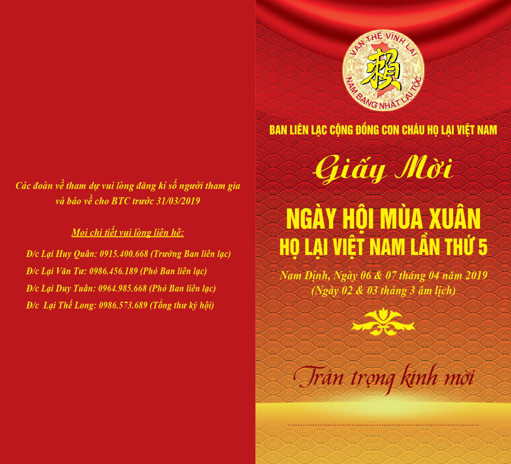
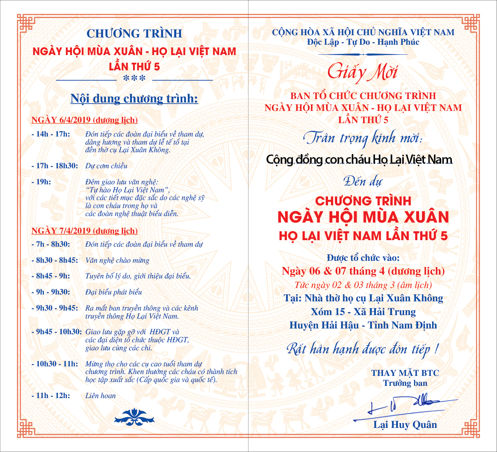

Với những người con Họ Lại Việt Nam thì Mùa xuân còn là mùa gặp gỡ giao lưu thắm tình đoàn kết. Cứ 2 năm 1 lần mọi người lại tổ chức gặp mặt để sẻ chia, để thăm hỏi và cùng chúc nhau luôn mạnh khỏe, hạnh phúc và bình an.

Nối tiếp thành công của 4 lần tổ chức gặp mặt giao lưu trước đây. Năm nay, Ban Liên Lạc cộng đồng con cháu Họ Lại Việt Nam phối hợp cùng hội Doanh Nhân Lại Việt và Ban truyền thông tổ chức :"Ngày hội mùa xuân - Họ Lại Việt Nam".

Chương trình năm nay sẽ diễn ra trong 2 ngày mùng 6 và mùng 7 tháng 4 dương lịch. Với sự tham dự của hàng nghìn người con Họ Lại từ các chi trong cả nước. Đặc biệt, ban liên lạc đã có sự thay đổi về địa điểm tổ chức ( 2 năm 1 lần tại các tỉnh khác nhau). Năm nay sẽ diễn ra tại Nam định nơi gắn liền với các vị tiền nhân như cụ Lại Thế Vinh, Lại Xuân Không đều là các vị anh hùng đất Nước (Sẽ có bài viết giới thiệu sau).  

 

Về nội dung, Năm nay chương trình sẽ được tổ chức quy mô và đặc sắc với đêm giao lưu văn hóa văn nghệ (Đêm mùng 6) tới từ các văn nghệ sỹ nổi tiếng là con em trong họ cũng như ngoài họ, biểu diễn trên nền sân khấu rộng lớn chuyện nghiệp. Ngày gặp mặt giao lưu chính (Ngày mùng 7) sẽ là cơ hội gặp mặt giao lưu của hàng ngàn người con Họ Lại cả nước, mọi người sẽ có cơ hội biết về lịch sử dòng họ, về truyền thống tốt đẹp của cha ông truyền lại và cũng là dịp để mọi người biết thêm những chi họ Lại trong cả nước.

Địa điểm tổ chức:  
Đền Thờ Cụ : Lại Xuân Không  
Địa Chỉ :Xóm 15- Xã Hải Trung - Hải Hậu - Nam Định.  
.........................................................  
Các đoàn đăng kí về tham dự vui lòng liên hệ:

Đ/c Lại Huy Quân :0915 400 668 (Trưởng ban Liên lạc)  
Đ/c Lại Văn Tư : 0986456189 (Phó BLL)  
Đ/c Lại Duy Tuân: 0981 026 170 (Phó BLL)  
Đ/c : Lại Thế Long :0986573689 Tổng thư ký hội  
Các đoàn đăng kí vui lòng đăng kí số lượng người tham dự.

Note:  
- kinh phí dự trù :  
+ 70.000 VNđ/ thành viên tham dự nếu ăn 1 bữa mùng 6.  
+ 140.000 Vnđ/ Thành viên tham dự nếu ăn 2 bữa tối mùng 6 và trưa mùng 7.  

Theo: Tony Lai
