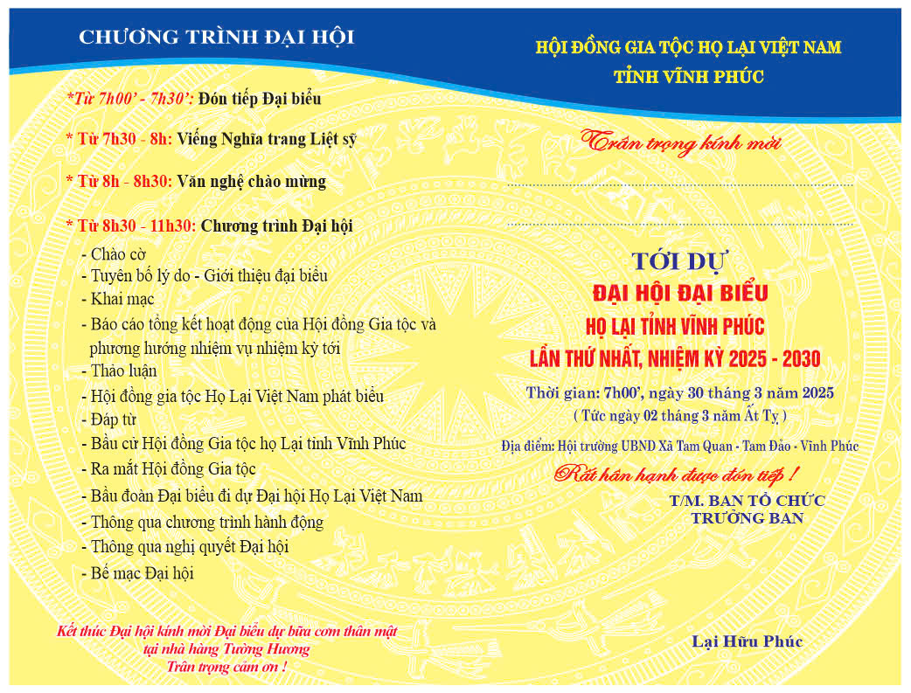

Nhằm củng cố tình đoàn kết, kết nối các chi họ và xây dựng phương hướng hoạt động lâu dài, Hội đồng Gia tộc Họ Lại tỉnh Vĩnh Phúc tổ chức **Đại hội Đại biểu Họ Lại lần thứ nhất, nhiệm kỳ 2025 - 2030**. Đây là một dấu mốc quan trọng, thể hiện sự thống nhất, quyết tâm và tinh thần trách nhiệm của con cháu dòng tộc.

Họ Lại tại Vĩnh Phúc có từ rất lâu đời, với nhiều nhánh chi họ sinh sống và phát triển qua nhiều thế hệ. Bà con nơi đây luôn giữ gìn truyền thống hiếu học, đạo lý gia phong và tinh thần yêu nước.  
Trong suốt chiều dài lịch sử, nhiều người con của Họ Lại tại Vĩnh Phúc đã đỗ đạt, trở thành những bậc danh nhân khoa bảng, sĩ phu yêu nước, góp phần xây dựng quê hương và đất nước. Ngày nay, thế hệ trẻ của dòng họ tiếp tục phát huy truyền thống, đạt được nhiều thành tích trong học tập và công việc, ghi dấu ấn trên nhiều lĩnh vực từ khoa học, giáo dục, kinh tế đến văn hóa, nghệ thuật.  
Người Họ Lại tại Vĩnh Phúc luôn gắn bó, giúp đỡ nhau trong cuộc sống. Các hoạt động kết nối, giao lưu thường xuyên được tổ chức để tăng cường tình cảm họ hàng, đồng thời hỗ trợ những gia đình khó khăn, động viên các em học sinh, sinh viên có thành tích xuất sắc.  
Trong các cuộc kháng chiến bảo vệ tổ quốc, nhiều người con của Họ Lại tại Vĩnh Phúc đã anh dũng chiến đấu, hy sinh vì độc lập, tự do của dân tộc. Điều đó thể hiện rõ tinh thần trách nhiệm và lòng yêu nước sâu sắc của dòng họ.

Đại hội sẽ diễn ra vào **7h00 ngày 30/3/2025 (tức ngày 02/3 năm Ất Tỵ)** tại **Hội trường UBND xã Tam Quan, huyện Tam Đảo, tỉnh Vĩnh Phúc** với nhiều nội dung quan trọng:

🔹 **Viếng Nghĩa trang Liệt sĩ** – Thể hiện lòng tri ân đối với những bậc tiền nhân đã hy sinh vì quê hương.  
🔹 **Văn nghệ chào mừng** – Những tiết mục đặc sắc mang đậm nét văn hóa truyền thống.  
🔹 **Báo cáo tổng kết hoạt động của Hội đồng Gia tộc** trong nhiệm kỳ qua và định hướng nhiệm kỳ tới.  
🔹 **Bầu cử Hội đồng Gia tộc Họ Lại tỉnh Vĩnh Phúc** – Lựa chọn những người có tâm huyết và trách nhiệm để lãnh đạo hoạt động của dòng họ.  
🔹 **Kết nối doanh nhân, tri thức, thế hệ trẻ** – Phát huy sức mạnh của cộng đồng Họ Lại trong phát triển kinh tế, giáo dục và văn hóa.

Sau khi kết thúc Đại hội, các đại biểu sẽ tham gia bữa cơm thân mật tại **nhà hàng Tường Hưng**, tiếp tục giao lưu và thắt chặt tình thân ái.

Đại hội Đại biểu Họ Lại tỉnh Vĩnh Phúc lần thứ nhất không chỉ là một sự kiện quan trọng của dòng họ mà còn là dịp để mỗi người con Họ Lại nhìn lại truyền thống vẻ vang, hướng về cội nguồn và chung tay xây dựng tương lai. Đây cũng là cơ hội để thế hệ trẻ học hỏi, tiếp nối những giá trị tốt đẹp của cha ông.  
**Trân trọng kính mời toàn thể bà con, con cháu Họ Lại xa gần về tham dự và góp phần tạo nên một kỳ đại hội thành công, đánh dấu bước phát triển mới của Hội đồng Gia tộc Họ Lại tỉnh Vĩnh Phúc!**

**TM. BAN TỔ CHỨC  
TRƯỞNG BAN  

Lại Hữu Phúc**
