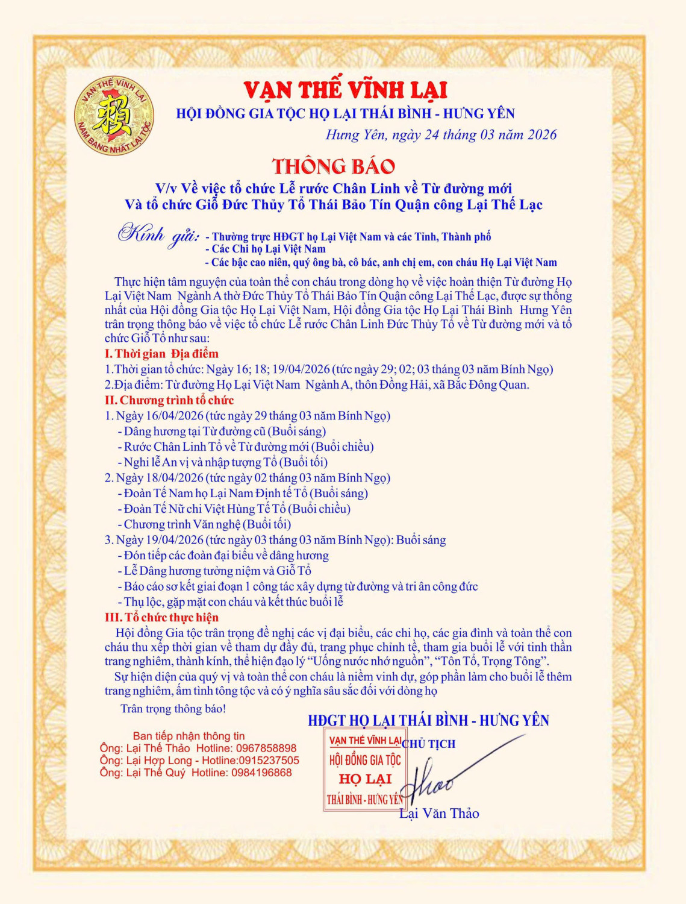
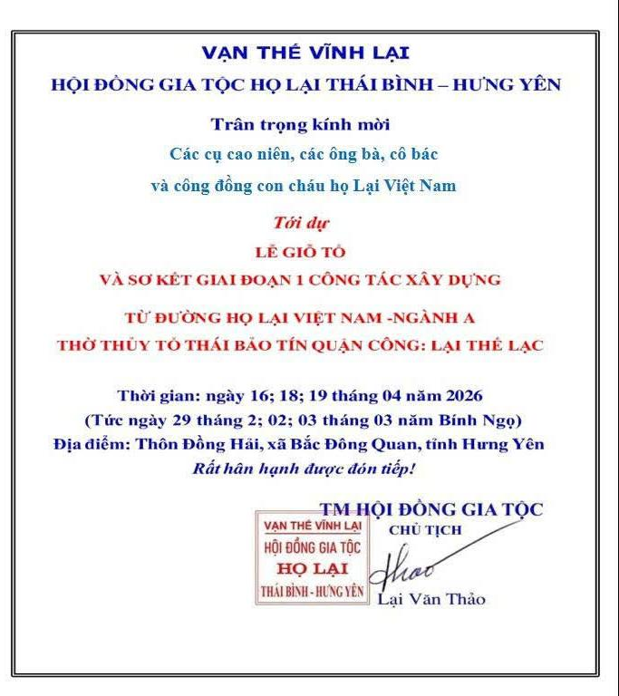
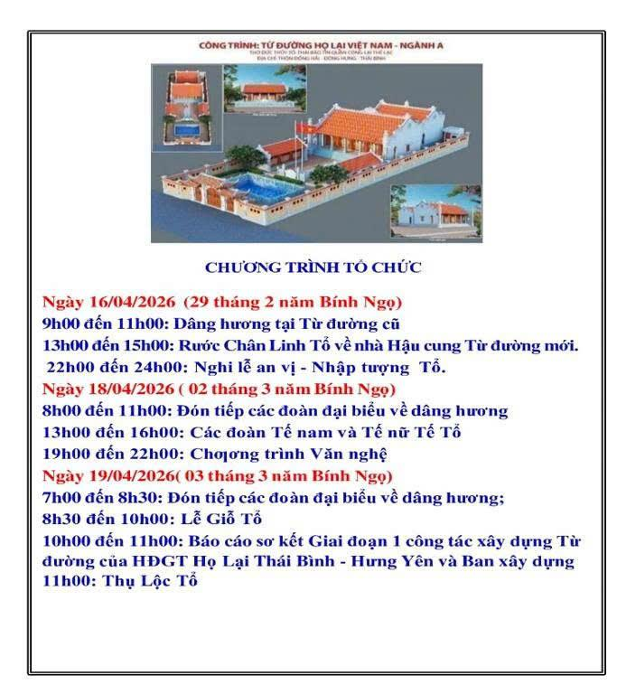

Thực hiện tâm nguyện của toàn thể con cháu dòng họ về việc hoàn thiện Từ đường Họ Lại Việt Nam — Ngành A thờ **Đức Thủy Tổ Thái Bảo Tín Quận Công Lại Thế Lạc**, được sự thống nhất của Hội đồng Gia tộc Họ Lại Việt Nam và Hội đồng Gia tộc Họ Lại Thái Bình – Hưng Yên, Hội đồng Gia tộc trân trọng thông báo về việc tổ chức Lễ Rước Chân Linh Đức Thủy Tổ về Từ đường mới và tổ chức mời **Giỗ Tổ vào các ngày 16, 18 và 19 tháng 04 năm 2026 (tức ngày 29, mùng 02 và mùng 03 tháng 03 năm Bính Ngọ) tại Từ đường Họ Lại Việt Nam — Ngành A, thôn Đông Hải, xã Bắc Đông Quan.**

Hội đồng Gia tộc trân trọng kính mời các vị đại biểu, các chi họ, các gia đình và toàn thể con cháu Họ Lại Việt Nam thu xếp thời gian về tham dự đầy đủ, trang phục chỉnh tề, cùng hướng về cội nguồn với tinh thần trang nghiêm, thành kính, thể hiện đạo lý "Uống nước nhớ nguồn", "Tôn Tổ, Trọng Tông". Sự hiện diện của quý vị và toàn thể con cháu là niềm vinh dự, góp phần làm cho buổi lễ thêm trang nghiêm, ấm tình tông tộc và có ý nghĩa sâu sắc đối với dòng họ.

*(Chi tiết chương trình tổ chức và thông tin liên hệ xin xem trong Thông báo đính kèm)*  

