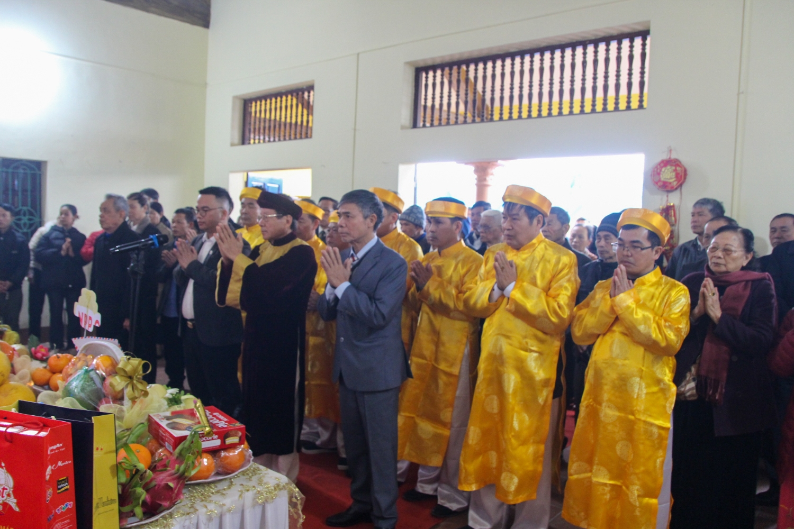
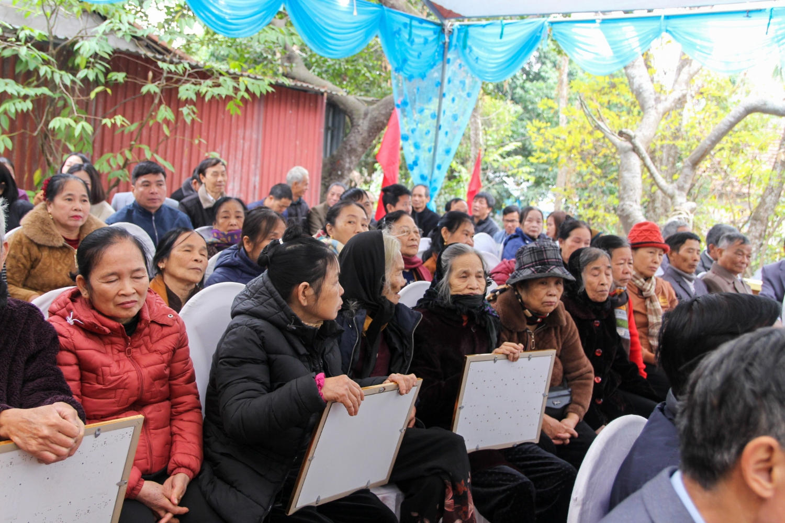
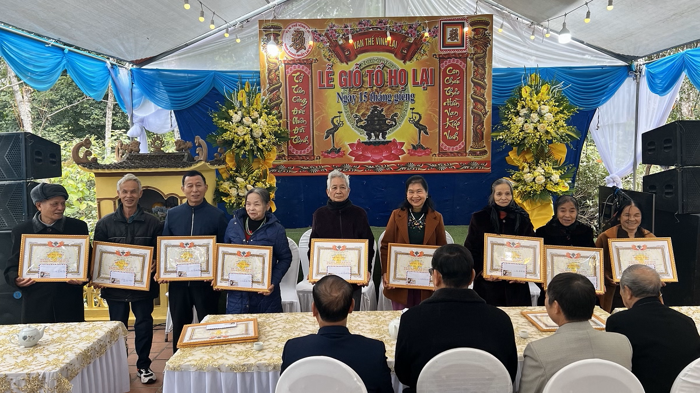
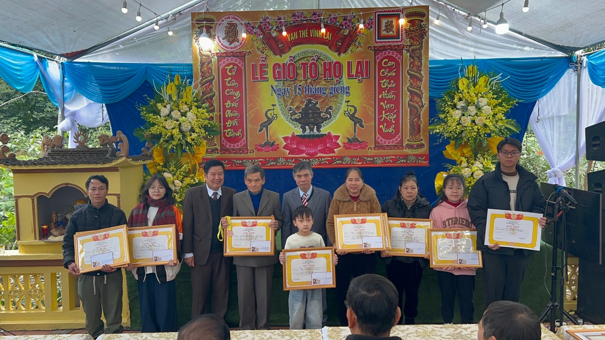

Buổi lễ được tổ chức trong không khí trang nghiêm, bắt đầu với nghi thức dâng hương và lễ tế, nơi con cháu cùng nhau tưởng nhớ công lao của Đức Triệu Tổ Lại Thế Tiên. Lễ mừng thọ dành cho các bậc cao niên trong dòng họ được diễn ra ngay sau đó, thể hiện tinh thần tôn kính và đạo hiếu truyền thống của con cháu đối với thế hệ đi trước.

 

Một trong những điểm nhấn ý nghĩa của buổi lễ là hoạt động vinh danh và khen thưởng các cháu có thành tích học tập xuất sắc. Đây là động lực lớn lao để thế hệ trẻ tiếp tục phát huy truyền thống hiếu học, nỗ lực học tập và rèn luyện để đóng góp vào sự phát triển của gia đình và xã hội.  
 

Bên cạnh những nghi thức trang trọng, hội nghị phương hướng và kế hoạch hoạt động của Hội đồng gia tộc cũng được tổ chức. Tại đây, các thành viên đã cùng nhau thảo luận, đóng góp ý kiến nhằm định hướng phát triển, giữ gìn và lan tỏa truyền thống dòng họ trong thời gian tới. Những đề xuất tâm huyết đã được đưa ra, thể hiện sự đoàn kết và quyết tâm gắn kết cộng đồng họ Lại ngày càng vững mạnh.

Đại lễ Giỗ Đức Triệu Tổ Lại Thế Tiên khép lại trong không khí ấm áp và đầy tự hào. Sự kiện không chỉ là dịp để tưởng nhớ công lao tổ tiên mà còn góp phần gắn kết dòng họ, khuyến khích thế hệ trẻ phát huy truyền thống tốt đẹp, chung tay xây dựng cộng đồng họ Lại ngày càng phát triển và vững mạnh.

*Theo: BTTTT Họ Lại Việt Nam*
