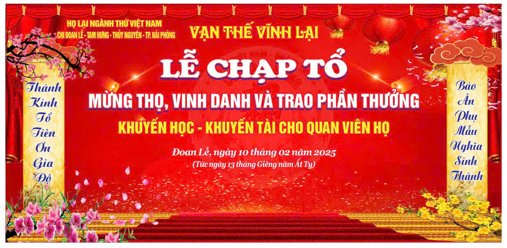
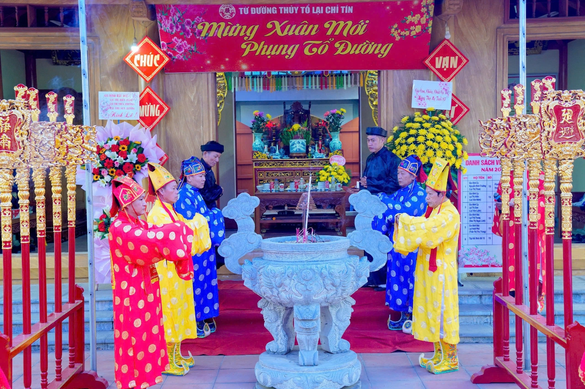
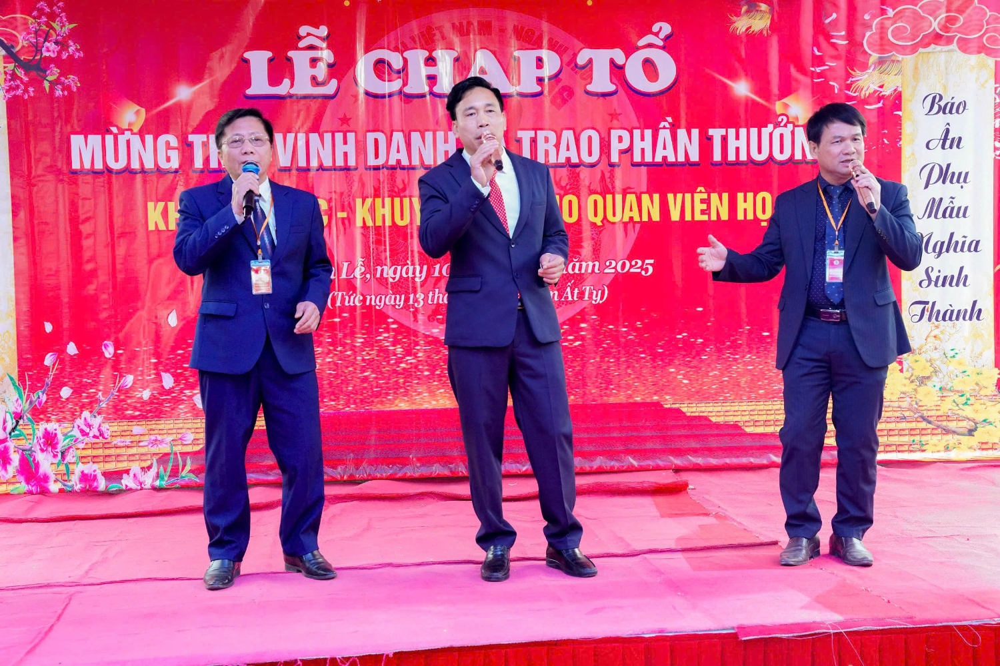
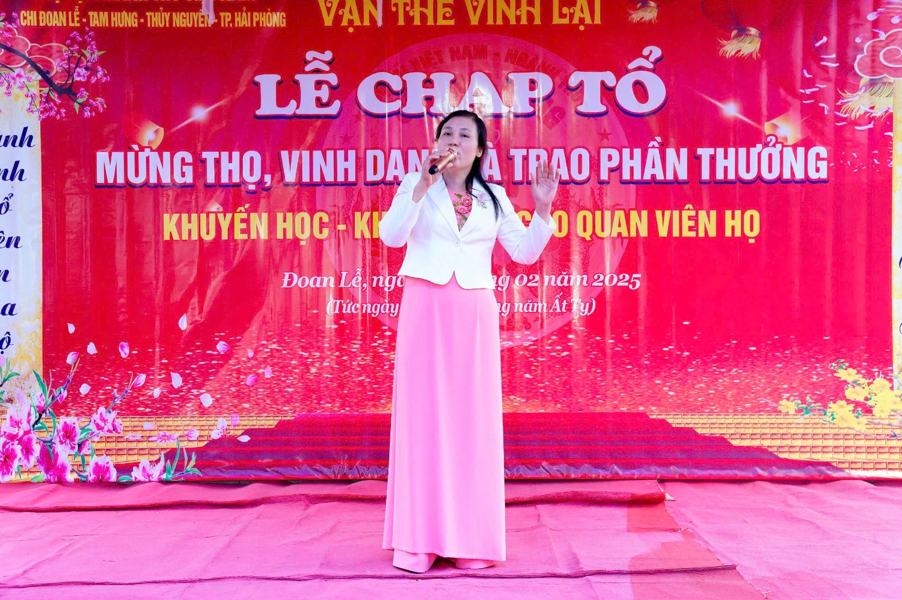
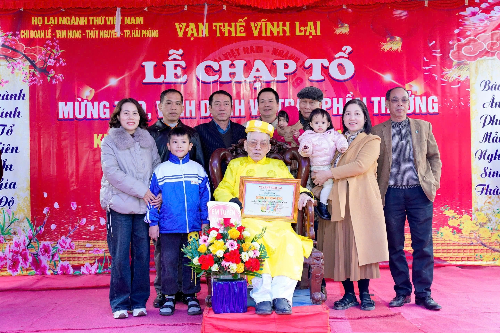
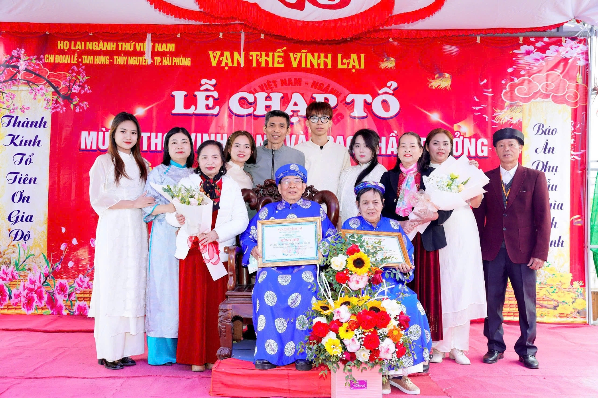
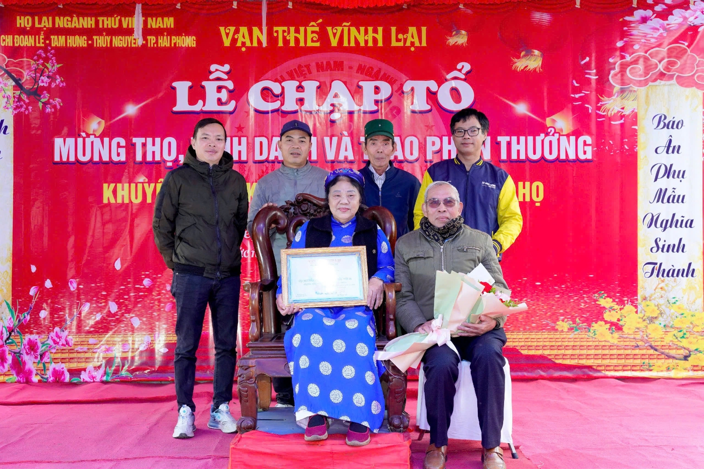
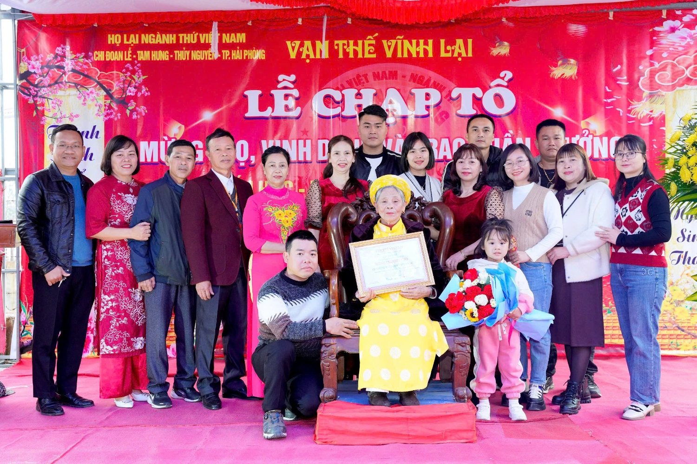
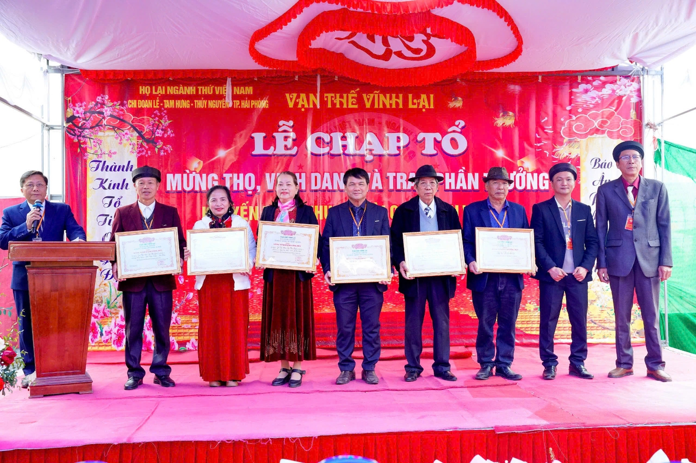
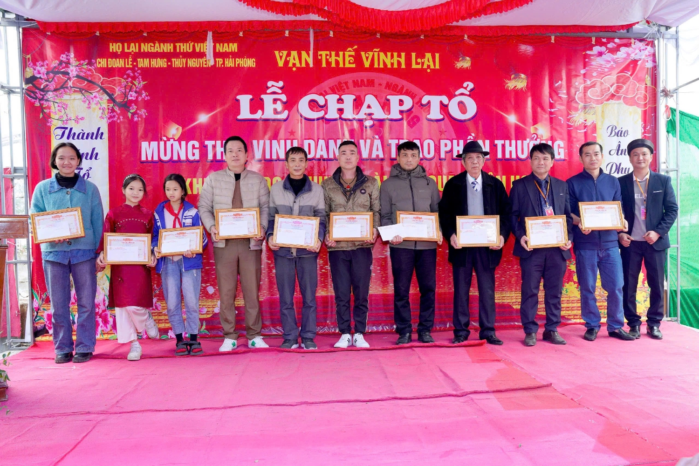

Lễ chạp Thủy tổ là nghi thức quan trọng, nhằm tưởng nhớ và tỏ lòng biết ơn đối với các bậc tiền nhân. Tiên công Lại Chân Tín là cháu đời thứ 4 của Thủy tổ Lại Thế Xuân (Lại Xuân Không), người đặt nền móng cho tổ ngành thứ của Họ Lại Việt Nam, đồng thời là cháu đời thứ 8 của Đức Triệu tổ Lại Thế Tiên. Sự kiện đã thu hút đông đảo con cháu từ nhiều địa phương về tham dự, tạo nên bầu không khí trang nghiêm và đầy ý nghĩa.  

Mở đầu chương trình là **lễ tế tổ**, được tổ chức trong không khí trang nghiêm và thành kính. Con cháu dòng họ cùng nhau dâng hương, bày tỏ lòng biết ơn sâu sắc đối với tổ tiên. Lễ tế tổ không chỉ thể hiện đạo lý uống nước nhớ nguồn mà còn cầu mong cho dòng họ luôn hưng thịnh, con cháu khỏe mạnh, thành đạt.

 

Sau phần lễ chính, chương trình tiếp tục với các tiết mục **văn nghệ chào mừng** do chính con cháu trong họ biểu diễn. Những bài hát, điệu múa mang đậm giá trị truyền thống đã tạo nên không khí vui tươi, gắn kết, giúp sự kiện thêm phần ý nghĩa và sinh động.

 

*(Chương trình văn nghệ mở đầu sự kiện do tập thể con cháu trong họ thể hiện)*

Chương trình diễn ra với nhiều hoạt động có ý nghĩa trong đó có lễ chúc thọ các bậc cao niên trong họ với những lời chúc phúc về sức khỏe, trường thọ.  
 

Tiếp đó, các tập thể và gia đình tiêu biểu được vinh danh vì có nhiều công lao trong việc bảo tồn, phát triển dòng họ. Các mạnh thường quân, con cháu hiếu nghĩa có đóng góp xây dựng từ đường, duy trì lễ hội cũng được tri ân một cách trân trọng.  
 

Một trong những điểm nhấn quan trọng của sự kiện là chương trình khuyến học, khuyến tài. Những thành viên xuất sắc trong học tập và sự nghiệp được vinh danh, trao thưởng nhằm động viên và khích lệ thế hệ trẻ tiếp tục phát huy truyền thống hiếu học, rèn luyện tài năng, góp phần xây dựng dòng họ ngày càng phát triển.  
 

 

Bên cạnh đó, chương trình còn có các tiết mục văn nghệ đặc sắc do chính con cháu trong họ biểu diễn, góp phần tạo nên không khí vui tươi, gắn kết. Những bài hát, điệu múa mang đậm giá trị truyền thống đã làm nổi bật ý nghĩa thiêng liêng của buổi lễ.

Lễ chạp Thủy tổ Họ Lại tại làng Đoan Lễ không chỉ là dịp để con cháu hướng về cội nguồn mà còn là cơ hội để kết nối, thắt chặt tình thân, khích lệ nhau cùng phát triển. Sự kiện này khẳng định tinh thần đoàn kết, truyền thống hiếu nghĩa của Họ Lại Việt Nam, đồng thời góp phần giữ gìn và phát huy những giá trị văn hóa tốt đẹp của dân tộc.

*Theo: Ban TTTT Họ Lại Việt Nam*
