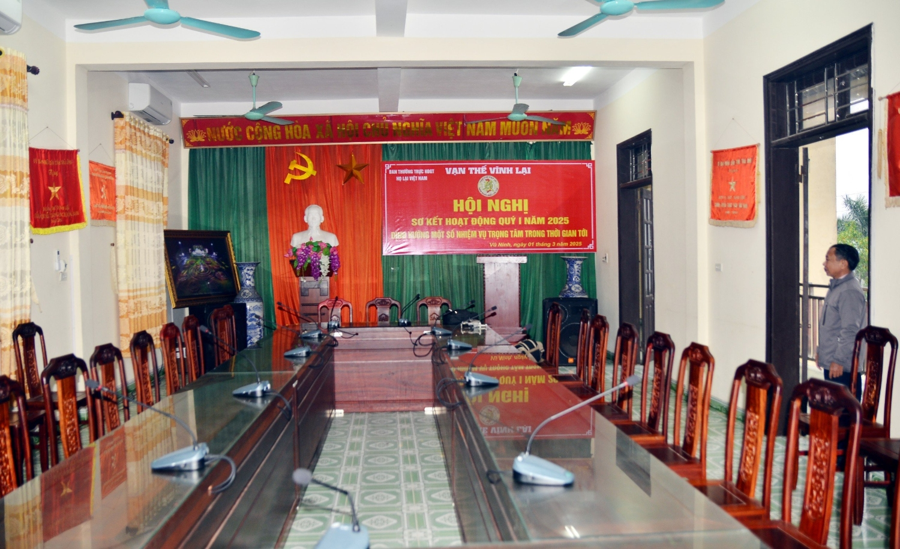
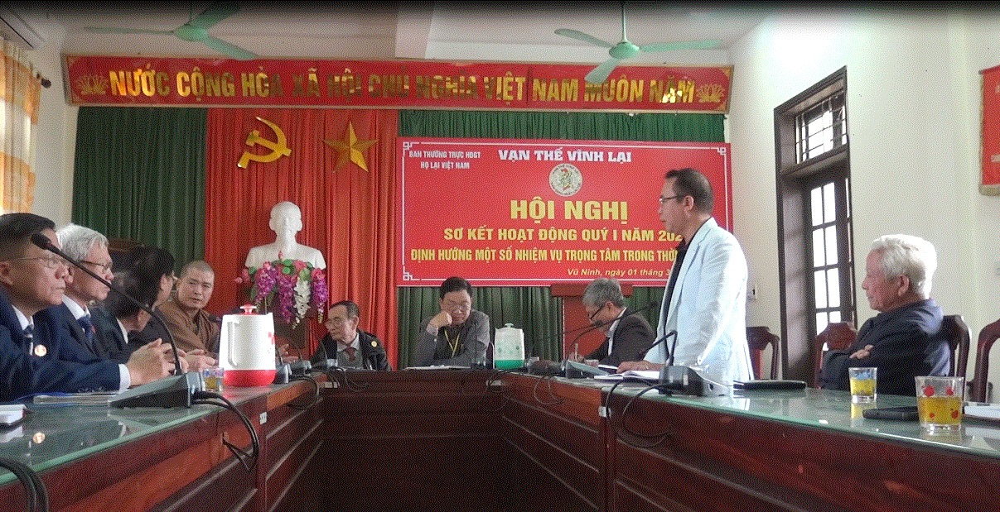
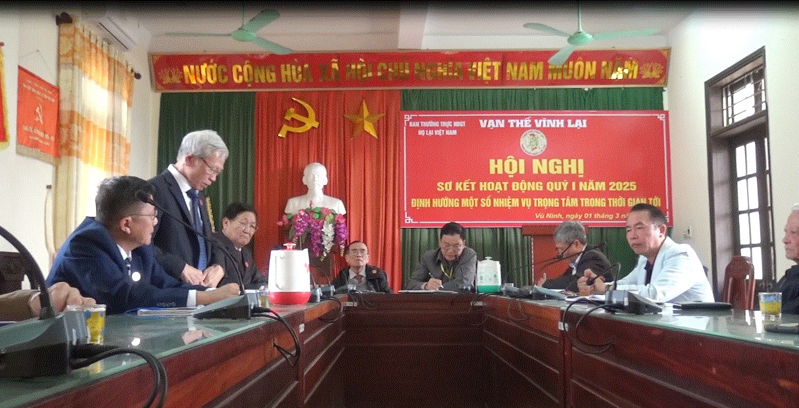

Hội nghị đã nghe ông Lại Quốc Tuấn - Phó Chủ tịch thường trực HĐGTHL Việt Nam báo cáo kết quả hoạt động của HĐGTHLVN Quý I năm 2025 và định hướng một số nhiệm vụ trọng tâm trong thời gian tới của HĐGTHLVN. Các đại biểu dự Hội nghị đã tham gia ý kiến, Ông Lại Quốc Tuấn đã kết luận Hội nghị (có Biên bản hội nghị), Hội nghị đã biểu quyết 100% 03 nội dụng chính, được tóm tắt như sau:  - Tổng kết việc triển khai thực hiện Lễ Giỗ Đức Triệu Tổ Lại Thế Tiên, tại Nhà thờ Tổ, kết quả đạt được và chỉ ra những vấn đề cần rút kinh nghiệm cho kỳ Giỗ Tổ những năm tiêp theo thành công hơn nữa;

   - Ban Thường trực cho ý kiến về chủ tương “Đúc tượng Tổ Mẫu” và chủ trương xây mới Nhà thờ Tổ mẫu tại vị trí trong khuôn viên Nhà Thờ Đức Triệu Tổ, Nhà thờ Tổ Mẫu hiện nay sẽ chỉ để thờ Tổ Cô và các Mẹ Việt Nam Anh Hùng, các Liệt Sỹ của Họ Lại Việt Nam;  

- Triển khai, thực hiện tổ chức Đại hội Đại biểu Hội đồng Gia tộc họ Lại Việt Nam nhiệm kỳ năm 2025 - 2030 theo nội dung kịch bản do Ban Tổ chức thược Hội đồng Gia tộc họ Lại Việt Nam trình bày, đã được Quyết nghị tại Nghị Quyết của Hội đồng Gia tộc họ Lại Việt Nam họp ngày 14 tháng 01 năm 2024.

Hội nghị sơ kết hoạt động Quý I năm 2025 và định hướng một số nhiệm vụ trọng tâm trong thời gian tới thành công tốt đẹp, được bế mạc hồi 17 giờ 00 phút ngày 01/3/2025. 03 nội dung nêu trên sẽ được Ban Thông tin truyền thông họ Lại Việt Nam tiếp tục đăng tải trong thời gian đến./.  

*Tin nhanh của Ban TTTT họ Lại VN*
