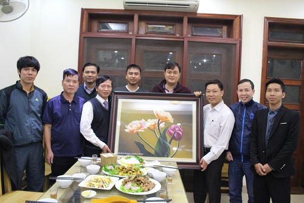
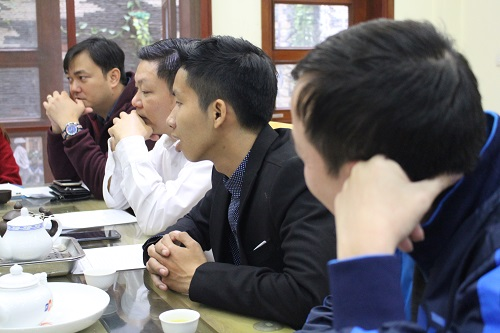
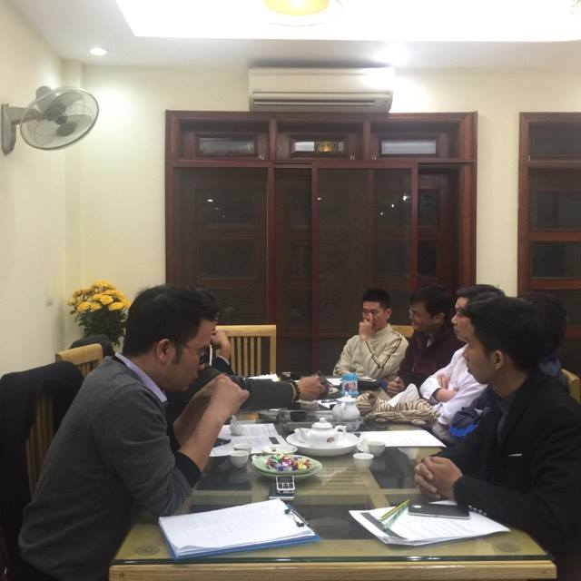
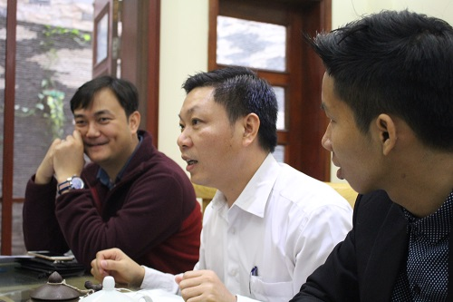
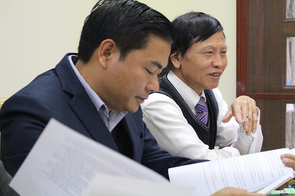

Hòa trong niềm vui chung cả nước đón mừng năm mới Xuân Đinh Dậu. Vào ngày 15/01/2017 vừa qua BLL Cộng đồng con cháu Họ Lại Việt Nam đã long trọng tổ chức chương trình tổng kết cuối năm 2016 và triển khai kế hoạch hoạt động năm 2017 với sự tham gia của Bác Lại Xuân Cương, Anh Lại Quang Trung(Khách mời), Đại diện Hội Doanh Nhân, Fc Lại tộc cùng toàn thể thành viên trong Ban Liên Lạc cộng đồng Con Cháu Họ Lại Việt Nam.  

 

  
   
  
*Không khí buổi họp rất nghiêm túc với nhiều ý kiến đóng góp ý nghĩa*  
   
Anh Lại Huy Quân (Trưởng Ban Liên Lạc) đã báo cáo rất chi tiết về những hoạt động trong năm 2016, những việc đã làm được, chưa làm được và những khó khăn gặp phải. Trên cơ sở đó đã đề ra phương hướng hoạt động 2017 với nhiều sự kiện ý nghĩa.  
   
  
*Anh Lại Huy Quân (Trưởng BLL) Tổng kết hoạt động 2016 và đề ra phương hướng hoạt động 2017*  
Các vị khách mời đã tích cực đóng góp ý kiến cho BLL về phương hướng hoạt động 2017. Đặc biệt là những ý kiến đóng góp của bác Lại Xuân Cương, người luôn nhiệt huyết và đồng hành cùng các phong trào hoạt động của Ban Liên Lạc nói riêng và của Dòng Họ Nói Chung.  
   
  
*Bác Lại Xuân Cương (Nguyên chuyên viên cao cấp VP Chính Phủ) Bên phải ảnh*  
   
Đại diện Hội Doanh Nhân Lại Việt, Anh Lại Mạnh Quân (Phó chủ tịch thường trực) đã có nhiều ý kiến đóng góp và thông báo kế hoạch Đại Hội Hội Doanh Nhân Lại Việt (Dự kiến 26-02-2016), Đồng thời xin ý kiến đóng góp và hỗ trợ thực hiện từ khách mời và từ Ban Liên Lạc.  
   
  
*Anh Lại Mạnh Quân (PCT Thường Trực Hội Doanh Nhân) Phía ngoài cùng bên trái*  
   
Cuối chương trình tất cả các thành viên xích lại gần nhau trong tình cảm gia đình ấm cúng của những người con Họ Lại, cùng ăn bữa cơm thân mật cuối năm do Bác Lại Xuân Cương chủ trì, cùng nâng ly rượu Nhạt chúc cho kế hoạch hoạt động của BLL thành công rực rỡ và chúc cho Cộng đồng Con Cháu Họ Lại Việt Nam ngày một đoàn kết, phát triển vững mạnh và trường tồn.  
   
  
*BLL tặng bức tranh kỉ niệm cho gia đình bác Lại Xuân Cương*
