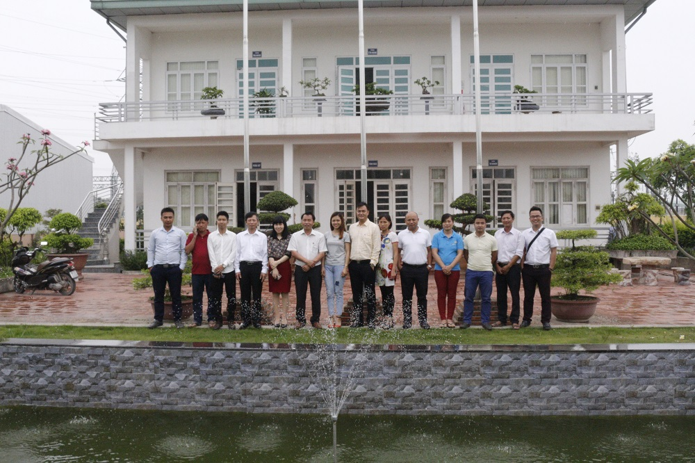

Vào ngày 17/05/2017 vừa qua, Theo lời mời của Ông: Lại Trọng Tâm, Hội doanh nhân Lại Việt do Anh Lại Mạnh Quân (Phó Chủ tịch lâm thời hội) Làm Trưởng đoàn đã tổ chức chương trình thăm quan công ty TNHH Hải Quân và các dự án do doanh nhân Lại Trọng Tâm làm chủ đầu tư tại khu công nghiệp Đại Đồng- Hoàn Sơn - Tiên Du - Bắc Ninh.  

Cùng đi với đoàn còn có bác Lại Xuân Cương (Nguyên chuyên viên cao cấp văn phòng chính phủ, Cố vấn hội doanh nhân Lại Việt), Anh Lại Thế Long (Tổng thư kí lâm thời hội DN Lại Việt), anh Lại Cao Phúc, Lại Minh Thắng, Lại Duy Tuân (Ban chấp hành lâm thời hội DN Lại Việt) cùng các anh em doanh nhân doanh nghiệp họ Lại cũng đã tham dự chuyến thăm quan.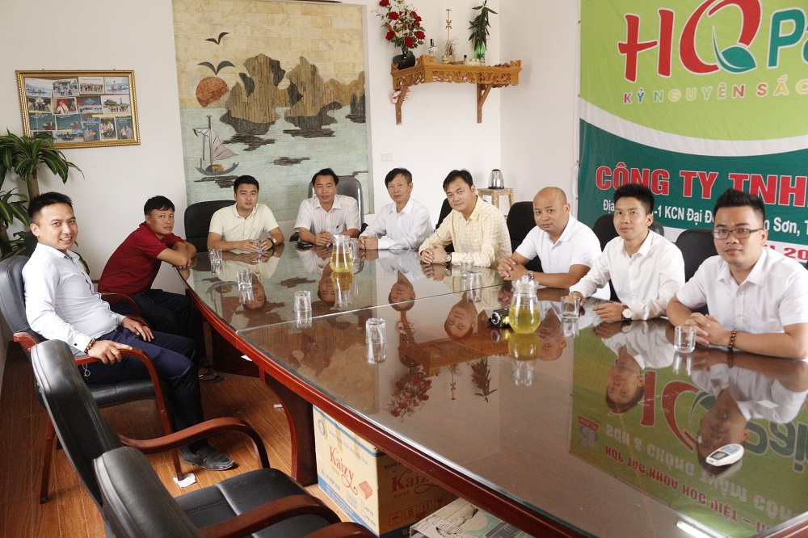

*Đoàn có buổi hội đàm với lãnh đạo công ty tại văn phòng*

*Chuyến đi với mục đích giao lưu học hỏi và chia sẻ kinh nghiệm giữa những thành viên của hội doanh nhân Lại Việt. Chương trình diễn ra trong không khí cởi mở của tình thân gia đình khi tất cả thành viên đều mang trong mình dòng máu họ Lại.*  
 

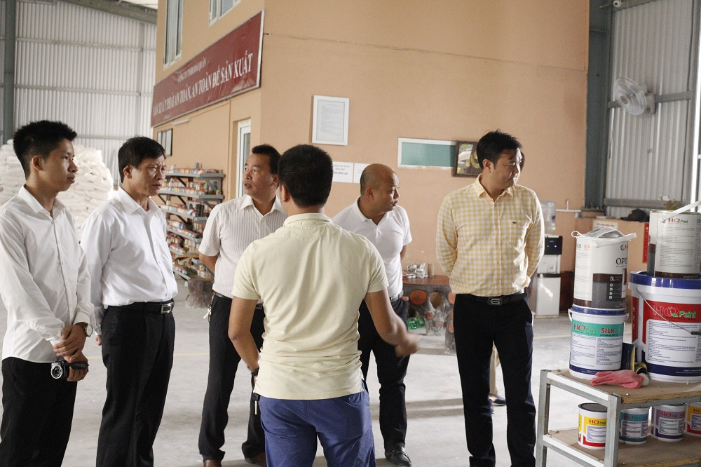

Ban Lãnh đạo công ty đã tổ chức tiếp đón đoàn chu đáo, tận tình. Sau khi tiến hành hội đàm, đoàn đã xuống thăm cơ sở sản xuất Sơn thương hiệu HQ Paint của công ty TNHH Hải Quân. Mặc dù mới đi vào hoạt động nhưng HQ Paint đã có hơn 20 loại sản phẩm khác nhau với chất lượng tiêu chuẩn đã được người tiêu dùng tin dùng và ủng hộ.  
 

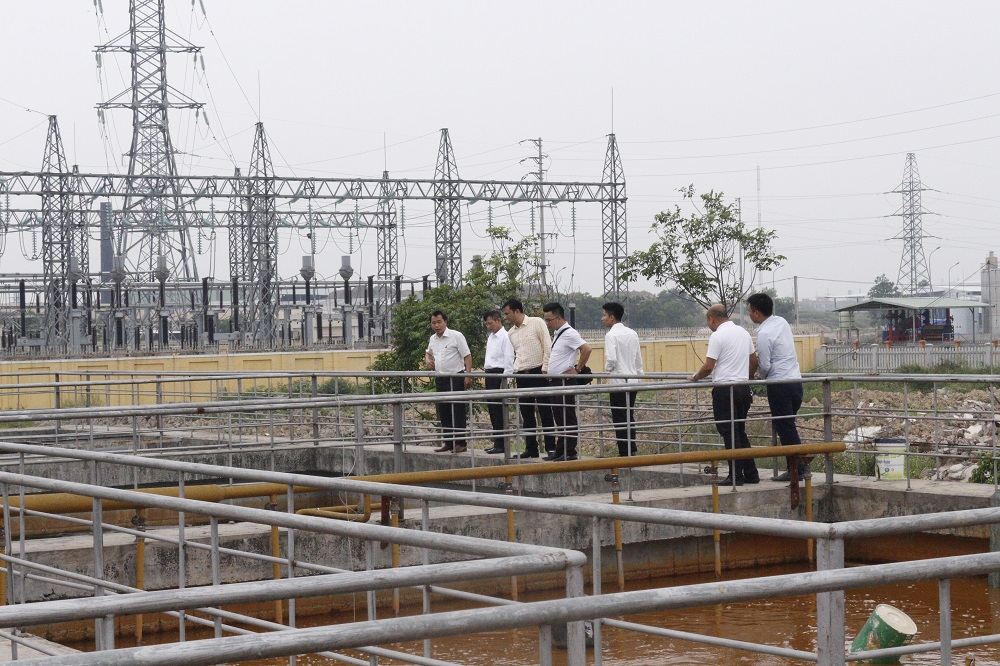

Bên cạnh thương hiệu HQ Paint mới đi vào hoạt động, Cty TNHH Hải Quân cũng là chủ đầu tư của dự án nhà máy xử lý nước thải công nghiệp của khu công nghiệp Đại Đồng- Từ Sơn-Bắc Ninh, Đây là dự án với tổng vốn đầu tư hơn 30 tỷ đồng, đảm bảo xử lý toàn bộ nước thải công nghiệp của khu công nghiệp trước khi thải ra môi trường.  
 

*Đoàn chụp ảnh lưu niệm với Cán bộ, nhân viên công ty TNHH Hải Quân*

Ngoài vị trí là chủ đầu tư Cty TNHH Hải Quân, Doanh nhân Lại Trọng Tâm còn là cổ đông lớn, giữ chức vụ Chủ Tịch HĐQT Công ty Vật Liệu Xây Dựng Tân Sơn (Top 500 thương hiệu mạnh Việt Nam 2010) và là cổ đông chính của dự án Pin năng lượng mặt trời liên kết với tập đoàn GREEN WING của Trung Quốc.  
 

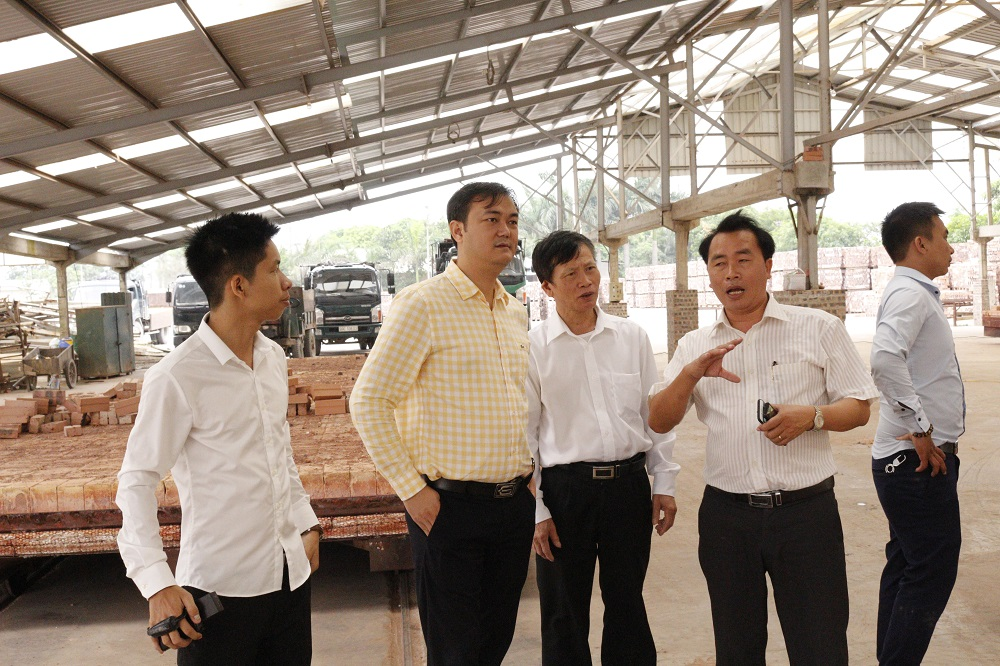  
   
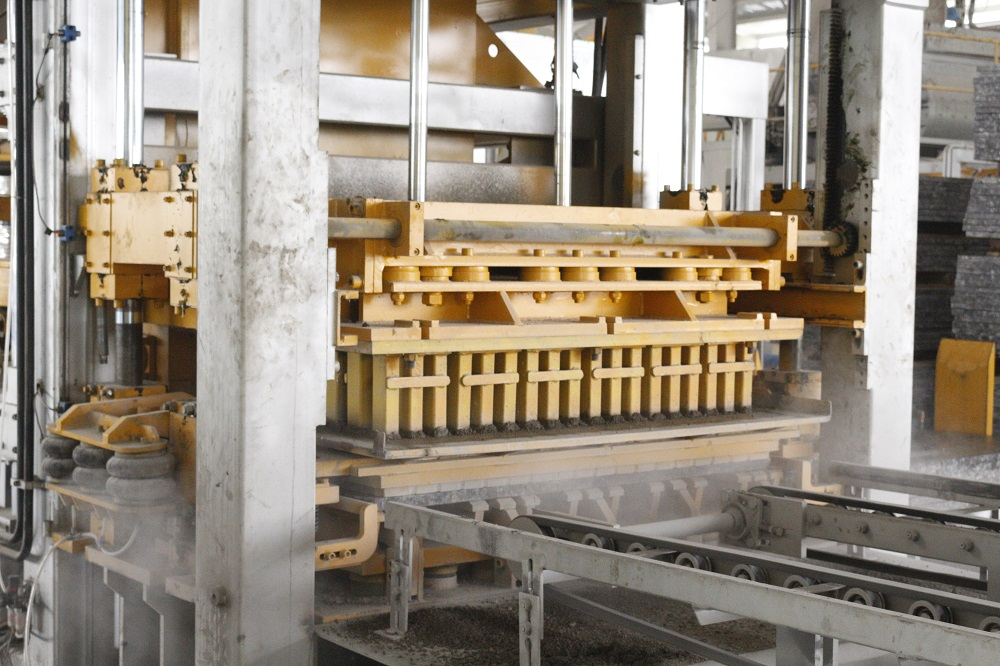  
*Đoàn thăm quan nhà máy gạch không nung của công ty Tân Sơn do doanh nhân Lại Trọng Tâm làm chủ tịch HĐQT*  
   
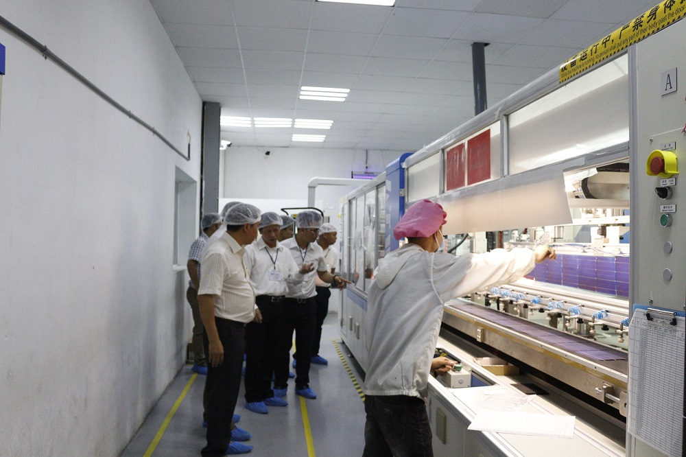  
   
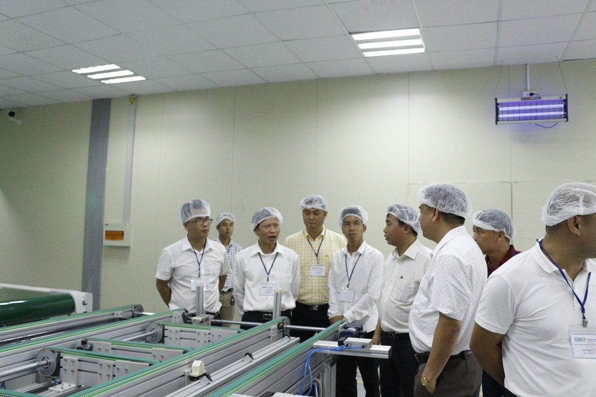  
*Bác Lại Xuân Cương và đoàn doanh nhân Lại Việt thăm quan công ty sản xuất pin năng lượng mặt trời Green Wing*  
Trong chuyến đi, Đoàn đại biểu lâm thời Hội Doanh nhân Lại Việt đã tới thăm từ đường Họ Lại chi Từ Sơn-Bắc Ninh và dâng hương tại đây.  
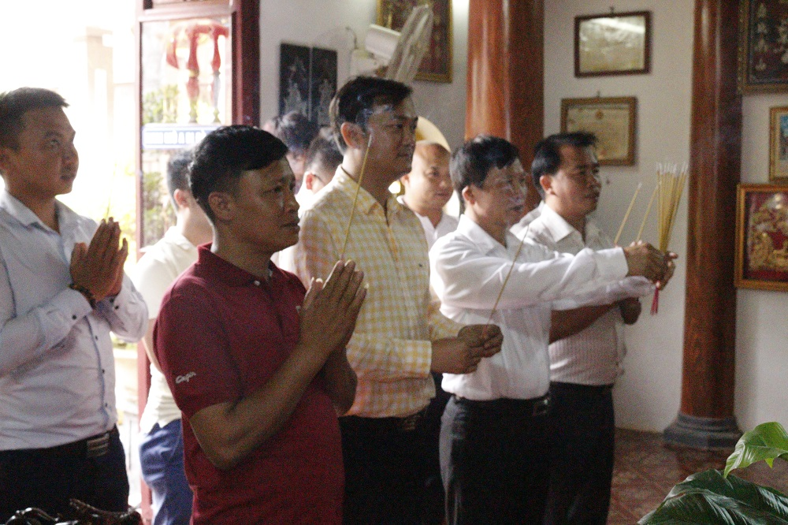  
   
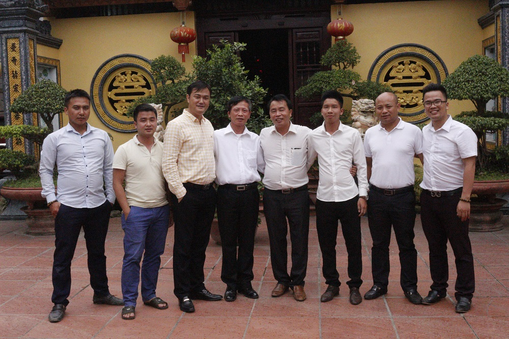  
*Bác Lại Xuân Cương cùng đoàn dâng hương và chụp hình lưu niệm tại từ đường Họ Lại chi Từ Sơn-Bắc Ninh*  
   
Kết thúc chuyến đi, Doanh nhân Lại Trọng Tâm đã mời đoàn ở lại dùng cơm với gia đình, Tất cả thành viên giao lưu trong chén rượu nhạt của quê hương Bắc Ninh, cùng gửi tới nhau lời chúc sức khỏe, hạnh phúc và chúc cho con cháu Họ Lại Việt Nam trên dưới một lòng, đoàn kết, kết nối cùng phát triển.  
   
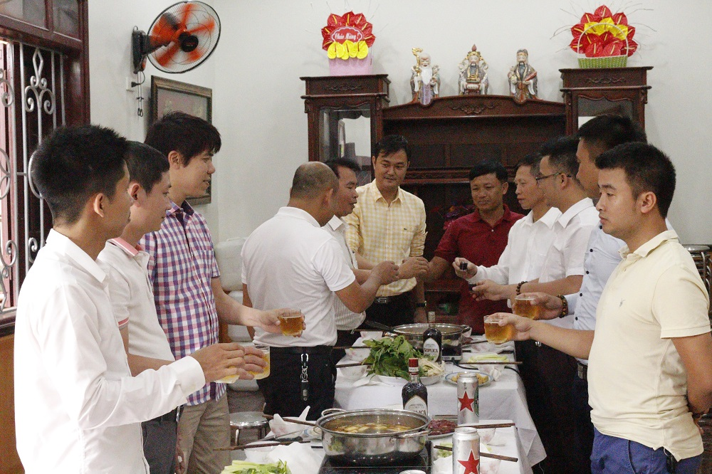  

Trước khi chia tay đoàn, Doanh nhân Lại Trọng Tâm cũng đã gửi lời cảm ơn đoàn đã tổ chức chuyến thăm và chia sẻ nhiều ý kiến đóng góp cho dự án. Ông cũng chúc cho đại hội Hội Doanh Nhân Lại Việt sắp tới thành công tốt đẹp, bên cạnh đó công ty TNHH Hải Quân cũng sẽ tham gia tài trợ chính cho Chương Trình.  

Thay mặt cho đoàn, Anh Lại Mạnh Quân cũng gửi lời cảm ơn tới sự tiếp đón chu đáo của Gia Đình doanh nhân Lại Trọng Tâm nói riêng và Cán bộ nhân viên Cty TNHH Hải Quân nói chung. Đoàn cũng gửi lời chúc tới toàn thể cán bộ nhân viên công ty luôn mạnh khỏe và phấn đấu đưa công ty ngày một phát triển hơn nữa, trở thành một doanh nghiệp lớn và xa hơn nữa là một tập đoàn lớn của Đất nước Việt Nam nói chung và của HọLại Việt Nói Riêng.
