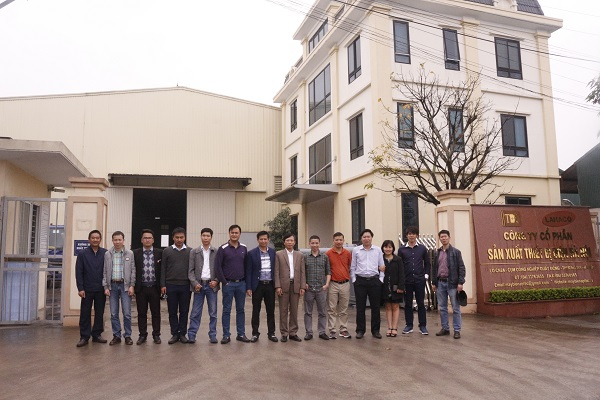
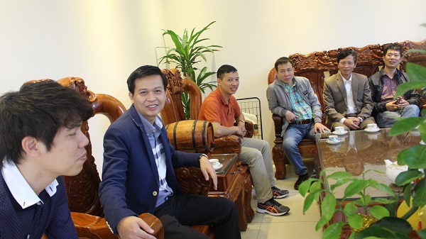
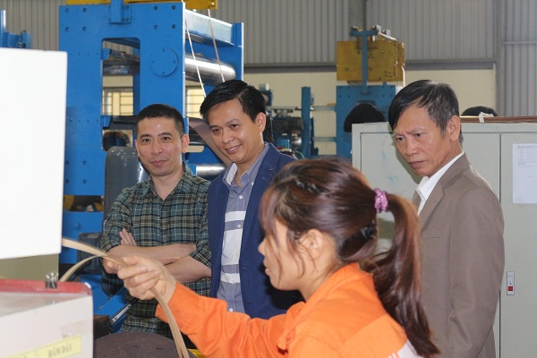
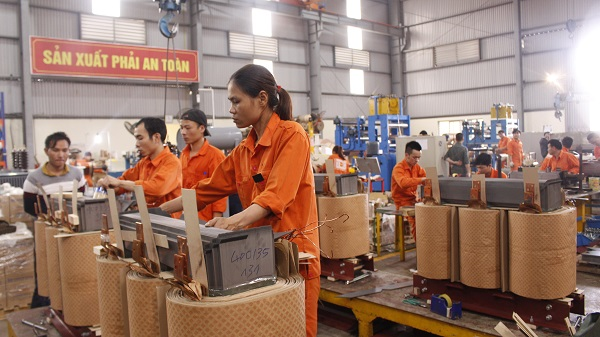
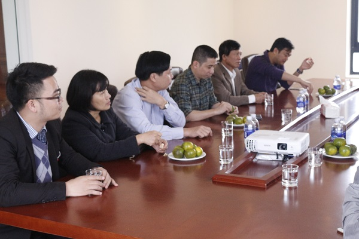
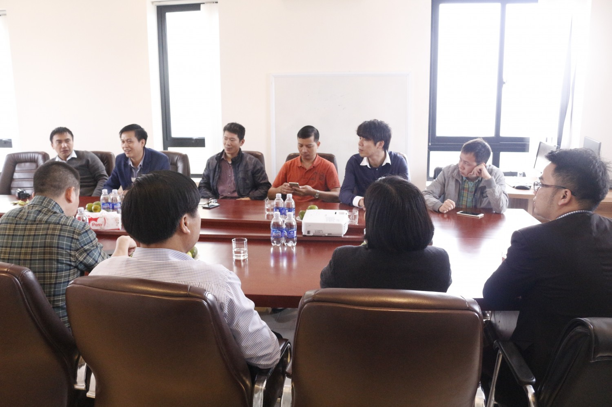
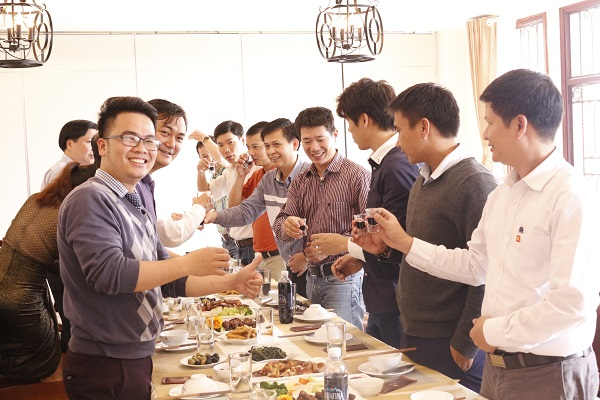
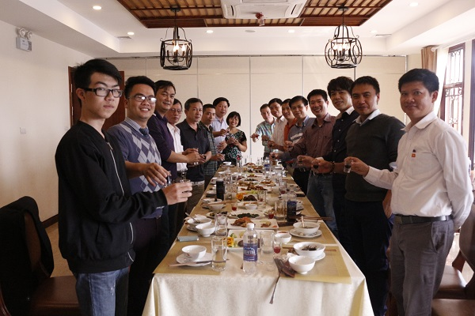
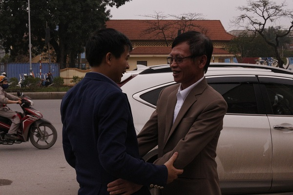
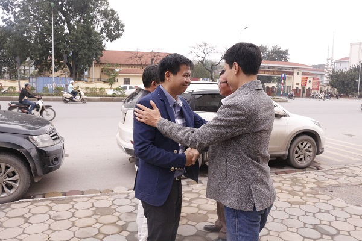

Vào sáng 18/03/2017, Hội Doanh Nhân Lại Việt do anh Lại Mạnh Quân (PCT Thường Trực) làm trưởng đoàn đã thăm quan mô hình sản xuất máy biến áp và các thiết bị điện của công ty LAHACO do anh Lại Văn Hải -Thành viên hội doanh nhân Lại Việt sáng lập và điều hành.  
Cùng đi trong chuyến thăm quan còn có Bác Lại Xuân Cương (Cố vấn Hội) cùng các anh em trong ban điều hành lâm thời Hội Doanh Nhân Lại Việt.  
  
Anh Lại Văn Hải rất vui mừng khi được đón tiếp đoàn thăm quan nhà máy, đặc biệt hơn vì đoàn 100% thành viên là những người con mang trong mình dòng máu Họ Lại.  
   
  
Trong chuyến thăm quan anh Hải đã giới thiệu tới đoàn toàn bộ cơ sở vật chất, quy trình sản xuất các sản phẩm của công ty.  
   
  
Với quy mô hơn 3000m2 nhà xưởng, giải quyết công ăn việc làm cho gần 100 cán bộ công nhân viên và công suất nhà máy đạt hơn 200 máy biến thế một tháng. Hiện Nay LAHACO là đơn vị hàng đầu trong lĩnh vực sản xuất và cung cấp máy biến thế tại Việt Nam.  
   
  
  
Sau khi thăm quan nhà máy, đoàn đã có 1 buổi chia sẻ đầy ý nghĩa. Anh Hải đã thẳng thắn chia sẻ các khó khăn hiện đang gặp phải trong các quy trình công việc, bên cạnh đó anh đã nhận được nhiều ý kiến đóng góp xây dựng chân thành và sâu sắc từ các thành viên tham gia trong đoàn là chuyên gia thuộc các lĩnh vực liên quan. Đặc biệt là các ý kiến đóng góp của Bác Lại Xuân Cương (Nguyên Chuyên viên cao cấp văn phòng chính phủ), Anh Lại Minh Hiếu (PGĐ BIDV Thạch thất, Anh Lại Mạnh Quân (GĐ bảo hiểm PTI) cùng nhiều góp ý chia sẻ của anh em trong đoàn.  
   
  
   
  
Cuối chương trình, dưới sự chuẩn bị chu đáo của Anh Hải đoàn có bữa tiệc liên hoan tràn đầy tinh thần đoàn kết và tình anh em một nhà, cùng chúc cho Hội Doanh Nhân Lại Việt sớm đại hội và có nhiều chương trình kết nối hơn nữa tạo điều kiện cho các doanh nghiệp Lại Việt đoàn kết vươn ra biển lớn.  
   
  
   
  
Hình ảnh cuối chương trình là những cái bắt tay, những cái ôm thắm tình đoàn kết, cùng hứa hẹn phấn đấu đưa Doanh Nhân Lại Việt ngày một phát triển hơn nữa, trở thành lá cờ đầu trong các phong trào kết nối ,xây dựng và phát triển làm rạng danh dòng Họ Lại Việt Nam.  
*bài viết: Thế Long*
