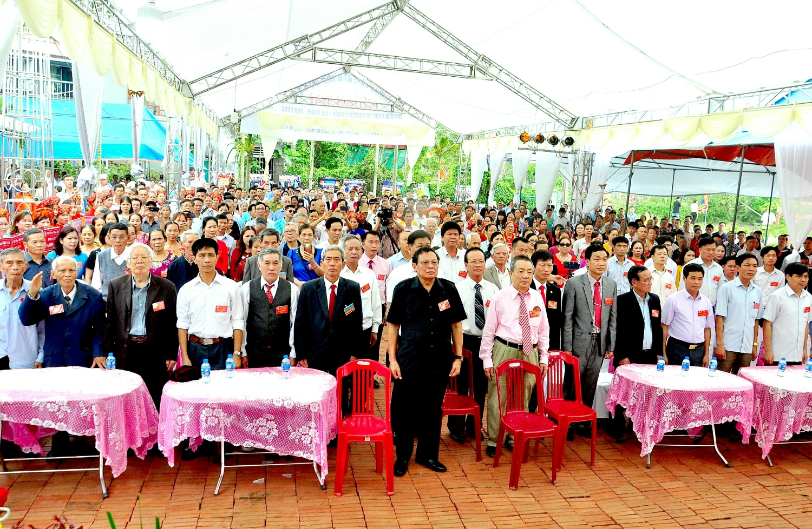

**Ban Tổ chức: “Ngày Hội Mùa xuân Họ Lại Việt Nam lần thứ 5”**  

Xin trân trọng cảm ơn: Phòng văn hóa thông tin truyền thông huyện Hải Hậu, UBND xã Hải Trung cùng các cơ quan ban ngành tại địa phương đã cấp phép và tạo điều kiện hỗ trợ công tác tổ chức sự kiện và dành thời gian đến tham dự Ngày hội.  

Xin cảm ơn: Đại diện TTHĐGT Họ Lại Việt Nam, Đại diện ban Cố vấn hội Doanh nhân Lại Việt, Ban truyền thông Họ Lại Việt Nam đã hỗ trợ công tác tổ chức và dành thời gian đến tham dự Ngày hội.  

Xin cảm ơn các đơn vị: Hội Doanh Nhân Lại Việt, Hội Doanh Nhân Lại Việt (Miền Nam), Công ty Máy Biến thế Lahaco, Công ty TNHH Hải Quân, Cty dây cáp điện Cadi Yên Viên, Công ty Ánh sáng Led Beco - những nhà tài trợ chính của Ngày hội. Cùng các cá nhân và tổ chức có nguồn gốc Họ Lại Việt Nam cũng đã tham gia tài trợ cho sự kiện ( Chi tiết trong File đính kèm).  

Xin trân trọng cảm ơn: Ban trị sự Họ Lại Ngành thứ tại Hải Hậu cùng toàn thể các bác, các chú, các cô trong các Chi họ đã tích cực và nhiệt tình tham gia công tác hậu cần như đoàn tế, nhà bếp, đoàn rước lễ….  

Xin cảm ơn các cơ quan thông tấn, báo, đài, Đoàn quay phim của anh Lại Văn Thiện đã đồng hành để phát sóng, đưa phóng sự, tin, bài về Lễ hội; Xin cảm ơn các nghệ sĩ Là con em trong Họ, Ban nhạc Quê hương, Đặc biệt xin cảm ơn đoàn văn nghệ sỹ Họ Trịnh Thăng Long đã tham gia biểu diễn tại Ngày hội.  

Đặc biệt, Ban Tổ chức xin dành lời cảm ơn nồng nhiệt tới các đoàn đại biểu con cháu Họ Lại tại các tỉnh thành trong cả nước, đặc biệt là các đoàn Miền Nam và Miền Trung đã vượt qua ngàn dặm xa xôi để về tham gia Ngày hội.  

Ban tổ chức xin trân trọng cám ơn bà con cộng đồng người Việt Nam tại nước ngoài đã gửi lời chúc mừng , hưởng ứng các hoạt động của Ngày hội.  

Trong quá trình tổ chức, chắc chắn không tránh khỏi thiếu sót, Ban Tổ chức Ngày hội mùa xuân Họ Lại Việt Nam rất mong nhận được sự thông cảm và góp ý từ cộng đồng  

Hẹn gặp lại tại Ngày Hội Mùa Xuân Họ Lại Việt Nam lần thứ 6 trong thời gian tới!  

Trân trọng!  

Ban tổ chức  

Dưới đây là một số hình ảnh sự kiện và ảnh báo cáo tài chính!  
 

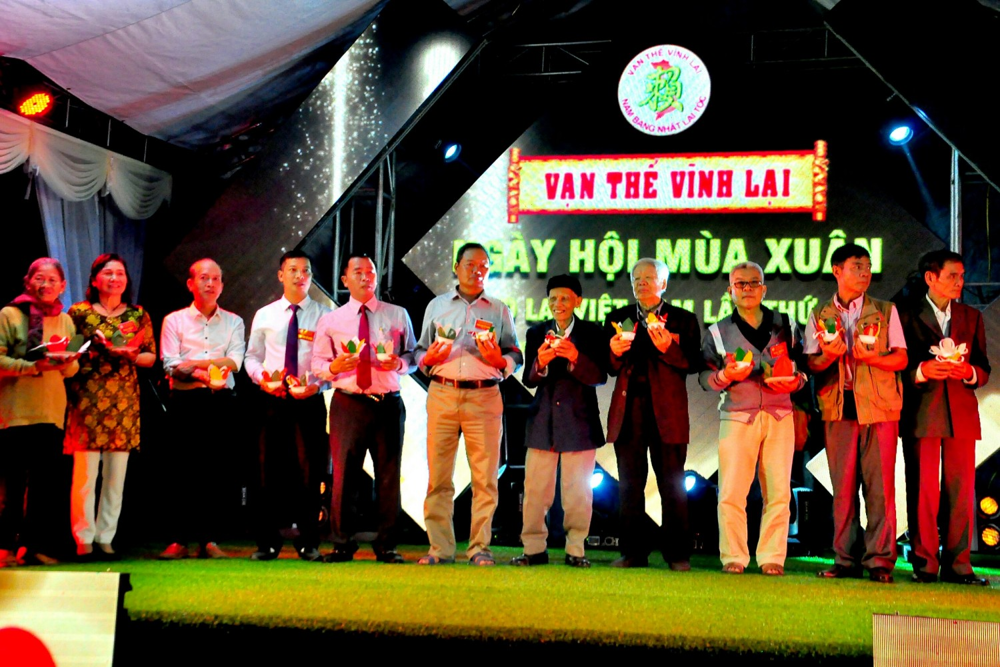

**Lễ thả đèn hoa đăng tối 6/4/2019**

 

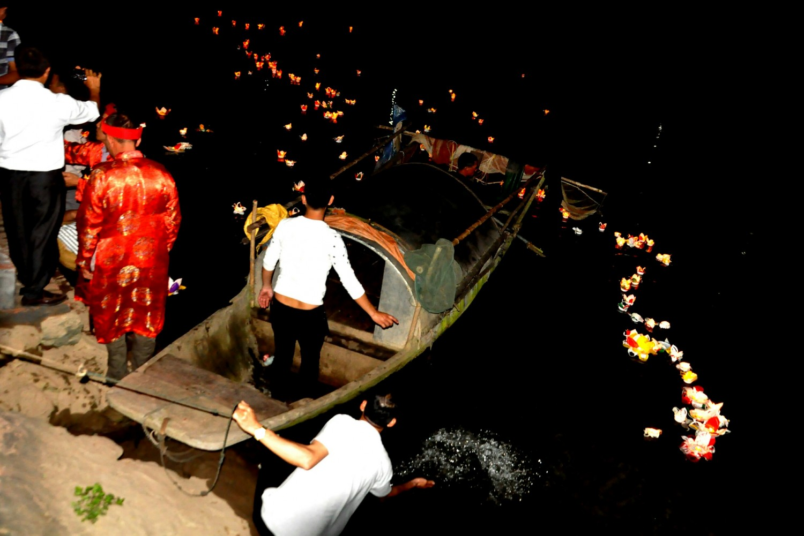

*Nhãn*

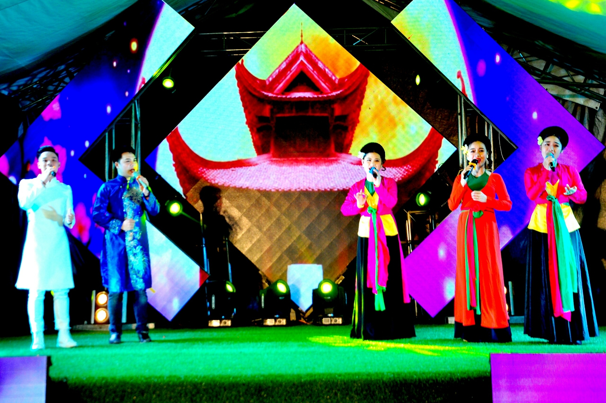

**Đêm văn nghệ (Tự hào họ Lại Việt Nam 6/4/2019)**

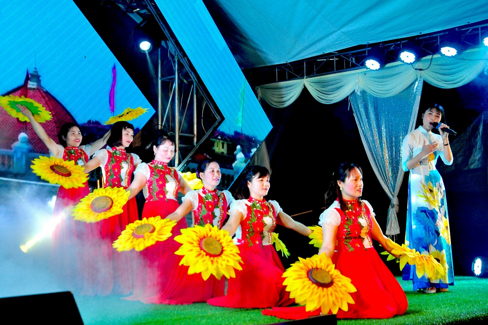

**Đêm văn nghệ (Tự hào họ Lại Việt Nam 6/4/2019)**

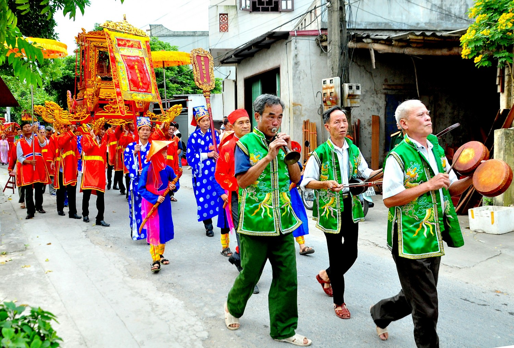

**Lễ diễu hành 7/4/2019**

 

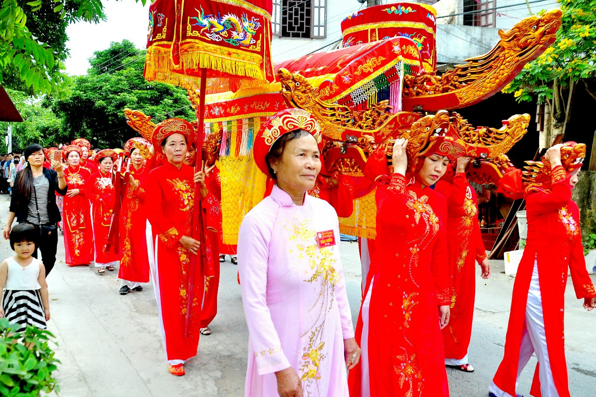

**Lễ diễu hành 7/4/2019**

**Cộng đồng con cháu thực hiện nghi lễ chào cờ**

 

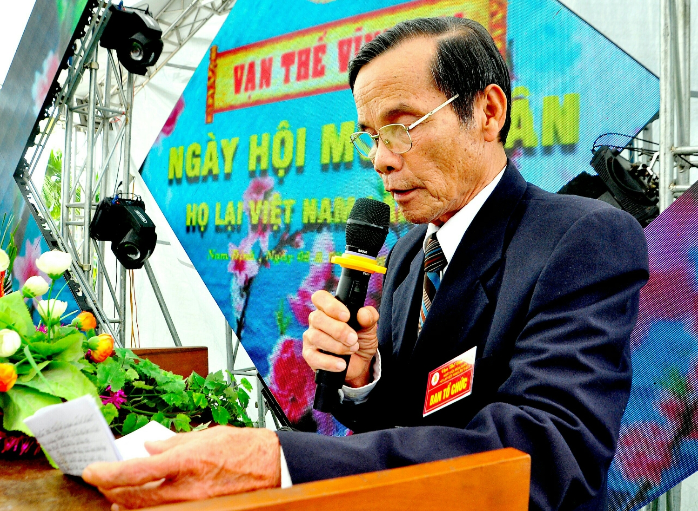

**Đại diện Ban Trị Sự Họ Lại Đại Tôn Hải Hậu giới thiệu về lịch sử cụ Lại Thế Xuân (Hiệu Xuân Không)**

 

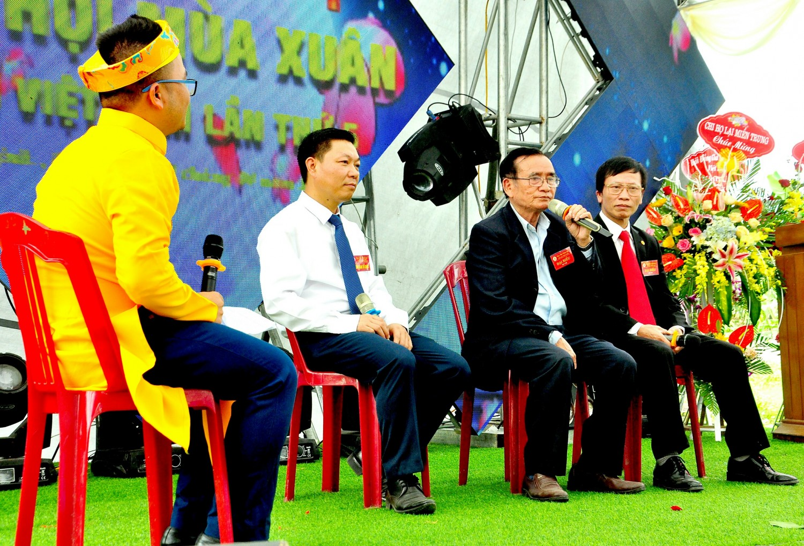

**Giao lưuvới Bác Lại Ngọc Thư (Giữa - Phó CTTTHĐGT), Bác Lại Xuân Cương ( Ngoài cùng bên phải - Cố vấn Hội Doanh Nhân Lại Việt), Anh Lại Huy Quân (Ngoài cùng bên trái - Trưởng ban liên lạc con cháu Họ Lại).**

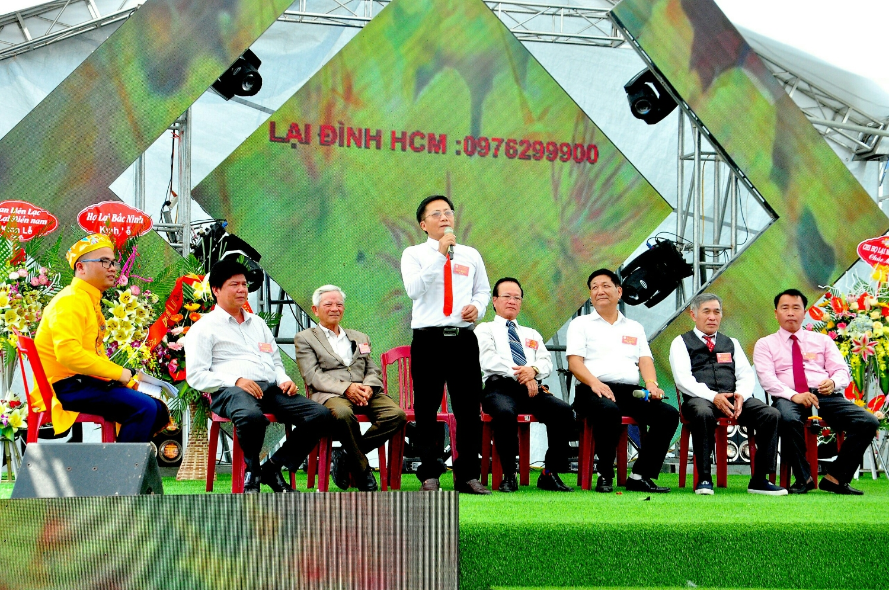

**Giao lưu với HĐGT và đại diện các đoàn về tham dự ngày hội**

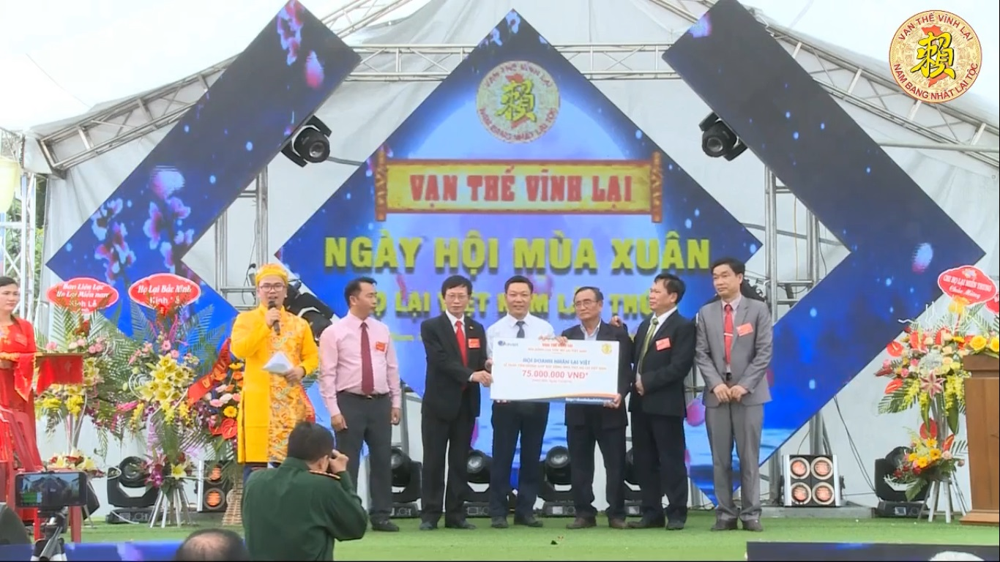

*Hội DN Lại Việt trao tiền công đức đợt 2 (75 triệu đồng) Cho HĐGT Họ Lại Việt Nam*

 

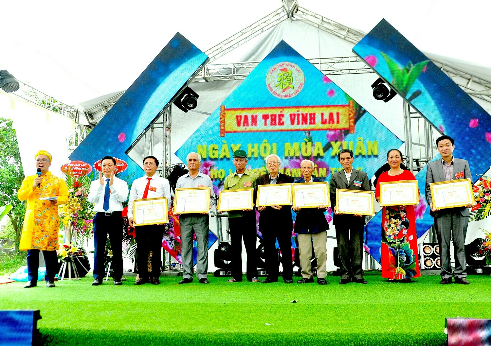

**Lễ chúc thọ các cụ cao niên có tuổi từ 90 trở lên trong họ**

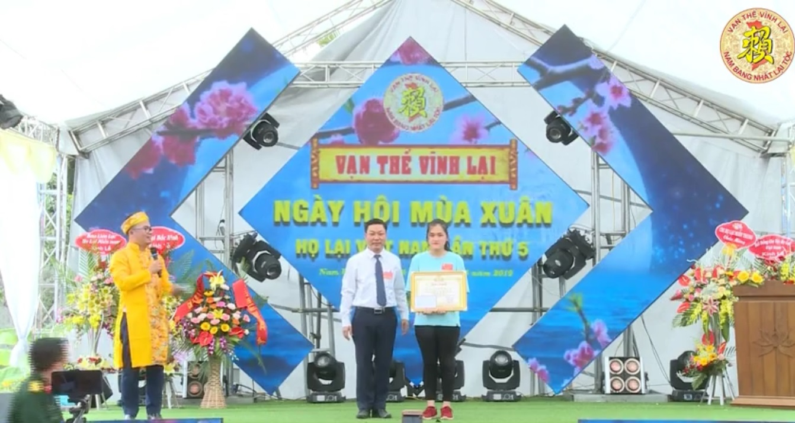

**Khen thưởng các cháu đạt giải học sinh giỏi cấp quốc gia và quốc tế**

 

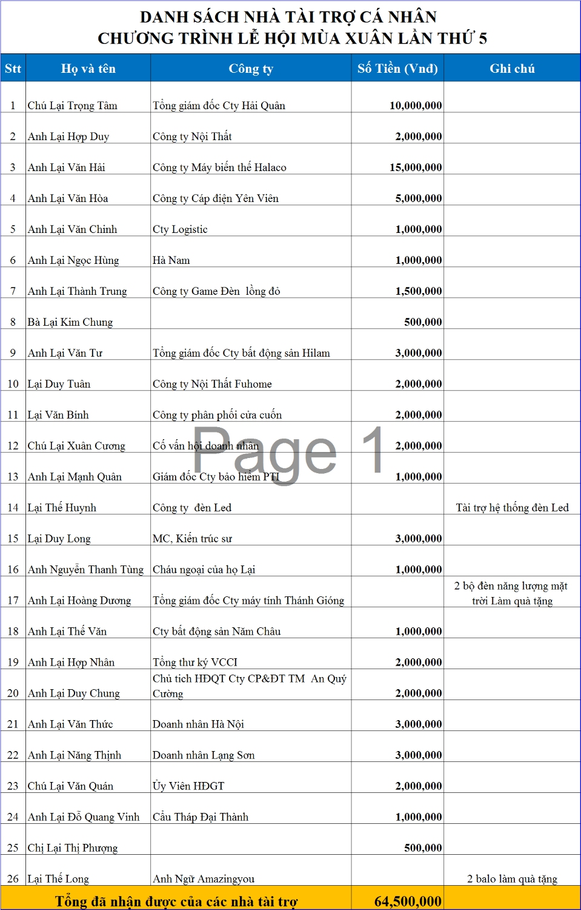

**Danh sách nhà tài trợ**

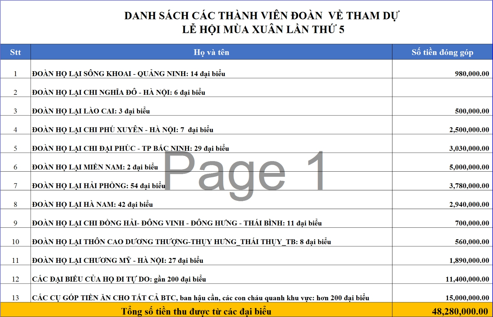

**Danh sách các đoàn về tham dự**

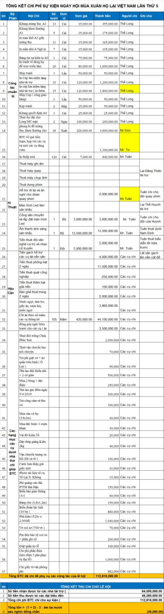

*Báo cáo thu chi*
