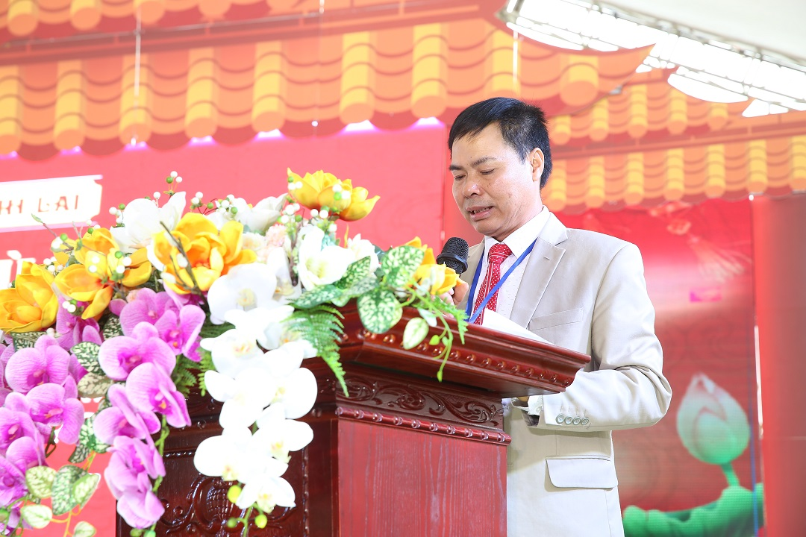

**DIỄN VĂN KHAI MẠC NGÀY HỘI MÙA XUÂN HỌ LẠI VIỆT NAM LẦN THỨ 6 & LỄ KỶ NIỆM 30 NĂM THÀNH LẬP HĐGT**

**____________**

*- Kính lạy anh linh tiên tổ*  
*- Kính thưa các đồng chí lãnh đạo địa phương  
- Kính thưa quý vị khách quý!*  
*- Thưa cụ Lại Ngọc Thư Trưởng ban chỉ đạo sự kiện, phó chủ tịch HĐGT Cùng các thành viên trong HĐGT Họ Lại Việt Nam*  
*- Thưa các cụ, các ông, các bà, cô gì chú bác, anh chị em là con trai, con gái, con dâu con rể có nguồn gốc Họ Lại Việt Nam có mặt tại buổi Lễ.*  

Hôm nay, trong tiết trời tươi đẹp của xuân Quý Mão, trên quê hương 5 tấn Thái Bình, nơi thờ đức Trưởng chi Thủy Tổ Đại Tướng Quân Thái Bảo tín Quận Công Lại Thế Lạc. Hội đồng Gia tộc họ Lại Việt Nam, phối hợp với Hội đồng gia tộc họ Lại tỉnh Thái Bình, long trọng tổ chức “Ngày hội mùa xuân họ Lại Việt Nam lần thứ 6 và Lễ kỷ niệm 30 năm thành lập Hội đồng gia tộc họ Lại Việt Nam” tại các chi họ Lại xã Vũ Ninh, huyện Kiến Xương, tỉnh Thái Bình. Đây là một ngày hội văn hóa lớn của cộng đồng con cháu Họ Lại Việt Nam, được tổ chức 2 năm 1 lần luân phiên giữa các tỉnh, đặc biệt năm 2023 này diễn ra nhân dịp kỷ niệm 30 năm thành lập HĐGT Họ Lại Việt Nam.  

Thay mặt Ban tổ chức, tôi xin nhiệt liệt chào mừng và kính chúc các vị lãnh đạo địa phương, quý vị khách quý, các thành viên HĐGT Họ Lại Việt Nam, HĐGT Họ Lại các tỉnh, các ông trưởng đoàn họ Lại các tỉnh cùng các vị cao niên, các ông, bà, cô, dì, chú, bác, anh chị em, con, cháu, dâu, rể họ Lại Việt Nam có mặt tại đây và hàng trăm ngàn người đang theo dõi trực tuyến luôn mạnh khỏe, hạnh phúc, an khang. Chúc cho cộng đồng con cháu họ Lại Việt Nam luôn đoàn kết, thương yêu, đùm bọc để phát triển vững bền góp phần xây dựng quê hương, đất nước giàu mạnh.  

Thưa quý vị!  

Sự kiện “Ngày hội mùa xuân họ Lại Việt Nam lần thứ 6 và Lễ kỷ niệm 30 năm thành lập Hội đồng gia tộc họ Lại Việt Nam” năm nay, được tổ chức trong 2 ngày 25,26 tháng 3 năm 2023 (Dương lịch) với nhiều hoạt động văn hóa đặc sắc thể hiện các góc nhìn, các sắc màu về cuộc sống của cộng đồng con cháu Họ Lại Việt Nam toàn quốc.  

Sáng nay, 25/3 Ban tổ chức đã tiến hành lễ tế để báo cáo Tiên tổ và lập hương án tại sân khấu sự kiện. Chiều nay sẽ diễn ra lễ dâng hương và lễ cầu an, đây là một hoạt động văn hóa vô cùng ý nghĩa của dòng họ mỗi dịp lễ hội, giúp giữ gìn và phát huy giá trị văn hóa, tôn kính, tri ân tổ tiên và tạo ra tinh thần đoàn kết, gắn bó giữa những người con Họ Lại, mang lại sự bình an, may mắn cho mọi người. Bên cạnh hoạt động có tính tâm linh trên, chiều nay cũng sẽ diễn ra các hoạt động thể thao như bóng đá, và các trò chơi dân gian đánh cờ, bịt mắt đánh trống, kéo co, cho chữ ngày xuân...Các thành viên trong cộng đồng con cháu Họ Lại cả nước về dự sẽ có cơ hội được giao lưu, gặp gỡ, thi đấu để nâng cao tình thần rèn luyện thể dục thể thao là tiền đề để nâng cao thể chất, tăng cường sức khỏe giúp xây dựng và phát triển gia đình hạnh phúc, dòng họ, đất nước phồn vinh.  

Tối nay, 25/3 sẽ diễn ra đêm giao lưu văn nghệ đặc sắc với chủ đề: “ BẢN HÙNG CA LẠI VIỆT”. Đây là một đêm diễn đặc biệt bởi sự đa dạng của các tiết mục từ thể loại dân gian đến hiện đại, từ hát múa đến nhạc cụ dân tộc và diễn xướng Chầu văn. Điều đặc biệt hơn nữa là phần lớn các tiết mục điều được biểu diễn bởi các ca sỹ, nghệ sỹ là con cháu họ Lại Việt Nam thể hiện.   Đêm giao lưu văn nghệ sẽ thúc đẩy tinh thần đoàn kết và giao lưu giữa các chi họ dưới lời ca tiếng hát và con tim chung nhịp đập nghệ thuật. Đây cũng là dịp để tôn vinh các tài năng văn hóa, thúc đẩy phong trào văn nghệ trong cộng đồng Họ Lại. Thông qua các tiết mục biểu diễn, những thông điệp văn hóa, hình ảnh và cuộc sống con người Họ Lại sẽ được thể hiện một cách đặc sắc hứa hẹn tạo ra những ấn tượng khó quên và cảm động trong lòng khán giả.  

Sáng ngày 26 tháng 3, sự kiện sẽ diễn ra lễ Mít ting với các hoạt động diễu hành, đọc trúc văn, báo cáo 30 năm xây dựng và phát triển Hội đồng gia tộc Họ Lại Việt Nam, Lễ chúc thọ các cụ Nam Đinh, con Dâu, Con Gái có tuổi thọ từ 90 trở lên, lễ khen thưởng các cháu có thành tích học tập cấp quốc gia và quốc tế...  

Mỗi một tiết mục, mỗi một nội dung trên đều hướng tới việc góp phần duy trì và phát triển các giá trị văn hóa truyền thống của người Họ Lại. Tạo nên sự đoàn kết và gắn bó trong cộng đồng hướng tới sự phát triển bền vững. Đây cũng là cơ hội để cộng đồng hơn 400 chi họ trong cả nước có cơ hội gặp gỡ và giao lưu sau nhiều năm xa cách, đặc biệt là giai đoạn dịch Covid-19 trong những năm trước đây.  

Thưa quý vị!  Thay mặt ban tổ chức, tôi xin gửi lời cảm ơn sâu sắc tới các đồng chí lãnh đạo địa phương đã nhiệt tình ủng hộ và hỗ trợ chúng tôi trong công tác chuẩn bị để tổ chức “Lễ kỷ niệm 30 năm thành lập Hội đồng gia tộc họ Lại Việt Nam và Ngày hội mùa xuân họ Lại Việt Nam lần thứ 6” hôm nay được diễn ra theo kế hoạch.  

Tôi cũng xin cảm ơn HĐGT Họ Lại Việt Nam đã tin tưởng giao nhiệm vụ, xin cảm ơn HĐGT Họ Lại Thái Bình đã chỉ đạo sát sao trong thời gian qua, xin cảm ơn sự tham gia nhiệt tình, trách nhiệm và những đóng góp quý báu của các chi họ Lại xã Vũ Ninh, huyện Kiến Xương, tỉnh Thái Bình, các thành viên trong ban tổ chức, các nhà tài trợ cho công tác chuẩn bị để ngày hội văn hóa dòng họ được đông vui, đoàn kết và ý nghĩa hôm nay.  Thưa quý vị,  Với phương châm: “ Đoàn kết – Phát Triển – Vững Bền”, Lễ kỷ niệm 30 năm thành lập Hội đồng gia tộc họ Lại Việt Nam và Ngày hội mùa xuân họ Lại Việt Nam lần thứ 6 thể hiện bản lĩnh, tinh thần gắn kết anh em một nhà và quyết tâm đi lên của của dòng họ vì mục tiêu góp phần dân giàu, nước mạnh, dân chủ, công bằng, văn minh của cả đất nước.  Với định hướng chiến lược, quy hoạch phát triển dòng họ đúng đắn của HĐGT, khát vọng phát triển mạnh mẽ và quyết tâm thực hiện tới cùng, cộng đồng con cháu Họ Lại Việt Nam chúng ta nhất định sẽ lập nên nhiều thành tựu phát triển mới vì một tương lai vững bền góp phần xây dựng đất nước phồn vinh, hạnh phúc, cùng tiến bước, sánh vai với các cường quốc năm châu, thực hiện thành công tâm nguyện của Chủ tịch Hồ Chí Minh vĩ đại và ước vọng của toàn dân tộc.  Với niềm tin sâu sắc đó, thay mặt Ban tổ chức, tôi xin tuyên bố khai mạc: “Lễ kỷ niệm 30 năm thành lập Hội đồng gia tộc họ Lại Việt Nam và Ngày hội mùa xuân họ Lại Việt Nam lần thứ 6”.  Kính chúc các vị khách quý, toàn thể đại tộc mạnh khỏe, hạnh phúc và thành công.  

**Xin trân trọng cảm ơn!**
