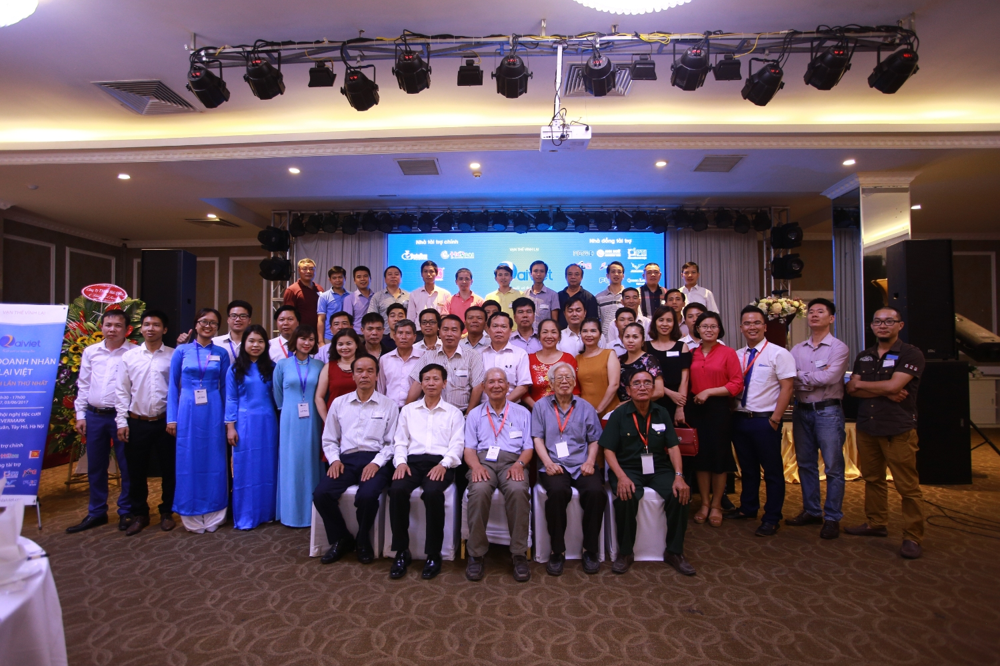

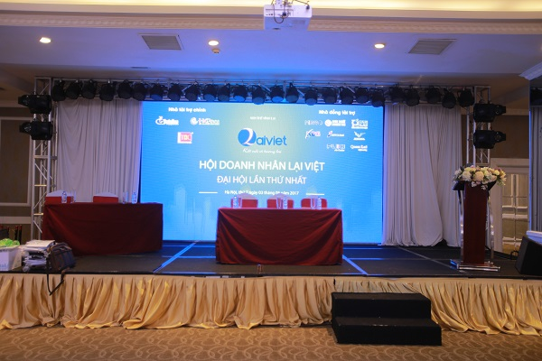  
Đại hội lần thứ nhất, với sự tham dự của Ban thường trực Hội đồng gia tộc Họ Lại Việt Nam, Ban cố vấn hội, Các đại biểu là con cháu Họ Lại nghe tin tới dự cùng 38 thành viên của Hội Doanh Nhân Lại Việt đã tạo ra một sự kiện ý nghĩa, đánh dấu sự phát triển của dòng Họ Lại trên tinh thần đoàn kết, liên kết cùng hướng tới một tương lại tốt đẹp hơn.  
   
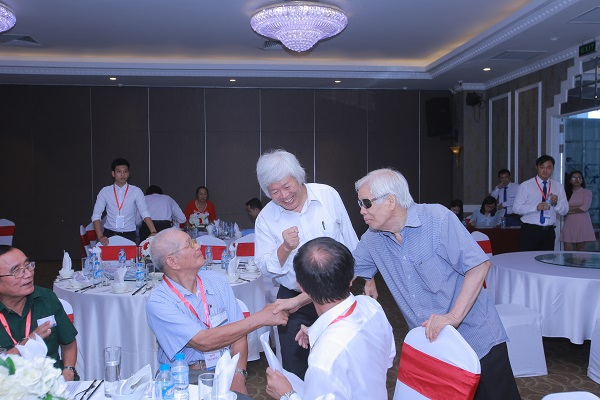  
*Ông Lại Thế Tác(Chủ tịch HĐGT)-Ông Lại Cao Hiến (Con Ông Nguyện)-Ông Lại Cao Nguyện từ trái sang..*  
   
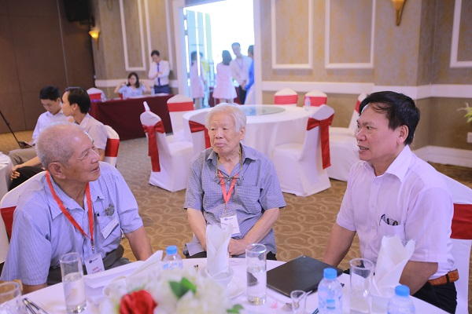  
 *Ông Lại Văn Quán (Cố vấn Hội DN) trò chuyện cùng HĐGT và Cụ Nguyện*  
   
Đại hội lần thứ nhất, với sự tham gia tài trợ của hơn 10 thương hiệu là các doanh nghiệp do con cháu Họ Lại thành lập đã thổi một làn gió mới trong phong trào khởi nghiệp của cộng đồng con cháu Họ Lại nói riêng và của đất nước nói chung.  
   
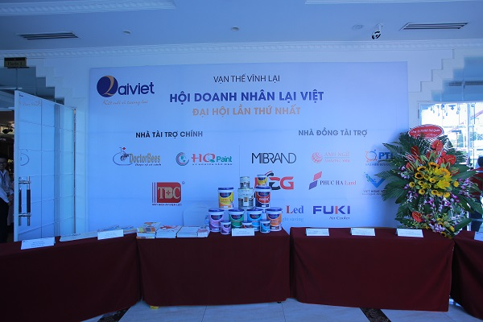  
*Các nhãn hiệu tài trợ cho sự kiện*  
   
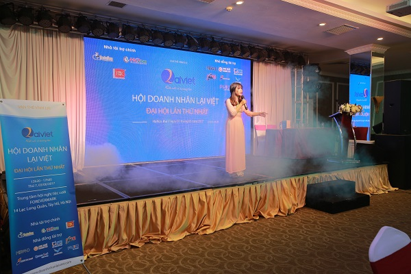  
   
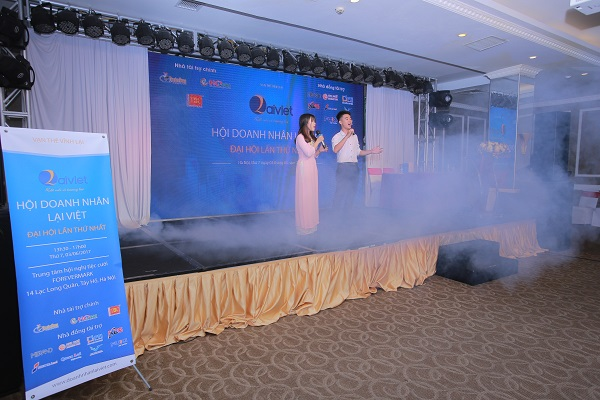  
   
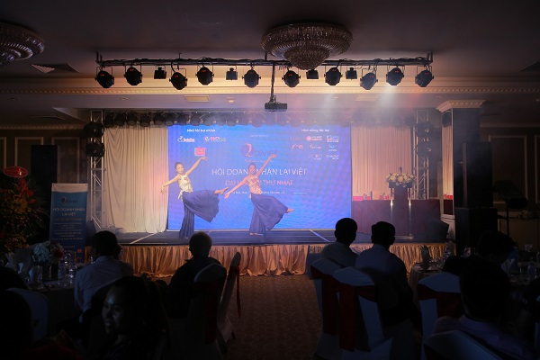  
*Các tiết mục âm nhạc đặc sắc đã mở màn cho chương trình đại hội*  
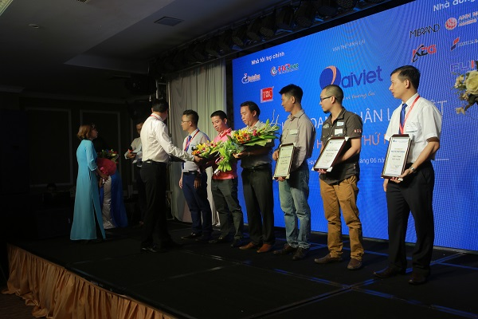  
   
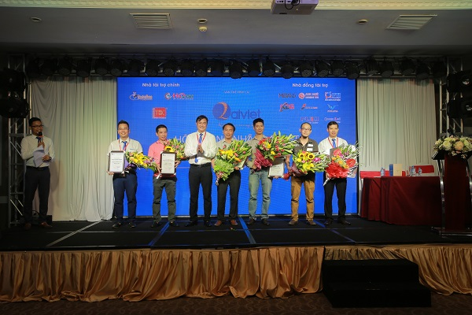  
*Anh Lại Mạnh Quân (Trưởng BTC) lên trao chứng nhận và hoa cho các đơn vị tài trợ  
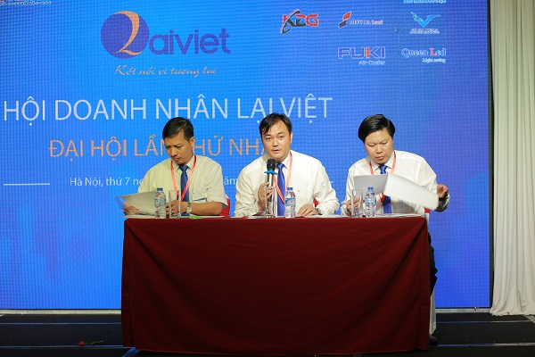  
Đoàn chủ tịch ( Anh Lại Văn Tư, Lại Mạnh Quân, Lại Văn Hiếu từ trái sang) lên làm nhiệm vụ  

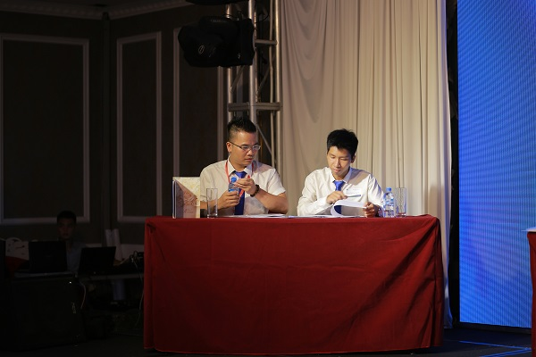*  
*Đoàn thư kí (Anh Lại Thế Long - Lại Cao Phúc) lên làm nhiệm vụ  

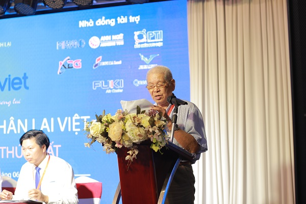  
Ông Lại Thế Tác (Chủ tịch HĐGT) lên phát biểu cảm nhận về sự kiện*  
Mở đầu Đại hội, Anh Lại Mạnh Quân thay mặt BCH lâm thời lên đọc báo cáo tổng kết hoạt động trong 1 năm của hội, tiếp sau đó Anh Lại Văn Hiếu lên đọc sơ thảo điều lệ Hội để đại hội đóng góp ý kiến sửa đổi và thông qua lần thứ nhất.,  
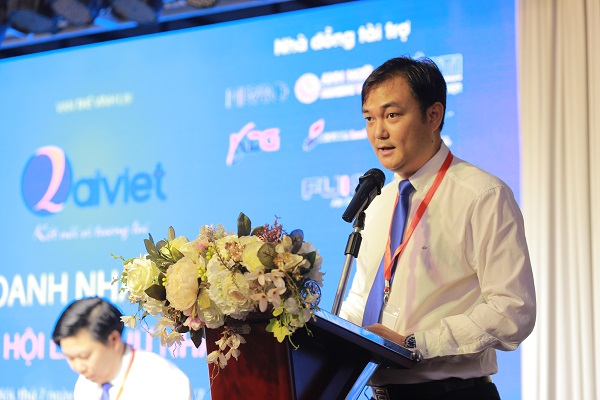  
Anh Lại Mạnh Quân lên đọc báo cáo hoạt động sau 1 năm của BCH lâm thời  
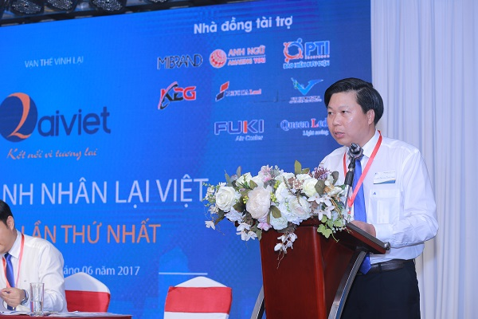  
*Anh Lại Minh Hiếu lên đọc sơ thảo điều lệ Hội*  
   
Các đại biểu, thành viên viên trong Ban cố vấn hội và các hội viên đã sôi nổi tham gia đóng góp ý kiến về điều lệ dự thảo hội.  
   
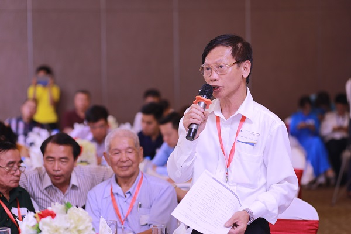  
*Bác Lại Xuân Cương (Nguyên chuyên viên cao cấp VP Chính Phủ - Cố vấn Hội) đóng góp ý kiến xây dựng điều lệ Hội  
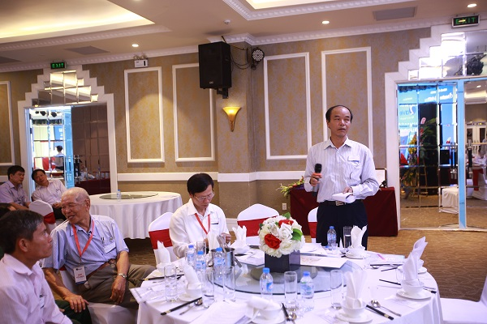  
Bác Lại Văn Nghiên (Ban Nội Chính TW - Cố vấn Hội) đóng góp ý kiến xây dựng điều lệ Hội  
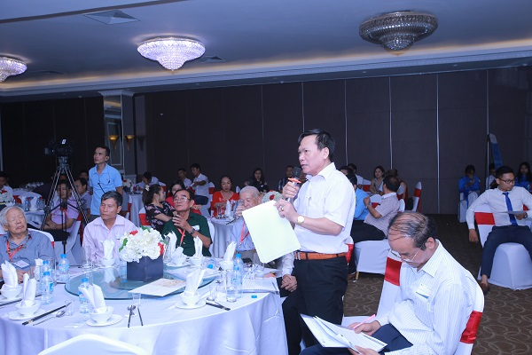  
Bác Lại Văn Quán (Chủ tịch HĐQT Cty xây dựng đường sắt 6 - Cố vấn Hội) đóng góp ý kiến xây dựng điều lệ Hội  
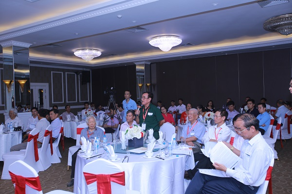  
Bác Lại Văn Thư (Phó chủ tịch HĐGT)  
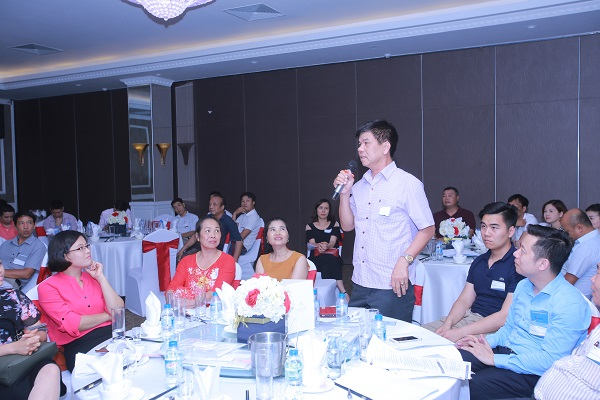  
Anh Lại Văn Toản (Chủ tịch hội doanh nghiệp trẻ tỉnh Lạng Sơn)*  
Sau khi các thành viên tham gia đóng góp ý kiến xây dựng điều lệ Hội và 100% Hội viên thông qua điều lệ hội sửa đổi lần thứ nhất, Đại hội đã tiến hành bầu BCH Hội doanh nhân Lại Việt Lần thứ nhất với 15 thành viên.  
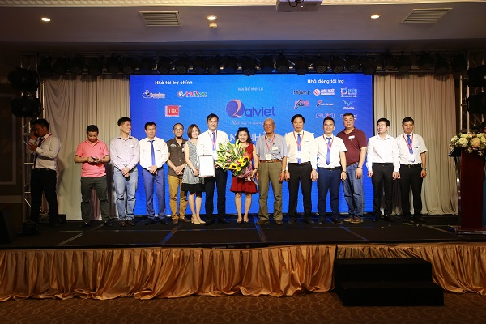  
*BCH Hội Doanh Nhân Lại Việt ra mắt và nhận hoa chúc mừng từ HĐGT*  
   
15 thành viên trong BCH khóa I bao gồm:  
.............................................................  
1) Lại Mạnh Quân (Chủ tịch Hội)  
2) Lại Minh Hiếu (Phó CT Hội)  
3) Lại Văn Tư (Phó CT Hội)  
4) Lại Thế Long (Tổng Thư Kí Hội)  
5) Lại Văn Đức (Ủy Viên)  
6) Lại Duy Tuân (Ủy Viên)  
7) Lại Tiến Mạnh (Ủy Viên)  
8) Lại Quốc Cường (Ủy viên)  
9) Lại Trọng Hải (Ủy Viên)  
10) Lại Ngọc Hùng (Ủy Viên)  
11) Lại Nguyễn Quang Vinh (Ủy Viên)  
12) Lại Văn Toản (Ủy Viên)  
13) Lại Văn Ngọc (Ủy Viên)  
14) Lại Thị Thanh Hải (Ủy Viên)  
15) Lại Thị Tân (Ủy Viên)./.  
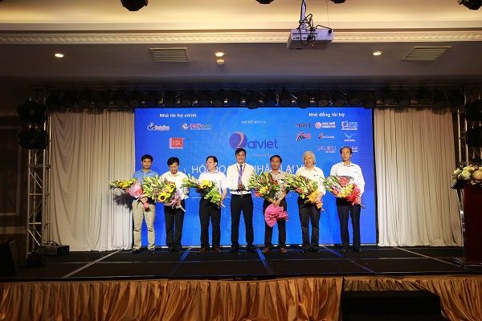  
*Các Thành viên trong ban cố vấn Hội ra mắt Đại Hội*  
   
Các Thành viên trong ban cố vấn Hội gồm:  
1) Bác Lại Xuân Cương - Nguyên Chuyên viên cao cấp VP Chính Phủ  
2) Bác Lại Văn Nghiên - Ban nội chính TW  
3) Bác Lại Văn Quán - Tổng Giám đốc công ty Đường Sắt số 6  
4) Bác Lại Cao Hiến - Trưởng ban tổ chức Nhân Sự tập đoàn hóa chất  
5) Chú Lại Trọng Tâm - Chủ tịch HĐQT công ty xây dựng Nam Sơn, Giám đốc Cty TNHH Hải Quân  
6) Anh Lại Anh Tuấn - Giám đốc khối vận hành ngân hàng Bản Việt  
7) Anh Lại Huy Quân - Trưởng ban LL con cháu Họ Lại, Giám đốc công ty kiểm toán Á Châu  
8) Anh Lại Văn Hải - Giám đốc công ty thiết bị điện Lahaco  

Kết thúc Đại hội, Anh Lại Thế Long tổng thư kí nhiệm kì đầu tiên của Hội lên đọc biên bản và nghị quyết đại hội, 100% Hội viên đã thông qua.  
   
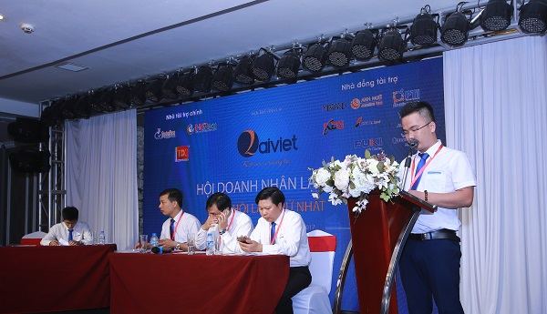  
Anh Lại Thế Long (Tổng thư kí) lên đọc biên bản và nghị quyết Đại Hội  
   
  
Đại Hội lần thứ nhất, Hội doanh nhân Lại Việt đã thành công tốt đẹp với việc thông qua được điều Lệ sơ thảo lần 1, bầu ra được ban chấp hành hội và ra mắt ban cố vấn hội. Đây sẽ là dấu mốc quan trọng đánh dấu sự phát triển của dòng Họ Lại Việt Nam trên tình thần đoàn kết - Nam bang nhất Lại.  
bài viết: Thế Long
