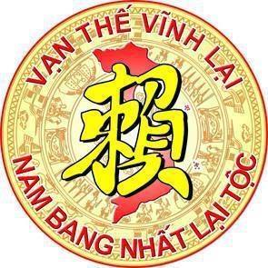

**VẠN THẾ VĨNH LẠI  
HỘI ĐỒNG GIA TỘC HỌ LẠI TỈNH THÁI BÌNH**

Thái Bình, ngày 16 tháng 06 năm 2024.

**THƯ NGỎ**  
(Về việc thành lập “Hội Doanh nghiệp và các đơn vị sản xuất kinh doanh Họ Lại Tỉnh Thái Bình”)

 

***Kính gửi:***

*- Các Doanh nhân, Doanh nghiệp và các đơn vị sản xuất, kinh doanh Họ Lại tỉnh Thái Bình  
- Các Doanh nhân Họ Lại tỉnh Thái Bình đang hoạt động sản xuất, kinh doanh trên mọi miền Đất nước và Nước ngoài.*

 

Song song với lịch sử hào hùng của Dân tộc, sự đóng góp của các thế hệ dòng Họ Lại Việt Nam trong lịch sử dựng nước và giữ nước qua các thời kỳ đã và đang tô thêm truyền thống anh hùng của Dân tộc.Trải qua bao thăng trầm, biến đổi của lịch sử dân tộc, ở thời đại nào cũng có sự đóng góp không nhỏ của dòng Họ Lại chúng ta, Các bậc tiền nhân đã tô những dấu son chói lọi trong sử vàng Dân tộc, để lại cho hậu nhân niềm tự hào về nguồn cội. Hiện nay với Gia Phả dòng họ và các tài liệu lịch sử, Khu di tích lịch sử “Từ đường Họ Lại Việt Nam” thờ Đức Triệu Tổ của dòng Họ Lại Việt Nam, tại xã Hà Dương, huyện Hà Trung, tỉnh Thanh Hóa, là nơi để con cháu dòng họ trên toàn quốc hướng về tưởng nhớ Đức Triệu Tổ và tri ân các bậc tiền nhân của dòng họ, với phương châm:

**“Hướng về cội nguồn – Tri ân Tổ Tiên – Đoàn kết, Phát triển”**

 

Trong những năm qua, thông qua các hoạt động kết nối, tìm về cội nguồn, tri ân tổ tiên, chúng ta những người con của Họ Lại càng thêm tự hào khi được hiểu biết và giáo dục về lịch sử lâu đời và truyền thống, văn hóa của dòng họ mà tổ tiên bao đời dày công vun đắp. Tiếp nối truyền thống ngàn đời của các bậc tiền nhân, các lớp kế thừa là con cháu Họ Lại ở khắp mọi miền đất nước đã và đang cống hiến trí tuệ, tài năng, vật lực trên mọi lĩnh vực khoa học, kinh tế, chính trị, quân sự…cùng với các dòng họ anh em trong cộng đồng anh em các dân tộc Việt Nam góp phần xây dựng tổ quốc.

 

Đội ngũ Doanh nhân Họ Lại Việt Nam với trí tuệ, tài năng của mình đã và đang mang lại những thành tựu đáng khích lệ được xã hội đánh giá cao. Hiện nay đội ngũ Doanh nhân Họ Lại Việt Nam với tinh thần “Hướng về cội nguyền – Tri ân Tổ Tiên – Đoàn kết, Phát triển” đã thành lập “Hội Doanh nhân Lại Việt”, Hội đi vào hoạt động được 7 Năm, đã và đang phát triển rất tốt, góp phần không nhỏ vào sự phát triển chung của xã hội cũng như dòng họ, kết nối, hợp tác, phát triển của các Doanh Nghiệp Họ Lại Trên toàn quốc với tôn chỉ: “Tập hợp, kết nối các Doanh nhân Họ Lại và Doanh nghiệp, với mong muốn giao lưu, chia sẻ kinh nghiệm, tìm kiếm cơ Hội hợp tác hỗ trợ trong công việc và cuộc sống đồng thời gắn kết và ủng hộ sự phát triển của Lại tộc.”

 

Họ Lại tỉnh Thái Bình gồm nhiều Chi Họ được phân bố đều tại các địa bàn trong toàn tỉnh. Cộng đồng con cháu trong họ luôn đoàn kết, tâm huyết, tổ chức nhiều hoạt động, sự kiện tri ân công đức Tổ Tiên, hợp tác phát triển kinh tế, nâng cao trí thức, đóng góp nhiều trí lực, tài lực vào sự phát triển của Đất nước, của dòng họ. Phát huy thế mạnh cộng đồng, kết nối cùng hỗ trợ, đoàn kết, phát triển của cộng đồng con cháu Họ Lại trong toàn tỉnh. Được sự hỗ trợ của “Hội Doanh nhân Lại Việt”, Hội đồng Gia tộc Họ Lại tỉnh Thái Bình bàn bạc và đi đến thống nhất mời toàn thể các Doanh nhân, Doanh nghiệp và các các đơn vị sản xuất kinh doanh trong và ngoài Quốc doanh là người mang Họ Lại tỉnh Thái Bình đang hoạt động sản xuất, kinh doanh trong Tỉnh, trên mọi miền Tổ quốc và Nước ngoài để thành lập “Hội Doanh nghiệp và các đơn vị sản xuất kinh doanh Họ Lại Tỉnh Thái Bình” tên viết tắt là: “Hội Doanh nghiệp Lại Việt Thái Bình” với phương châm:

**Phát huy truyền thống Lại Tộc  
Kết nối, chia sẻ, hỗ trợ  
Đoàn kết, hợp tác, phát triển Xây dựng Doanh nghiệp, Dòng họ vững mạnh**

 

Hội đồng Gia tộc Họ Lại tỉnh Thái Bình trân trọng kính mời các Ông (Bà) là con cháu Họ Lại tỉnh Thái Bình thuộc các thành phần nêu trên đang hoạt động sản xuất, kinh doanh trong Tỉnh, trên mọi miền Tổ quốc và Nước ngoài hưởng ứng cho chủ trương này của Hội đồng Gia tộc Họ Lại tỉnh Thái Bình và đăng ký tham gia là thành viên của Hội. Sự hiện diện của các Ông, (Bà) là niềm tự hào của dòng họ, góp phần cho sự thành công của các chủ trương vì lợi ích Doanh nghiệp, dòng họ và cộng đồng. Xin trân trọng cám ơn!

 **T/M HỘI ĐỒNG GIA TỘC HỌ LẠI TỈNH THÁI BÌNH  
PHÓ CHỦ TỊCH  
(Đã ký)  

  
LẠI VĂN THẢO**

**Để đăng ký thành viên của Hội, xin gọi Về Ban thường trực HĐGT Họ Lại Thái Bình:**  
- Ông: Lại Văn Thảo (Phó chủ tịch HĐGT Họ Lại Thái Bình) Hotline: 0967858898  
- Ông: Lại Thế Quý (Chủ tịch lâm thời Hội Doanh nghiệp Lại Việt Thái Bình) Hotline: 0984196868
