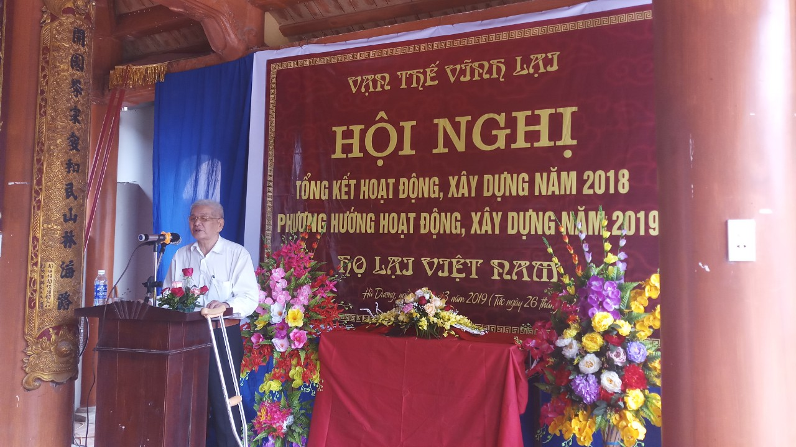
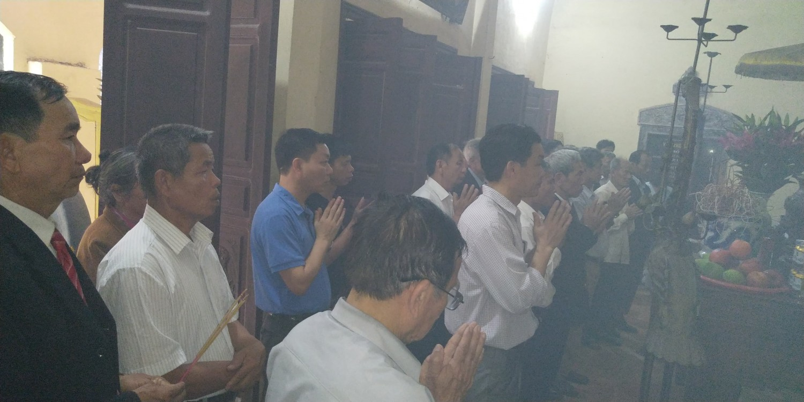
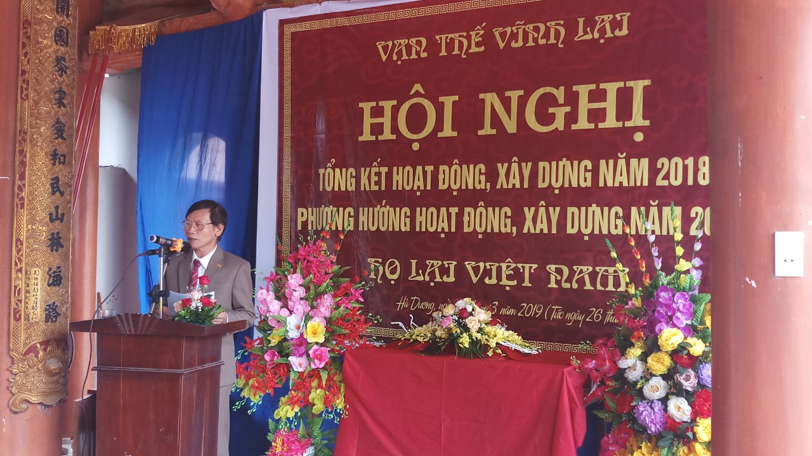
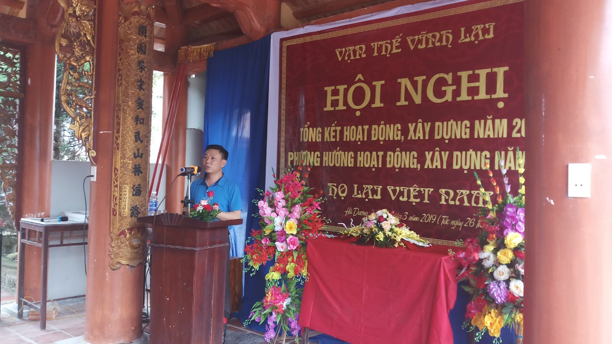
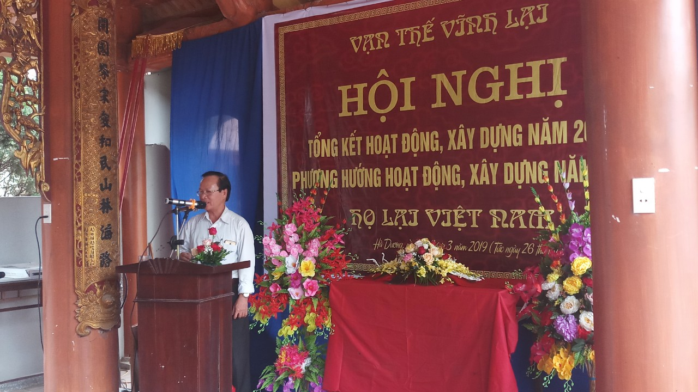
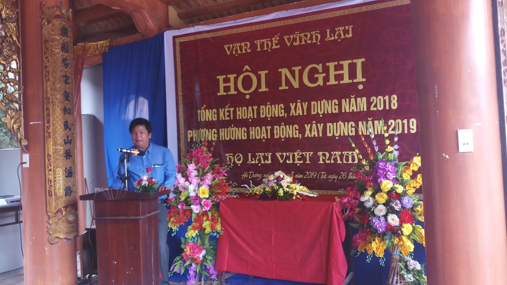
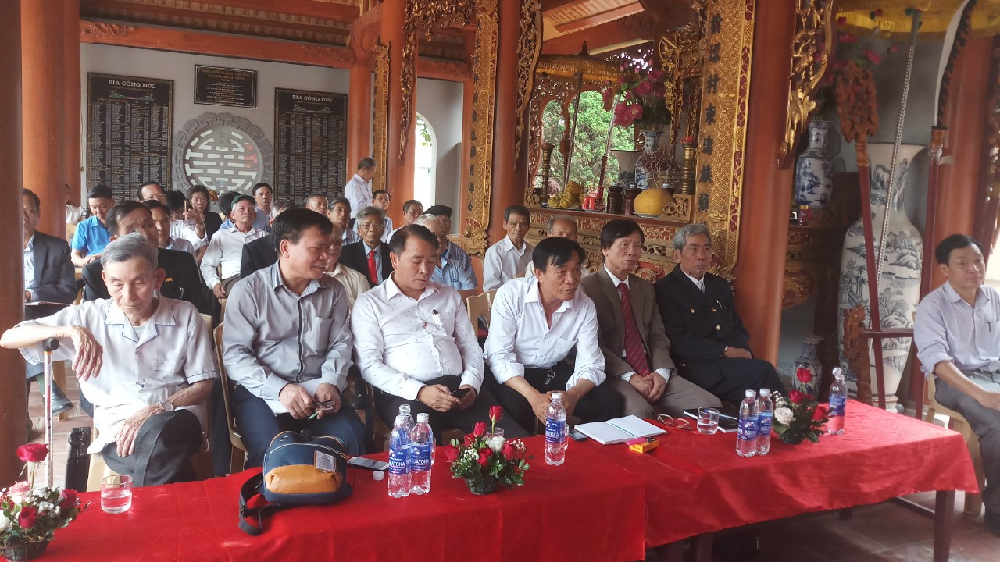
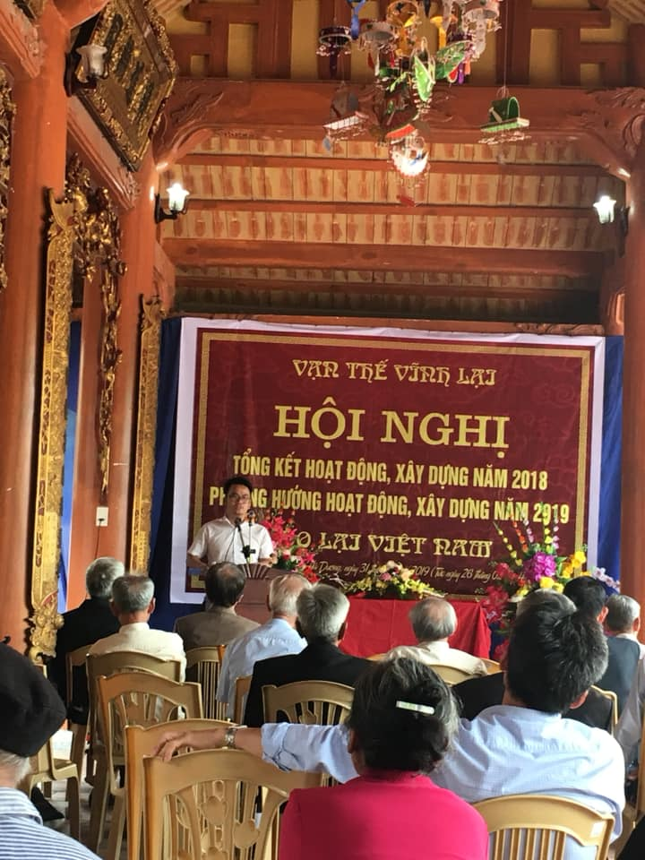

**Đoàn đại biểu dâng hương kính tổ trước khi vào sự kiện**

Mở đầu sự kiện, Ông Lại Thế Tác (Chủ Tịch HĐGT) lên phát biểu tổng kết các kết quả trong công tác xây dựng năm 2018 và trình bày kế hoạch xây dựng năm 2019. Tuy tuổi đã cao (90t) Nhưng với sự nhiệt huyết, tinh thần trách nhiệm và sự tân tâm của mình, ông đã chia sẻ những tâm tư nguyện vọng về kế hoạch 2019 để hoàn thành nốt khuôn viên nhà thờ trong tổng thể kiến trúc. Sự tâm huyết đó đã lan tỏa trong lòng các đại biểu tham sự trong suốt sự kiện.  
 

**Ông Lại Thế Tác(Chủ tịch HĐGT) Phát biểu tổng kết và nêu phương hướng 2019**

Với tình thần đoàn kết và mong muốn xây dựng Dòng họ ngày một phát triển hơn nữa, Các đại biểu về tham dự đã tích cực đóng góp các ý kiến thiết thực, trong đó có cả các góp ý về mặt đã làm được và chưa được của Ban thường trực trong thời gian qua. Trên tinh thần tiếp thu xây dựng, Ban thường trực HĐGT cũng đã tiếp nhận và tiếp thu các ý kiến của đại biểu để điều chỉnh các phương hướng hoạt động sao cho kết quả 2019 được tốt hơn.  
 

**Bác Lại Xuân Cương ( Trưởng ban Truyền thông, Cố vấn hội DN, Nguyên cố vấn VP chính phủ) Phát biểu**

**Anh Lại Huy Quân(Trưởng ban liên lạc) Phát biểu**

**Đại biểu Lại Diệp (Đại diện BLL Miền Trung) Phát biểu**

**Đại biểu Lại Đình (đoàn miền nam) Phát biểu**

Sự kiện diễn ra trong một bầu không khí nghiêm túc với các ý kiến thẳng thắn từ các đại biểu tham dự, trên tinh thần xây dựng cao. Ban TTHĐGT đánh giá rất cao các ý kiến của các đại biểu xuất phát từ cái tâm công hiến và một lòng hướng về tổ tiên.

**Hình ảnh các đại biểu trong sự kiện**

 

**Anh Lại Thế Long (Tổng thư kí hội DN Lại Việt) Phát biểu**

Để hỗ trợ kế hoạch xây dựng của HĐGT, Hội DNLV đã phát động phát tâm công đức và sẽ bàn giao đợt 2 là 75 triệu cho HĐGT vào ngày 7.4.2019 ( Trong sự kiện Ngày Hội Mùa Xuân Họ Lại Việt Nam). Đợt 1 vào năm 2018 Hội cũng đã phát động hội viên phát tâm công đức và bàn giao cho HĐGT 130tr.  

Sau gần 5h diễn ra sự kiện, Hội nghị đã thành công tốt đẹp trong niềm vui hân hoan của các đại biểu về tham dự. Đây là sự kiện có dấu mốc quan trọng trong công tác xây dựng các hoạt động năm 2019. Cùng chúc cho các đại biểu luôn mạnh khỏe để cùng HĐGT xây dựng Dòng Họ đoàn kết và phát triển trường tồn.
