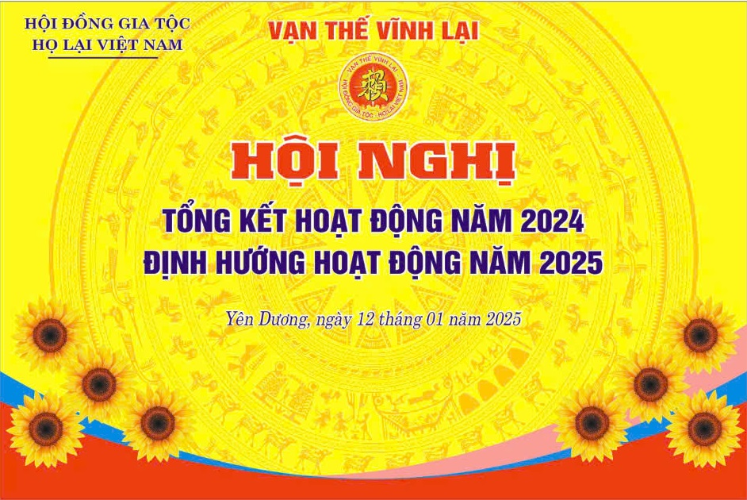

## Trước khi diễn ra Hội nghị các đại biểu đã tiến hành nghi lễ dâng hương trang trọng, thể hiện lòng tôn kính và tri ân tiên tổ họ Lại Việt Nam.

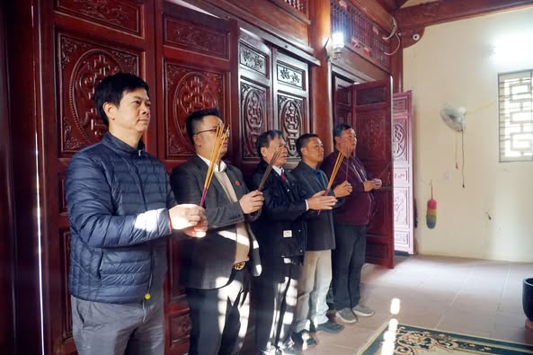

Tiếp theo, Hội nghị đã tiến hành trao các quyết định bổ nhiệm các Phó Chủ tịch HĐGT họ Lại Việt Nam và thành viên mới tham gia HĐGT họ Lại Việt Nam. Đây là sự kiện quan trọng nhằm tăng cường nhân sự tâm huyết hướng tới việc thực hiện các hoạt động phong trào, nhằm xây dự khối đại đoàn kết và phát triển của dòng họ trong thời gian tới

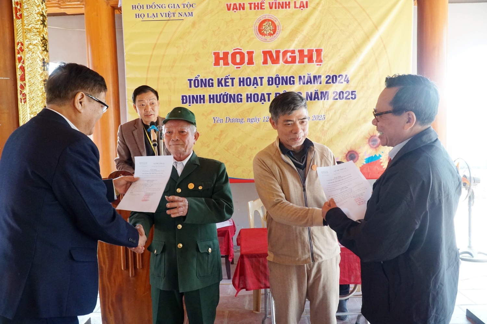

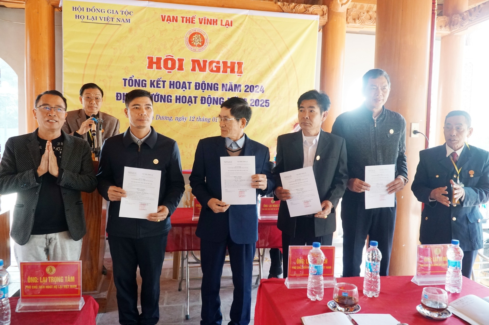

Ông Lại Quốc Tuấn, Phó Chủ tịch Thường trực HĐGT họ Lại Việt Nam, đã trình bày báo cáo Tổng kết hoạt động của HĐGT họ Lại Việt Nam trong năm 2024. Báo cáo nêu rõ những thành tựu đã đạt được cũng như những khó khăn và thách thức mà HĐGT họ Lại Việt Nam đã vượt qua. Đồng thời, ông cũng đề xuất nhiều phương hướng nhiệm vụ quan trọng cho năm 2025, nhằm tiếp tục đưa HĐGT họ Lại Việt Nam phát triển mạnh mẽ hơn.  

 

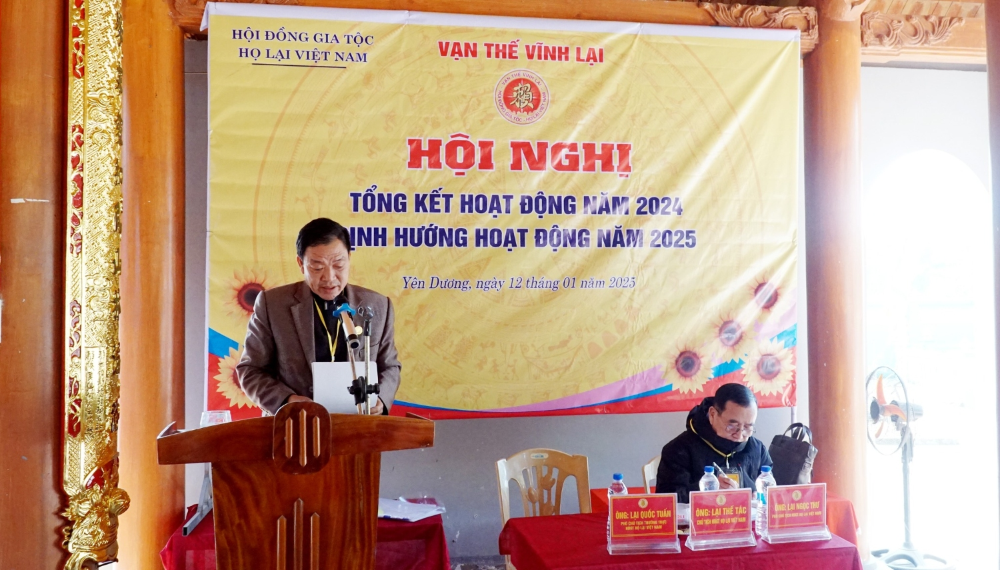

Các báo cáo của các Ban chuyên trách cũng được trình bày trong hội nghị. Ông Lại Trọng Tâm, Phó Chủ tịch HĐGT họ Lại Việt Nam - Chủ tịch Hội Doanh nhân Lại Việt, đã trình bầy báo cáo về hoạt động của Hội Doanh nhân Lại Việt trong năm 2024 và đưa ra những định hướng nhiệm vụ cho năm 2025. Ông Lại Thế Long, Tổng Biên tập Ban Thông tin Truyền thông họ Lại Việt Nam, đã trình bày báo cáo về hoạt động thông tin, truyền thông của dòng họ trong năm 2024 và những định hướng phát triển trong năm 2025. Ông Lại Huy Quân, Phó Chủ tịch HĐGT họ Lại Việt Nam - Trưởng Ban Liên lạc cộng đồng con cháu họ Lại Việt Nam, đã trình bầy báo cáo về tình hình kết nối cộng đồng trong dòng họ và phương hướng phát triển trong thời gian đến.  
 

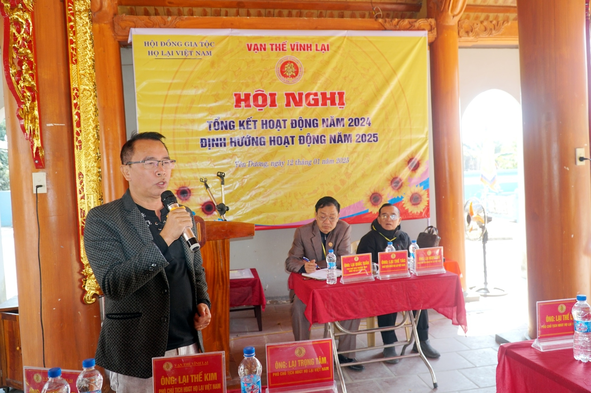

Hội nghị còn lắng nghe nhiều tham luận và ý kiến đóng góp từ các đại biểu đại diện cho HĐGT họ Lại các tỉnh, thành, Ban trị sự như, TP Hải Phòng, Bắc Ninh, Ninh Bình, Nam Định, Thái Bình, Hà Nội, Hà Tây và Thanh Hóa. Các đại biểu đã kiến nghị nhiều nội dung cụ thể đầy tâm huyết, đề xuất các giải pháp thiết thực nhằm thúc đẩy sự phát triển của HĐGT họ Lại Việt Nam trong thời gian tới.  
 

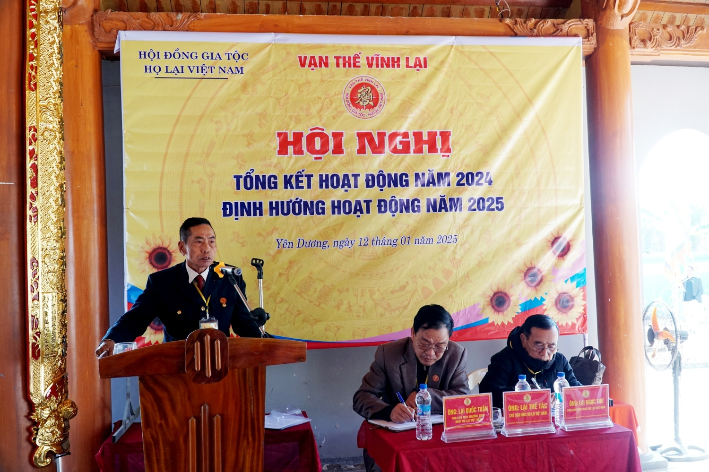

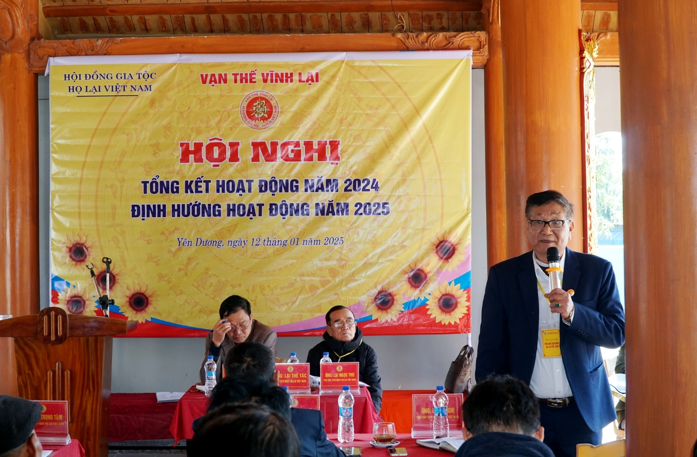

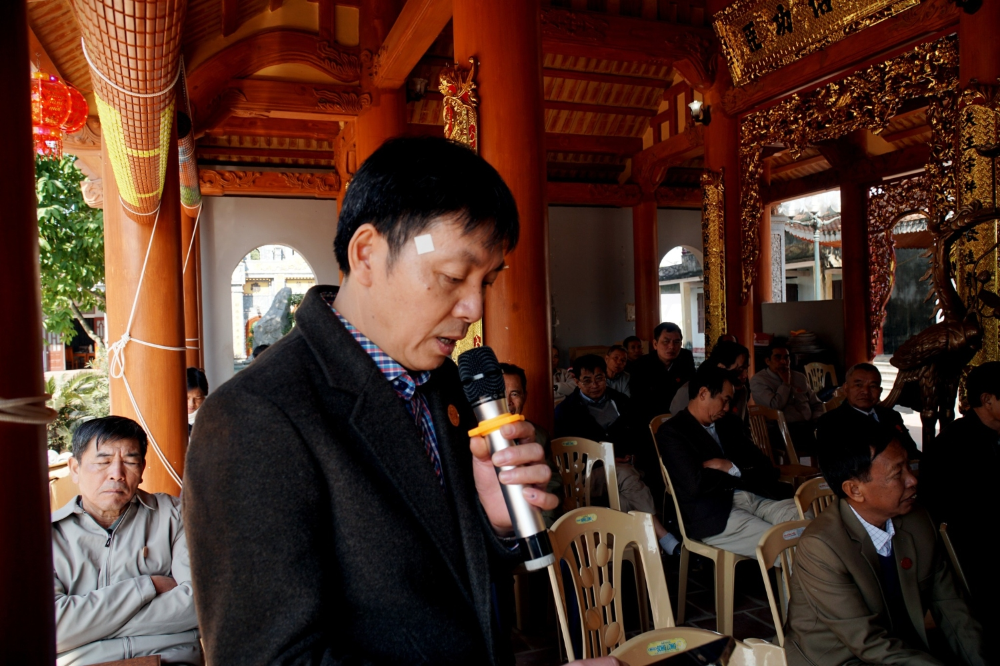

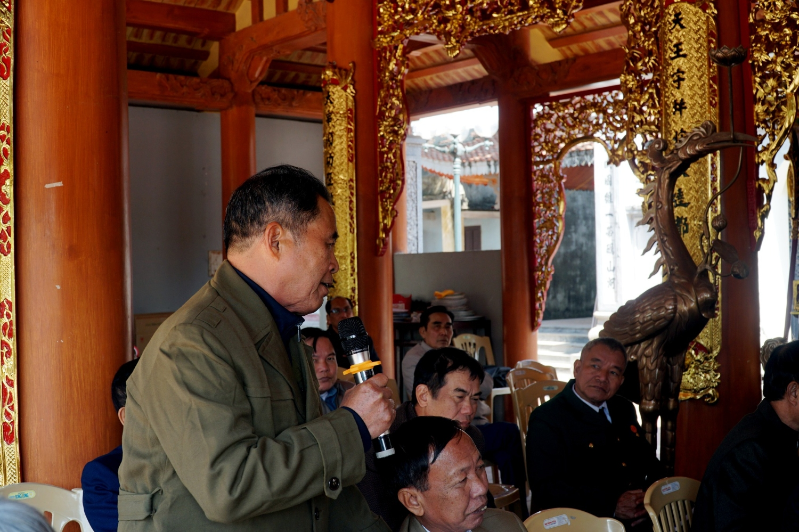

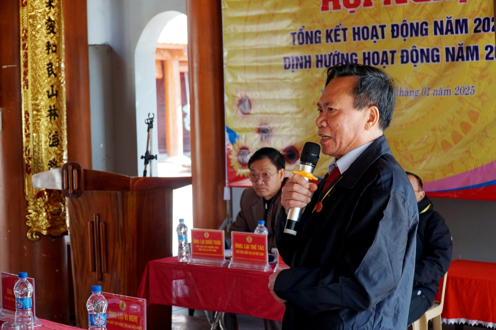

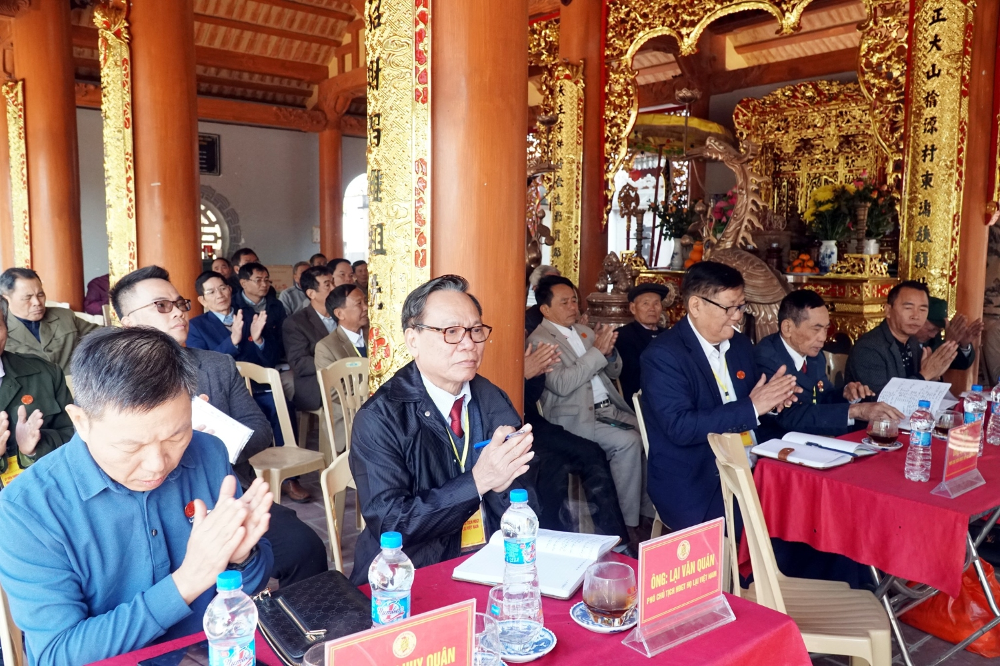

Hội nghị kết thúc thành công tốt đẹp với nhiều kết luận quan trọng; mọi thông tin chi tiết, kết quả và Nghị quyết của Hội nghị sẽ được Ban Thông tin Truyền thông họ Lại Việt Nam thông báo đến cộng đồng dòng họ trong thời gian tới, biết, thực hiện./.  
 

Theo: BTTTT Họ Lại Việt Nam
