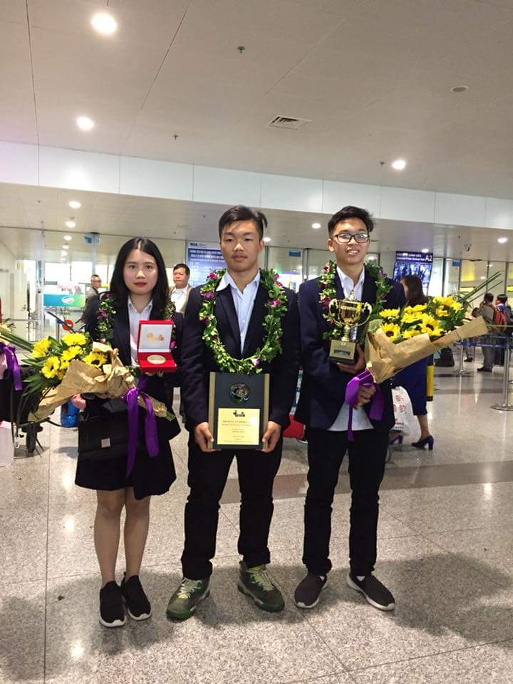
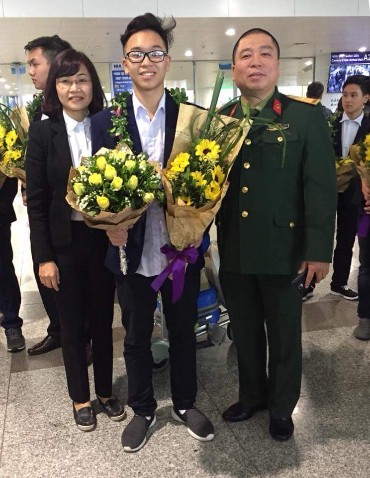
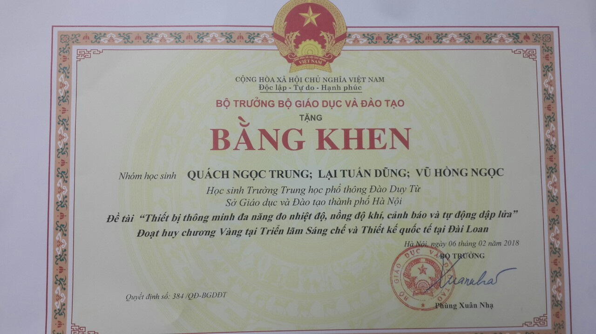
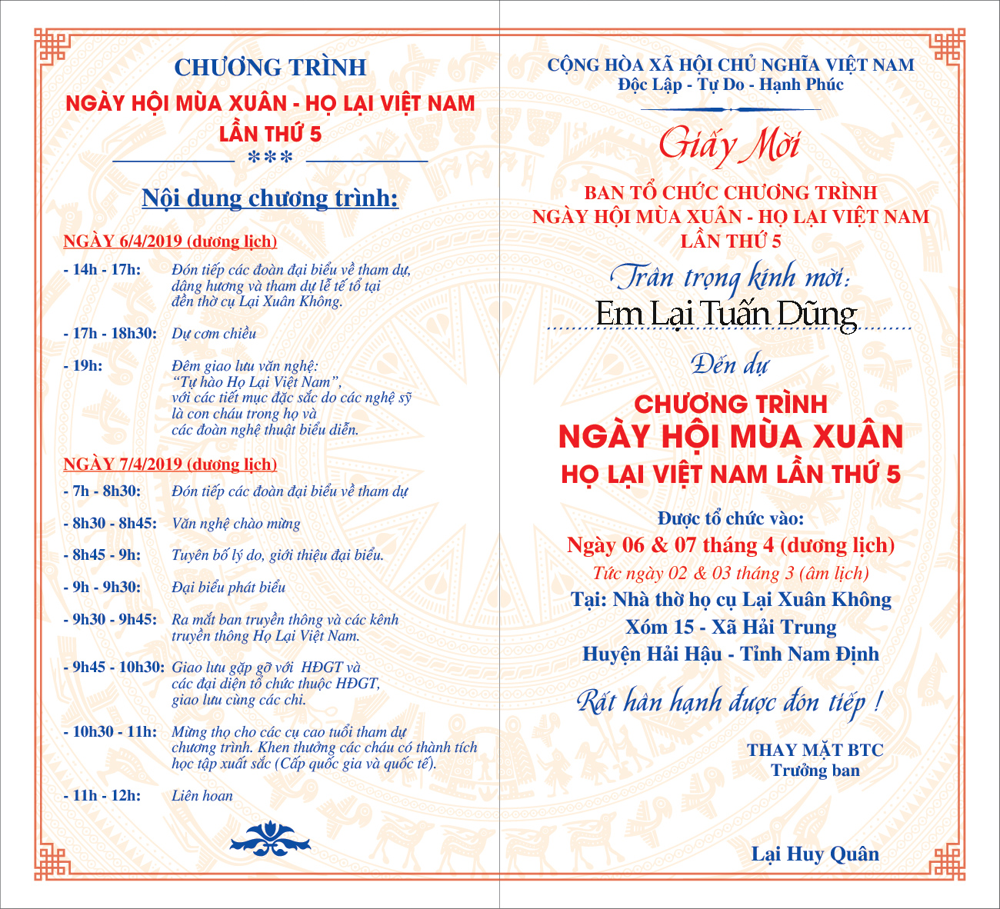

Lại Tuấn Dũng, sinh ra tại Hà Nội trong một gia đình có Ba là Giảng viên trường Học Viện Quân y :" Anh Lại Văn Tuấn". Nên em sớm thừa hưởng trong mình niềm đam mê sáng tạo vô bờ bến. Anh Tuấn chia sẻ, hồi nhỏ Dũng rất thích các đồ chơi về công nghệ, em thường có thói quen tìm tòi, nghiên cứu các nguyên lý hoạt động của các đồ chơi như Oto, cần cẩu...Khi các đồ chơi hỏng thì Dũng loay hoay sửa và tìm các vật dụng sẵn có trong nhà để thay thế...

*Lại Tuấn Dũng ( Ngoài cùng bên phải nhận giải cùng các bạn".*  
 

Chính nhờ có đam mê và khát vọng lớn lao nên trong chương trình cuộc thi Sáng Chế và Thiết Kế tại Cao Hùng - Đài Loan vừa qua, dự án của dũng và các bạn đã xuất sắc dành Huy Chương Vàng. Đây là một vinh dự lớn lao cho Đất nước chúng ta và cho Dòng Họ Lại. Trò chuyện với Dũng, em có một ước muốn được đi du học ngành kĩ thuật tại các đất nước phát triển như Đức, Mỹ để phát triển hơn nữa và khi trở về có thể đóng góp xây dựng quê Hương.  
 

*Gia đình anh Lại Văn Tuấn tới đón Dũng tại sân bay và chia vui cùng con*  
 

Nhờ các thành tích trên mà năm 2018, Dũng đã vinh dự được Bộ giáo dục và đào tạo trao bằng khen. Đây là niềm vui và sự động viện khích lệ lớn lao cho ước mơ của Dũng bay cao và bay xa hơn.

*Bằng khen bộ trưởng phùng Xuân Nhạ trao tặng*

Trong chương trình:" Ngày Hội mùa xuân Họ Lại Việt Nam lần thứ 5" được tổ chức vào ngày 6&7/4/2019 sắp tới, Dũng cũng vinh dự được Ban Tổ Chức mời tới tham dự và trao tặng bằng khen của dòng họ.  
 

*Dũng Vinh dự được BTC mời tới nhận bằng khen của Dòng họ Lại Việt Nam*

Qua câu chuyện của Dũng, hy vọng rằng các thế hệ trẻ của Dòng Họ Lại Việt Nam thi đua học tập tốt lập thành tích báo công tổ tiên và phát triển quê hương đất nước, làm rạng dành họ như tổ tiên chúng ta đã từng làm.
