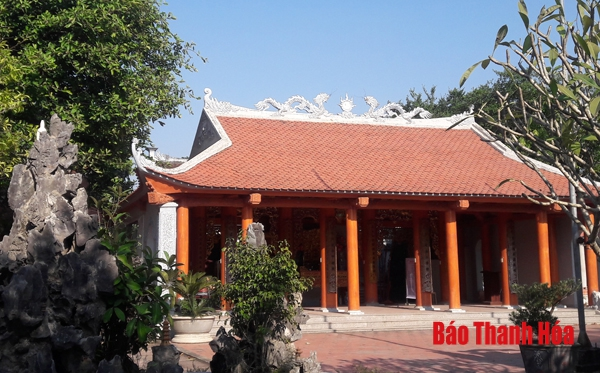
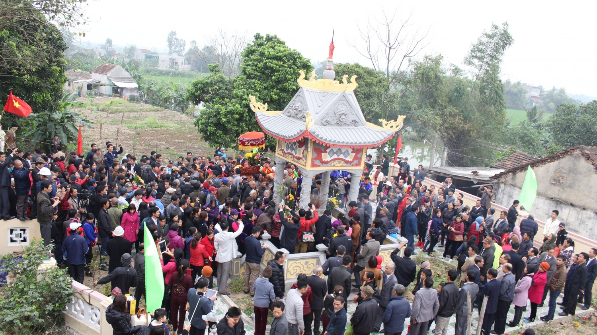

*Từ Đường họ Lại.*

**Thủy tổ họ Lại và các nhân vật lịch sử dòng họ Lại**

Theo sử liệu đầu tiên có liên quan đến nguồn gốc họ Lại ở nước ta là bộ “An Nam chí lược” và bộ “Việt sử lược” soạn cuối đời Trần. Trong “An Nam chí lược” nói rõ: Lại Tiên làm Thái thú quận Giao Chỉ (Thế kỷ thứ 2 sau công nguyên). Kể từ đó, họ Lại coi Lại Tiên là vị tổ đầu tiên và duy nhất của họ Lại ở nước ta. Những tướng tài mở nước, phò vua, giúp dân, góp phần khôi phục giang sơn các triều đại nhà Lý, triều Lê, triều Nguyễn Tây Sơn như: Trung dũng tướng quân Lại Đôn Tín; Huyện thừa Lại Thế Tương đã giúp rập Lam Sơn Động Chủ dấy nghĩa thành công; Bảo tín hầu Lại Linh khuông phò nhà Lý đánh đông dẹp bắc lập nhiều công tích; các danh tướng Lại Thúc Mậu, Lại Thế Vinh, Lại Thế Khanh, Lại Thế Quý... cả thảy 18 vị quận công cùng nhiều yếu nhân tôn lập và bảo vệ nhà Lê Trung hưng; Bắc bình hầu Lại Tiến Tùy tham gia khởi nghĩa Tây Sơn, lập nhiều công trạng đã anh dũng hy sinh; hoặc những bậc học giỏi tài cao giàu lòng đức nghĩa như tiến sĩ Lại Kim Bảng, Lại Mẫn, Lại Đức Dụ, Lại Gia Phúc, Lại Đăng Tiến, Lại Duy Chí... Có thể nói họ Lại từng có nhiều nhân vật xuất sắc trên vũ đài lịch sử nước ta.

Cuốn Gia phả xưa nhất của họ Lại (bằng chữ Hán) thời vua Lê Cảnh hưng năm thứ nhất (1740) ở làng Quang Lãng, huyện Tống Sơn còn lưu giữ đến ngày nay đã ghi chép từ đời đức triệu tổ là quan huyện thừa Lại Thế Tương là hậu duệ của viễn tổ Lại Tiên đến vùng đất Quang Lãng sinh cơ lập nghiệp từ thế kỷ XV (thời Thuận Thiên - Lê Lợi) rồi sinh ra các chi phái ở đây. Con cháu các chi họ Lại ở 29 tỉnh, thành trong cả nước đã ghi chép gia phả đến đời thứ 31, 32. Từ năm 2000, đã có 339 chi họ và hiện nay (2018) lên tới 500 chi họ... coi đây là ngôi từ đường gốc của tổ dòng họ Lại. Từ đường họ Lại tôn thờ Lại Tiên; 18 vị quận công triều Lê (gồm Lại Thế Lạc, Lại Thế Tưởng, Lại Thế Vinh, Lại Thế Đạt, Lại Thế Mỹ, Lại Thế Khanh, Lại Thế Tướng, Lại Thế Định, Lại Thế Hiển, Lại Thế Hiền, Lại Thế Thời, Lại Thế Duy, Lại Thế Ất, Lại Thế Khánh, Lại Thế Tế, Lại Thế Hiên, Lại Thế Tích, Lại Thế Dũng); 48 vị quan tước và 8 vị tiến sĩ triều Lê - Nguyễn được tôn thờ ở từ đường họ Lại. Có thể nói, từ đường họ Lại ở làng Quang Lãng, huyện Tống Sơn được xem là một di tích thờ tự khá nhiều nhân vật lịch sử thời Lê - Nguyễn...

Vì thế, địa điểm “Từ đường họ Lại” ở làng Quang Lãng, huyện Tống Sơn xưa, làng Đông Thôn, xã Hà Dương, huyện Hà Trung, tỉnh Thanh Hóa ngày nay, đã trở thành điểm hội tụ tâm linh, nơi tìm về cội nguồn của các chi họ Lại trong cả nước. Nhiều năm qua, hàng năm có khoảng 500 - 700 lượt người (năm lẻ) và năm chẵn (5 năm/1 lần) lên tới trên vài ngàn lượt người các chi họ Lại trong nước tìm về tham dự lễ giỗ tổ và dâng hương bái tổ vào ngày 15 tháng giêng âm lịch hàng năm tại Từ đường họ Lại.

**Nơi họ Lại tìm về nguồn cội...**

Từ đường họ Lại được xây dựng từ thế kỷ XV khi huyện thừa Lại Thế Tương đến vùng đất Quang Lãng định cư. Từ mái tranh vách lá đơn sơ, qua nhiều lần tu bổ, năm 2000 Từ đường họ Lại - nơi thờ tổ tiên họ Lại đã được xếp hạng di tích lịch sử văn hóa cấp tỉnh. Nhân dân địa phương còn gọi di tích này là “Từ đường họ Lại” hoặc “Đền thờ Lại Thế Khanh”. Nhà tiền đường, trung đường và hậu cung được sắp đặt, bài trí, nghi lễ, thờ tự đảm bảo trang nghiêm và theo đúng quy định. Các bức đại tự hoành phi, câu đối còn lưu giữ trong nhà thờ họ Lại ở Quang Lãng vào thế kỷ XVI của Vua Lê Huyền tông (1663-1671) ban khen, nhằm tuyên dương công tích của Thái Dương quốc công Lại Thế Vinh và Thái tể Khiêm Quốc công Lại Thế Khanh trong việc tôn lập Vua Lê Trang tông khuông phò nhà Lê Trung hưng (1533-1788) với dòng chữ: “Lại Kỳ Khanh” ở gian giữa, “Khai quốc công thần” và “Triệu Nam hữu Lại” ở hai bên; nội dung chữ viết trong đôi câu đối:

Phiên âm: “Quân tử sự quân, vũ trụ uyển lưu dư khí tiết

Tướng môn xuất tướng, sơn hà do ký cựu huân danh”.

Dịch nghĩa: Quân tử thờ vua, khí tiết tiếng thơm trùm vũ trụ

Cửa tướng, sinh tướng, huân công dấu cũ đượm non sông.

Và

Phiên âm: “Tử hiếu thần trung, tam bách dư viên quốc

Tả chiêu, hữu mục, nhất thập bát công từ”.

Dịch nghĩa: Con hiếu, tôi trung ba trăm năm nước cũ

Tả chiêu hữu mục, mười tám vị quận công.

Nghĩa là trong số những bầy tôi lập công mở nước Nam có người họ Lại.  

 

Di tích Từ đường họ Lại tọa lạc trên một vùng đất có tổng diện tích gần 2 ha, thuộc làng Đông Thôn, xã Hà Dương, huyện Hà Trung. Được sự giúp đỡ, hướng dẫn của các cơ quan chuyên môn, qua 5 lần trùng tu, tôn tạo, nhà hậu cung, trung đường, tiền đường vẫn giữ được nét kiến trúc nguyên gốc, mái ngói truyền thống, cửa vòm... cách bài trí tượng thờ, đồ thờ vừa làm tôn vẻ đẹp uy nghi tráng lệ nhưng vẫn giữ được nét cổ kính rêu phong. Ngôi nhà bia 8 mái bề thế với tấm bia đá đồ sộ dựng ở chính giữa, trên cùng nổi bật dòng chữ “Lại tộc tôn vinh”, phía dưới là tên 18 vị quận công triều Lê, 48 vị quan tước và 8 vị tiến sĩ triều Lê - Nguyễn; danh sách dày đặc các Bà mẹ Việt Nam Anh hùng, anh hùng liệt sĩ của các chi họ Lại trong nước lưu danh trên 3 tấm bia đá dựng ở nhà bia.

Một sự kiện vô cùng quý giá đối với dòng họ Lại. Đó là, trong những năm kháng chiến chống thực dân Pháp, vào mùa xuân Canh Dần (1950) vì có thành tích vận động tòng quân đánh giặc, chi họ Lại ở Phù Vân, huyện Kim Bảng, Hà Nam được Chủ tịch Hồ Chí Minh gửi thư khen ngợi. Nội dung thư được thể hiện ở tấm bia đá: “Trong lúc nước nhà kháng chiến gay go, họ đã nghe tiếng gọi của Chính phủ. Hăng hái tòng quân, bảo vệ đất nước và góp phần chung sức kháng chiến mọi mặt với Chính phủ, là biểu hiện tinh thần yêu nước rất cao. Tôi mong rằng: Các họ trong cả nước Việt Nam, họ nào cũng như họ Lại Phù Vân thì ta không cần phải đánh mà giặc cũng phải lui. Vậy tôi thay mặt Chính phủ nước Việt Nam dân chủ cộng hòa khen ngợi và cảm ơn họ. Mong họ tin tưởng Chính phủ và đoàn kết xung quanh Chính phủ để cùng kháng chiến kiến quốc”.

Bao quanh di tích là tường rào bê tông kiên cố vững chắc. “Nghinh môn” hay còn gọi là “Cổng tam quan” mới được xây dựng theo kiến trúc truyền thống, kết cấu hiện đại dáng bề thế, vừa hoành tráng vừa thể hiện sự trang nghiêm. Nhà truyền thống dùng cho các chi họ sưu tầm hiện vật liên quan trưng bày, giới thiệu như: Cuốn gia phả, văn bằng chứng chỉ đỗ đạt khoa bảng xưa...) nhằm để giáo dục truyền thống “Uống nước nhớ nguồn”, “Ăn quả nhớ người trồng cây”, phát huy lòng tự hào, tôn vinh các giá trị truyền thống cho các thế hệ hiện tại và tương lai của dòng họ. Nhà khách, nhà ăn với đầy đủ tiện nghi... để tiếp đón quan khách, đại diện và người của các chi họ về dự lễ giỗ tổ hàng năm. Sân đền, đường đi, bãi đỗ xe... được tu bổ khang trang rộng rãi sạch đẹp thông thoáng thuận lợi khi dòng họ tổ chức các sự kiện.

Đặc biệt, tại khu di tích còn giữ được 3 cây Ruối cổ thụ cao tới 5-7 mét, thân cây to thẳng, cành lá xum xuê, thuộc loại cây quý hiếm được ngành văn hóa công nhận là Cây Di sản, tấm bia gắn dưới gốc cây có đề dòng chữ: “Cây di sản Việt Nam. Từ đường họ Lại, thôn Đông, xã Hà Dương, huyện Hà Trung, tỉnh Thanh Hóa”. Ngôi điện thờ mẫu đang được trùng tu, tôn tạo lại để đáp ứng nhu cầu văn hóa tâm linh hàng ngày và trong thời gian diễn ra các sự kiện ở đây.

Trên đường đến với Từ đường họ Lại (cách chừng năm trăm mét), là khu lăng mộ đức triệu tổ Lại Tiên lặng lẽ trầm mặc ngảnh về hướng Nam. Câu chuyện về nơi vị thủy tổ họ Lại yên nghỉ vĩnh hằng có yếu tố huyền bí. Khi ngài tịch, thi thể ngài mối xông thành mộ, nhân dân địa phương gọi là “thiên táng”. Từ đó, mộ chí của ngài được hậu duệ các chi họ Lại đời nối đời gìn giữ, tu bổ và uy nghi như ngày nay, là nơi để con cháu đời đời thắp hương bái tổ. Cách đó không xa, một võ tướng nhà Hậu Lê là Lại Cửu Uy (tức Võ Cửu Oai) được cử đi trấn ải ở Bắc Ninh, khi mất được an táng tại khu Cồn Cụ, làng Đông Thổ, xã Hà Dương, dân gian có câu thơ truyền lại: “Đói thì ăn ráy ăn khoai/ Chớ đi làm giặc Cửu Oai lấy đầu” để thể hiện sự uy nghiêm của một võ tướng. Hiện khu mộ được tu bổ bảo vệ, con cháu hương khói quanh năm...

**Phát huy giá trị truyền thống uống nước nhớ nguồn...**

Nẻo về nguồn cội là địa chỉ gắn liền với đời sống tâm linh ai ai cũng phải tìm về. Vì vậy, lần theo dấu vết lịch sử và thời gian, gia phả dòng họ, con cháu các chi họ Lại trong nước đã nhanh chóng hội tụ. Đây cũng chính là dịp tốt để con cháu các chi họ Lại trong cả nước ôn lại lịch sử phát tích của dòng họ, phát huy truyền thống yêu nước và đánh giặc giữ nước, tự hào về một dòng họ đã có những đóng góp quan trọng vào sự hưng thịnh của quê hương, đất nước qua mỗi thời kỳ lịch sử cho đến ngày nay. Đồng thời, trên cơ sở tôn vinh giá trị của các bậc tiền nhân, trong ngày lễ giỗ tổ, ban tổ chức còn trao những phần thưởng xứng đáng cho các em học sinh giỏi xuất sắc, thi đỗ vào các trường đại học, cao đẳng để khuyến khích động viên phong trào thi đua khuyến học, khuyến tài trong dòng họ tích cực phấn đấu vươn lên xây dựng quê hương đất nước ngày càng đổi mới giàu đẹp.

Qua nhiều lần tu bổ tôn tạo, bằng tấm lòng hằng tâm hằng sản, người góp của, người góp công, người hiến tặng vật chất... với số tiền trên hàng chục tỷ đồng, ngành văn hóa hỗ trợ chống xuống cấp 500 triệu đồng, đến nay di tích “Từ đường họ Lại” đã trở nên khang trang bề thế, đáp ứng nhu cầu đời sống tâm linh, tìm về nguồn cội của dòng họ Lại... Đây cũng chính là bài học thực tiễn về “xã hội hóa” đã tác động tích cực trong việc bảo tồn, phát huy giá trị di sản văn hóa những năm qua trên địa bàn, tin rằng các địa phương sẽ tiếp tục phát huy hơn nữa ở mọi miền quê.
