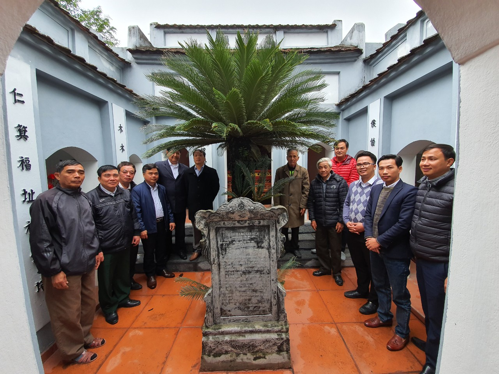
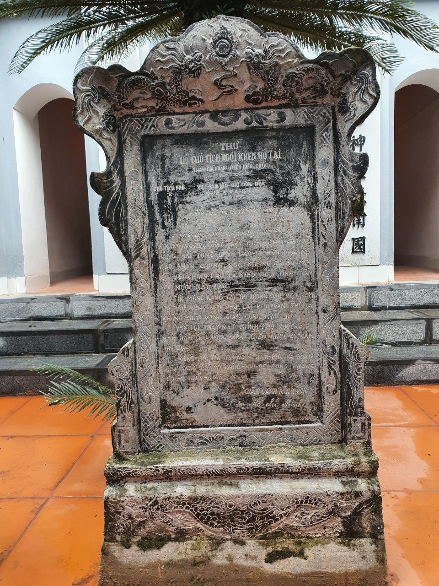
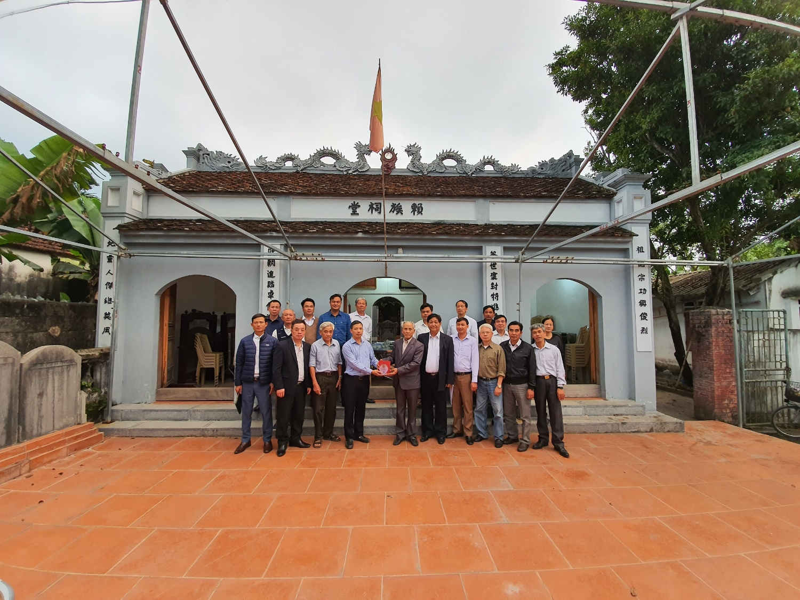

Theo Tộc phả họ Lại (kiểm duyệt tại Ty Thông tin Hà Nam số 117 ngày 7/7/1949) thì từ đường họ Lại là một di tích rất cổ ở xã Phù Khê xưa (nay là xã Phù Vân, Thành phố Phủ Lý). Khi quân Thanh sang xâm chiếm nước ta, dân trong làng phải bỏ đi lánh nạn, vua Quang Trung Nguyễn Huệ đem đại đội binh mã từ trong Nam ra đánh tan 30 vạn quân Thanh, đem lại thái bình cho đất nước. Nhân dân hồi cư, về làng còn ngờ là không phải vì chỗ nào cây cối cũng mọc um tùm, phát quang đi mới nhận ra nhà thờ họ Lại, trên tầng thượng diêm có 4 chữ “Lại tộc từ đường”. Chúa Trịnh mượn tiếng vua Lê sai quân đi thu thóc ở Sơn Nam, chúng rượu chè, cờ bạc bán cả thuyền thóc thuế, đốt thuyền để ăn chơi, vu cho dân Phù Khê cướp thóc thuế và báo về kinh. Vua Lê tưởng thật, hạ chỉ bắt tội xã Phù Khê. Khi ấy, cụ Lại Đức Hoành làm lễ trừ phục, hỏa tốc quay lại kinh thành minh oan. Vua Lê thấy rõ sự thực, ân xá. Người dân Phù Khê thoát tội, tôn cụ làm Hậu làng để tỏ lòng biết ơn.  
 

*Nội dung thư khen ngợi của Bác Hồ gửi chi Họ Lại Phù Vân Xuân Canh Dần 1950*  
 

Từ đường họ Lại xã Phù Vân thờ 3 anh em họ Lại có công trong việc khai điền lập ấp là: Thái tổ Lại Thế Hựu, giữ chức Trào Vị Hầu; Lại Thế Giáp, chức Thái Sơn Hầu; Lại Thế Duy, chức Đô đốc Quyền Quận Công (con cụ Lại Thế Xuân, ngành thứ ở Bắc Hà, cháu đời thứ 3 của Đức Triệu tổ Lại Thế Tiên) và Thiếu tổ Lại Đức Hoành (đời thứ 14) giữ chức Chiêu Thọ Bá. Những sắc phong của các cụ tiên tổ triều đình phong kiến nhà Hậu Lê đến triều vua nhà Nguyễn, các cụ đều được tôn phong là: Thượng đẳng thần. Từ đường họ Lại xã Phù Vân là ngôi Đại Tôn Từ Đường ở thôn 2, xã Phù Vân, trên thửa đất rộng 225m2. Từ đường quay hướng Bắc, được xây vào cuối thế kỷ XV. Ban đầu công trình kiến trúc xây bít đốc, chồng diềm 2 tầng 4 mái. Năm 1947, con cháu dòng họ xây thêm tòa tiền đường, tả vu và hữu vu. Hiện bố cục từ đường hình chữ Quốc: tiền đường, hậu cung, hai bên tả vu và hữu vu. Tòa tiền đường 3 gian, có tổng chiều dài 8,85m, chiều rộng 3,75m; xây chồng diềm 2 tầng mái, mái lợp ngói nam, trên bờ nóc đắp rồng chầu mặt nhật. Phần cổ đản ở giữa đắp nổi dòng chữ Hán “Lại tộc từ đường”. Phía trước hồi hiên là hai cột đồng trụ áp với tường hồi tạo vẻ vững chắc cho từ đường. Từ tiền đường vào hậu cung là một khoảng sân nhỏ đặt trang trọng tấm bia ghi toàn văn bức thư Hồ Chủ tịch khen ngợi họ Lại. Tòa hậu cung có chiều dài 3,70m, rộng 2,82m, xây bít đốc giật cấp. Bên trong đặt một ban thờ, trên ban thờ đặt một tấm bia “Lại tộc từ đường bi ký” (bia ghi từ đường họ Lại), bia được khắc vào thời Nguyễn. Hai bên tả vu, hữu vu, thờ gia tiên dòng họ Lại và Hậu thần làng Lại Đức Hoành, cả hai tòa đều dựng bia đá khắc vào năm thứ 2 niên hiệu Bảo Đại (1926). Hàng năm, họ Lại tổ chức các kỳ tế lễ dịp xuân thu nhị kỳ tại từ đường: 15 tháng Giêng - ngày kị cụ Tổ Lại Thế Tiên; 15 tháng 8 âm lịch - ngày cúng lễ cụ Lại Thế Xuân (cụ tổ họ Lại ở Bắc Hà) và các cụ: Lại Thế Hựu, Lại Thế Giáp, Lại Thế Duy. Ngày 13 tháng 5 âm lịch, họ Lại tưởng niệm ngày kị cụ Lại Đức Hoành. Những ngày này, con cháu họ Lại tề tựu đông đủ tại từ đường, trang nghiêm, thành kính tế lễ…  
 

Dẫn chúng tôi đến trước tấm bia đá khắc thư khen của Bác Hồ được dựng trang trọng trong khuôn viên từ đường, ông Lại Thành Cửu - Trưởng Ban khánh tiết dòng họ hãnh diện cho biết: “Hưởng ứng lời kêu gọi Toàn quốc kháng chiến năm 1946 của Chủ tịch Hồ Chí Minh, họ Lại xã Phù Vân đã quyên góp được 105kg đồng, chì, thép, thiếc và thu góp 50kg gạo ủng hộ kháng chiến. Năm 1949, họ hăng hái động viên con em tòng quân cứu nước. Trước ngày khám tuyển, họ tổ chức buổi liên hoan thâu đêm tại từ đường để thắp hương cầu nguyện các cụ phù hộ độ trì cho con cháu. Các cụ cao niên trong họ ôn lại công trạng vẻ vang của thành hoàng làng Lại Đức Hoành - từng làm quan triều Lê đến chức Thị Nội giám, Tư Lễ giám, Tả Thái Giám hữu đề điểm chiếu, được phong tước Đặc tiến Kim Tử Vinh Lộc Đại Phu. Ngài bỏ tiền mua ruộng cho dân làm của công, mua sắm đồ thờ, cứu dân Phù Khê thoát nạn chu di cửu tộc… Qua đó dặn dò, nhắc nhở con cháu không lùi bước trước những khó khăn, thử thách. Sáng sớm hôm sau, hơn 60 người rước Quốc kỳ, biểu ngữ vừa đi vừa dõng dạc hô khẩu hiệu lên đình Phương Khê khám tuyển và kết quả 17 thanh niên trong họ lên đường ra trận. Đợt ra quân này đã gây được tiếng vang lớn, thôi thúc phong trào tòng quân không chỉ ở địa phương mà còn khơi dậy khí thế ở một số nơi khác. Chính vì thế họ Lại được Ủy ban hành chính kháng chiến huyện Kim Bảng tặng giấy khen. Càng xúc động, tự hào hơn khi mùa xuân năm Canh Dần 1950, họ Lại nhận được thư khen của Chủ tịch Hồ Chí Minh”. Bức thư ghi nhận những đóng góp và chứa đựng những lời động viên, khích lệ của Bác đã trở thành động lực lớn lao đối với dòng họ: “Trong lúc nước nhà kháng chiến gay go, Họ đã lắng nghe tiếng gọi của Chính phủ hăng hái tòng quân, bảo vệ đất nước và góp phần chung sức kháng chiến mọi mặt với Chính phủ là biểu hiện tinh thần yêu nước rất cao. Tôi mong rằng: Các họ trong cả nước Việt Nam họ nào cũng như họ Lại Phù Vân thì ta không cần phải đánh giặc cũng phải lui. Vậy tôi thay mặt Chính phủ nước Việt Nam dân chủ cộng hòa khen ngợi và cảm ơn họ. Mong họ tin tưởng Chính phủ và đoàn kết xung quanh Chính phủ để cùng kháng chiến kiến quốc”.              Những năm 50, khi thực dân Pháp tràn về chiếm đóng Hà Nam, Phù Vân trở thành vùng tạm chiếm của địch, người dân họ Lại một lòng theo Đảng, theo Bác, kiên cường bám trụ, vừa chiến đấu vừa lao động sản suất. Không ít người con trong họ đã lập nhiều chiến công, điển hình là xã độ trưởng Lại Năng Hồi, chống càn dũng cảm, hy sinh năm 1953. Họ có 2 cơ sở kháng chiến chống Pháp, sau này được Thủ tướng Chính phủ tặng bằng khen.  Trong kháng chiến chống Mỹ, họ Lại ở Phù Vân cũng có nhiều đóng góp được ghi nhận như: thường xuyên gửi thư và tặng phẩm động viên thanh niên đi nghĩa vụ quân sự, quyên góp gạo ủng hộ đồng bào Biên Hòa, gửi quà tặng các cháu miền Nam. Trai tráng họ Lại hăng hái ra trận, còn ở hậu phương các bà, các cô, các chị tham gia tải đạn chuyển thương. Ngoài ra còn phối hợp với bộ đội chủ lực địa phương chiến đấu ngoan cường với máy bay Mỹ. Tiêu biểu phải kể đến bà Lại Thị Khiêm, xã đội phó, Bí thư đoàn xã lãnh đạo trung đội nữ dân quân, đã anh dũng hi sinh trên đường làm nhiệm vụ tại trận địa pháo Đường Đình. “Tính đến thời điểm này, chúng tôi thống kê, họ Lại ở Phù Vân có 27 liệt sỹ (đã được khắc tên trong bia đá ở từ đường), 9 thương binh, 105 người được tặng thưởng Huân, Huy chương kháng chiến, chưa kể bằng khen, giấy khen. Họ từng được Ban thống nhất Trung ương gửi thư khen (công văn số 769 ngày 30/5/1969). Những thành tích này đã góp phần để xã Phù Vân được phong tặng danh hiệu Anh hùng lực lượng vũ trang nhân dân năm 1998. Và thật vinh dự cho Họ, năm 2014 Từ đường họ Lại được công nhận là Di tích lịch sử - văn hóa cấp tỉnh”- Ông Cửu cho biết.  Những thành tích vẻ vang của thế hệ cha anh đã và đang được lớp con cháu họ Lại hôm nay kế thừa và phát huy. Là một trong những dòng họ thành lập Hội khuyến học sớm nhất của tỉnh (năm 2000), từ đó đến nay năm nào Họ cũng đạt danh hiệu “Dòng họ hiếu học tiêu biểu”. Bằng khen, giấy chứng nhận do Hội khuyến học Việt Nam, UBND tỉnh Hà Nam, UBND Thành phố Phủ Lý, Hội khuyến học tỉnh… được treo trang trọng ở từ đường luôn là niềm tự hào, là sự khích lệ, cổ vũ đối với con cháu trong Họ. Ông Lại Khắc Dụ - người đảm nhiệm trọng trách Trưởng Ban khuyến học dòng họ suốt 13 năm qua phần khởi cho biết: “Tính đến thời điểm này, họ Lại ở Phù Vân có 4 tiến sỹ, 5 thạc sỹ, 101 người trình độ đại học. Nhiều gia đình có con cháu học hành giỏi giang, đỗ đạt như gia đình các ông: Lại Năng Lượng, Lại Văn Thắc, Lại Năng Bảo, Lại Thành Cửu. Hàng năm, chúng tôi tổ chức trao phần thưởng cho các cháu đỗ đại học, cao đẳng, đạt danh hiệu học sinh giỏi từ cấp huyện, thành phố trở lên vào hai đợt: đầu năm học mới và rằm tháng giêng- ngày giỗ cụ Tổ họ. Ban khuyến học còn quan tâm động viên, tặng quà khích lệ tinh thần cho các cháu lên đường nhập ngũ, căn dặn các cháu luôn nhớ về nguồn cội, về truyền thống vẻ vang của dân tộc để nỗ lực tu dưỡng, phấn đấu, xứng đáng với thế hệ cha ông đi trước”. Không chỉ chú trọng công tác khuyến học, khuyến tài, Họ còn nêu cao tinh thần đoàn kết, gắn bó, động viên nhau xây dựng gia đình văn hóa, giúp đỡ nhau phát triển kinh tế./.  
 

*Ban tổ chức Ngày Hội Mùa Xuân Họ Lại Việt Nam lần thứ 5 trao tặng kỉ niệm chương cho chi Phù Vân*
