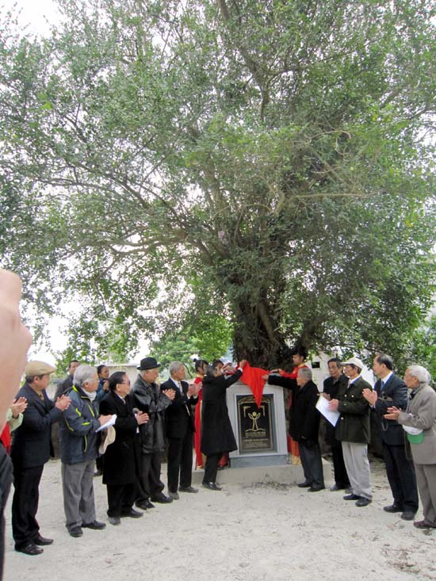
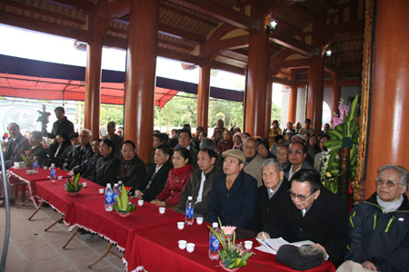
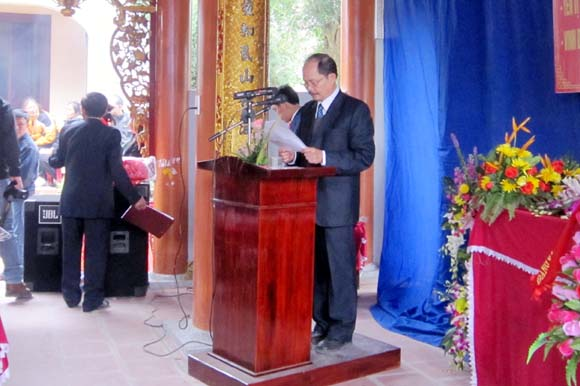
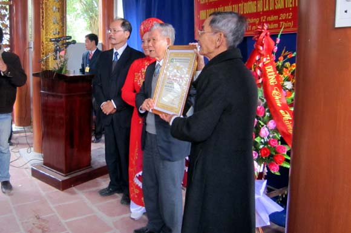
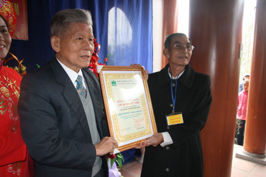
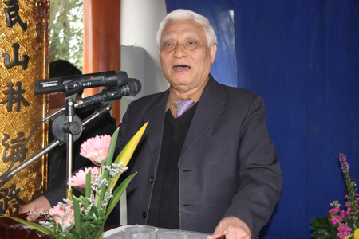
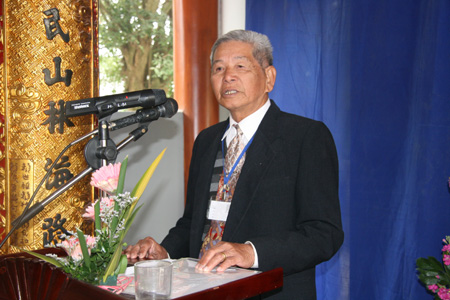
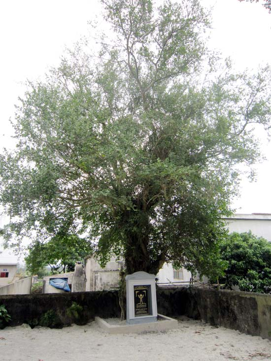
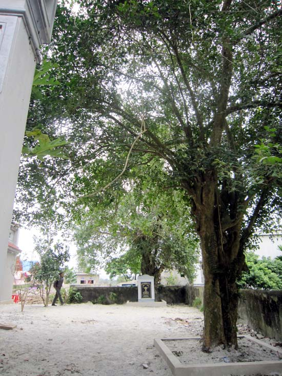

Nhân dịp lễ yên vị tượng Đức triệu tổ tại hậu cung mới được trùng tu, hàng nghìn người con của gia tộc họ Lại chứng kiến GS.TSKH Đặng Huy Huỳnh, Chủ tịch Hội đồng Cây Di sản Việt Nam, VACNE, trao bằng công nhận Cây Di sản Việt Nam cho đại diện họ Lại tại từ đường được xây dựng trong khuôn viên khoảng gần 3000m2, ngay sau khi PGS. TS Nguyễn ĐÌnh Hòe, Tổng Thư ký VACNE đọc Quyết định công nhận Cây Di sản Việt Nam.  

   Đại diện gia tộc họ Lại cho biết Nhà thờ Họ Lại thờ Đức Thủy Tổ Lại Thế Tiên, người sản sinh ra họ Lại từ thế kỷ thứ 15. Nhà thờ lúc bấy giờ còn đơn sơ, mãi đến triều vua Lê Thần Tông niên hiệu Đức Long năm thứ 4 ngày 27/3/1632 Đại nguyên Soái thống đốc chính Sự vụ khanh vương có lịch cho đề đốc vương Quận Công Lại Thế Hiền về Quang Lãng – Huyện Tống Sơn lấy dân binh khám thủ từ đường tạo lệ phụng sự tiên tổ khảo cầu lễ công và tiền thân xây dựng từ đường gồm ba cung đệ nhất, cung đệ nhị, đệ tam mà ta thường gọi tiền đường và đường hậu cung.     Khi xây dựng xong, gia tộc đã trồng xung quanh từ đường các cây đại, thị, xanh, si, ruối, bừng, và cây cau nhưng giờ chỉ còn ba cây ruối khoảng gần 400 năm tuổi ở khu đất thiêng sau hậu cung.     Nhân sự kiện này, TS Nguyễn Ngọc Sinh, Chủ tịch VACNE, chúc mừng và chia vui với gia tộc họ Lại, đồng thời mong muốn gia tộc có thêm những cây được công nhận là cây di sản Việt Nam.     Ông Nguyễn Minh Châu, Phó giám đốc Sở Tài nguyên và Môi trường tỉnh Thanh Hóa, chia sẻ việc vinh danh cây di sản ở Thanh Hóa còn mới mẻ vì vậy mong muốn VACNE giúp tỉnh tìm hiếm và hoàn thiện hồ sơ để tỉnh có thêm cây di sản Việt Nam.     Trong ngày đón nhận bằng công nhận cây di sản, ông Lại Thế Tác, trưởng tộc họ Lại, bày tỏ vui mừng và hứa họ tộc sẽ coi ba cây ruối là tư sản và tất cả dòng họ sẽ chăm sóc và bảo vệ cây mãi mãi xanh tươi, góp phần vào việc bảo vệ cây di sản của Việt Nam.     “Đến nay VACNE đã công nhận gần 400 gây với hơn 40 loài trên tất cả các vùng miền của đất nước”, TS Sinh chia sẻ, “Việc công nhận cây di sản có ý nghĩa về bảo vệ môi trường, sinh thái, bảo vệ nguồn gene của đất nước”.    

***Đông đảo các vị lãnh đạo VACNE và tỉnh Thanh Hóa cùng con cháu họ Lại***  
***về dự lễ vinh danh cây di sản Việt Nam***  

******  
 

***PGS. TS Nguyễn Đình Hòe, Tổng Thư ký Hội Bảo vệ TN&MT VN đọc Quyết định  
công nhận Cây Di sản VN***   

  
 

     

***GS.TSKH Đặng Huy Huỳnh, Chủ tịch Hội đồng Cây Di sản Việt Nam  
trao bằng công nhận cây di sản cho đại diện họ Lại***        

 ***TS. Nguyễn Ngọc Sinh, Chủ tịch VACNE, chúc mừng họ Lại có ba cây di sản đầu tiên***          ***Ông Lại Thế Tác, trưởng tộc họ Lại, hứa toàn thể họ tộc sẽ chăm sóc cây được mãi mãi tốt tươi***  

 

***Đại diện VACNE, lãnh đạo tỉnh, và gia tộc mở bia cây di sản Việt Nam trong sự chứng kiến của các quý khách thập phương cùng những người con họ Lại***  

  

Một vài hình ảnh cụm cây ruối được vinh danh Cây Di sản VN

***Tin và ảnh: Mai Anh***
