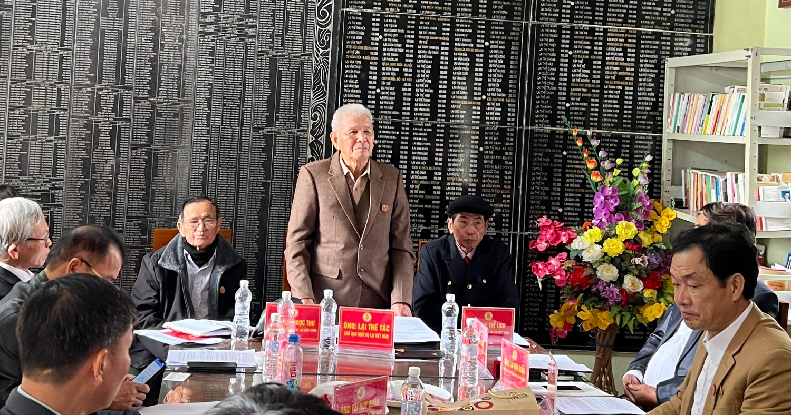

| **BAN THÔNG TIN TRUYỀN THÔNG**    **HỌ LẠI VIỆT NAM**    __________ | **CỘNG HÒA XÃ HỘI CHỦ NGHĨA VIỆT NAM**      **Độc Lập – Tự Do – Hạnh Phúc**    **________________________________________** |
| --- | --- |
| Số: 01/2024/TB/BTTTT | *Thanh Hóa**, ngày 14* *tháng 01*  *năm 2024* |

**THÔNG BÁO**  NỘI DUNG NGHỊ QUYẾT CỦA HỘI ĐỒNG GIA TỘC HỌ LẠI VIỆT NAM

NGÀY 14/01/2024

________________

Ngày 14 tháng 01 năm 2024 tại Nhà thờ Họ Lại, xã Yên Dương*,* huyện Hà Trung, tỉnh Thanh Hóa, Hội đồng gia tộc Họ Lại Việt Nam (viết tắt là HĐGTHLVN) đã tổ chức Hội nghị Tổng kết hoạt động năm 2023 và đề ra phương hướng hoạt động, kế hoạch năm 2024. Hội nghị do ông Lại Thế Tác - Chủ tịch HĐGTHLVN chủ trì, ông Lại Quốc Tuấn - PCT Thường trực HĐGTHLVN điều hành Hội nghị, đọc báo cáo; đại biểu tham dự có 30/49 thành viên HĐGTHLVN đại diện các chi Họ; Hội doanh nhân Lại Việt; Ban liên lạc con cháu họ Lại VN (viết tắt là Ban Liên lạc CCHLVN) và Ban Thông tin truyền thông họ Lại VN (viết tắt là Ban TTTT). Sau khi các đại diện Ban Thường trực HĐGTHLVN (viết tắt là Ban Thường trực), các tổ chức báo cáo, Hội nghị đã thảo luận nội dung các báo cáo, PCT Thường trực đã kết luận 03 nội dung lớn, Hội nghị đã biểu quyết ban hành Nghị quyết để làm căn cứ triển khai thực hiện, giao Ban TTTT thông báo nội dung Nghị quyết đến các chi họ, các tổ chức thuộc HĐGTHLVN và cá nhân liên quan biết, thực hiện. Thực hiện kết luận của HĐGTHLVN, Ban TTTTT xin thông báo cụ thể nội dung Nghị quyết như sau:

**I. Tóm tắt** **Báo cáo tổng kết các hoạt động năm 2023 của HĐGTHLVN và các tổ chức thuộc HĐGTHLVN**  **1. Đánh giá kết quả hoạt động năm 2023 của HĐGTHLVN**  Trong năm 2023 mặc dù có nhiều khó khăn như kinh tế xã hội, môi trường ô nhiễm, ... nhưng với tinh thần đoàn kết trong dòng họ luôn hướng về cội nguồn. Các hoạt động từ HĐGTHLVN đến các chi họ trong cả nước diễn ra rất sôi nổi, kết quả đáng ghi nhận và mang đậm ý nghĩa nhân văn trong dòng họ.   Tại Hội nghị sơ kết 6 tháng đầu năm 2023, HĐGTHLVN đã đánh gía: Năm 2023, ngay từ ngày đầu, tháng đầu, HĐGTHLVN đã lên kế hoạch cho hoạt động, công việc cụ thể, quyết liệt chỉ đạo đến các chi họ, các tổ chức trực thuộc HĐGTHLVN, con cháu của dòng họ Lại, quyết tâm triển khai thực hiện Nghị quyết của HĐGTHLVN ngày 25/12/2022. Các báo cáo trình bầy tại Hội nghị của Ban Thường trực, các tổ chức thuộc HĐGTHLVN và báo cáo của HĐGT họ Lại tỉnh Thái Bình. HĐGTHLVN đã đánh gía cao tính chuyên nghiệp trong công tác truyền thông, sự phối kết hợp, tính đoàn kết, tinh thần trách nhiệm trong triển khai thực hiện công việc giữa các tổ chức và phối hợp với hai địa phương tỉnh Thái Bình và tỉnh Thanh Hóa thực hiện thành công hai sự kiện lớn như: tổ chức Lễ Giỗ Đức Triệu Tổ Lại Thế Tiên và Tổng kết 30 năm hoạt động của HĐGTHLVN tại Nhà thờ Đức Triệu Tổ: HĐGTHLVN đã đón tiếp các con cháu dòng họ Lại khắp các tỉnh thành trên toàn quốc về dâng hương kính Tổ trong 03 ngày kể từ ngày 13 đến 15/01/2023 (âm lịch), trong đó ngày 15/01/2023 (âm lịch) HĐGTHLVN tổ chức nghi Lễ Giỗ Tổ và báo cáo Tổng kết 30 năm hoạt động của HĐGTHLVN. Đối với việc Tổ chức Ngày hội Mùa Xuân họ Lại Việt Nam lần thứ 6 và Lễ kỷ niệm 30 năm thành lập HĐGTHLVN tại xã Vũ Ninh, huyện Kiến Xương, tỉnh Thái Bình đã thành công tốt đẹp như mong muốn.   Về các hoạt động những tháng cuối năm 2023, HĐGTHLVN tiếp tục chỉ đạo dòng họ thực hiện theo kế hoạch năm như: Về thực hiện Quy ước của Gia tộc họ Lại VN trong việc kiện toàn tổ chức, cụ thể, đối với HĐGTHL một số tỉnh, các chi họ trên cả nước đã tổ chức hội nghị, đại hội và giới thiệu những thành viên thuộc tổ chức của minh, có đủ điều kiện tham gia thành viên của HĐGTHL tỉnh, tiếp tục giới thiệu một số thành viên tham gia HĐGTHLVN và đã được HĐGTHLVN chấp thuận. HĐGT HLVN đã được kiện toàn, bầu Ban Thường trực lâm thời, phân công nhiệm vụ đối với các thành viên đảm nhiệm các chức danh trong hệ thống tổ chức của HĐGTHLVN. Một số kết quả hoạt động chính được tổng hợp như sau:   ***a) Kết quả thực hiện các hoạt động của HĐGTHLVN năm 2023, gồm 16 nội dung sau:***  1. Ngày 05/02/2023 Tổ chức lễ Giỗ Tổ và Tổng kết 30 năm hoạt động của HĐGTHLVN tại nhà thờ Tổ (xã Yên Dương- Hà Trung- Thanh Hóa)  2. Ngày 19/02/2023: Tham dự lễ Giỗ Tổ chi Yên Ninh (Thị trấn Yên Ninh - Yên Khánh - Ninh Bình).  3. Ngày 26/03/2023: Tham dự và Tổ chức Ngày Hội mùa xuân lần thứ 6 và Lễ kỷ niệm 30 năm thành lập HĐGTHLVN tại xã Vũ Ninh, huyện Kiến Xương, tỉnh Thái Bình.  4. Ngày 10/04/2023: Dự lễ Tổng kết Ngày hội mùa xuân tại tỉnh Thái Bình.  5. Ngày 20/05/2023: Tham dự buổi gặp mặt cộng đồng con cháu họ Lại TP Hồ Chí Minh và các vùng lân cận.   6. Ngày 4/06/2023: Họp HĐGT tổng kết 6 tháng đầu năm 2023 tại Nhà thờ Tổ và Kiện toàn lại các Ban tổ chức.  7. Ngày 24/06/2023: Họp ban Thường trực và phân công nhiệm vụ các ban TT HĐGT và gặp mặt trao đổi với đại diện của Chi Đồng Hới - Quảng Bình tại Nhà Hàng Sen Hồng - Hà Nội.   8. Ngày 6/8/2023: Tham dự Đại Hội DNLV lần 2 tại Hà Nội.  9. Ngày 27/9/2023: Dự lễ Giỗ Tổ chi Mỹ Lợi - Thừa Thiên Huế.  10. Ngày 8/10/2023: Dự lễ Khánh Thành Bảo Điện chùa Hoành Nha - Hải Hậu - Nam Định (Đại Đức Thanh Độ chủ trì).  11. Ngày 10/11/2023: Dự lễ kỷ niệm 445 năm ngày mất của Thái tế Khiêm quốc công Lại Thế Khanh chi Quan Chiêm (xã Hà Giang, huyện Hà Trung, tỉnh Thanh Hóa).  12. Ngày 12/12/2023: Dự lễ Khánh thành - an vị Nhà thờ họ Lại Văn, An Nông, Hòa Vang, xã Lộc Bổn, huyện Phú Lộc - Thừa Thiên Huế.  13. Ngày 22/11/2023: Dự lễ Khai trương văn phòng hội DNLV tại Hà Nội.  14. Ngày 16/12/2023: Họp ban Thường trực HĐGT tại Phủ Lý - Hà Nam chuẩn bị cho họp HĐGT cuối năm 2023.  15. Ngày 22/12/2023: Dự lễ Khánh thành 4 khu Lăng mộ tại Hải Hậu - Nam Định.  16. Ngày 14/01/2024: Tổ chức Họp Tổng kết năm 2023 của HĐGT tại nhà thờ Tổ.  ***Hạn chế:*** chưa tìm được nguồn tài chính trả nợ cho các nhà thầu, chưa thống kê toàn diện tài sản Nhà thở Tổ, chưa xúc tiến được việc xây dựng nhà Truyền thống dòng họ Lại VN tại Nhà thờ Tổ.  ***b) Về công tác tài chính (******ông Lại Trọng Tâm*** ***- PCT HĐGTHLVN – Trưởng Ban TC HĐGTHLVN BC tóm tắt)***  Trong năm nguồn thu của con cháu về công đức được 90.880.000 đ và bán được 2 quyển Phả trị giá 1 triệu đồng. Tổng thu cả năm là 91.880.000 đ.  Theo Quy chế hoạt động HĐGTHLVN, trong năm đã chi cho các hoạt động của HĐGTHLVN: tổ chức họp HĐGT, Thường trực HĐGT; đi dự khánh thành các nhà thờ, các lăng mộ, Giỗ ở các chi thuộc các tỉnh. Ngoài ra còn tổ chức thăm hỏi, hiếu, hỷ tới các gia đình của các thành viên trong HĐGT. Tổng chi trong kỳ là 89.345.000 đ.  Thu bù chi trong kỳ + số dư kỳ trước chuyển sang thì hiện nay quỹ còn 27.815.000 đ. Số nợ còn phải trả là: 225.628.000 đ (ông Hảo: 155.628.000 đ, ông Viên: 70 triệu đồng chẵn).  ***Ưu điểm:*** Trong năm các con cháu luôn hướng về đất Tổ, nên cũng có 1 phần kinh phí gửi về cúng tiến nhằm góp phần tôn tạo và gìn giữ Nhà thờ Tổ.   ***Nhược điểm:*** Trong kỳ phát sinh nhiều hoạt động nên nguồn tài chính không dư để chi trả nợ cho các nhà thầu.  ***c) Về công tác thông tin***  ***t******ruyền*** ***thông (******ông Lại Xuân Cương***  ***-***  ***PCT HĐGTHLVN - Trưởng Ban TTTT HĐGTHLVN***  ***BC tóm tắt):***  Thực hiện chỉ đạo của HĐGTHLVN, Ban TTTT đã biên tập, ban hành, truyền thông nhiều hoạt động của HĐGTHLVN và chủ trì, phối hợp với các tổ chức thuộc HĐGTHLVN thực hiện nhiệm vụ trong các hoạt động như:   - Hoàn thành nhiệm vụ HĐGTHLVN giao trong việc soạn thảo và duyệt nội dung các bài phát biểu trong sự kiện lớn của dòng họ, đã được HĐGTHLVN ghi nhận, đánh gia cao,  - Đã soạn thảo và truyền thông các nội dung Nghị quyết HĐGTHLVN của các kỳ họp HĐGT, TTr HĐGT để cộng đồng con cháu họ Lại biết, thực hiện, gắn kết dọng họ, các nội dung liên quan đến Gia phả Họ Lại Việt Nam.   - Hiện nay ban TTTT quản lý các kênh truyền thông sau:  - Website: [http://holaivietnam.com/](http://holaivietnam.com/): đã đăng tải 20 bài viết truyền thông về HĐGTHLVN và các hoạt động của dòng họ, thực hiện bảo trì và backup dữ liệu theo tháng, gia hạn tên miền va hostinh dưới sự tài trợ kinh phí của hội DNLV.  - Fanpage: [http://www.facebook.com/holaivietnam](http://www.facebook.com/holaivietnam): đã thiết kế các ấn phẩm liên quan đến các sự kiện của HĐGTHLVN và các tổ chức thuộc HĐGTHLVN.  - Group: [http://www.facebook.com/groups/HoLaiVietNam](http://www.facebook.com/groups/HoLaiVietNam) phát triển và theo dõi gần 2000 thành viên, phê duyệt gần 1000 bài viết của các thành viên và xóa bỏ tin và gần 400 bài quảng cáo, spam trong group.  ***Khó khăn, hạn chế:***   - Hiện nay nguồn kinh phí đều dựa vào sự tài trợ của hội DNLV nên số lượng bài viết chưa nhiều, chất lượng chưa cao.  - Thành viên có chuyên môn về truyền thông còn thiếu và thiếu các cộng tác viên biên tập tin, viết bài và các ấn phẩm.  - Một số thành viên chưa dành thời gian cho hoạt động, công tác của Ban.  ***Kiến nghị:*** Ban TTTT sẽ trình HĐGTHLVN ký quyết định về việc kiện toàn tổ chức Ban TTTT theo chủ trương và mô hình mới. Đồng thời cho phép Ban TTTT chịu trách nhiệm trước HĐGTHLVN về việc soạn thảo, ban hành Quy chế hoạt động của ban TTTT theo thẩm quyền, nhưng phù hợp với chỉ đạo của HĐGTHLVN.  ***d)***  ***Về công tác*** ***liên lạc******,***  ***kết nối*** ***Cộng đồng con cháu Họ Lại*** ***VN (******ông Lại Huy Quân*** ***-***  ***PCT HĐGTHLVN - Trưởng Ban LLCCHLVN***  ***BC tóm tắt)***  Thực hiện chỉ đạo của HĐGTHLVN, Ban LLCCHLVN đã chủ trì, phối hợp với các tổ chức thuộc HĐGTHLVN thực hiện nhiệm vụ trong các hoạt động như:  - Chủ trì, phối hợp với các tổ chức thuộc HĐGTHLVN đẩy mạnh các hoạt động gắn kết giữa các chi họ, phát triển dòng họ, đã được HĐGTHLVN ghi nhận.  - Tham gia cùng với Hội DNLV tổ chức thành công Đại hội Hội DNLV ngày 6/8/2023 tại Nhà hàng Cảnh Hồ, Trường Chinh, Hà Nội.  - Đóng góp kinh phí để HĐGTHLVN mua sắm lễ phục, phục vụ tế lễ tại Nhà thờ Tổ.  ***Khó khăn:*** Chưa xây dựng được Quy chế tổ chức, hoạt động của Ban Liên lạc. Các thành viên còn kiêm nhiệm cả công việc của Hội DNLV. Không có nguồn kinh phí hoạt động, các hoạt động 100% tự nguyện và tài trợ từ con cháu dòng họ.  ***đ)***  ***Về công tác phát triển*** ***Hội Doanh nhân Lại Việt*** ***(******ông Lại Thế Long*** ***TV - HĐGTHLVN – TTK Hội DNLV BC tóm tắt):***  Thực hiện chỉ đạo của HĐGTHLVN, Hội DNVN đã chủ trì, phối hợp với các tổ chức thuộc HĐGTHLVN thực hiện nhiệm vụ trong các hoạt động như:  - Tổ chức thăm quan gần 20 doanh nghiệp tại 3 miền Bắc – Trung – Nam.  - Tổ chức gặp mặt giao lưu các doanh nghiệp họ Lại tại miền Nam với gần 40 người tham dự.  - Tổ chức thành công Đại hội hội DNLV lần thứ 2 vào ngày 6/8/2023 tại Nhà hàng Cảnh Hồ, Trường Chinh, Hà Nội.  - Tham gia công tác tổ chức, tài trợ cho các sự kiện: “Lễ kỷ niệm 30 năm thành lập HĐGTHLVN và Ngày hội mùa xuân HLVN lần thứ 6”, đã được HĐGTHLVN ghi nhận, đánh giá cao.  ***Hạn chế:*** do khủng hoảng kinh tế nói chung, các doanh nghiệp Lại Việt nói riêng cũng gặp nhiều khó khăn, dẫn đến các hội viên ít tham gia các phong trào của Hội. Số lượng dân số mang họ Lại ít nên các doanh nhân cũng không nhiều và nằm rải rác trên đất nước VN, dẫn đến việc kết nối, phát triển thành viên còn gặp nhiều khó khăn.  ***Kiến nghị, đề xuất:*** Đề nghị HĐGTHLVN tạo điều kiện đề Hội DNLV tổ chức nhiều hơn nữa các chương trình giao lưu, kết nối các hội viên. Đẩy mạnh công tác truyền thông Hội để mọi người hiểu rõ và nắm được tầm nhìn, sứ mệnh của Hội DNLV từ đó tích cực tham gia kết nối, xây dựng Hội.  ***e) Về công tác phối kết hợp từ chỉ đạo của Ban Thường trực, các tổ chức thuộc HĐGTHLVN và các HĐGTHL các địa phương***  Trong báo cáo Tổng kết 6 tháng đầu năm và tổng kết hoạt động năm 2023 của HĐGTHLVN đã nhận xét, đánh gia, ghi nhận kết quả hoạt động trong dòng họ là tốt. Kết quả đạt được như vậy là nhờ vào sự chỉ đạo của HĐGTHLVN giao phó cụ thể đối với các tổ chức, TC nào chủ trì, TC nào phối hợp, từ Ban Thường trực, cho tới các tổ chức thuộc HĐGTHLVN và các HĐGTHL các địa phương, thực hiện nhiệm vụ trong các hoạt động, đặc biệt là những sự kiện lớn của dòng họ, điền hình năm 2023 có hai sự kiện lớn diễn ra là:   Tổ chức Lễ giỗ Đức Triệu Tổ Lại Thế Tiên năm 2023, Tổng kết hoạt động hơn 30 năm thành lập HĐGTHLVN tại Nhà Thờ Tổ và Tổ chức Ngày hội mùa xuân lần thứ 6 và Lễ kỷ niệm 30 năm thành lập HĐGTHLVN tại Thái Bình*.*   HĐGTHLVN đã đánh gía cao tính chuyên nghiệp trong công tác truyền thông, sự phối kết hợp, tính đoàn kết, tinh thần trách nhiệm trong triển khai thực hiện công việc giữa các tổ chức và phối hợp với hai địa phương tỉnh Thái Bình và tỉnh Thanh Hóa thực hiện thành công hai sự kiện lớn nói trên.   ***h) Ý kiến của các thành viên HĐGTHLVN tham gia góp ý vào các báo cáo***   Các ý kiến góp ý vào các BC tổng kết nêu trên của các ông: Lại Thế Tác, Lại Văn Đức (Đại Đức Thích Thanh Độ), Lại Ngọc Thư, Lại Xuân Cương, ... liên quan đến mục đích, sự cần thiết tổ chức, nhưng cũng nên cân nhắc về hiệu quả trước khi quyết định tổ chức những Lề hội của dòng họ; việc tiếp tục triển khai việc kiện toàn tổ chức từ HĐGTHLVN theo quy định nêu tại Quy ước của Gia tộc họ Lại VN, đến các chi họ; việc cần tiếp tục quy hoạch Nhà thờ Đức Triệu Tổ ngày một hoàn chỉnh hơn; ... HĐGTHLVN đã ghi nhận các ý kiến này, sẽ lồng ghép đưa vào nội dung phương hướng hoạt động trong năm công tác và trong thời gian đến.  **2. Phương hướng hoạt động của HĐGTHLVN năm 2024**  1. Tổ chức Lễ Giỗ Tổ năm 2024 theo nghi lễ truyền thống bắt đầu từ ngày 12 đến 15 tháng Giêng năm Giáp Thìn (âm lịch).  2. Chuyển tất cả Sổ đỏ của Nhà thờ Tổ thành đất tín ngưỡng với tên gọi là “Nhà Thờ Họ Lại Việt Nam” theo đề nghị của Ban TTr HĐGTHLVN.  3. Tổ chức Hội thao họ lại Việt Nam lần thứ 5 năm 2024 theo quy định của HĐGTHLVN.  4. Về việc Ban Liên lạc cộng đồng con cháu Họ Lại Thành phố Hồ Chí Minh có Đơn xin chủ trương thành lập Ban liên lạc lâm thời để sớm hoạt động.   **II. Chủ trương và** **Kế hoạch** **tổ chức, triển khai thực hiện** **Đại hội Đại biểu HĐGT Họ Lại Việt Nam**  1. Ông Lại Vi Nghị - PCT – Trưởng Ban Tổ chức HĐGTHLVN báo cáo xin chủ trương và trình bầy dự thảo Kế hoạch tổ chức Đại Hội Đại biểu HĐGT Họ Lại Việt Nam, với các nội dung sau:  - Tiêu đề: **“Đại Hội Đại biểu Họ Lại Việt Nam lần thứ nhất”**  - Thời gian tổ chức: mùa xuân 2025 sau lễ Giỗ tổ 15 tháng Giêng âm lịch (khoảng trung tuần tháng 2 âm lịch).  - Địa điểm: tại Từ đường Nhà thờ Tổ xã Yên Dương, huyện Hà Trung, tỉnh Thanh Hóa  **-** Phương châm: ***“Nguồn cội***  ***- trường tồn***  ***- đoàn kết***  ***- phát triển”***  - Thành phần: các vị HĐGTHLVN và các đại biểu phân bổ từ các tổ chức và chi họ các khu vực các tỉnh thành: 370 đại biểu. Các vị đại biểu khách mời địa phương sở tại và các chi họ trên cả nước.  - Thành lập Ban Tổ chức Đại hội; các tiểu ban, do thành viên Thường trực HĐGTHLVN làm thành viên ban làm Trưởng tiểu ban và chịu trách nhiệm thực hiện Kế hoạch nói trên.  **III. Kết luận Hội nghị (Quyết nghị)**  1. Tổ chức Lễ Giỗ Tổ theo nghi lễ truyền thống bắt đầu từ ngày 12 đến 15 tháng Giêng năm Giáp Thìn (âm lịch). Giao Ban TTr HĐGTHLVN chỉ đạo triển khai thực hiện.  2. Chuyển tất cả Sổ đỏ đất của nhà thờ Tổ thành đất tín ngưỡng với tên gọi là **“Nhà Thờ Họ Lại Việt Nam”.**  Giao Ban TTr HĐGTHLVN chỉ đạo triển khai thực hiện.  3. Đồng ý về chủ trương, thông qua Kế hoạch Đại hội Đại biểu HĐGTHLVN lần thứ nhất và tổ chức trong năm 2025. Giao Ban Tổ chức chủ trì, phối hợp với các ban thuộc HĐGTHLVN triển khai, thực hiện Kế hoạch Đại hội Đại biểu HĐGT họ Lại Việt Nam trong năm 2025.  4.  Bổ sung Thành viên Thường trực HĐGTHĐGTHLVN để giúp HĐGTHLVN theo dõi hoạt động của các chi họ Lại khu vực miền Trung. Giao Ban Tổ chức HĐGTHLVN đề xuất nhân sự và trình ký theo quy định hiện hành.  5. Về việc tiếp tục hoàn thiện thiết kế, xây dựng Nhà truyền thống, phương án huy động vốn và việc nghiên cứu điều chỉnh Quy hoạch tổng thể Nhà thờ họ Lại Việt Nam. Giao Ban Xây dựng cơ bản, quản lý tài sản nhà thờ Tổ và khu lăng mộ Đức Triệu Tổ, chịu trách nhiệm triển triển khai thực hiện.  6. Đồng ý với đề nghị của HĐGTHL tỉnh Thái Bình được đăng cai Tổ chức Hội thao họ Lại Việt Nam lần thứ 5 năm 2024 tại tỉnh Thái Bình. Giao HĐGTHL tỉnh Thái Bình chủ trì, phối hợp sớm với các tổ chức thuộc HĐGTHLVN để triển khai thực hiện.  7. Về việc Ban liên lạc lâm thời cộng đồng con cháu Họ Lại Thành phố Hồ Chí Minh có Đơn trình HĐGTHLVN và Ban Liên lạc CCHLVN xin phép thành lập Ban liên lạc cộng đồng Họ Lại Thành phố Hồ Chí Minh và các tỉnh lân cận. Giao Ban Liên lạc CCHLVN làm việc cụ thể với Ban liên lạc lâm thời cộng đồng con cháu Họ Lại Thành phố Hồ Chí Minh, trình Thường trực HĐGTHLVN xem xét quyết định trong tháng 2 năm 2024.  8. Về việc tổ chức các hoạt động mang tính chất dòng họ tại các chi họ, ... phải thực hiện nghiêm, đúng quy định nêu tại Quy ước của Gia tộc họ Lại Việt Nam. Giao Ban TTTT, đẩy mạnh công tác tuyên truyền đến từng con cháu, chi họ biết thực hiện*.*  9. Giao Ban TTTT soạn thảo văn bản thông báo, đăng trên trang Website: http://holaivietnam.com của dòng họ nội dung Nghị quyết này để các chi họ Lại trên toàn quốc và nước ngoài biết, thực hiện**.**   Ban Thông tin truyền thông họ Lại Việt Nam xin thông báo nội dung Nghị quyết của HĐGTHLVN ngày 14/01/2024 để các chi họ Lại trên toàn quốc và nước ngoài, các tổ chức thuộc HĐGTHLVN liên quan biết, thực hiện./.

 

| ***Nơi nhận:***    - Chủ tịch, các PCT      HĐGTHLVN,    - Các TV HĐGTHLVN,    - Các chi họ, các tổ chức thuộc      HĐGTHLVN,    - Lưu: Ban TTTT. | **BAN THÔNG TIN TRUYỀN THÔNG**     **HỌ LẠI VIỆT NAM**    **TRƯỞNG BAN**        *(Đã ký)*         **Lại Xuân Cương** |
| --- | --- |
