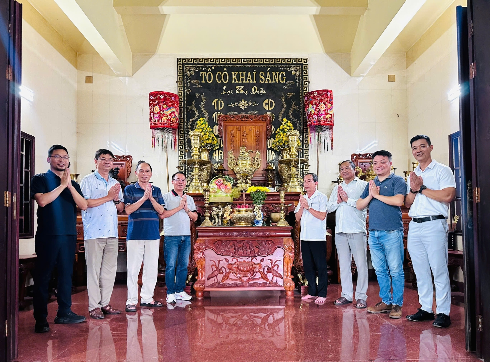
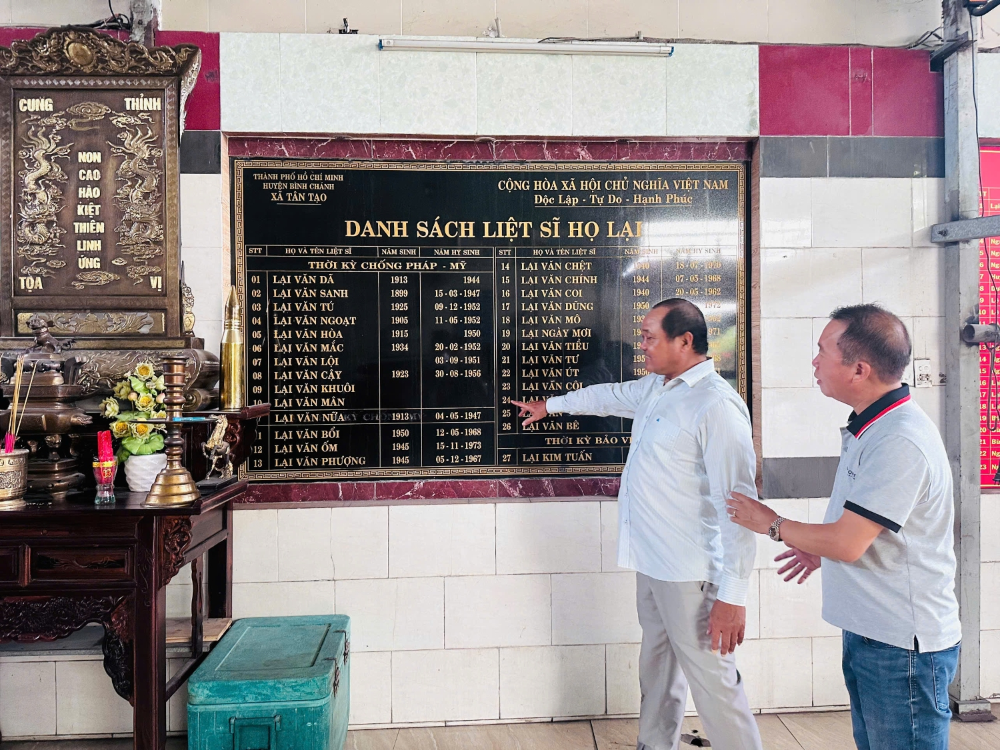
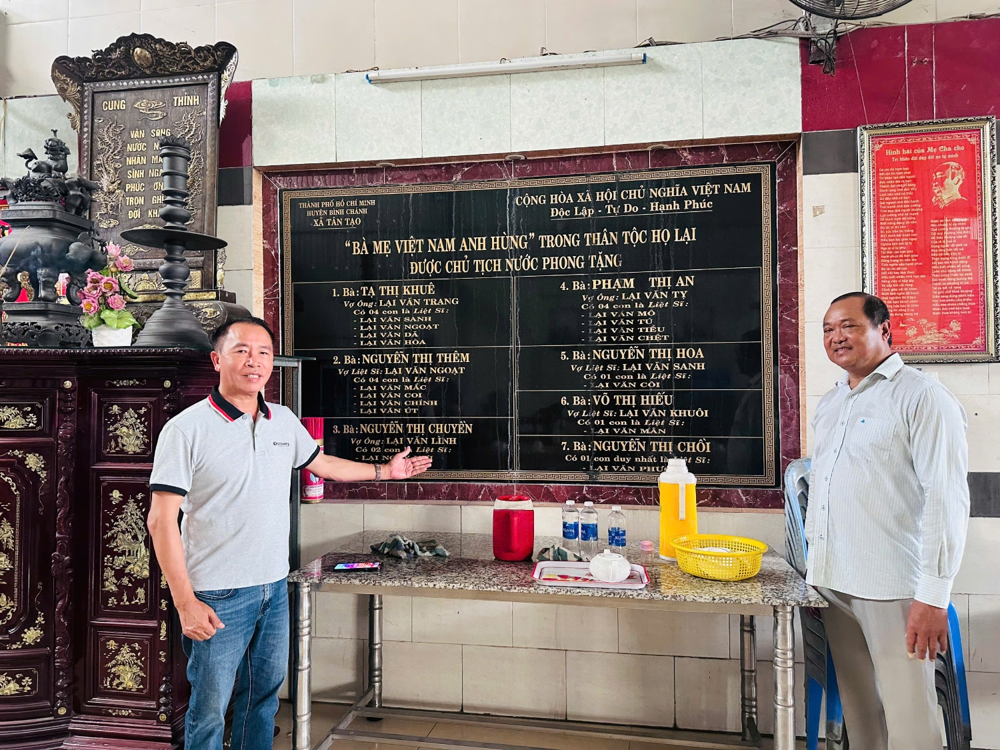

Chuyến đi không chỉ là hoạt động tâm linh ý nghĩa mà còn là dịp để toàn thể con cháu họ Lại bày tỏ lòng thành kính và tri ân sâu sắc tới các bậc tiền nhân, đặc biệt là các Mẹ Việt Nam Anh hùng, các Anh hùng Liệt sĩ Họ Lại đã anh dũng hy sinh, góp phần làm nên độc lập, tự do cho Tổ quốc.  
 

Trưởng đoàn là ông Lại Trọng Tâm, Tân Chủ tịch Hội đồng Gia tộc Họ Lại Việt Nam, cùng với sự tham gia của nhiều vị trong Hội đồng Gia tộc và Hội Doanh nhân Lại Việt Miền Nam. Trong không khí trang nghiêm, toàn thể đoàn đã cùng nhau dâng hương tại Đền Thờ, thể hiện sự đoàn kết, hướng về cội nguồn và lòng biết ơn sâu sắc.

Tiếp đón đoàn đại biểu Hội đồng Gia tộc Họ Lại Việt Nam, về phía Đền Thờ Miếu Bà Họ Lại tại TP. Hồ Chí Minh có ông Lại Văn Hùng, ông Lại Văn Nghề cùng các ông trong Ban Chấp sự của Đền Thờ.  
 

Trong buổi gặp gỡ thân mật, Chủ tịch Lại Trọng Tâm đã có những chia sẻ tâm huyết với chi Họ Lại TP. Hồ Chí Minh và Hội Doanh nhân Lại Việt miền Nam. Ông nhấn mạnh tầm quan trọng của việc giữ gìn và phát huy truyền thống "Uống nước nhớ nguồn" của dòng tộc, đồng thời khẳng định vai trò của cộng đồng họ Lại trong công cuộc xây dựng và phát triển đất nước. Chủ tịch Tâm cũng bày tỏ mong muốn các chi họ và doanh nghiệp họ Lại tại miền Nam tiếp tục phát huy tinh thần đoàn kết, tương trợ lẫn nhau, cùng nhau vượt qua khó khăn, phát triển kinh tế, đóng góp tích cực vào sự thịnh vượng chung của dòng họ và xã hội.  

 

Trong không khí cởi mở, thân tình và ấm áp tình đoàn kết, Nam Bang Nhất Lại, Chủ tịch đã chia sẻ nhiều nội dung quan trọng, hướng tới việc tăng cường liên kết, hỗ trợ lẫn nhau để thúc đẩy sự phát triển toàn diện của Tộc Họ trong thời gian tới. Các hoạt động cụ thể sẽ được triển khai nhằm nâng cao hiệu quả, kết nối các thế hệ và phát huy mạnh mẽ hơn nữa vai trò của dòng họ Lại trong cộng đồng.

Sau buổi dâng hương ý nghĩa, đoàn đã cùng nhau dùng bữa thân mật và chan hòa tình thân tại Đền Thờ, một lần nữa khẳng định tình cảm gắn bó, sự đồng lòng và quyết tâm xây dựng một cộng đồng Họ Lại Việt Nam ngày càng vững mạnh.

*Theo Tony Lại (Ban TTTT Họ Lại Việt Nam)*
