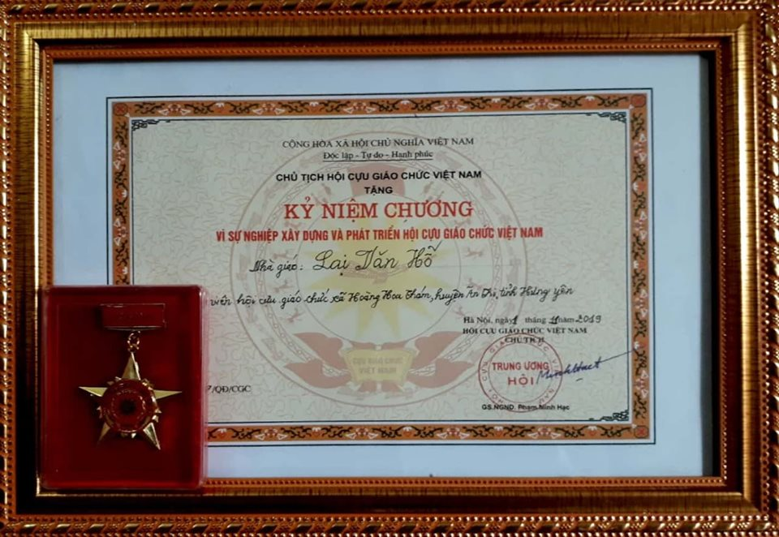
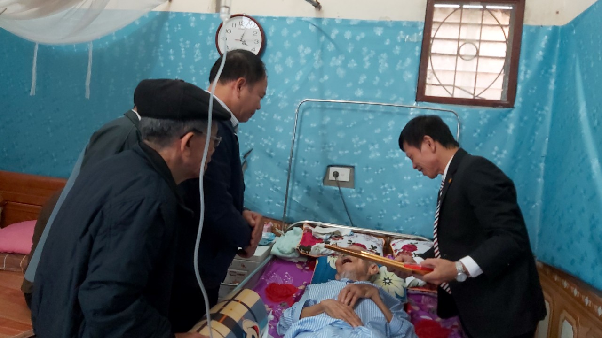
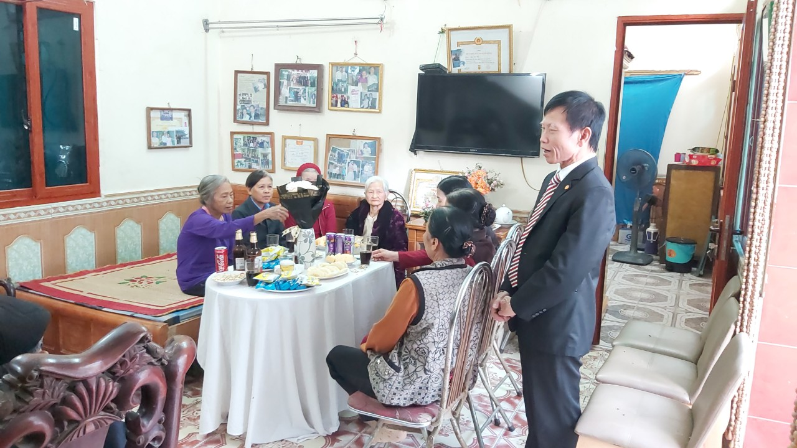
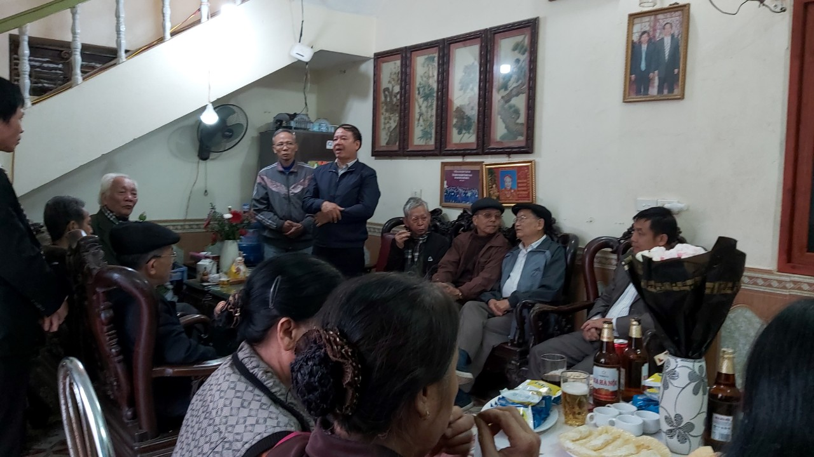
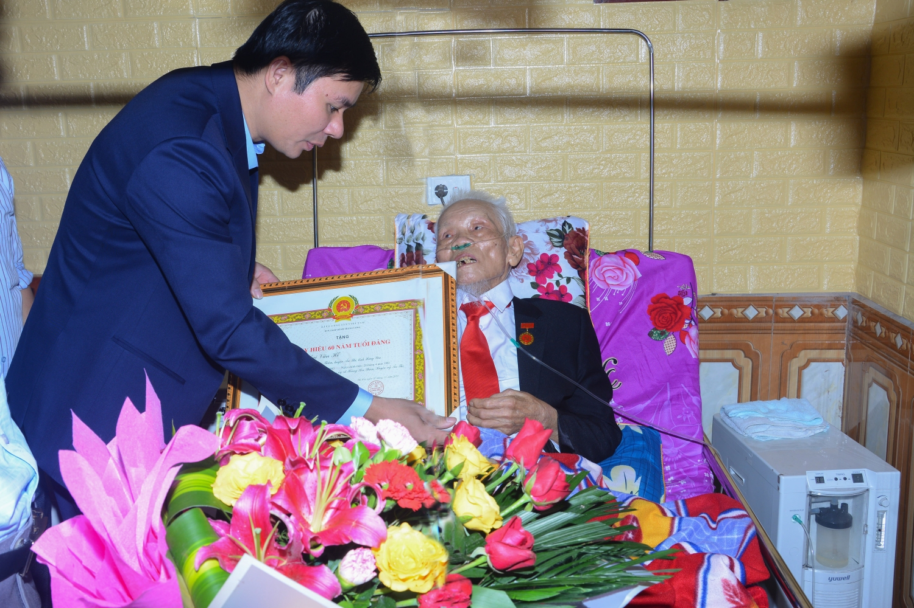
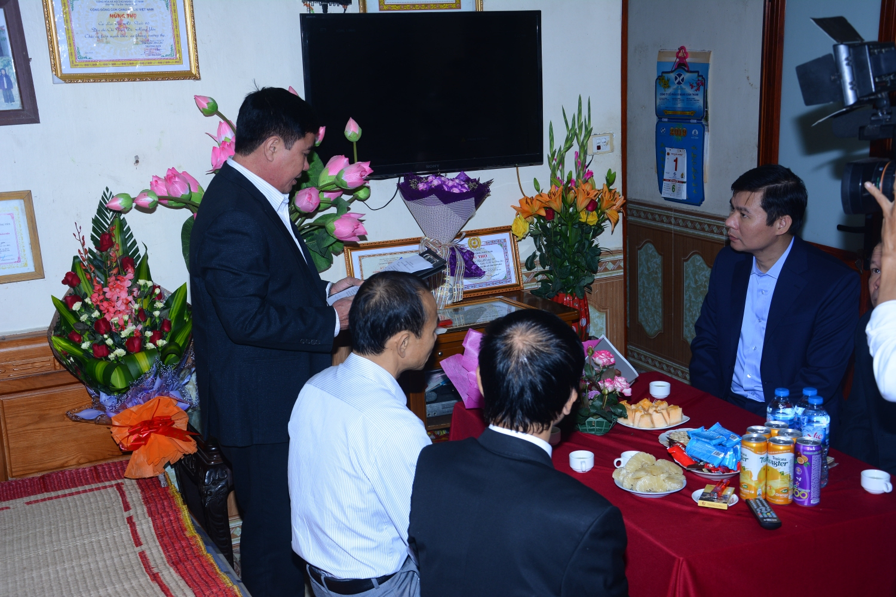

Nhà giáo Lại Văn Hỗ sinh ra và lớn lên tại thôn Tam Đô, xã Hoàng Hoa Thám, huyện Ân Thi, tỉnh Hưng Yên. . Cả cuộc đời ông đã đóng góp rất nhiều cho sự nghiệp trồng người của đất nước. Khi về hưu ông tích cực tham gia xây dựng và phát triển hội cựu giáo chức Việt Nam. Để ghi nhận công lao và sự đóng góp đó, BCH hội đã trao tặng kỉ niệm chương, đây là một việc làm rất ý nghĩa và cũng là món quà vô giá đối với ông ở cái tuổi mà xưa nay nhiều người ước ao (90 Tuổi).

 

**Do tuổi cao sức yếu nên Nhà giáo Lại Văn Hỗ không ngồi tiếp đoàn được**

**Đại diện gia đình phát biểu cảm ơn BCH Hội cựu giáo chức Việt nam**

**BCH Hội đến tặng kỉ niệm chương**

 

*Ông Nguyễn Lê Huy, tỉnh ủy viên, Bí thư huyện ủy, đại diện Tỉnh ủy, Huyện ủy, Đảng ủy, Chi bộ trao Huy hiệu 60 năm tuổi Đảng cho Nhà giáo Lại Văn Hỗ*

 *Đại diện gia đình đón tiếp và gửi lời cảm ơn Đảng, Nhà Nước và Chính quyền địa phương*

Theo: Tony Lại
