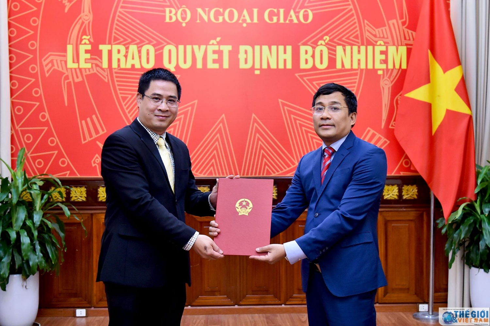
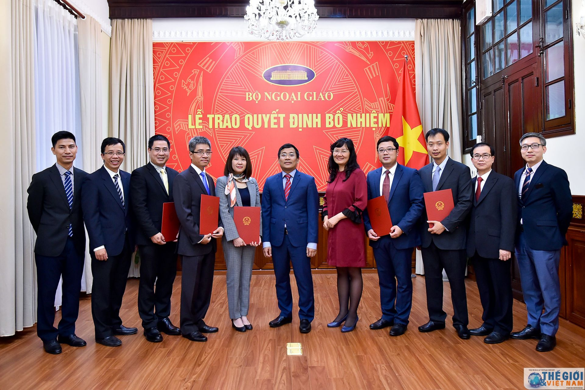
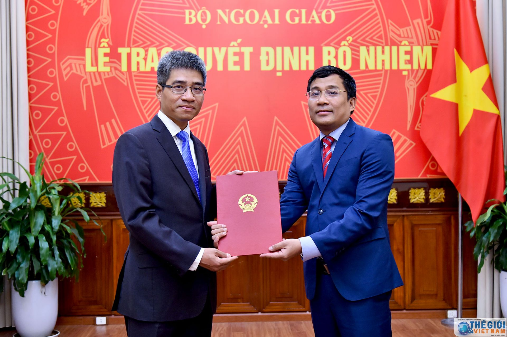
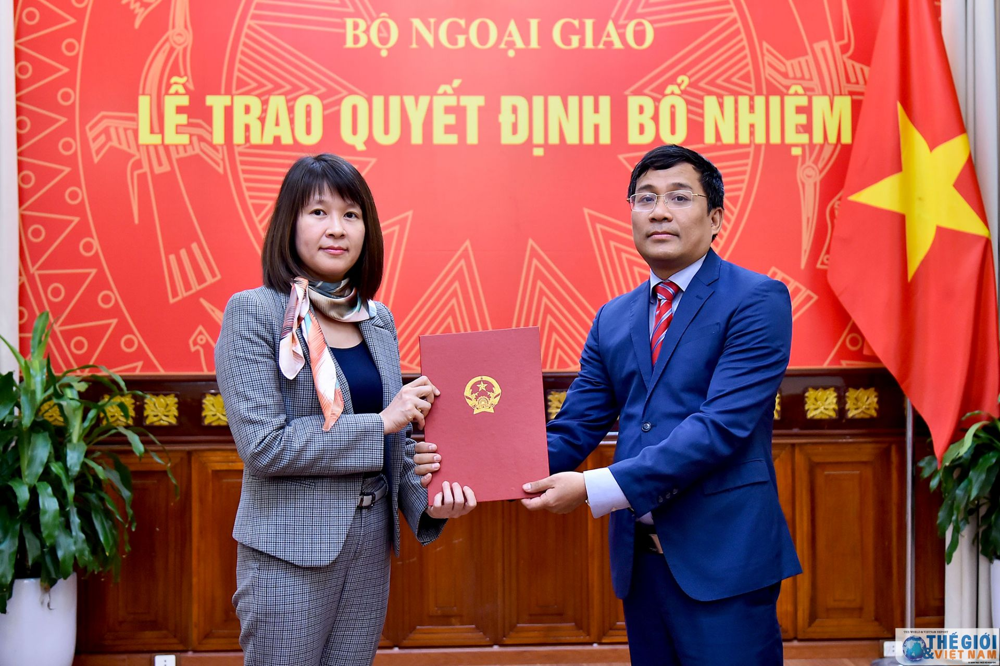
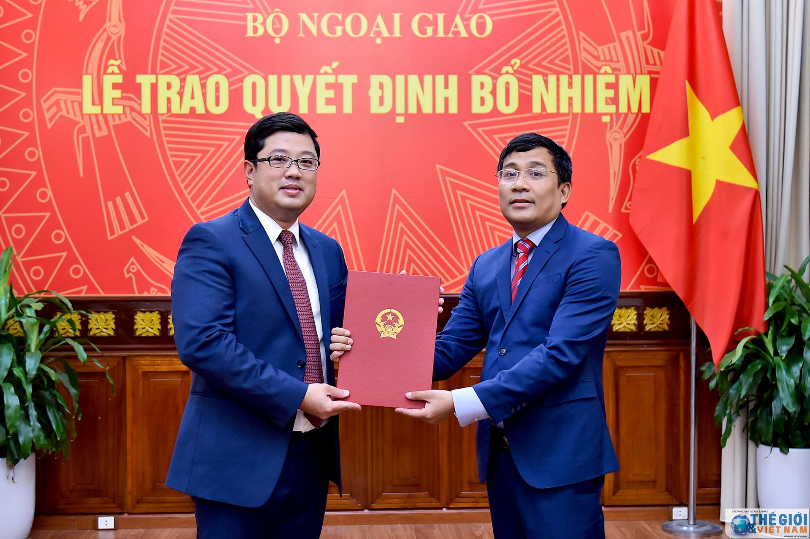
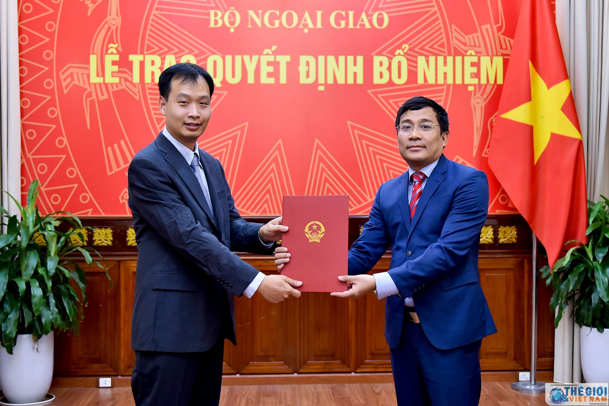
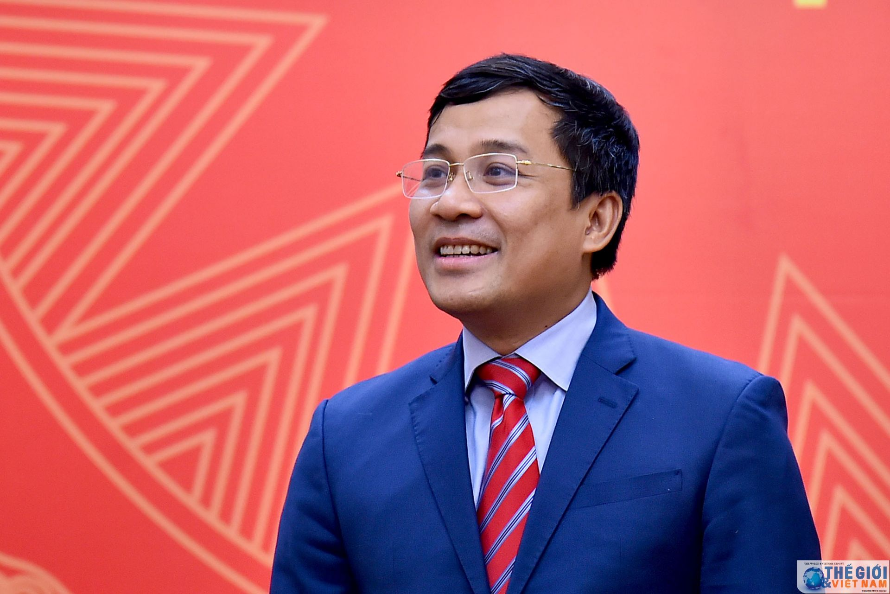
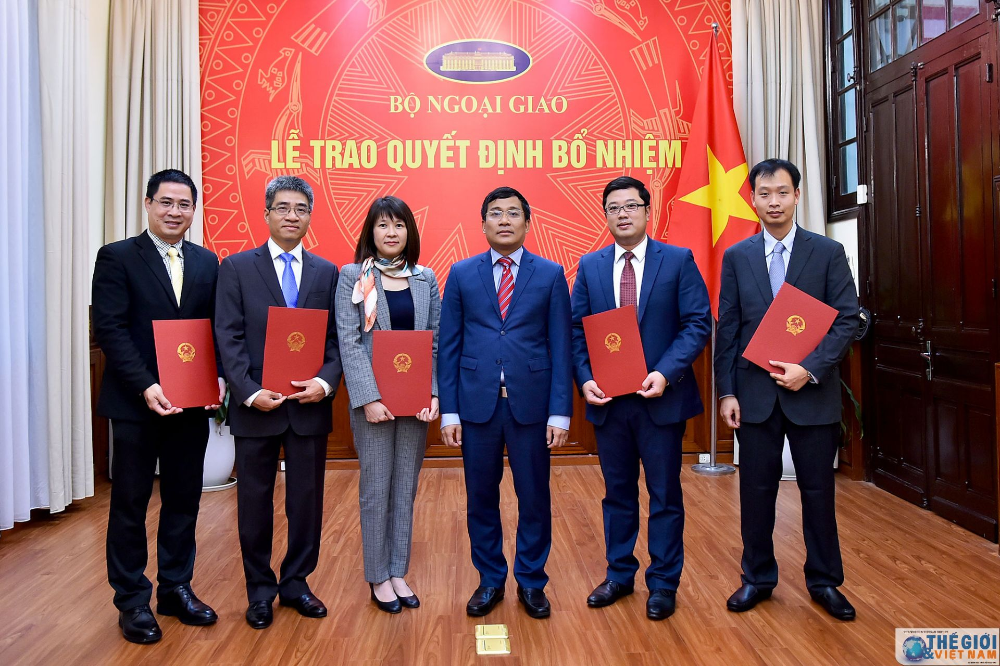
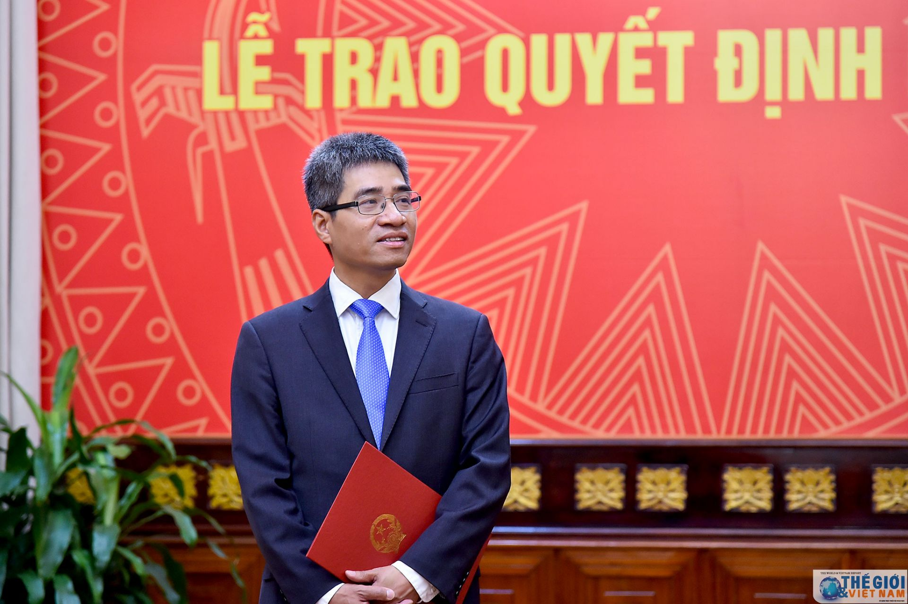

| Chiều 17/12, tại Trụ sở Bộ, Thứ trưởng Ngoại giao Nguyễn Minh Vũ đã trao quyết định điều động và bổ nhiệm các cán bộ cấp Vụ của Bộ Ngoại giao.    |
| --- |
| Tham dự buổi lễ trao quyết định có đại diện lãnh đạo các đơn vị của Bộ Ngoại giao. |
 

|  |
| --- |
| Theo đó, Bộ trưởng Bộ Ngoại giao quyết định: Điều động và cử ông Nguyễn Đắc Thành, nguyên Tham tán Công sứ Đại sứ quán Việt Nam tại Trung Quốc, làm Phó Vụ trưởng phụ trách Vụ Thi đua - Khen thưởng và Truyền thống Ngoại giao; |
 

|  |
| --- |
| Cử bà Nguyễn Thị Thìn, Phó Trưởng ban Đào tạo, Học viện Ngoại giao, phụ trách Ban Đào tạo, Học viện Ngoại giao; |

|  |
| --- |
| **Tiếp nhận và điều động ông Lại Thái Bình, nguyên Phó Tổng Lãnh sự - Người thứ Hai Tổng Lãnh sự quán Việt Nam tại Houston, Hoa Kỳ, hết nhiệm kỳ về nước, giữ chức Phó Viện trưởng Viện Biển Đông, Học viện Ngoại giao;** |

|  |
| --- |
| Tiếp nhận và điều động ông Ngô Quang Anh, nguyên Phó Tổng Lãnh sự - Người thứ Hai Tổng Lãnh sự quán Việt Nam tại San Francisco, Hoa Kỳ, hết nhiệm kỳ về nước, giữ chức Phó Giám đốc Trung tâm Biên Phiên dịch quốc gia; |

|  |
| --- |
| Tiếp nhận và điều động ông Nguyễn Nam Dương, nguyên Tham tán Phái đoàn Đại diện Thường trực Việt Nam tại Liên hợp quốc, New York, hết nhiệm kỳ về nước, giữ chức Phó Viện trưởng Viện Biển Đông, Học viện Ngoại giao. |
 

|  |
| --- |
| Phát biểu tại buổi lễ, Thứ trưởng Ngoại giao Nguyễn Minh Vũ chúc mừng các cán bộ vừa được điều động vào vị trí công tác mới; khẳng định, đây là sự tin tưởng của Phó Thủ tướng, Bộ trưởng Ngoại giao và Ban cán sự Đảng Bộ, Lãnh đạo Bộ đối với phẩm chất, năng lực của các cán bộ được điều động lần này. |
 

| [](08.jpg "&#039;&#039;&#039;			&lt;p&gt;Trao đổi cụ thể với từng cán bộ về những thách thức trong bối cảnh tình hình mới, Thứ trưởng Nguyễn Minh Vũ cũng đã giao nhiệm vụ cụ thể cho các cán bộ; mong muốn các cán bộ mới được điều động sẽ nỗ lực hết sức mình xây dựng tập thể đơn vị đoàn kết, tiếp tục đóng góp vào nhiệm vụ chính trị của Bộ, góp phần vào thành công chung của công tác đối ngoại đất nước.&lt;/p&gt;			&lt;p&gt;Cuối cùng, Thứ trưởng Nguyễn Minh Vũ bày tỏ tin tưởng các cán bộ sẽ hoàn thành tốt nhiệm vụ được Phó Thủ tướng, Bộ trưởng Ngoại giao và Ban cán sự Đảng Bộ, Lãnh đạo Bộ giao phó.&lt;/p&gt;			&#039;&#039;&#039;") |
| --- |
|  Trao đổi cụ thể với từng cán bộ về những thách thức trong bối cảnh tình hình mới, Thứ trưởng Nguyễn Minh Vũ cũng đã giao nhiệm vụ cụ thể cho các cán bộ; mong muốn các cán bộ mới được điều động sẽ nỗ lực hết sức mình xây dựng tập thể đơn vị đoàn kết, tiếp tục đóng góp vào nhiệm vụ chính trị của Bộ, góp phần vào thành công chung của công tác đối ngoại đất nước. Cuối cùng, Thứ trưởng Nguyễn Minh Vũ bày tỏ tin tưởng các cán bộ sẽ hoàn thành tốt nhiệm vụ được Phó Thủ tướng, Bộ trưởng Ngoại giao và Ban cán sự Đảng Bộ, Lãnh đạo Bộ giao phó. |

|  |
| --- |
| Thay mặt cho các cán bộ được nhận quyết định, ông Nguyễn Đắc Thành bày tỏ vinh dự khi được Phó Thủ tướng, Bộ trưởng Phạm Bình Minh và tập thể Lãnh đạo Bộ tin tưởng phân công nhiệm vụ mới. Ông Nguyễn Đắc Thành khẳng định, các cán bộ được điều động vào vị trí công tác mới sẽ cố gắng hết sức mình để hoàn thành tốt công việc được giao, xứng đáng với sự tin cậy của tập thể Lãnh đạo Bộ.        Nguồn: [https://baoquocte.vn](https://baoquocte.vn/) |
