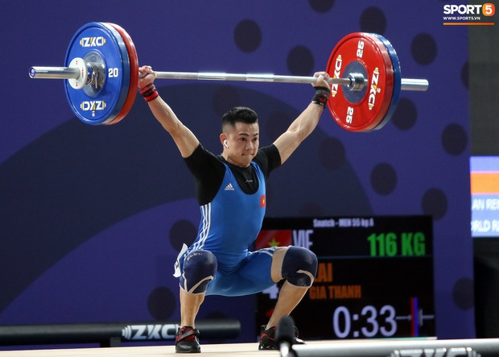
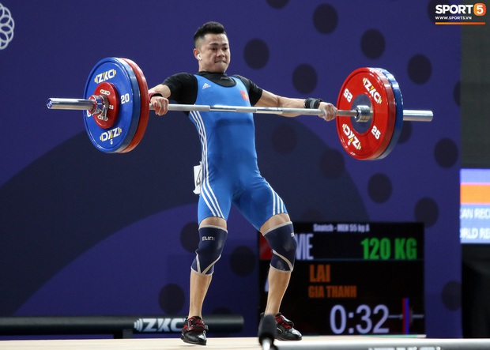
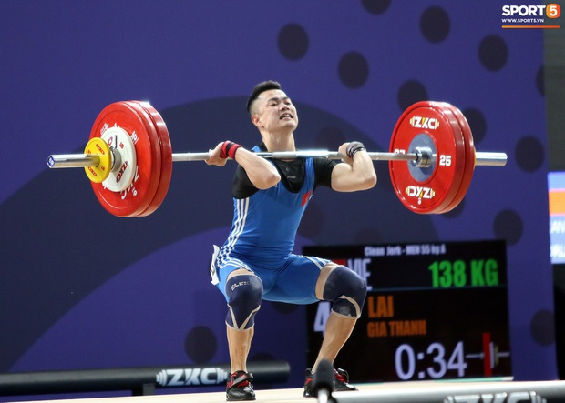
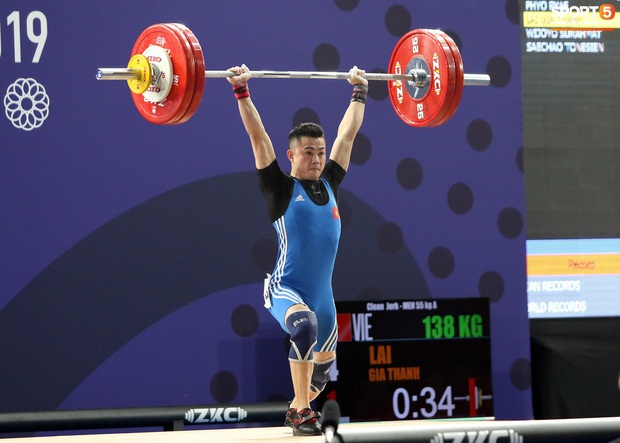
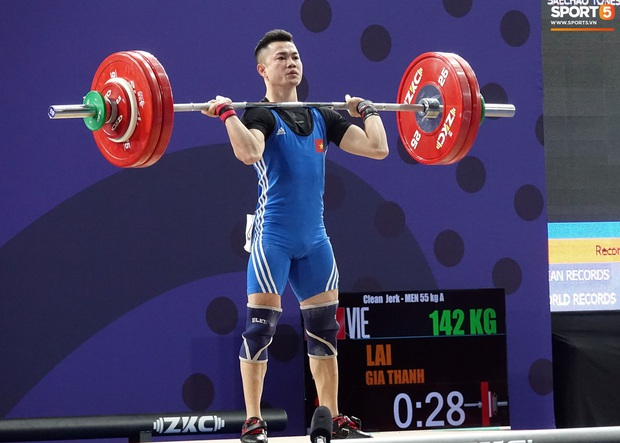
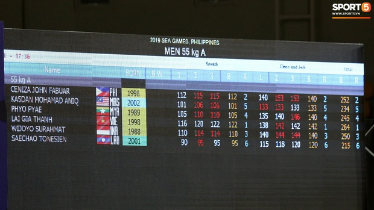
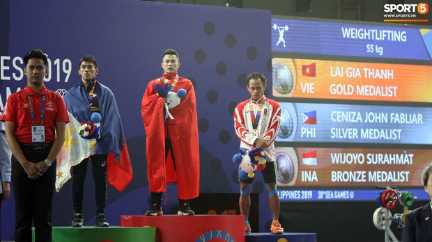

## Đô cử sinh năm 1998 - Lại Gia Thành đã đem về chiếc HC Vàng thứ 2 cho cử tạ Việt Nam tại SEA Games 2019, sau khi chiến thắng ở nội dung 55kg nam.

Đô cử quê Hà Nội thể hiện phong độ ấn tượng ở loạt cử giật, thành công ở cả 3 mức: 116, 120 và 122. Ảnh: Hoàng Tùng.

Đô cử sinh năm 1998 gây tò mò cho nhiều người khi tai phải đeo tai nghe. Nhiều ý kiến bảo anh nghe nhạc riêng cho thoải mái, nhưng có lẽ BTC đã đề phòng "có gì đó" chỉ đạo trực tiếp, nên Gia Thành sau 2 lượt cử đã bỏ tai nghe ở ngoài khu thi đấu. Ảnh: Hoàng Tùng

 

Với mức cử giật được tính là 122kg, xếp thứ nhất sau vòng đầu, Lại Gia Thành có thêm tinh thần cho loạt cử đẩy. Ảnh: Hoàng Tùng

Anh thành công ở lần đầu với mức 138kg. Lần 2 với mức 142kg đã có lỗi nhỏ xảy ra. Và phải đến lần 3, Gia Thành mới hoàn tất mức 142kg, đưa tổng mức của mình lên thành 264kg. Ảnh: Hoàng Tùng

Mức tạ mà Lại Gia Thành đạt được đã tạo áp lực không nhỏ lên hai VĐV tranh chấp huy chương là Cenzia John Fabuar của chủ nhà Philippines, và Wijoyo Surahmat của Indonesia. Nhiều CĐV Việt Nam thở phào khi cả hai đối thủ này đều đã không thành công ở cả 2 lần cử đẩy cuối. Ảnh: Hoàng Tùng

Thành tích chung cuộc của nội dung 55kg nam môn cử tạ SEA Games 2019. Ảnh: Hoàng Tùng

Ở SEA Games 2019, môn cử tạ không được tính điểm cho Olympic, chính vì thế, đây sẽ chỉ là bước khởi đầu cho Lại Gia Thành. Ảnh: Hoàng Tùng

 

[Theo Trí Thức Trẻ](http://ttvn.vn/gioi-tre/do-cu-lai-gia-thanh-khien-khan-gia-thot-tim-truoc-khi-gianh-hcv-sea-games-2019-2201911220042418.htm "Theo Trí Thức Trẻ")
