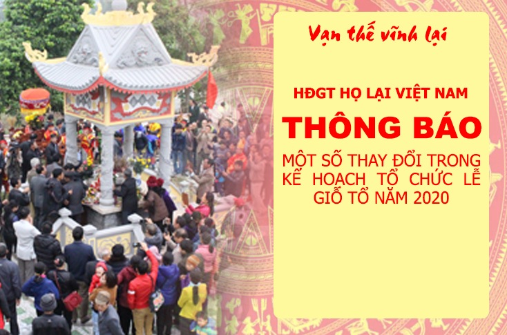

Do tình hình bùng phát dịch Corona khó đoán và khó lường, hưởng ứng lời kêu gọi và chỉ thị của Chính phủ trong việc đảm bảo sức khỏe của nhân dân nói chung và của Cộng đồng con cháu Họ Lại Việt Nam nói riêng, Nay HĐGT Họ Lại Việt Nam quyết định thay đổi một số nội dung trong việc đón con cháu hành hương về giỗ tổ:  
- Điều 1: Tạm dừng việc tổ chức lễ tế và lễ rước kiệu trong ngày lễ chính,  
- Điều 2: HĐGT đón tiếp quí vị đại biểu và con cháu Họ Lại Việt Nam về dâng hương lễ Tổ từ chiều ngày 13 đến hết ngày 15 tháng giêng năm 2020 (âm lịch).  
- Điều 3: Để đảm bảo sức khỏe và hạn chế việc lây lan dịch bệnh, Yêu cầu các cá nhân về dự đeo khẩu trang y tế, dâng hương lễ tổ theo sự sắp xếp và chỉ đạo của BTC.  

Trân trọng kính báo!
