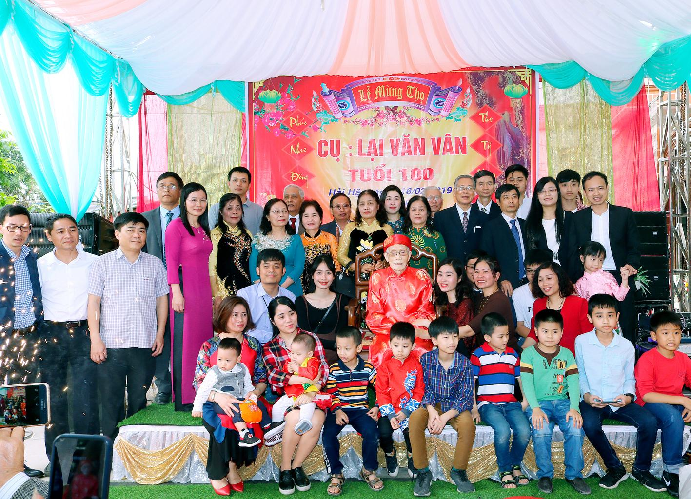
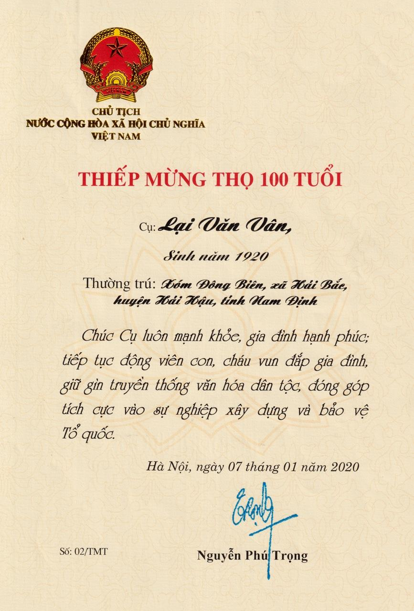
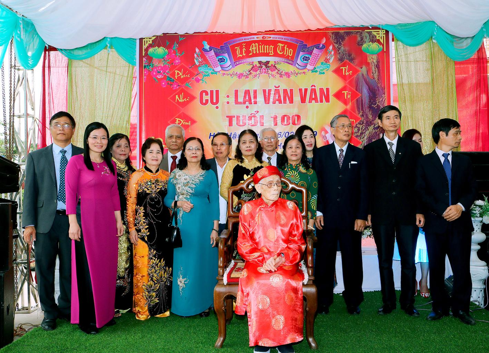
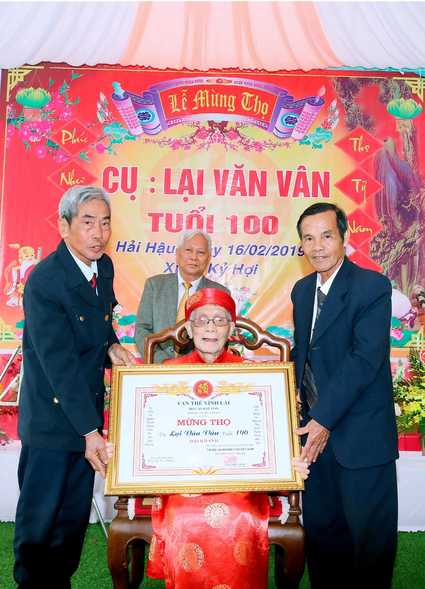
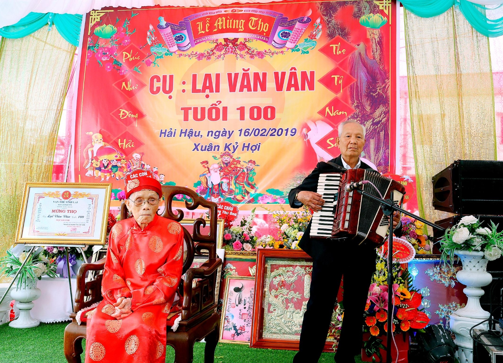
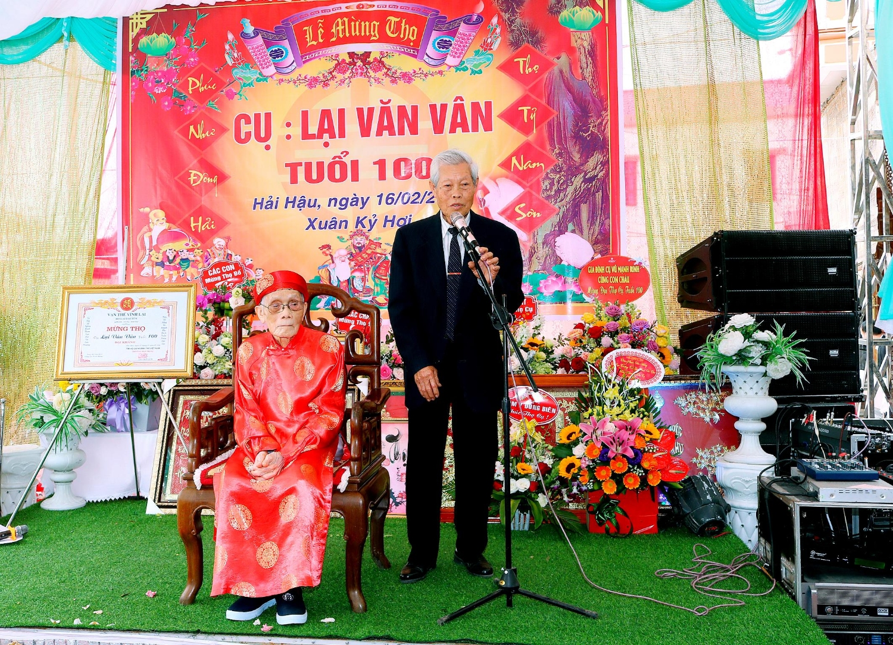
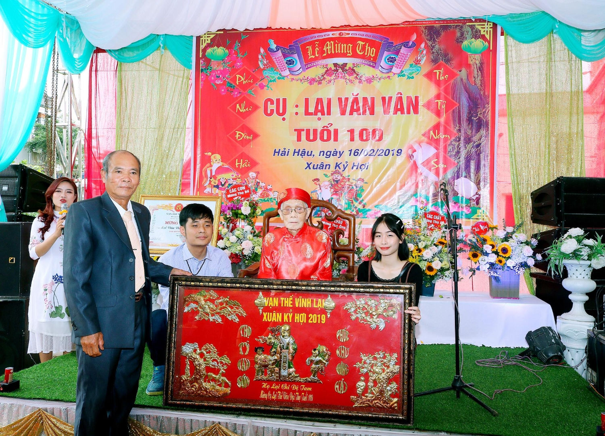
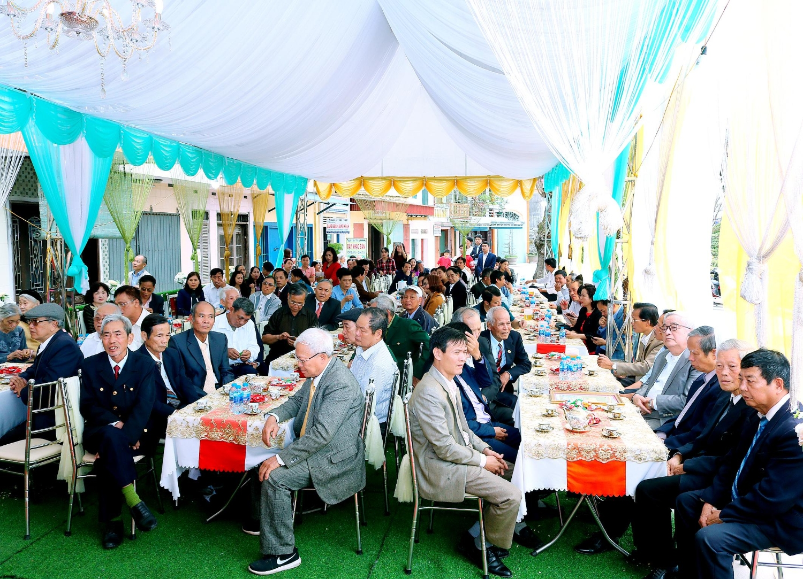

Vào ngày 16/2/2020, Gia đình cụ Lại Văn Vân đã long trọng tổ chức lễ đón thiệp chúc thọ của Tổng Bí Thư, Chủ Tịch Nước Nguyễn Phú Trọng gửi tặng nhân dịp cụ tròn 100 tuổi. Đây không chỉ là niềm vui, sự hoan hỷ của gia đình cụ mà còn là của cộng đồng con cháu Họ Lại Việt Nam.

**Thiệp chúc thọ của Tổng bí thư, Chủ tịch nước: Nguyễn Phú Trọng**

**Đôi nét về tiểu sử cụ: Lại Văn Vân**  
 

- Cụ Lại Văn Vân sinh năm Canh Thân 1920 tại xã Hải Long, Hải Hậu trong 1 gia đình có truyền thống nho học và là hậu duệ đời thứ 14 của Thủy Tổ Lại Xuân Không. Tổ Lại Xuân Không là đồng khởi Tổ với tứ Tổ là Trần, Vũ, Hoàng, Phạm và đứng đầu 9 họ có công quai đê lấn biển khai sáng thành đất Quần Anh-tiền thân của huyện Hải Hậu từ hơn 500 năm trước.
- Thời niên thiếu cụ đã tham gia Đoàn thanh niên cứu quốc. Khi Pháp đóng bốt Đông Biên, Cụ đã bị địch bắt, tra hỏi vì có người em đi theo Cách Mạng.
- Lớn lên Cụ theo thân phụ là lương y ra Hải Phòng mở hiệu thuốc bắc, khi quân Nhật đổ bộ vào đất Cảng thì trở về Đông Biên tiếp tục nghề cũ. Sau một vài biến cố của gia đình, Cụ chuyển sang bán tạp hóa và từ thập niên 70 của thế kỷ trước, Cụ là xã viên HTX thủ công nghiệp. Vốn tính cẩn thận, Cụ được giao làm thủ quỹ và Trưởng ban kiểm soát.
-

**Các con,cháu cụ về chúc thọ cụ**

-
  

- Cụ còn tham gia công tác xã hội: Trong 27 năm từ năm 1954-1982 nhiều năm liền là công an viên, Trưởng phố Đông Biên (bao gồm cả dãy phố đã cắt về thị trấn), ủy viên HĐND và thủ kho nghĩa thương xã Hải Bắc, được chính quyền cấp huyện và tỉnh ghi công.
- Trong gia tộc, cụ là bậc cao niên, nhiều năm là niên trưởng của kho Lại Hải Hậu, cùng với các con quan tâm đóng góp công đức tu tạo Từ Đường và quỹ khuyến học của dòng họ, được người trong họ tôn trọng. Trong buổi lễ đón nhận bằng di tích lịch sử văn hóa của Từ đường Đại tôn ngành thứ Việt Nam thờ Thủy tổ Lại Xuân Không tại Hải Trung ngày 21/12/2008, Cụ được mời lên phát biểu cám ơn các đại biểu và con cháu trong họ về dự lễ. Tiếp theo khi Từ đường Chi Tam tại Hải Long- cấp dưới của Đại Tôn Hải Trung cũng được công nhận là di tích lịch sử văn hóa, Cụ lại được mời lên đón bằng tại Từ Đường sau khi chính quyền tổ chức trao nhận ngày 12/11/2017 tại Nhà văn hóa xã.
-

**Ban trị sự Họ Lại Đại Tôn tại Hải Hậu do ông Lại Thế Lịch đại diện về Trao giấy mừng thọ Cụ**

- Cụ có 8 người con, mất 1 còn 3 trai 4 gái. Cùng với cụ bà lúc sinh thời, Cụ đã bươn chải kiếm sống, tằn tiện hết lòng nuôi dưỡng,dạy bảo các con gìn giữ đạo đức gia phong và cho học hành đầy đủ. Theo gương cụ, con cháu dâu rể phấn đấu thành đạt và là những công dân tốt, hiếu thảo với bố mẹ.
- Cụ có thói quen không dùng thuốc, thường xuyên tập luyện nhẹ nhàng, ăn uống sinh hoạt điều độ nên đến nay tuy thể lực và trí não suy giảm nhưng chưa mặc bệnh nặng nào.
- Với và con xóm phố qua các thế hệ hay với khách hàng, bạn làm ăn trước đây, Cụ luôn sống chân tình và giữ được chữ tín, được mọi người quý trọng.

**Một số hình ảnh trong ngày lễ mừng thọ cụ:**

