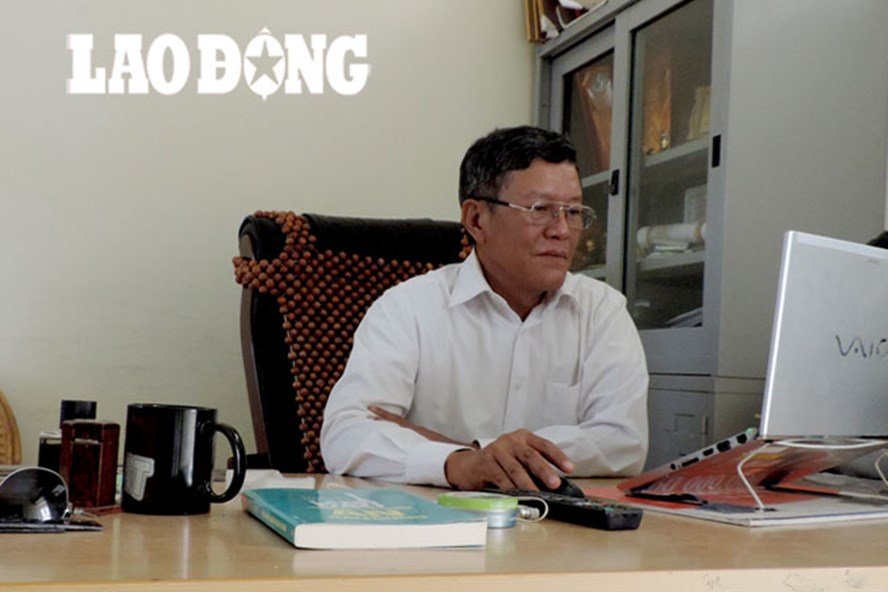
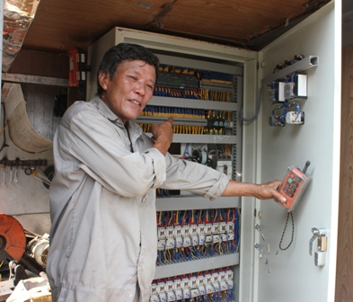
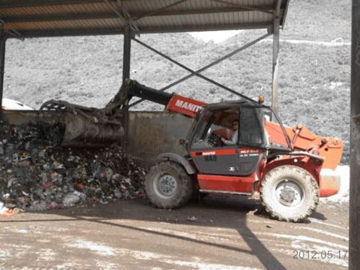

Sau nhiều năm miệt mài nghiên cứu thử nghiệm, thậm chí phải đổ cả máu, hệ thống máy móc phân loại, xử lý rác đã được ông hoàn thành. Ông trở thành kĩ sư Việt Nam đầu tiên làm được điều gần như không tưởng ấy.

**Con người đam mê sáng tạo khoa học**

Ông Lại Minh Chức sinh năm 1955 tại xã Thanh Bình, huyện Thanh Liêm, tỉnh Hà Nam trong một gia đình trí thức. Từ nhỏ, ông Chức đã tỏ ra là một đứa trẻ thông minh, lanh lợi, đặc biệt có trí nhớ rất tốt. 7 tuổi, ông đã được cha - vốn là Giám đốc Xí nghiệp ôtô canno Hà Nam - đưa lên xưởng và dạy cho những kiến thức về nguyên lý hoạt động của động cơ ôtô, xe máy. Theo năm tháng, niềm say mê với những con ốc vít, bánh răng, động cơ… cứ lớn dần lên trong ông, biến thành động lực cho những sáng tạo về sau.

[01.html](01.html)

Năm 17 tuổi, như bao bạn bè đồng trang lứa, ông nhập ngũ lên đường chiến đấu giải phóng quê hương. Hòa bình lập lại, ông được Bộ tư lệnh Trường Sơn 559 chuyển ra Bắc học văn hóa. Một năm sau, ông thi đỗ vào Khoa Xây dựng dân dụng công nghiệp, Đại học Kiến trúc Hà Nội. Năm 1988, ông xin chuyển ngành về làm Phó Giám đốc, rồi Giám đốc Xí nghiệp thiết bị du lịch Hải Phòng. Đang làm giám đốc của một đơn vị ăn nên làm ra nhưng khi niềm say mê nghiên cứu sáng tạo trỗi dậy, ông đã xin giải thể để tự đầu tư nghiên cứu khoa học và tiếp tục theo học bằng 2 hệ chính quy quản trị doanh nghiệp công nghiệp tại Đại học Kinh tế quốc dân.

Vốn đam mê sáng tạo, từ những năm tháng sinh viên cũng như sau này khi đã trở thành một kỹ sư, ông Chức luôn đề xuất những sáng chế mới. Năm 1997, ông đã nổi tiếng với công trình “Nghiên cứu vật liệu và công nghệ chế tạo vật liệu mới thay gỗ” để sản xuất đồ nội thất, được Hội đồng Khoa học TP.Hải Phòng nghiệm thu xuất sắc - Giải thưởng sáng tạo Khoa học công nghệ Việt Nam VIFOTEC năm 1997. Từ đây, ông trở thành Nghiên cứu viên khoa học tại Trung tâm Nghiên cứu ứng dụng Khoa học công nghệ thuộc Sở Khoa học Công nghệ Hải Phòng

Năm 2007, ông được cử đi làm chuyên gia kỹ thuật và trực tiếp quản lý Nhà máy xử lý rác thải của Công ty CP môi trường xanh Seraphin tại TX.Sơn Tây. Năm 2009, ông trở về công tác tại Viện Kiến trúc nhiệt đới - Đại học Kiến trúc Hà Nội.

Mấy mươi năm công tác ở nhiều cương vị khác nhau nhưng ông Chức chưa bao giờ ngưng nghĩ về những công trình sáng chế khoa học của mình. Ông tâm sự: “Làm ở trong các cơ quan nhà nước, việc làm tuy nhàn nhưng cũng vướng phải những ràng buộc này nọ, không theo kịp xu hướng phát triển của thế giới. Vì thế, khi những ý tưởng khoa học nảy ra, tôi đã tự nguyện xin ra ngoài để tự chủ nghiên cứu khoa học”. Năm 2010, ông Chức thôi công tác tại Đại học Kiến trúc, từ chối lời mời làm Giám đốc trung tâm khoa học của trường để trở về nhà nghiên cứu khoa học. Ông vận động người thân, bạn bè, đồng nghiệp lập nên Trung tâm nghiên cứu và phát triển công nghệ môi trường xây dựng. Và từ trung tâm đó, chiếc máy và quy trình phân loại, xử lý rác thải đã được ra đời.  

 

**Bán cả gia tài để làm máy phân loại rác**

Ý tưởng chế tạo máy phân loại rác được hình thành khi ông Chức đang trực tiếp quản lý điều hành nhà máy xử lý rác thải tại TX.Sơn Tây. Khi ấy, ông nhìn thấy cảnh cả trăm công nhân phân loại rác mà vẫn không đạt được hiệu quả tốt, rác lẫn lộn các thành phần, không thể tái chế hay làm phân bón được. Ông bèn nảy ra ý định làm một chiếc máy để phân loại được tốt hơn. Thế nhưng, khi nghe ông trình bày, nhiều nhà khoa học đã bảo ý tưởng của ông là điên rồ, hoang tưởng. Ông chỉ đáp lại với một niềm tin mãnh liệt “Phân loại rác ở Việt Nam đúng là không dễ, nhưng cũng không phải quá khó hay không làm được. Nếu không ai làm, tôi sẽ làm để chứng minh”.

Thế rồi, ông bắt tay vào công việc nghiên cứu, thiết kế của mình. Để có tiền làm, ông phải đem cầm cố, bán hết tài sản mà mình có, đồng thời huy động thêm tiền từ gia đình, bè bạn. Mẹ, chị gái và em gái đặt trọn niềm tin vào ông, lần lượt bán đất, rút sổ tiết kiệm, đưa vàng tích cóp cả đời cho ông, tổng cộng được hơn 3 tỉ đồng. Ông dốc hết tiền vào nghiên cứu chế tạo máy.

Trải qua 2 năm miệt mài, ăn ngủ tại xưởng, sống chung với rác, người lúc nào cũng “đượm mùi”, có lúc còn bị tai nạn gẫy xương, ông Chức đã cho ra đời chiếc máy phân loại rác của mình. Máy có trọng lượng 8 tấn, là tổ hợp của 15 chiếc máy khác nhau được lắp ghép và vận hành trong một hệ thống dây chuyển tự động, có sự can thiệp của con người thông qua điều khiển từ xa. Điều đáng nói là 15 chiếc máy ấy đều là những sản phẩm sáng tạo độc quyền của ông và cộng sự.  

 

Ông Chức cho biết, trước đây quy trình phân loại rác chủ yếu do con người thực hiện, vì thế, hiệu quả vừa không cao, vừa gây ra nguy cơ lây nhiễm các bệnh từ vi khuẩn có hại. Chiếc máy do ông chế tạo ra sẽ phân loại rác thải trong một nhà kín. Vì thế, hạn chế được đến mức tối đa mùi hôi của rác, đồng thời lại tách được “nước rác” để đem đi xử lý riêng, không để ô nhiễm vào đất. Hệ thống máy gồm nhiều tay xúc, sẽ phân rác thành 7 nhóm. Nhóm 1 là mùn hữu cơ dễ phân hủy sinh học có nguồn gốc động thực vật. Nhóm 2 là nilon màng mỏng, nhựa phế thải. Nhóm 3 là rác thải mùn hữu cơ có nguồn gốc thực vật vụn. Nhóm 4 là cát, sạn, thủy tinh. Nhóm 5 là gạch đá không tái chế được. Nhóm 6 là sắt, thép, kim loại đen, kim loại màu. Nhóm 7 là rác thải cá biệt như các loại rác có kích thước lớn, không tiêu hủy được. Điều đặc biệt thêm nữa là mỗi đầu ra của rác đều được gắn camera theo dõi, vì thế người điều khiển chỉ cần đứng tại phòng làm việc là có thể bao quát toàn bộ quy trình hoạt động của cả dây chuyền. Vận hành cả quy trình phân loại rác chỉ cần có 2 người: 1 công nhân điều khiển và 1 công nhân nạp rác.

Không chỉ phân loại, chiếc máy còn có năng lực xử lý rác thải để tái chế ứng dụng vào đời sống. Máy có thể tự động phân phối lượng rác, có thiết bị băm cắt thông minh cho phép tự cắt xé bao, gói và lựa chọn loại rác cần cắt nhỏ theo yêu cầu của công nghệ phân loại và tái chế. Ngoài ra, máy còn có thể cắt nhỏ các loại rác hữu cơ có nguồn gốc động thực vật để sản xuất phân bón vi sinh phục vụ cho nông nghiệp. Công nghệ này đã cho phép giảm từ 70 - 85% diện tích chôn lấp so với công nghệ cũ, giảm thời gian phân hủy và thu hồi được nhiều lượng mùn hữu cơ hơn.

Hiện tại, chiếc máy đang được ông Chức nâng cấp sử dụng lên thế hệ thứ 4. Thế hệ đầu được ông đem áp dụng tại Nhà máy xử lý rác thải ở Sơn Tây, thế hệ thứ hai được áp dụng tại Công ty môi trường đô thị Hà Nam, thế hệ thứ ba ở Thanh Hóa, còn thế hệ này sẽ được ông áp dụng ở Hưng Yên. Thế hệ càng cao thì tính năng càng vượt trội, năng lực xử lý càng cao. Ông Chức cho biết, hiện tại năng lực xử lý rác thải của máy là từ 10 - 15 tấn/giờ.

Với sáng chế máy phân loại rác, ông Chức đã được Bộ Khoa học Công nghệ cấp bằng sáng chế độc quyền năm 2013. Nó cũng mang lại cho ông nhiều giải thưởng khoa học công nghệ uy tín. Ông Chức cũng nhiều lần được nhận bằng khen của các tỉnh Hà Nam, Hưng Yên, Hà Nội. Chia sẻ về những dự định trong tương lai, ông Chức cho biết, ông sẽ tiếp tục nâng cấp hệ thống máy phân loại rác lên đến trình độ tự động hóa hoàn toàn. Người kĩ sư năm nay 60 tuổi chưa bao giờ có ý định nghỉ ngơi. Trong đầu ông vẫn còn rất nhiều những ý tưởng, những dự định chưa được triển khai. Ông bảo, chỉ khi nào mà mắt không nhìn được chữ, tay không vẽ được chi tiết máy trên màn hình máy tính nữa thì mới thôi làm việc. “Mới đây, tôi đã đón bạn là một nhà khoa học người Nhật 73 tuổi mang theo nhiều sáng chế tình nguyện sang Việt Nam để giúp dân mình xây dựng đất nước, vì vậy mình còn sức thì còn làm phải tiếp tục làm việc”, ông Chức cười chia sẻ.
