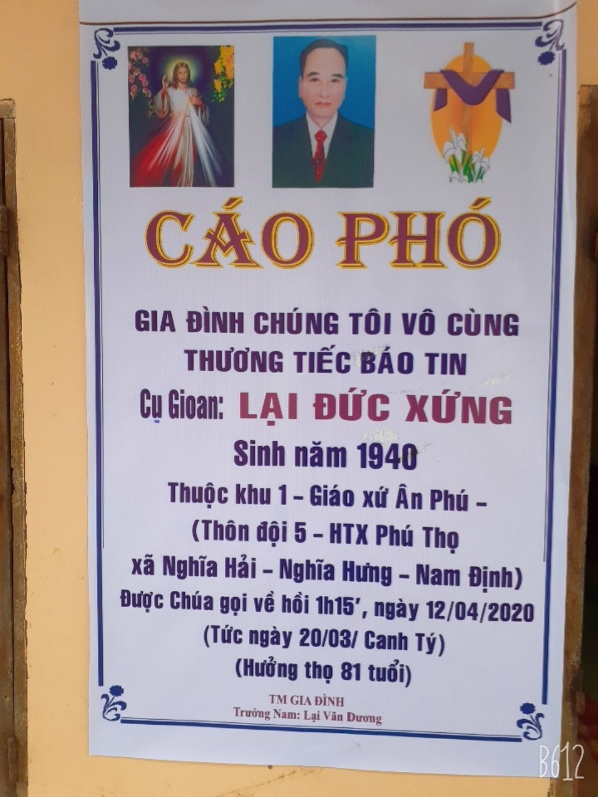

Kính thưa hương hồn ông Lại Đức Xứng !  

Công lao đóng góp của ông đã được Đảng, Nhà nước, chính quyền, đoàn thể các cấp ghi nhận, tuyên dương. Những thành tích lớn nhất của ông để lại cho thế hệ mai sau là tấm gương về tình yêu dòng họ, về sự nhiệt tình, trách nhiệm trong các công việc được giao. Đặc biệt là trong việc hoàn thành xuất sắc nhiệm vụ là thành viên thuộc Ban tu phả của Hội đồng gia tộc họ Lại Việt Nam giao phó. Những thành tích, sự cống hiến của ông sẽ được con cháu, chi họ, Hội đồng gia tộc họ Lại Việt Nam ghi nhận.  

Sự ra đi của Ông là niềm tiếc thương vô hạn đối với gia đình, xóm làng, đặc biệt là đối với cộng đồng con cháu Họ Lại Việt Nam. Thay mặt cho HĐGT, tôi xin gửi lời chia buồn sâu sắc tới gia đình ông và sớm vượt qua sự mất mát này,cầu chúc cho hương hồn ông được an vui nơi miền cực lạc!  

TM.HĐGTHLVN  
CHỦ TỊCH  

Lại Thế Tác
