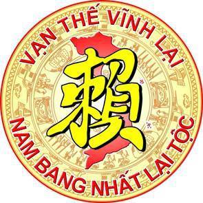

**Trang web họ Lại Việt Nam là địa chỉ, là thương hiệu, biểu tượng chính thống của dòng họ Lại Việt Nam.**  

Thay mặt Ban TTTT xin có đôi lời chia sẻ với các thành viên, quản trị viên trên Facebook “Trang Họ Lại Việt Nam”. Chúng ta đều biết: “Trang Họ Lại Việt Nam” được đăng trên Facebook có từ 6 - 7 năm nay của những con cháu họ Lại có tâm hướng về Tổ tiên. Những con cháu họ Lại đã tự nguyện tìm đến với nhau, xây dựng lên một địa chỉ của dòng họ với mục đích trong sáng, nhằm kết nối…, để chia sẻ với nhau mọi nỗi niềm, … việc làm này, những thông tin, bài đăng này,… thật là đáng trân trọng!.  

Hiện nay, một số dòng họ khác trên lãnh thổ Việt Nam, đã có Trang web riêng, đây cũng là địa chỉ của dòng họ, là biểu tượng riêng, hoạt động hiệu quả, có tổ chức cao. Chúng ta tự hỏi? Nam Bang Nhất Lại! Việt Nam chỉ có một họ Lại! Tại sao chúng ta lại không đồng tâm, hợp lực, … xây dựng cho bằng được Trang web họ Lại Việt Nam. Trước mắt chúng ta cần phấn đấu như một số dòng họ khác.

 

Nhóm nghiên cứu, bao gồm các con cháu họ Lại đã có đề xuất, kiến nghị và được Hội đồng gia tộc họ Lại Việt Nam xem xét, đồng ý thành lập Ban thông tin truyền thông trực thuộc Hội đồng gia tộc (viết tăt là Ban TTTT). Mục đích thành lập Ban TTTT là một Ban chuyên trách của HĐGTHLVN, có chức năng giúp Hội đồng chỉ đạo các hoạt đông của dòng họ thông qua kênh thông tin này để con cháu dòng họ trong nước và ngoài nước biết,  chủ động liên lạc, móc nối, gắn bó nhau qua việc liên kết, nhận họ, truy tìm, thăm viếng nhau, tổ chức các lễ cúng giỗ Tổ, xây dựng khuyến học, đóng góp nghĩa tình ... Trước mắt, HĐGTHLVN cũng cho phép thành lập Ban TTTT lâm thời tiến hành thực hiện các thủ tục cần thiết, trình Thường trực HĐGT quyết định (Nghị quyết của HĐGT ngày 02/8/2018).

 

Sau một thời gian khẩn trương nghiên cứu, dự thảo các văn ban cần thiết, Ban TTTT lâm thời đã trình Thường trực HĐGTHLVN các văn bản. Ngày 10 tháng 10 năm 2018, Chủ tịch HĐGTHLVN đã ký Quyết định số 03/QĐ-HĐGT về việc thành lập Ban TTTT trực thuộc HĐGTHLVN và Quyết định số 04/QĐ-HĐGT về việc phê chuẩn Quy chế “Tổ chức và hoạt động của Ban TTTT”.  

Khó khăn trước hết của Ban TTTT là xây dựng Trang web theo quy mô nào? đặt tên và quản lý, ... Chúng tôi cho rằng tên Trang web cần đạt được những yêu cầu: địa chỉ, thương hiệu, là biểu tượng chính thống của dòng họ Lại Việt Nam chúng ta và đồng nghĩa với xứng danh Nam Bang Nhất Lại! Việt Nam chỉ có một họ Lại!. Do vậy, tên Trang web phải là “Trang web HỌ LẠI VIỆT NAM”. Tuy nhiên, tên trang web HỌ LẠI VIỆT NAM này có sự trùng hợp với tên “Trang Họ Lại Việt Nam” hiện nay có trên Facebook như chúng tôi có đôi lời chia sẻ nói trên. Vì vậy, Ban TTTT rất mong cộng đồng con cháu họ Lại Việt Nam chúng ta hãy vì dòng họ, đồng tâm, hợp lực, … tập trung, thống nhất lấy một tên là “Trang web HỌ LẠI VIỆT NAM”, một địa chỉ, là thương hiệu, biểu tượng chính thống của dòng họ Lại Việt Nam. Trong thời gian đến, Ban TTTT sẽ có lộ trình, kế hoạch cụ thể, mong các thành viên chia sẻ, các quản trị viên phối hợp với Ban TTTT thực hiện việc tổ chức, tác nghiệp kỹ thuật, để “Trang web HỌ LẠI VIỆT NAM” có địa chỉ, là thương hiệu, biểu tượng chính thống của dòng họ Lại sớm đi vào hoat động chính thức.  

Ban TTTT thời gian qua đã triển khai được một số việc cơ bản, như xây dựng giao diện trang, đăng ký, hợp đồng, … quản lý; trước hết ghi nhận sự đóng góp về trí tuệ, kinh phí của cá nhân các thành viên trong nhóm nghiên cứu. Nhóm đã lường trước những việc phức tạp, khắc phục những khó khăn để đến nay trang web HỌ LẠI VIỆT NAM được vận hành thử nghiệm tại địa chỉ **holaivietnam.com** theo đúng kế hoạch của Ban đề ra; đã đăng tải một số thông tin về hoạt động của dòng họ theo đúng mục tiêu, yêu cầu của HĐGT và quy định của luật pháp. Đồng thời, trong thời gian đến, Ban TTTT sẽ tiếp tục đăng trên Trang về việc hướng dẫn các thành viên khai thác, chia sẻ; quy định việc viết, gửi bài của các cộng tác viên, duyệt đăng tải;… (Ban TTTT cũng đã mua 02 tên miềm trước mắt để làm kho lưu dữ liệu và phát triển trong thời gian đến: holaivietnam.com.vn; holaivietnam.vn).  Xin trân trọng cám ơn!                                                                                                         **TM.BAN TTTT**  **TB - Lại Xuân Cương**
