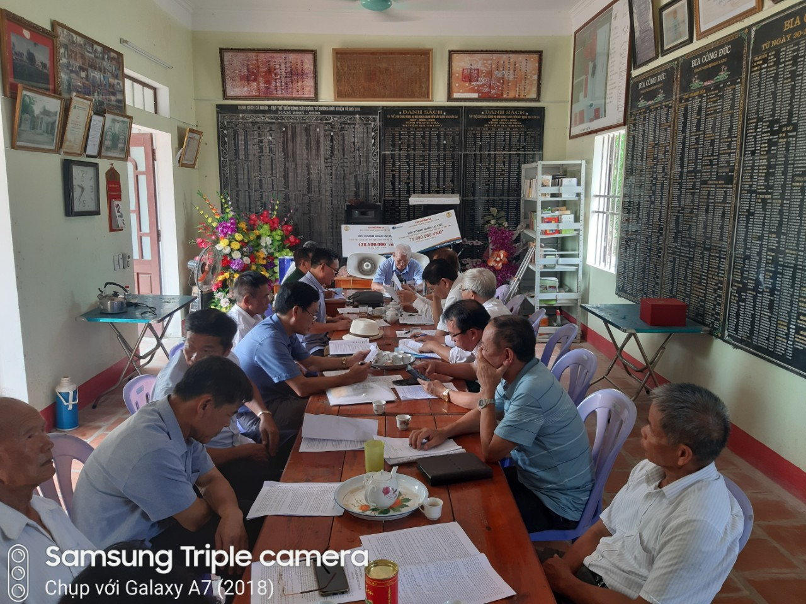

Hội nghị do **Chủ tịch HĐGT Lại Thế Tác** chủ trì. Đại biểu tham dự bao gồm các thành viên HĐGT, đại diện: một số chi họ, các tổ chức trực thuộc HĐGT. Sau khi Đại diện Ban Biên soạn Quy ước trình bày bản dự thảo Quy ước đã được giải trình tiếp thu những ý kiến do các thành viên HĐGT, đại diện: một số chi họ, các tổ chức trực thuộc HĐGT nêu tại hội nghị lần thứ II của HĐGT. Chủ tịch HĐGT đã kết luận những nội dung hội nghị thảo luận, thống nhất, như sau:   - Bổ sung ông Lại Vi Nghị (TV - HĐGT) vào Ban Biên soạn Quy ước của HĐGT họ Lại Việt Nam.

- Giao Ban Biên soạn Quy ước của HĐGT họ Lại Việt Nam tiếp thu những nội dung thảo luận, thống nhất tại hội nghị hôm nay, hoàn chỉnh bản **QUY ƯỚC CỦA GIA TỘC HỌ LẠI VIỆT NAM**  trình Chủ tịch HĐGT ký ban hành trước ngày 15 tháng 9 năm Canh Tý.

- Bản **QUY ƯỚC CỦA GIA TỘC HỌ LẠI VIỆT NAM**  được biên tập thành một cuốn sách, in 500 cuốn sách; phát đến các chi họ trên toàn quốc, các tổ chức trực thuộc HĐGT để biết, thực hiện. Giao Ban Thường trực HĐGT chỉ đạo triển khai thực hiện cụ thể: phối hợp với Ban Biên tập Quy ước thiết kế bìa cuốn sách đẹp; huy động kinh phí (từ nguồn tài trợ, quỹ của HĐGT,...), hợp đồng in cuốn sách bảo đảm chất lượng, giá thành phù hợp với thị trường.  

Ban Thông tin truyền thông xin thông tin các nội dung nêu trên đến các chi họ, các tổ chức trực thuộc HĐGT, anh em, con cháu trên toàn quốc biết./.
