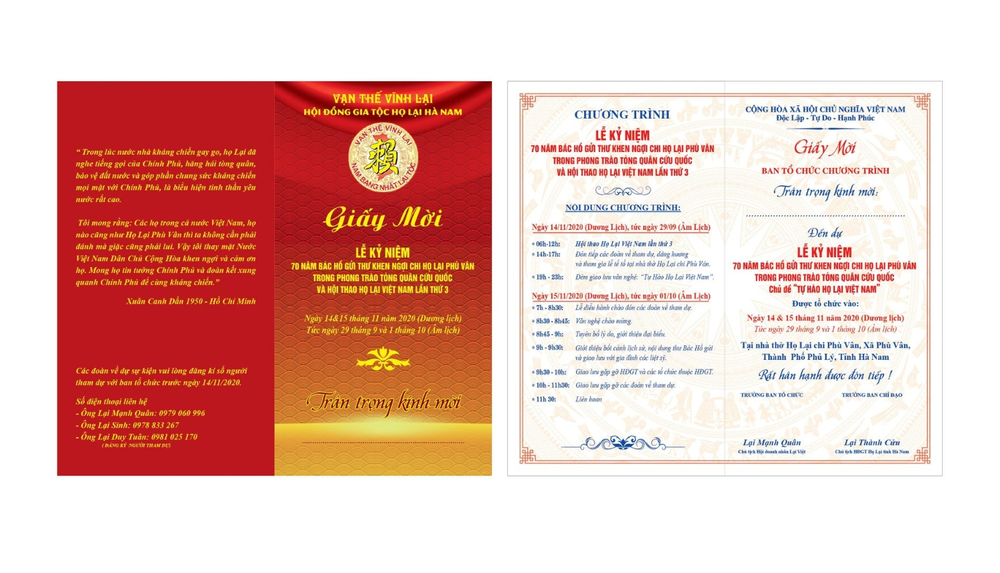

[THƯ MỜI THAM DỰ SỰ KIỆN]  

"LỄ KỶ NIỆM 70 NĂM BÁC HỒ GỬI THƯ KHEN NGỢI CHI HỌ LẠI PHÙ VÂN TRONG PHONG TRÀO TÒNG QUÂN CỨU QUỐC VÀ HỘI THAO HỌ LẠI VIỆT NAM LẦN THỨ 3"  

Kính gửi: Cộng đồng con cháu họ có nguồn gốc Lại Việt Nam trên toàn quốc

Trong suốt chiều dài lịch sử dựng nước và giữ nước của dân tộc Việt Nam ta, Họ Lại Việt Nam chúng ta tuy nhỏ nhưng cũng đã có nhiều đóng góp cả về trí tuệ và xương máu vì nền độc lập, thống nhất và sự phát triển của đất nước. Đặc biệt trong 2 giai đoạn kháng chiến chống Pháp và chống Mỹ, hưởng ứng theo lời kêu gọi của đất nước, hàng ngàn người con Họ Lại đã lên đường tòng quân và nhiều người đã ra đi mãi mãi, đặc biệt là những người con Họ Lại của Chi Phù Vân-Hà Nam ngày nay.

Trước sự đóng góp to lớn đó, vào ngày 9/1/1950 (Âm lịch), Bác Hồ kính yêu đã gửi thư khen ngợi phong trào tòng quân cứu nước của chi Họ Lại Phù Vân. Đây không chỉ là niềm tự hào của chi họ nơi đây mà còn là niềm vinh dự, sự tự hào của toàn thể cộng đồng con cháu Họ Lại Việt Nam.  

Nhân dịp kỷ niệm 70 năm đón thư Bác, với mong muốn con cháu Họ Lại khắp mọi miền tổ quốc và nhân dân cả nước biết đến sự kiện đặc biệt này, để phát huy truyền thống tốt đẹp của cha anh, HĐGT Họ Lại Viêt Nam đã giao cho HĐGT Họ Lại Hà Nam tổ chức sự kiện với quy mô toàn quốc để con cháu Họ Lại khắp mọi miền đất nước về tham dự.

I. Thời gian tổ chức  
Sự kiện diễn ra trong 2 ngày 14 và 15 tháng 11 năm 2020 (Dương Lịch). Tức ngày 29 tháng 9 và ngày 01 tháng 10 năm 2020 (Âm Lịch).  
II. Địa điểm: Nhà thờ Họ Lại chi Phù Vân, Thành Phố Phủ lý, Tỉnh Hà Nam  

III. Nội dung sự kiện ( Chi tiết trong ảnh đính kèm bài đăng)  

Đặc biệt, để chào đón lễ kỉ niệm sẽ có phần hội thao tranh tài của 12 tỉnh diễn ra vào sáng ngày 14/11/2020 (Dương Lịch), lễ trao giải sẽ diễn ra vào tối cùng ngày trong sự kiện.  

SỰ XUẤT HIỆN CỦA CÁC CHI HỌ LẠI VIỆT NAM TA TRÊN CẢ NƯỚC VỀ DỰ SỰ KIỆN SẼ LÀ THÀNH CÔNG LỚN NHẤT THỂ HIỆN SỰ ĐOÀN KẾT, TÌNH YÊU DÒNG HỌ THA THIẾT VÀ NIỀM TỰ HÀO DÒNG TỘC LỚN LAO. VÌ VẬY, BTC RẤT MONG QUÝ VỊ SẮP XẾP THỜI GIAN VÀ CÔNG VIỆC VỀ THAM DỰ.  

Các cá nhân và các đoàn về tham dự vui lòng đăng kí trước với BTC để phần hậu cần đón tiếp được chu đáo:  
- Đ/c: Lại Sinh : 0918753368 (Ban Hậu Cần)  
- Đ/c: Lại Văn Giỏi: (Ban Tài chính, nhận tài trợ)  
- Đ/c: Lại Đăng Thiện: 0976439926 ( BTC Hội Thao)  
- Đ/c: Lại Duy Tuân : 0981025170 (Ban Hậu Cần)  

Rất hân hạnh được đón tiếp!  
BTC
