Vào 02 ngày 19&20/12/2020 (ngày 06 & 07/11/2020) vừa qua, ban trị sự chi họ Lại đại tôn tại Hải Hậu Nam Định đã long trọng tổ chức lễ khánh thành việc tu bổ từ đường cụ Triệu tổ Lại Xuân Không với sự có mặt của đông đảo cộng đồng con cháu Họ Lại tại đây và các chi họ trên cả nước cũng về tham dự chúc mừng.

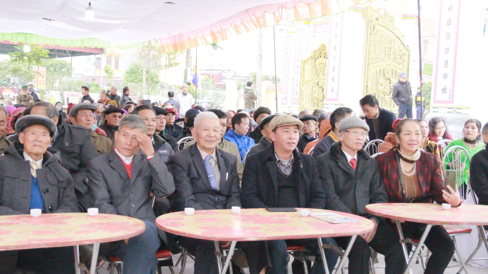

*Nhãn*

Ngôi từ đường đã đã đại trùng tu với tổng chi phí gần 2 Tỷ đồng, gồm nhiều hạng mục quan trọng như xây mới cổng tam quan, tu bổ lại toàn bộ từ đường và tường bao. Sau khi hoàn thiện, công trình đã mang lại một hình ảnh mới đầy uy nghi và lộng lẫy để tưởng nhớ công lao của tiên tổ.

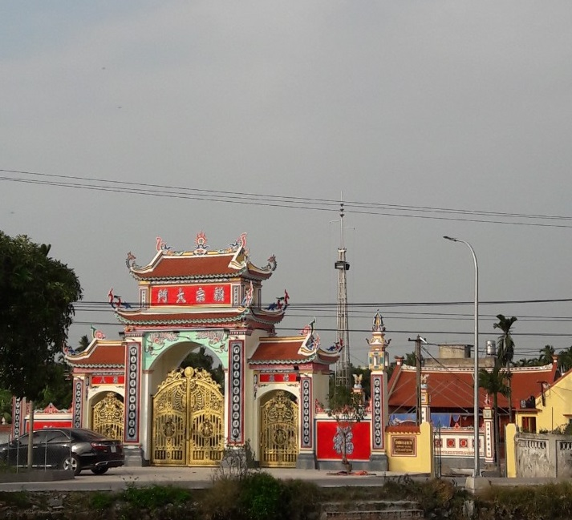

Về dự và chung vui với sự kiện long trọng này ngoài cơ quan tổ chức chính quyền tại địa phương còn có sự góp mặt của Hội đồng gia tộc Họ Lại Việt Nam, Ban liên lạc thanh niên họ Lại Việt Nam, Hội Doanh nhân lại Việt, Hội đồng gia tộc Họ Lại Tỉnh Hà Nam, Cộng đồng Họ Lại Tỉnh Thái Bình, Bắc Ninh, Hưng Yên, Ninh Bình....Cũng đã về tham dự.  
 

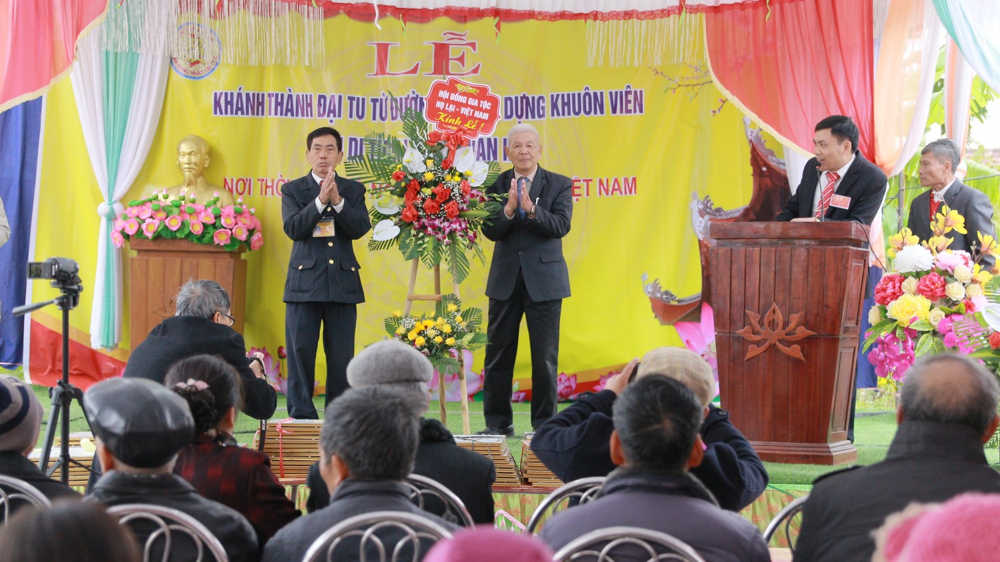

**Cụ Lại Thế Tác Chủ tịch HĐGT Họ Lại Việt Nam lên tặng hoa chúc mừng**

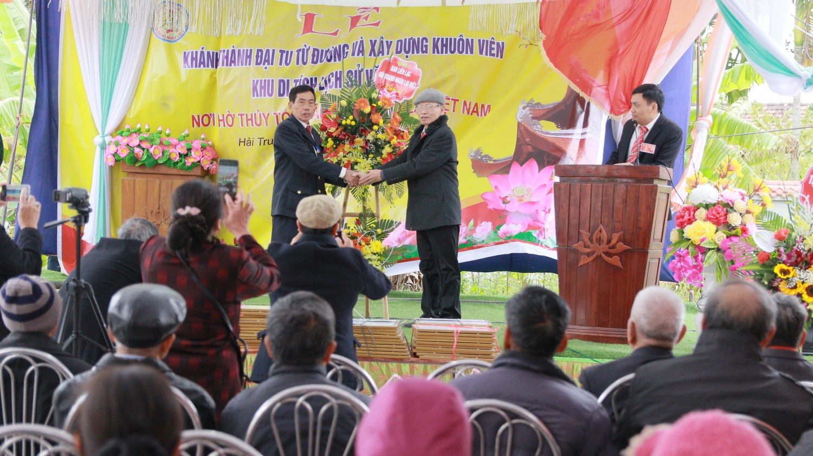

**Ông Lại Xuân Cương, Đại diện cho ban liên lạc và hội Doanh Nhân Lại Việt lên tặng hoa chúc mừng**

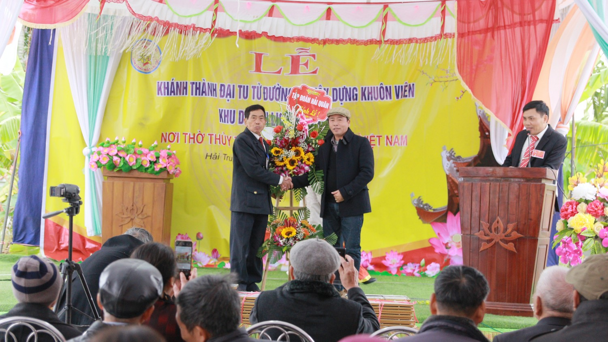

**Ông Lại Trọng Tâm Chủ tịch tập đoàn Hải Quân (Bắc Ninh) lên tặng hoa chúc mừng**

Để ghi nhận những đóng góp của các tổ chức và cá nhân trong việc xây dựng và tu bổ từ đường, ban trị sự dòng họ đã có bằng khen ngợi kịp thời để biểu dương.

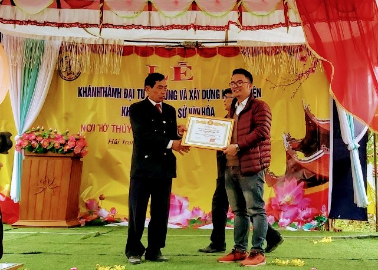

**Ông Lại Thế Long, Tổng thư kí hội Doanh Nhân Lại Việt lên nhận bằng khen của hội**

 

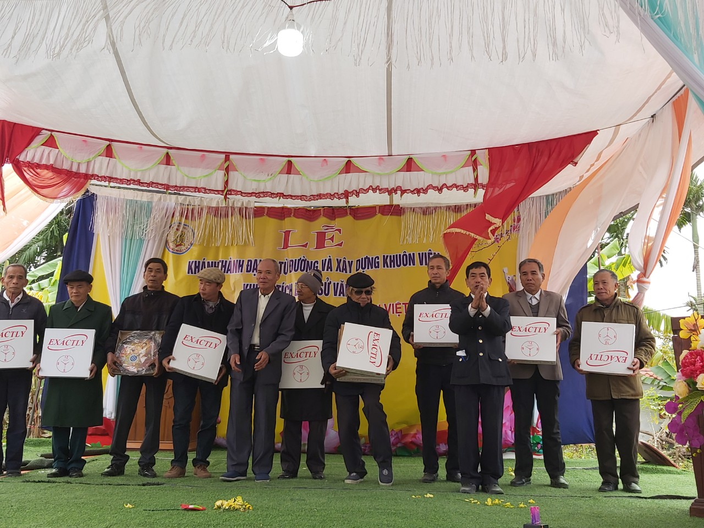

*Nhãn*

Chương trình đã diễn ra vô cùng trang trọng và ấm cúng trong tình cảm gia đình giữa những người con Họ Lại trong ngày vui của tiên tổ khi ngôi từ đường được tu bổ và sửa sang. Đặc biệt, trong chương trình còn có sự xuất hiện của rất nhiều tiết mục văn nghệ đặc sắc của các văn nghệ sỹ chính là con cháu của các chi Họ Lại tai Hải Hậu Nam Định..

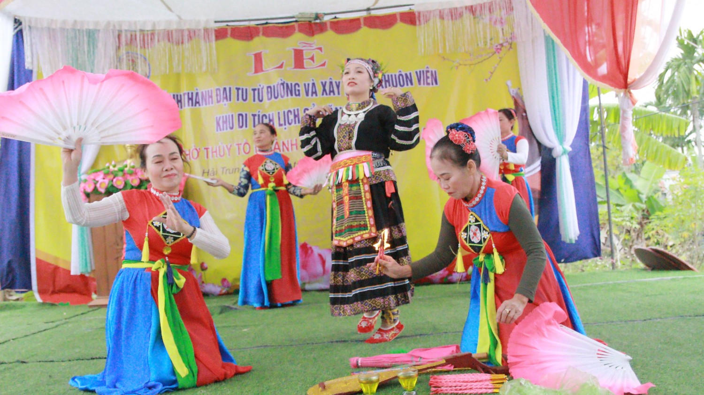

 

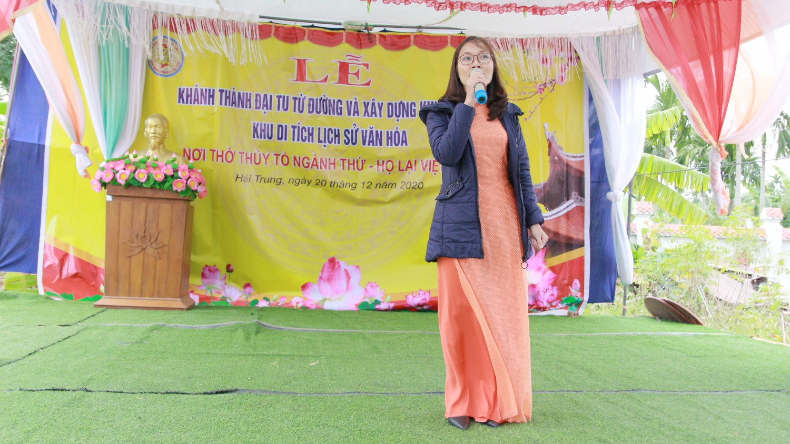

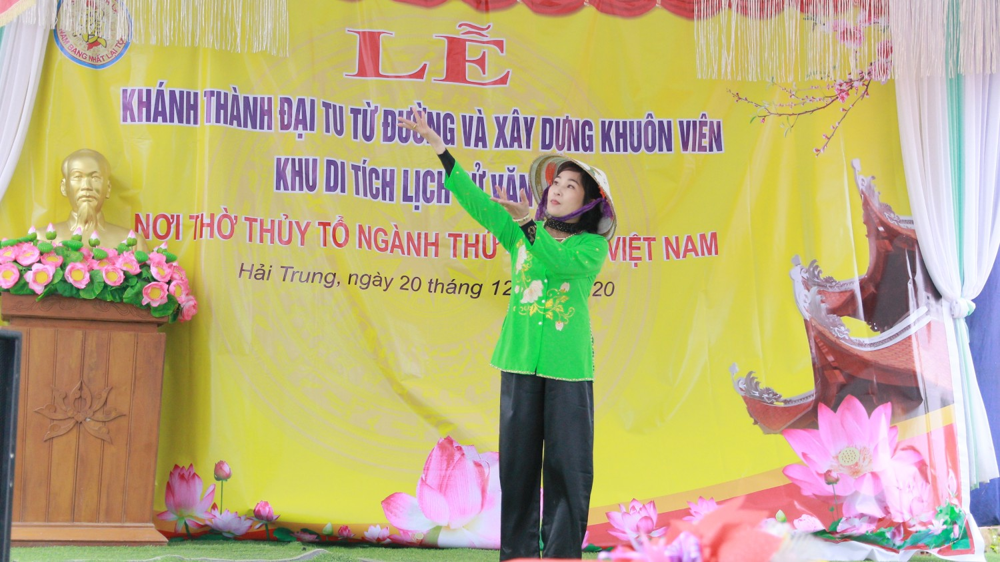

 

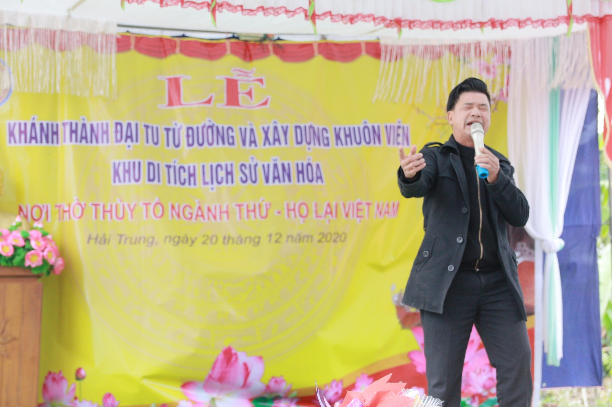

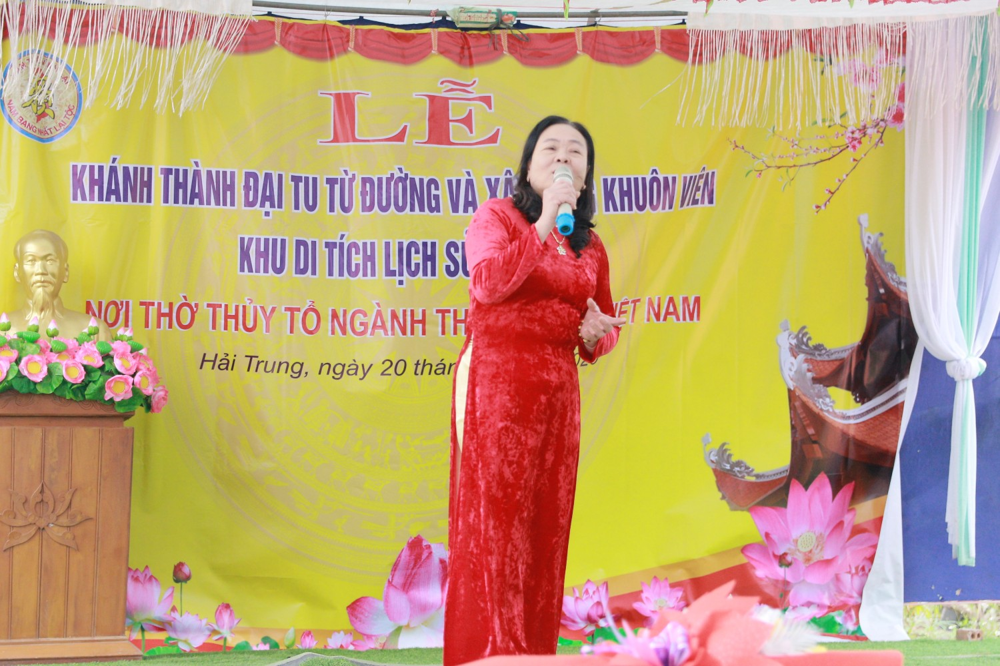
