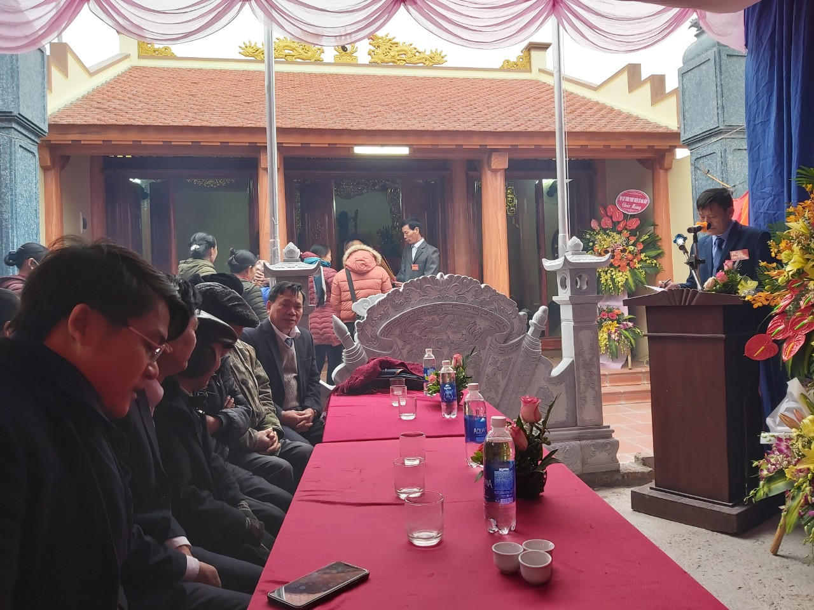
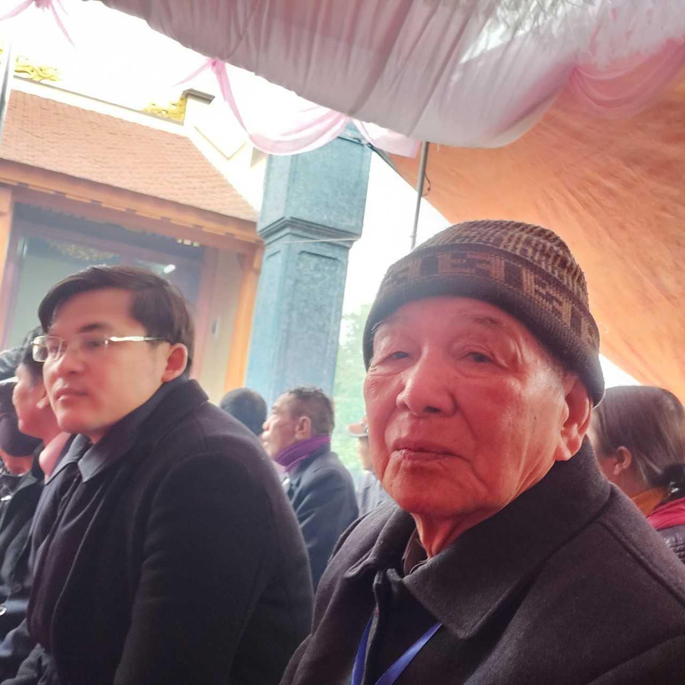
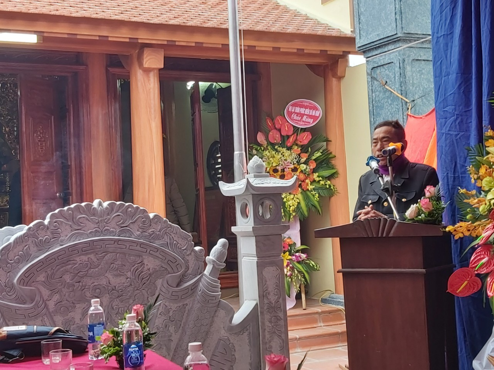
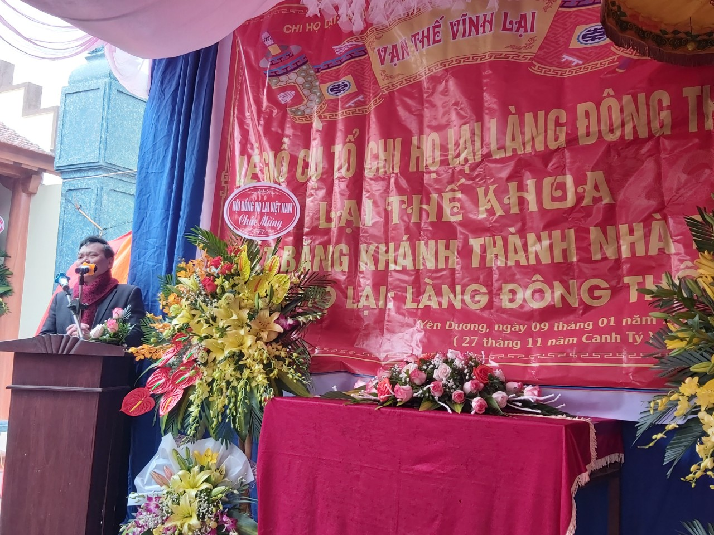
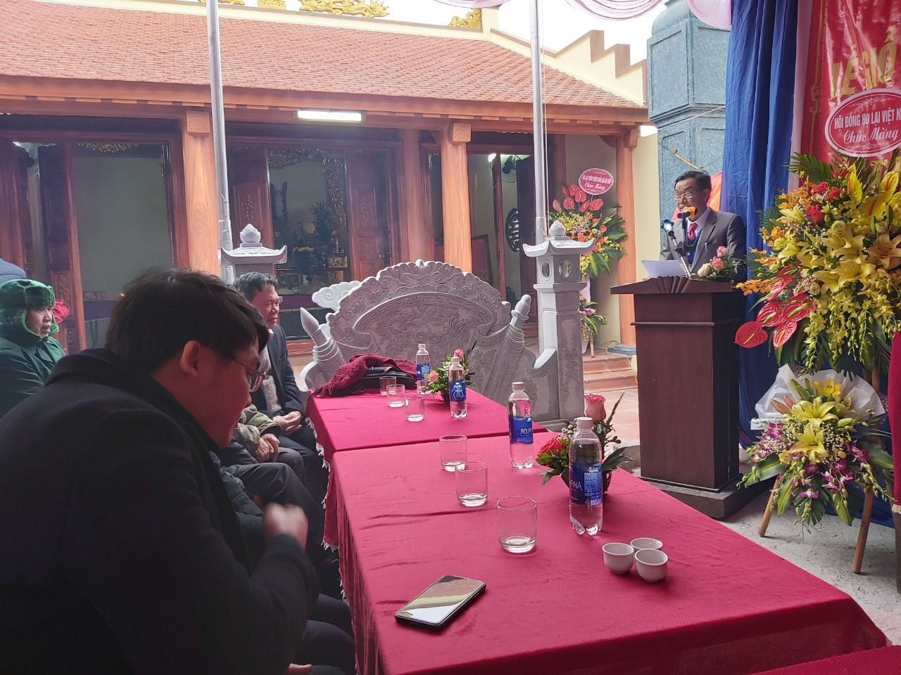
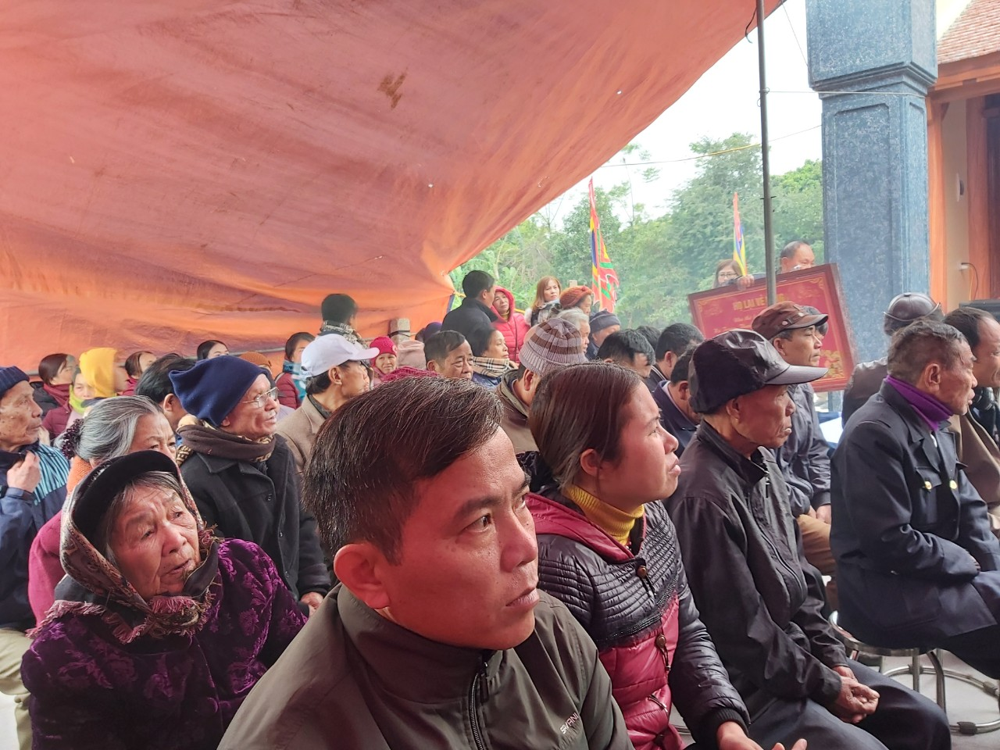

Về dự buổi lễ ngoài con cháu họ Lại trong chi còn có đại diện của Đảng ủy, Ủy ban nhân dân và các đoàn thể xã Yên Dương và đặc biệt còn có hội đồng gia tộc Họ Lại Việt Nam do cụ Lại Thế Tác làm trưởng đoàn về tham dự cùng đại diện các tổ chức trực thuộc hội đồng gia tộc như, ban truyền thông do bác Lại Xuân Cương đại diện về tham dự, ban liên lạc thanh niên Họ Lại, Hội Doanh Nhân Lại Việt...

**Ông Lại Thế Tác, Chủ tịch HĐGT về tham dự**

**Ông Lại Thế Lịch, đại diện chi Họ Lại Hải Hậu Nam Định về tham dự**

**Ông Lại Văn Quán, Ủy viên HĐGT phát biểu trong buổi lễ**

**Ông Lại Quốc Tuấn, Ủy viên HĐGT phát biểu trong sự kiện**

**Cộng đồng con cháu các chi họ Lại về tham dự buổi lễ**

Ngoài ra, còn có đại diện các chi họ lại tại Hà Nam, Ninh Bình, Thái Bình, Bắc Ninh cũng đã về tham dự, chia vui trong buổi lễ và thắp nén nhanh thơm tri ân công đức tiên tổ.
