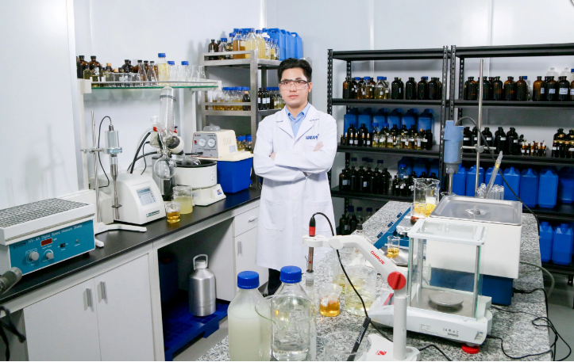
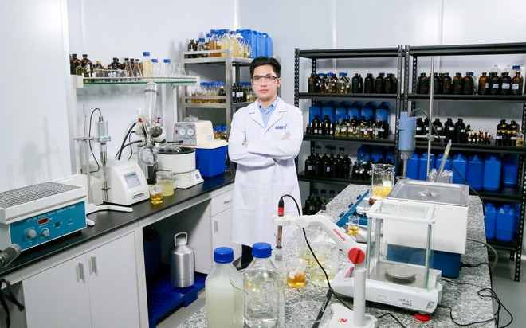
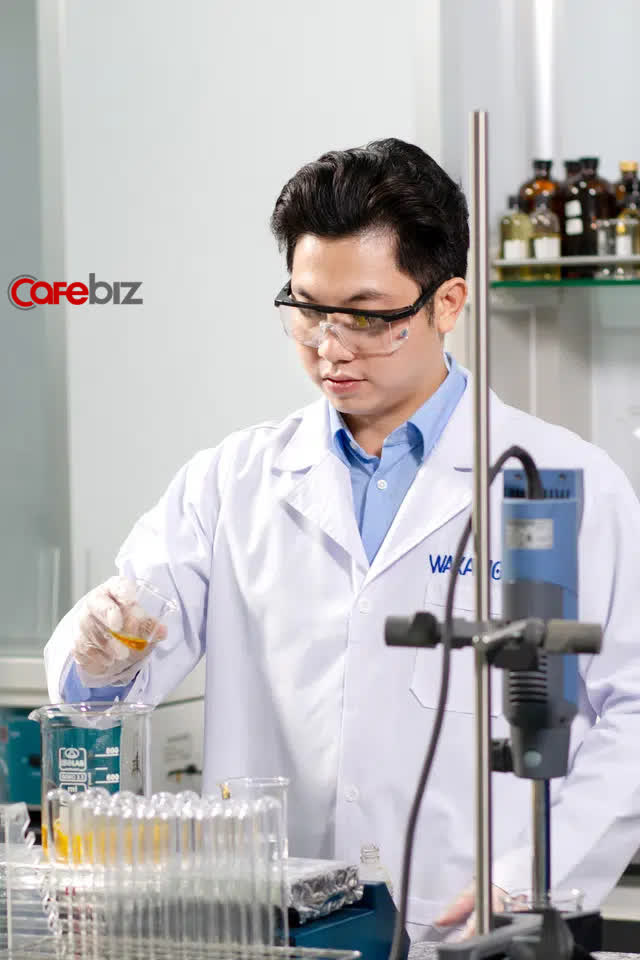
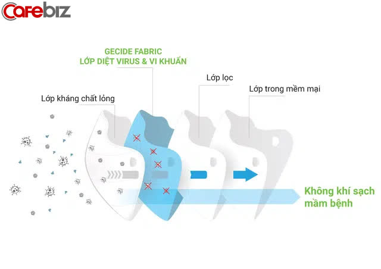
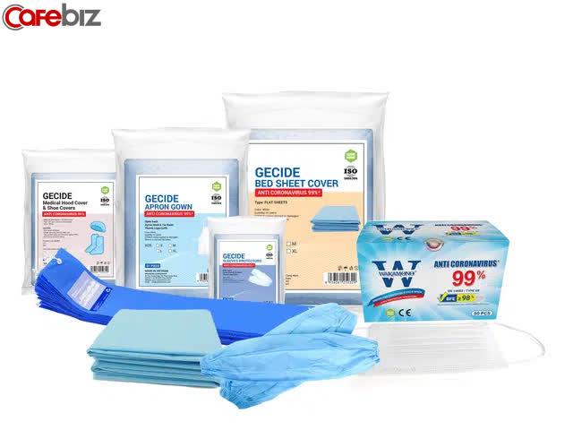
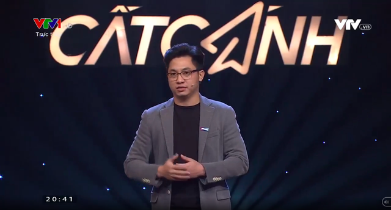

 **Khẩu trang y tế diệt virus corona 99% đầu tiên trên thế giới**

Thế giới đang chứng kiến đợt bùng phát nặng nề dịch bệnh do các biến thể mới của virus Corona gây ra, nhu cầu về khẩu trang và trang thiết bị bảo hộ y tế tăng cao khắp toàn cầu.

Chỉ tính riêng 2 tháng đầu năm 2021, hơn 10 triệu chiếc khẩu trang Wakamono - khẩu trang y tế diệt virus Corona lên đến 99% đầu tiên trên thế giới và đã được CE của Châu Âu công nhận và cho phép ghi trên nhãn hộp đã được xuất khẩu vào các thị trường khó tính như Bồ Đào Nha, Ý, Úc, NZ, Mỹ.

Nhiều người tỏ ra bất ngờ khi biết rằng, sản phẩm này được phát minh, sáng tạo bởi người Việt.

Theo tìm hiểu của chúng tôi, để xúc tiến và bán thành công vào các thị trường khó tính trên, doanh nghiệp Việt phải vượt qua các hàng rào kỹ thuật của từng quốc gia.

Đặc biệt đây là một sản phẩm công nghệ mới, chưa từng có trên thế giới, 100% do người Việt Nam phát minh ra và làm chủ công nghệ từ sản xuất nguyên liệu đến ra thành phẩm, sản xuất ngay tại Việt Nam và đã được đăng ký bảo hộ tại Mỹ. Thế nhưng, những điều phi thường ấy được Wakamono -công ty Công nghệ thành lập năm 2010 tại Việt Nam làm được!

 

*Ông Lại Nam Hải - Chủ tịch hội đồng quản trị và là người phát minh khẩu trang Wakamono*

Theo AZOnano, một tờ báo công nghệ hàng đầu tại Anh, khẩu trang tiêu chuẩn N95 có thể lọc ra 95% hạt có kích thước xấp xỉ 0,3 micron. Tuy nhiên, virus corona có kích thước xấp xỉ 0,05 - 0,2 micron. Người dùng luôn được khuyến cáo rằng không nên chạm vào bề mặt khẩu trang để tránh nhiễm bẩn cho cả hai mặt.

Các vi sinh vật gây bệnh bám dính hoặc mắc kẹt trên bề mặt khẩu trang vẫn còn sống và lây nhiễm. Theo nghiên cứu coronavirus tồn tại đến bảy ngày trên khẩu trang dùng một lần.

Các nhà khoa học tại Wakamono đã phát triển khẩu trang y tế với đặc tính kép, vừa có khả năng lọc các mầm bệnh có hại, vừa có khả năng tiêu diệt virus bằng lớp vải có phủ hợp chất bionano diệt virus độc quyền do chính Wakamono sản xuất trong cấu trúc 4 lớp của khẩu trang.

 

")

(Cấu trúc khẩu trang Wakamono bao gồm lớp vải diệt virus và lớp lọc khác, nguồn: AZOnano)

Đặc biệt, gần đây các biến thể chủng Coronavirus được phát hiện tại Anh, Pháp, Đức và một số nước khác với khả năng lây nhiễm cao hơn từ 50 -70% so với chủng vi rút ban đầu khiến tình trạng dịch bệnh trở nên phức tạp.

Khẩu trang Wakamono đã được kiểm nghiệm và chứng minh hiệu quả tiêu diệt các loại virus bao gồm vi rút màng bọc như virus cúm (influenza virus) H1N1 và virus không màng bọc như virus bại liệt như Polio loại I (Poliovirus-I), đặc biệt là tiêu diệt chủng virus Corona lên đến 99% ngay khi tiếp xúc.

Đây được xem như là bằng chứng về khả năng tiêu diệt tất cả các biến thể của Human Coronavirus.

Hiệu quả tiêu diệt virus của khẩu trang đã được kiểm tra và chứng nhận bởi các phòng thí nghiệm độc lập có uy tín và đáng tin cậy theo tiêu chuẩn ISO 18184: 2019. Ngoài ra, khẩu trang Wakamono đạt tiêu chuẩn cao nhất theo FDA Hoa Kỳ ASTM F2100 cấp 3 và CE EN 14683 Loại IIR của Châu Âu.

Việc sử dụng khẩu trang diệt virus corona 99% của Wakamono có thể làm giảm đáng kể tỷ lệ lây nhiễm vì nó sẽ giảm lây truyền vi rút một cách hiệu quả. Do đó, sự phát triển này có thể hoạt động như một công cụ tiềm năng để chống lại đại dịch COVID-19.

**Hướng mở cho cơ hội bước vào thị trường tỷ đô**

Ông Lại Nam Hải - Chủ tịch hội đồng quản trị và là người phát minh khẩu trang Wakamono cho biết, việc phát minh chính trong chiếc khẩu trang Wakamono là tích hợp hợp chất Bionano từ thiên nhiên được đặt tên là Gecide có khả năng diệt các loại vi rút và vi khuẩn trên 99 % ngay khi tiếp xúc được ứng dụng từ Công nghệ Nano Biotech – An toàn sinh học.

Bên cạnh đó, hợp chất này không chỉ ứng dụng vào việc phủ lên khẩu trang mà còn mở ra rất nhiều ứng dụng khác không chỉ trong các sản phẩm kháng khuẩn và diệt khuẩn trong y tế bao gồm áo choàng phẫu thuật, khăn lau.., mà còn trong nông nghiệp, xử lý môi trường, trong ngành hóa mỹ phẩm, thực phẩm và thuốc trong tương lai.

Theo Fortune business insights thì tổng thị trường thế giới về Medical clothing market là 63,3 tỷ đô la trong năm 2019 dù chưa có đại dịch COVID-19 diễn ra, và dự báo sẽ đạt 99,9 tỷ đô la vào năm 2027.

Rõ ràng, thị trường màu mỡ, nhiều tiềm năng, tuy nhiên, với tính chất đặc thù không chỉ đầu tư về vốn hoặc chiến lược marketing, yếu tố quyết định cuối cùng vẫn là công nghệ nào đáp ứng được các quy chuẩn về hàng rào kỹ thuật của quy định của từng quốc gia.

 

*Các sản phẩm medical clothing trên thị trường*

Ông Hải cũng cho biết thêm: "Để có được kết quả bán thành công sản phẩm vào thị trường Châu Âu và các nước khác là 1 điều không dễ dàng, dù chúng tôi có đầy đủ giấy tờ kiểm định và cấp phép của CE. Nhưng, khi khắc tới nơi sản xuất và phát minh ra công nghệ này là Việt Nam, không ít đối tác hoài nghi.

Thế nhưng, bằng lòng tự tôn dân tộc cùng niềm tin lớn, chúng tôi đã gửi mẫu, các phương pháp kiểm nghiệm và mẫu thử sản phẩm. Cuối cùng, họ tỏ ra ngỡ ngàng là tại sao có thể nghĩ ra một ý tưởng đơn giản mà hiệu quả như vậy. Chúng tôi đã vượt qua mọi kiểm nghiệm khắt khe nhất tại đất nước của họ như vậy!

Tại Việt Nam, giá thành sản phẩm rẻ hơn 40% giá thị trường thế giới với chất lượng tương đương. Đó là 1 lời cám ơn và biết ơn vì mình được sinh sống tại mảnh đất giàu tinh thần đùm bọc, thương yêu nhau, nhất là trong hoạn nạn, khó khăn".

 

")

*Ông Lại Nam Hải xuất hiện trong Gala Cất Cánh (Ảnh chụp từ màn hình)*

Xuất hiện trong Gala Cất Cánh, trước phát minh khẩu trang diệt y tế diệt Virus Corona mang tên Wakamono, giáo sư Sinh học, Nhà giáo Nhân dân Nguyễn Lân Dũng bày tỏ: "Chúng ta cũng biết rằng virus rất nhỏ, để làm được việc chống virus là quá khó, mà lại còn là người Việt Nam trong điều kiện nghiên cứu không có nhiều.

Thế nhưng mà anh đã làm được quá giỏi và làm cho hai tiếng – Việt Nam nổi bật trên thế giới trong giai đoạn chống COVID-19. Tôi thấy rất cảm phục và tin tưởng các nhà khoa học trẻ Việt Nam, có nhiều nhà khoa học sẽ cống hiến lớn cho thế giới."

Hay, Bác sĩ, Phó giáo sư, Tiến sĩ Y khoa, Giám đốc bệnh viện Đại Học Y Hà Nội Nguyễn Lân Hiếu chia sẻ: "Đây là một phát kiến rất đột phá và tôi rất mong muốn các bác sĩ, điều dưỡng có thể sử dụng phương tiện này.

Nếu có thể, đây là một chất phủ mà chúng ta có thể nhân rộng ra, không chỉ khẩu trang, mà có thể làm mũ y tế, quần áo y tế, thậm chí là những phương tiện trên người bệnh nhân... ".

Một hướng phát minh chỉ trong vòng 90 ngày đã giải quyết và khắc phục hầu hết các vấn đề của khẩu trang trong đại dịch, nghe có vẻ giản đơn, nhưng đằng sau đó là những đêm miệt mài không nghỉ, là ý trí quyết tâm cao độ trong bối cảnh thiếu thốn trang thiết bị, cùng với sự cộng hưởng của 10 năm đầu tư kỹ lưỡng nghiên cứu khoa học và trên hết là ý trí của một thế hệ người Việt trẻ, mong muốn cống hiến cho đất nước.

Theo Doanh nghiệp và Tiếp thị
