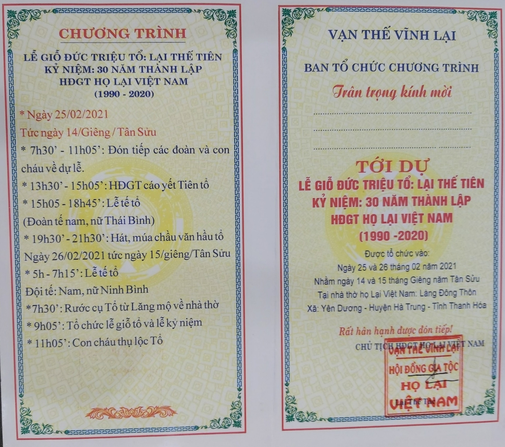

| **BAN THÔNG TIN TRUYỀN THÔNG**    **HỌ LẠI VIỆT NAM**    __________ | **CỘNG HÒA XÃ HỘI CHỦ NGHĨA VIỆT NAM**      **Độc Lập – Tự Do – Hạnh Phúc**  **________________________________________** |
| --- | --- |
| Số: 01/TB/BTTTT | *Thanh Hóa, ngày 15 tháng 02 năm 2021* |

**THÔNG BÁO**  **NỘI DUNG NGHỊ QUYẾT CỦA HỘI ĐỒNG GIA TỘC HỌ LẠI VIỆT NAM**  **VỀ VIỆC TỔ CHỨC LỄ GIỖ ĐỨC TRIỆU TỔ NĂM 2021**

_________________________

Ngày 15 tháng 02 năm 2021 tại xã Hà Dương (nay là xã Yên Dương), huyện Hà Trung, tỉnh Thanh Hóa, Ban Thường trực Hội đồng gia tộc Họ Lại Việt Nam (viết tắt là Ban Thường trực HĐGTHLVN) đã họp thống nhất công tác tổ chức giỗ Đức Triệu Tổ Họ Lại Việt Nam năm 2021. Chủ tịch HĐGT ông Lại Thế Tác chủ trì phiên họp; ông Lại Xuân Đức Ủy viên Ban Thường trực HĐGTHLVN làm thư ký. Sau khi đã thảo luận nội dung chỉ đạo của chính quyền địa phương liên quan đến phòng, chống dịch COVID - 19 bùng phát lại trong cộng đồng, Chủ tịch HĐGT Lại Thế Tác kết luận 02 nội dung, phiên họp đã biểu quyết ban hành Nghị quyết để làm căn cứ triển khai thực hiện, giao Ban Thông tin truyền thông Họ Lại Việt Nam thông báo Nghị quyết đến các chi họ và các tổ chức thuộc HĐGTHLVN biết, thực hiện.  Thực hiện Nghị quyết của HĐGT, Ban TTTT xin thông báo cụ thể 02 nội dung như sau:  **I. Một số thay đổi trong công tác tổ chức giỗ Đức Triệu Tổ Lại Thế Tiên (Giấy mời đề ngày 12 tháng 02 năm 2021 đã gửi các chi họ ...) trong mùa dịch covid để đảm bảo sức khỏe của cộng đồng con cháu về dâng hương kính tổ:**  1. Không tổ chức Lễ kỷ niệm 30 năm thành lập HĐGTHLVN.  2. Không tổ chức rước kiệu, múa lân.  3. Không tổ chức tế, văn nghệ.  **II. Về công tác tổ chức giỗ Đức Triệu Tổ Lại Thế Tiên năm nay hội nghị thống nhất**  1. Ngày 10 tháng 01 năm 2021 (âm lịch) Ban Thường trực HĐGTHLVN triển khai công tác chuẩn bị, các ban khác tổ chức, thực hiện công việc như hàng năm.  2. Ngày 14 và 15 tháng 01 năm 2021 (âm lịch) đón các đoàn về dâng hương kính Tổ. Các đoàn về tham dự thực hiện nghiêm việc đeo khẩu trang và giữ khoảng cách quy định theo sự hướng dẫn của Ban tổ chức khi vào dâng hương kính Tổ.  3. Ban Tổ chức chuẩn bị khẩu trang, dung dịch sát khuẩn tay cho cộng đồng con cháu về kính Tổ.  Ban Thông tin truyền thông Họ Lại Việt Nam xin thông báo để các chi họ, các tổ chức thuộc HĐGTHLVN biết, thực hiện./.

 

| ***Nơi nhận:***    - Chủ tịch, các PCT      HĐGTHLVN,    - Các TV HĐGTHLVN,    - Các chi họ, các tổ chức thuộc      HĐGTHLVN,    - Lưu: Ban TTTT. | **BAN THÔNG TIN TRUYỀN THÔNG**    **HỌ LẠI VIỆT NAM**    **TRƯỞNG BAN**			    *(Đã ký)*            **Lại Xuân Cương** |
| --- | --- |
