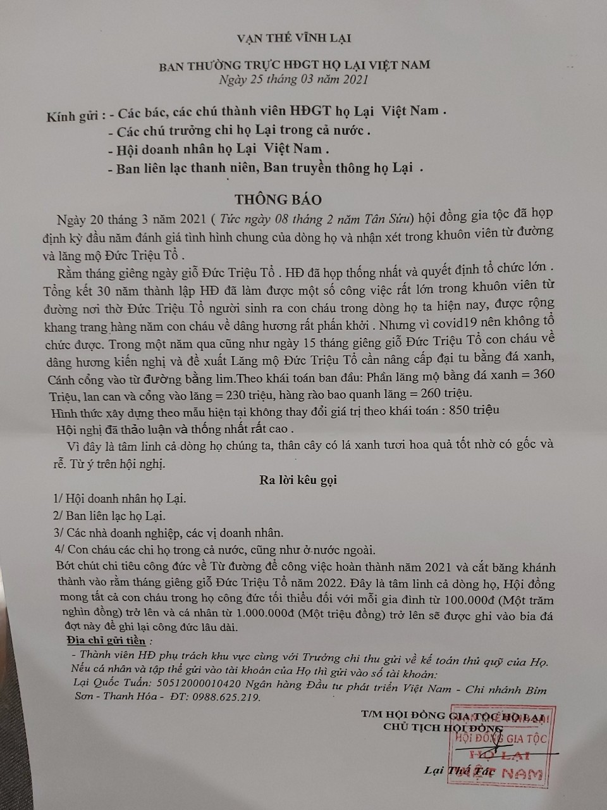

**VẠN THẾ VĨNH LẠI**  **BAN THƯỜNG TRỰC HĐGT HỌ LẠI VIỆT NAM**

*Ngày 25 tháng 03 năm 2021*

*Kính gửi:*

*- Các bác, các chú thành viên HĐGT họ Lại Việt Nam.*  *- Các chủ trưởng chi họ Lại trong cả nước.*   *- Hội Doanh nhân họ Lại Việt Nam.*   *- Ban liên lạc thanh niên, Ban truyền thông họ Lại .*  
 

**THÔNG BÁO**

Ngày 20 tháng 3 năm 2021 ( Tức ngày 08 tháng 2 năm Tân Sửu) hội đồng gia tộc đã họp định kỳ đầu năm đánh giá tình hình chung của dòng họ và nhận xét trong khuôn viên từ đường và lăng mộ Đức Triệu Tổ .   Rằm tháng giêng ngày giỗ Đức Triệu Tổ HĐ đã họp thống nhất và quyết định tổ chức lớn. Tổng kết 30 năm thành lập HĐ đã làm được một số công việc rất lớn trong khuôn viên từ đường nơi thờ Đức Triệu Tổ người sinh ra con cháu trong dòng họ ta hiện nay, được rộng khang trang hàng năm con cháu về dâng hương rất phấn khởi . Nhưng vì covid19 nên không tố chức được. Trong một năm qua cũng như ngày 15 tháng giêng giỗ Đức Triệu Tô con cháu về dâng hương kiến nghị và đề xuất Lăng mộ Đức Triệu Tổ cần nâng cấp đại tu bằng đá xanh, Cánh cổng vào từ đường bằng lim.Theo khái toán ban đầu: “Phần lăng mộ bằng đá xanh = 360 Triệu, lan can và cổng vào lăng = 230 triệu, hàng rào bao quanh lăng = 260 triệu. Hình thức xây dựng theo mẫu hiện tại không thay đổi giá trị theo khái toán: 850 triệu”. Hội nghị đã thảo luận và thống nhất rất cao.  Vì đây là tâm linh cả dòng họ chúng ta, thân cây có lá xanh tươi hoa quả tốt nhờ có gốc và rễ. Từ ý trên hội nghị.

**Ra lời kêu gọi**

1/Hội doanh nhân họ Lại.  2/Ban liên lạc họ Lại.   3/Các nhà doanh nghiệp, các vị doanh nhân.  4/Con cháu các chi họ trong cả nước, cũng như ở nước ngoài.   Bớt chút chi tiêu công đức về Từ đường để công việc hoàn thành năm 2021 và cắt băng khánh thành vào rằm tháng giêng giỗ Đức Triệu Tổ năm 2022. Đây là tâm linh cả dòng họ, Hội đồng mong tất cả con cháu trong họ công đức tối thiểu đối với mỗi gia đình từ 100.000đ (Một trăm nghìn đồng) trở lên và cá nhân từ 1.000.000đ (Một triệu đồng) trở lên sẽ được ghi vào bia đá đợt này để ghi lại công đức lâu dài.

***Địa chỉ gửi tiền :***

 *- Thành viên HĐ phụ trách khu vực cùng với Trưởng chi thu gửi về kế toán thủ quỹ của Họ. Nếu cá nhân và tập thể gửi vào tài khoản của Họ thì gửi vào số tài khoản:*

 *Lại Quốc Tuấn: 5051 2000010420 Ngân hàng Đầu tư phát triển Việt Nam - Chi nhánh Bim Sơn - Thanh Hóa - ĐT: 0988.625.219.*

 

**T/M HỘI ĐỒNG GIA TỘC HỌ LẠI**  **CHỦ TỊCH HỘI ĐỒNG**  

**Lại Thế Tác**  

 

