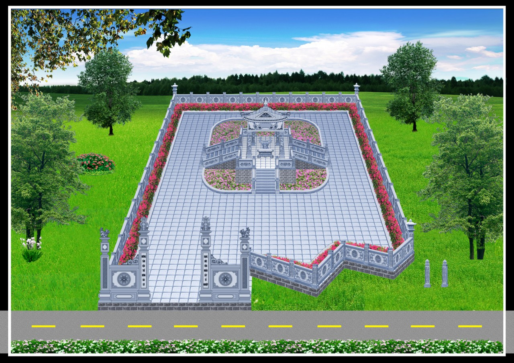
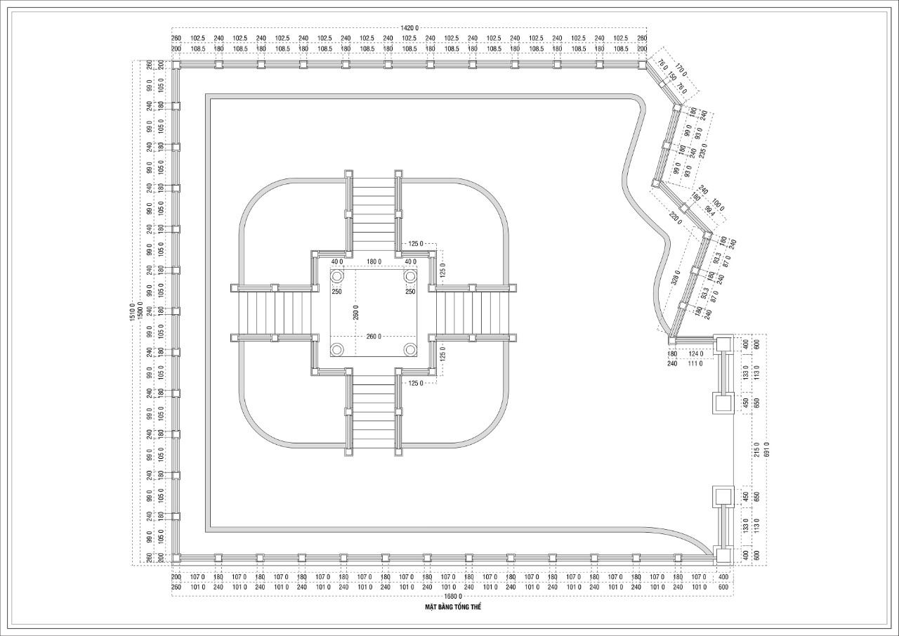
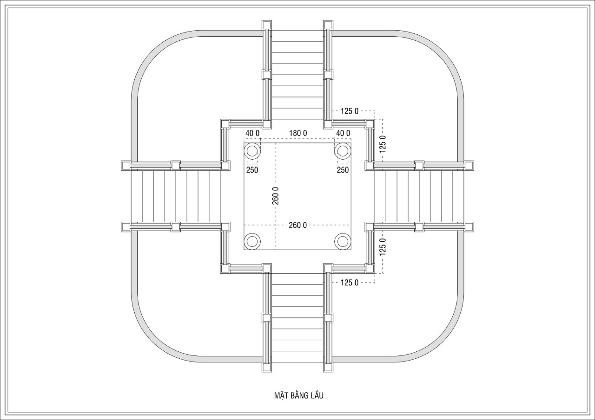
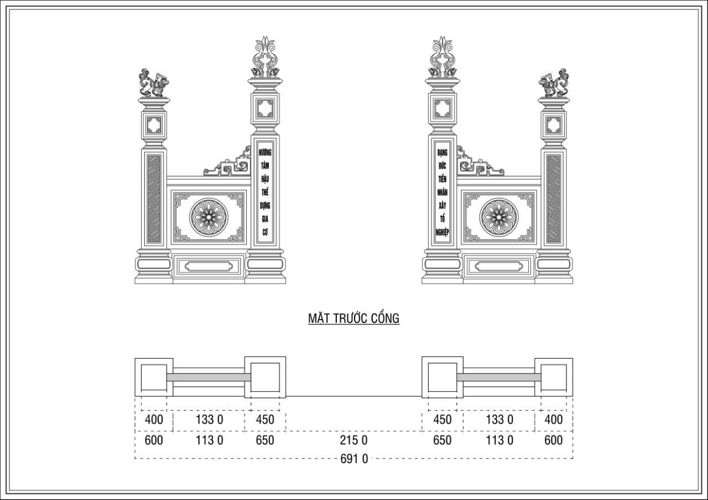
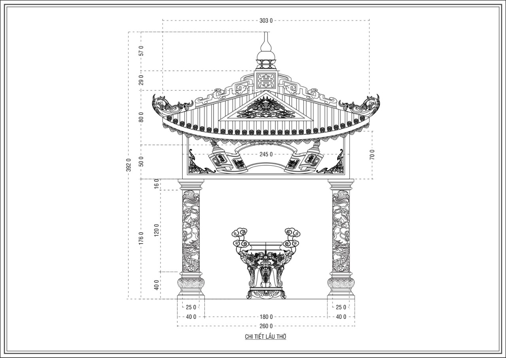
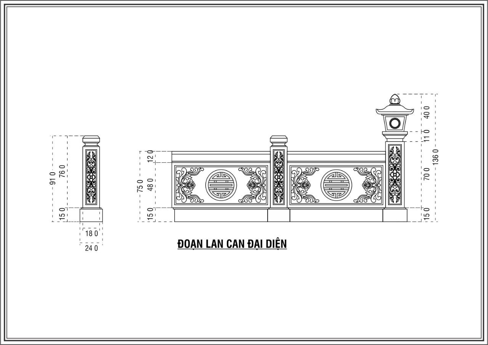
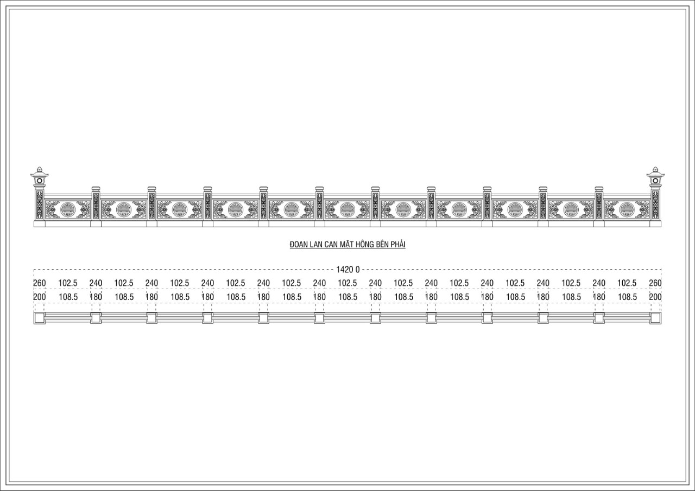
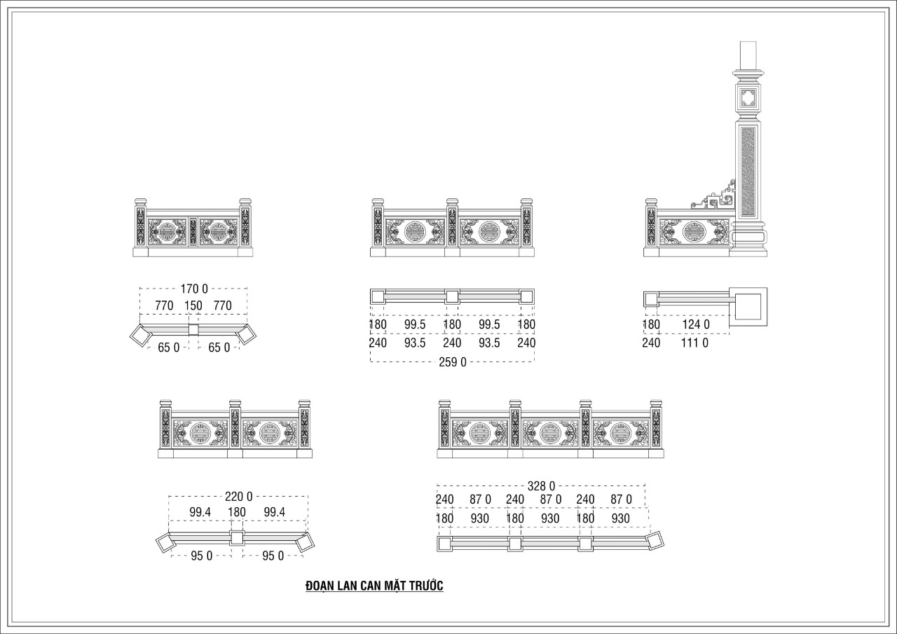
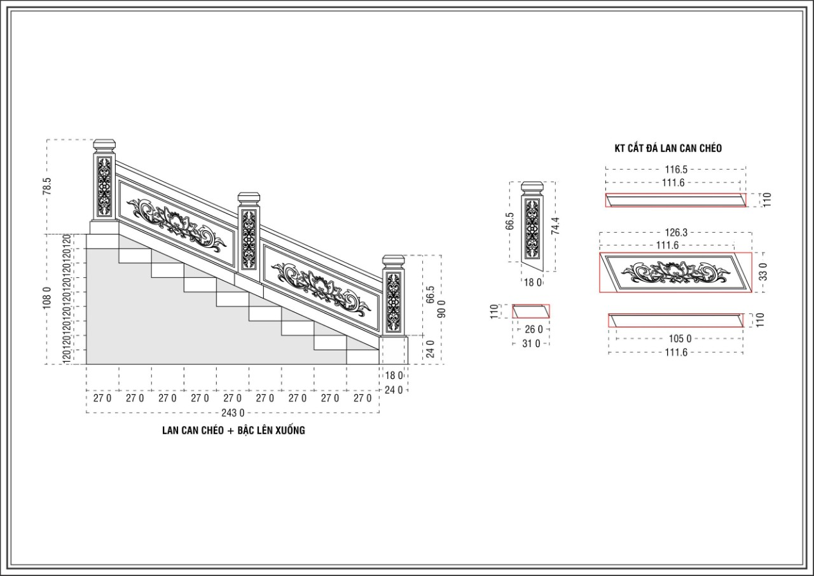

**Mặt bằng tổng thể**

*Mặt bằng lầu*

**Mặt Trước Cổng**

**Chi tiết lầu thờ**

**Đoạn lan can đại diện**

**Đoạn lan can mặt hông phải**

**Đoạn lan can mặt trước**

**Lan can chéo, bậc lên xuống**

**Phối cảnh 3D công trình cải tạo khuôn viên lăng mộ tổ**

Đứng trước một công việc có tính tâm linh và quan trọng mà con cháu xa gần dấy lên bao nỗi niềm suy ngẫm. Để làm được thì cần sự chung tay chung sức của tất cả con cháu, đó là quả phúc lớn lao mà nếu làm được tổ tiên trên cao cũng tự hào, ban phước lành cho hậu duệ chúng ta hôm nay và con cháu mai sau.  

HĐGT Họ Lại Việt Nam ra lời kêu gọi phát tâm công đức của những người con Họ Lại trên khắp mọi miền đất nước và trên thế giới hãy chung tay chung sức và chung lòng phát tâm công đức về vật chất,trí tuệ để hoàn thành công theo đúng kế hoặch ( khánh thành vào ngày 15/Tháng Giêng/ Năm 2022)  

**Mọi đóng góp xin vui lòng gửi về:  
- Ông Lại Quốc Tuấn (UVHĐGT họ Lại Việt Nam, Phó ban xây dựng)  
- STK: 50512000010420  
- Ngân hàng đầu tư và phát triển - chi nhánh Bỉm Sơn, Thanh Hóa  
- Nội dung CK: Công đức xây dựng Lăng Mộ tổ  
- Số ĐT liên hệ: 0988.625.219**
