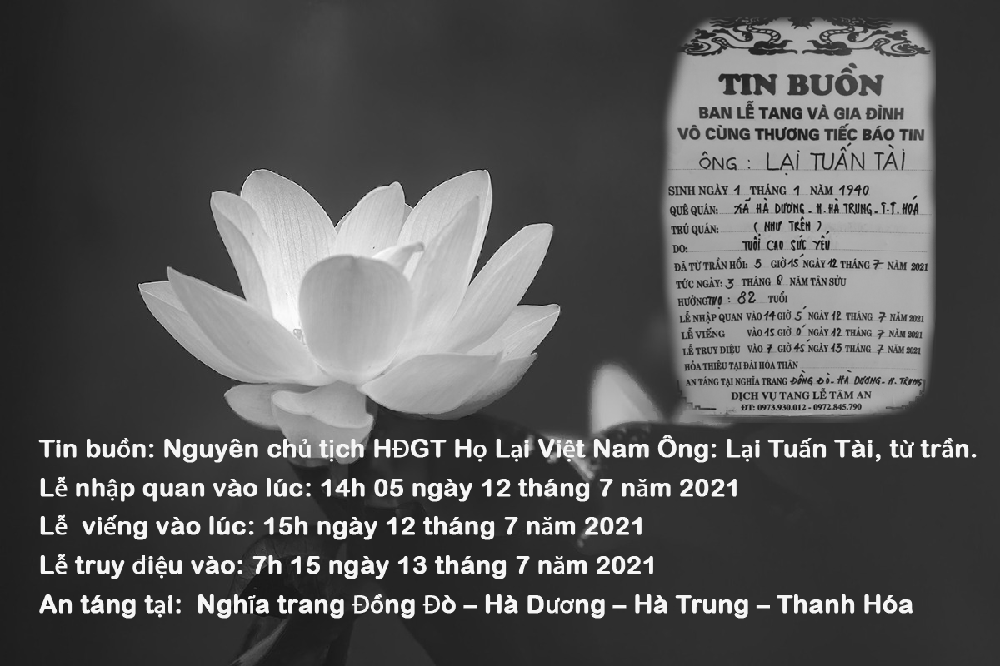

Hội đồng Gia tộc Họ Lại Việt Nam, Ban Thông tin truyền thông Họ Lại Việt Nam cùng gia đình vô cùng thương tiếc báo tin:  Ông Lại Tuấn Tài - Nguyên Chủ tịch HĐGT Họ Lại Việt Nam - Sinh ngày 01/01/1940 đã từ trần vào hồi 5 giờ 15 phút ngày 12 tháng 7 năm 2021 *(Tức ngày 03 tháng 6 năm Tân Sửu)* tại nhà riêng (Xã Hà Dương “nay là xã Yên Dương” – Huyện Hà Trung – Tỉnh Thanh Hóa), hưởng thọ 82 Tuổi.  - Lễ nhập quan vào lúc: 14h 05 ngày 12 tháng 7 năm 2021  - Lễ viếng vào lúc: 15h ngày 12 tháng 7 năm 2021  - Lễ truy điệu vào: 7h 15 ngày 13 tháng 7 năm 2021  - An táng tại: Nghĩa trang Đồng Đò – xã Hà Dương – huyện Hà Trung – tỉnh Thanh Hóa.  

Ông Lại Tuấn Tài đã tham gia Thành viên Hội đồng gia tộc họ Lại Việt Nam từ ngày đầu thành lập và đã được Hội đồng tín nhiệm bầu giữ chức Chủ tịch nhiệm kỳ (1992- 1998). Ông là người đã có nhiều công lao đóng góp trong việc xây dựng HĐGT trong những ngày đầu thành lập HĐGT và phát triển dòng họ. Do tuổi cao sức yếu, mặc dù đã được con cháu, gia đình tận tình chăm sóc nhưng Ông đã ra đi, về với Tiên tổ. Sự ra đi của Ông là niềm thương tiếc vô hạn không chỉ đối với gia đình mà còn của cả dòng tộc.  

**Kính thưa:   Hương hồn ông Lại Tuấn Tài!  Kính thưa: Gia đình tang quyến!  Kính thưa: Các cụ phụ lão, các vị trưởng chi cùng toàn thể cộng đồng con cháu có nguồn gốc họ Lại Việt Nam kính mến!**  Hiện nay, do dịch COVID 19 đang bùng phát trở lại trên toàn lãnh thổ Việt Nam, thực hiện nghiêm các chỉ thị của Đảng, Nhà nước trong việc dãn cách, phòng chống dịch bệnh, nên những người thân của gia đình, các tổ chức xã hội, dòng họ, con cháu có nguồn gốc họ Lại Việt Nam không thể về cùng gia đình tổ chức Tang lễ cho Ông được – Xin được chia buồn cùng gia đình.   Cầu cho vong linh ông được siêu sinh tịnh độ.
