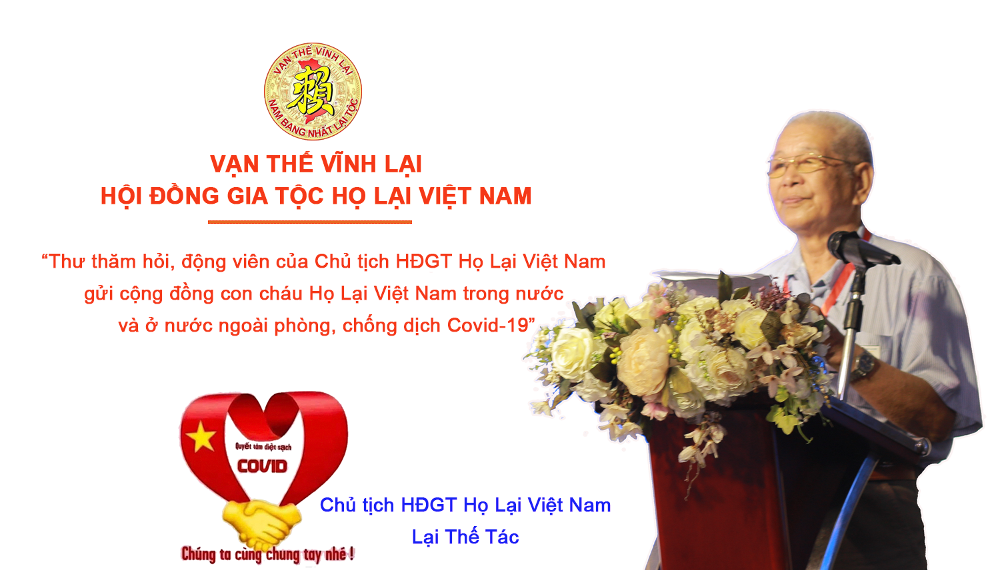

**VẠN THẾ VĨNH LẠI  HỘI ĐỒNG GIA TỘC HỌ LẠI VIỆT NAM**

__________

**Thư thăm hỏi, động viên của Chủ tịch Hội đồng gia tộc Họ Lại Việt Nam gửi cộng đồng con cháu Họ Lại Việt Nam trong nước và ở nước ngoài về phòng, chống dịch Covid-19**

Thưa cộng đồng anh em, con cháu  họ Lại Việt Nam trong nước và ở nước ngoài,  

Trong thời gian qua, trước những diễn biến phức tạp của tình hình dịch bệnh Covid-19, Đảng và Nhà nước ta đã có nhiều chỉ đạo về tăng cường công tác phòng, chống dịch, chăm lo đời sống, bảo vệ sức khoẻ nhân dân và phát triển kinh tế - xã hội; ban hành kịp thời nhiều chính sách hỗ trợ người dân và doanh nghiệp gặp khó khăn do ảnh hưởng bởi đại dịch Covid-19... HĐGT họ Lại Việt Nam cùng HĐGT các địa phương, ngành, chi họ, Ban trị sự; các tổ chức trực thuộc HĐGT họ Lại Việt Nam cũng đã chủ động, kịp thời thực hiện các biện pháp mạnh mẽ, quyết liệt theo chỉ đạo của Đảng và Nhà nước như giãn cách, cách ly xã hội, biện pháp 5K... để phòng, chống, ngăn chặn dịch bệnh, bước đầu đã thu được một số kết quả tích cực.  

Thay mặt Hội đồng gia tộc họ Lại Việt Nam, tôi nhiệt liệt hoan nghênh, biểu dương và đánh giá cao sự cố gắng, nỗ lực của cộng đồng anh em, con cháu họ Lại Việt Nam trong nước và ở nước ngoài đã phát huy truyền thống yêu nước, tinh thần đoàn kết, tương thân, tương ái đã đồng hành, ủng hộ, chung tay góp sức cùng đất nước, trong công tác phòng, chống dịch; biểu dương HĐGT các địa phương, ngành, chi họ, Ban trị sự; các tổ chức trực thuộc HĐGT họ Lại Việt Nam đã tích cực chăm lo đời sống, bảo vệ sức khoẻ cộng đồng anh em, con cháu họ Lại Việt Nam.  

Trong suốt chiều dài lịch sử dựng nước và giữ nước, người Họ Lại chúng ta với tình yêu nước nồng nàn, ý chí kiên cường và tinh thần chịu thương chịu khó, sẵn sàng đương đầu với thử thách đã đoàn kết cùng nhân dân cả nước chiến thắng mọi kẻ thù. Ngày nay, trước: “Giặc dịch Covid” qua báo, đài và tivi tôi được biết nơi tuyến đầu chống giặc mọi người đang nỗ lực, vất vả, mệt mỏi vả thậm chí là bị de dọa đến tính mạng, trong đó có rất nhiều thành viên là anh em, con cháu của cộng đồng họ Lại Việt Nam ta. Phát huy truyền thống quý báu trên, thay mặt Hội đồng gia tộc họ Lại Việt Nam, tôi tha thiết kêu gọi cộng đồng anh em, con cháu họ Lại Việt Nam trong nước và ở nước ngoài: Chúng ta đã cố gắng càng cố gắng hơn nữa; đã đoàn kết càng đoàn kết hơn nữa; đã quyết tâm càng quyết tâm cao hơn nữa; “Nam bang nhất Lại tộc” cùng cả nước muôn người như một, đồng lòng cùng Đảng, Chính phủ, các cấp, các ngành tìm mọi cách quyết ngăn chặn, đẩy lùi bằng được, không để dịch lan rộng, bùng phát trong cộng đồng.  

Tôi yêu cầu HĐGT các địa phương, ngành, chi họ, Ban trị sự; các tổ chức trực thuộc HĐGT họ Lại Việt Nam phối hợp cùng các cấp ủy, tổ chức đảng, chính quyền, ban chỉ đạo phòng, chống dịch Covid-19, các cấp phải quyết liệt hơn nữa trong lãnh đạo, chỉ đạo; tập trung cao nhất công sức, thời gian, ưu tiên mọi nguồn lực; chủ động nắm chắc, kiểm soát tốt tình hình; tuyệt đối không được lơ là, chủ quan, không để bị động, bất ngờ trong ứng phó với diễn biến mới của dịch bệnh; linh hoạt, sáng tạo tổ chức thực hiện có hiệu quả công việc hệ trọng này.  

Tôi tin tưởng sâu sắc rằng, HĐGT các địa phương, ngành, chi họ, Ban trị sự; các tổ chức trực thuộc HĐGT họ Lại Việt Nam cùng cả nước góp sức, đồng lòng, thống nhất ý chí và hành động, cùng với sự giúp đỡ chí tình của cộng đồng anh em, con cháu họ Lại Việt Nam ta ở nước ngoài và bạn bè quốc tế, nhất định chúng ta sẽ chiến thắng đại dịch Covid-19 và phải chiến thắng cho bằng được, góp phần xứng đáng vào sự nỗ lực chung của toàn nhân loại vì một thế giới an toàn, lành mạnh, hoà bình, hữu nghị, hợp tác và thịnh vượng, xứng đáng với truyền thống anh hùng vẻ vang của Đất nước ta, Dân tộc ta trong đó có truyền thống “Nam bang nhất Lại tộc”!

                                                             
Lại Thế Tác  Chủ tịch Hội đồng gia tộc Họ Lại Việt Nam
