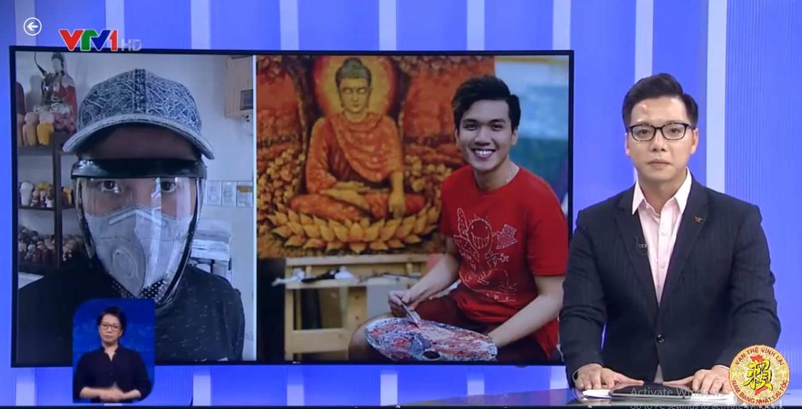

Trong suốt chiều dài lịch sử dựng nước và giữ nước, người Họ Lại chúng ta với tình yêu nước nồng nàn, ý chí kiên cường và tinh thần chịu thương chịu khó, sẵn sàng đương đầu với thử thách đã đoàn kết cùng nhân dân cả nước chiến thắng mọi kẻ thù.  

Ngày nay, trên mặt trận chống giặc Covid có rất nhiều anh em, con cháu của cộng đồng Họ Lại Việt Nam, mọi người đang nỗ lực, vất vả, mệt mỏi vả thậm chí là bị de dọa đến tính mạng. Chúng ta đã biết đến câu chuyện của Lại Nam Hải (Cha đẻ của khẩu trang diệt Virut 99% đầu tiên trên thế giới), và trong bản tin :" Việt Nam Hôm Nay" của đài VTV1 phát sóng vào lúc 17h30 ngày 3/8/2021 lại là 1 câu chuyện nữa về Lại Vũ Tuấn Anh, người bị F0 và đã tự vượt qua được dịch bệnh tại nhà bằng tinh thần lạc quan, bản lĩnh vững vàng, lối sống lành mạnh và ý chí nghị lực phi thường, không sợ dịch . Câu chuyện của Tuấn Anh đang truyền cảm hứng và niềm tin cho nhiều người trong bối cảnh dịch bệnh vẫn đang diễn biến hết sức phức tạp.  
 

[https://www.youtube.com/embed/lH8h7L7Y-ww](https://www.youtube.com/embed/lH8h7L7Y-ww)

**Nguồn video: VTV1  
Biên tập bài viết: Tony Lại**
