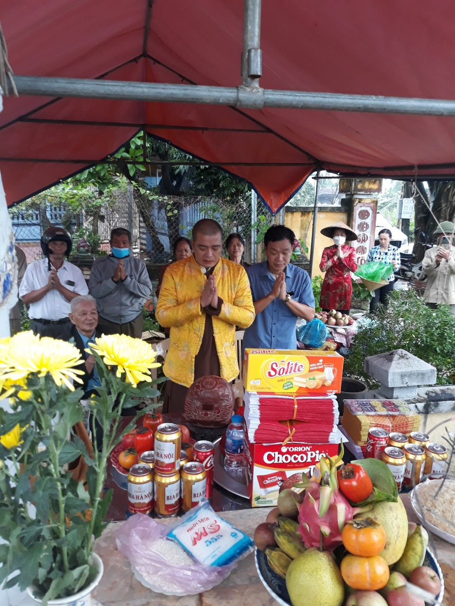
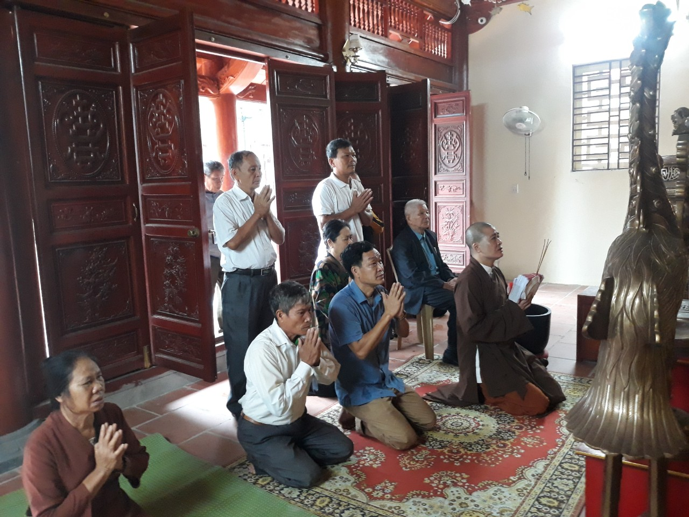
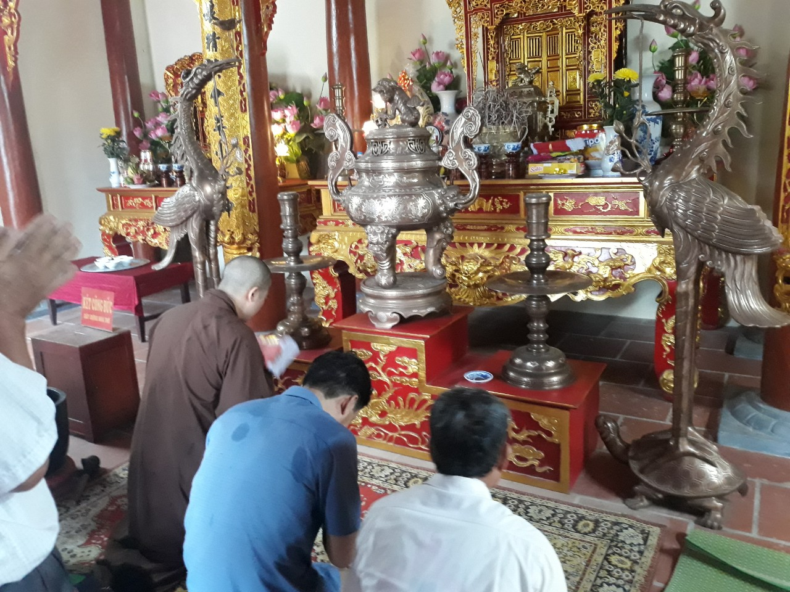
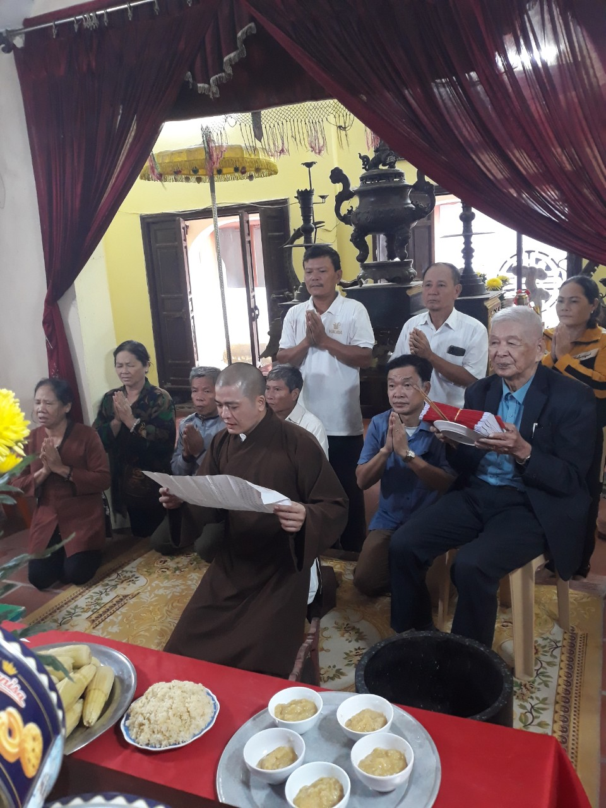
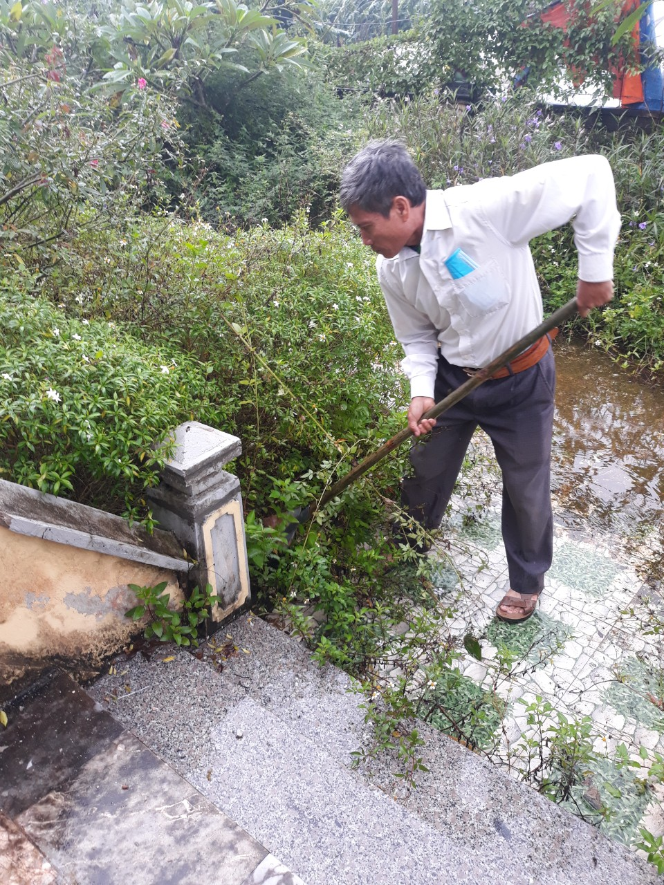
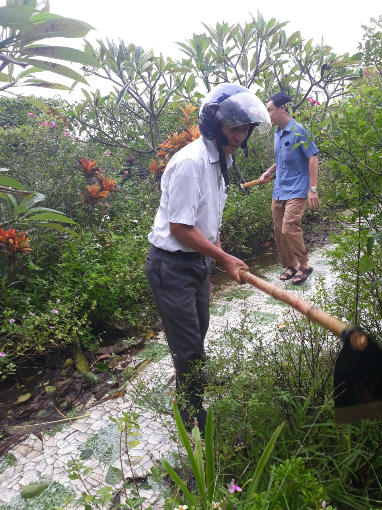

Thay mặt HĐGT, Thường trực HĐGT, ông Lại Thế Tác - Chủ tịch HĐGT chủ trì chỉ đạo Lễ Hạ Giải; Thượng Tọa Thích Thanh Độ (Thầy Lại Thế Đức) -Trụ trì Chùa Cảnh Phong, phường Lê Hồng Phong, thành phố Phủ Lý, tỉnh Hà Nam chủ trì hành Lễ Hạ Giải Lăng Mộ Tổ Lại Thế Tiên (tháp hương kính Tổ tại Nhà thờ Tổ). Đồng tham dự Lễ còn có các ông, bà đại diện lãnh đạo xã Yên Dương, huyện Hà Trung, tỉnh Hóa, Ban Thường trực HĐGT, Ủy viên HĐGT và các ông, bà... Chi họ Lại thôn Đông.  

***Một số hình ảnh tổ chức hành Lễ Hạ Giải Lăng Mộ Tổ Lại Thế Tiên:***

 

 

     

 

 

 

