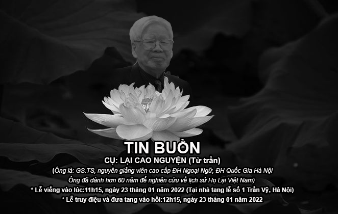

*Nhà giáo Lại Cao Nguyện - một trong “Tứ trụ” thư pháp Việt Nam**,* Nguyên giảng viên cao cấp khoa Trung, ĐH Ngoại Ngữ, ĐH Quốc Gia Hà Nội. Sau 64 năm công tác trong ngành sư phạm cho đến ngày nghỉ hưu, ông đã cống hiến gần cả cuộc đời cho ngành giáo dục và đã được nhận nhiều bằng khen, huy hiệu, huy chương và huân chương cao quý.  - Bằng khen của Bộ trưởng Bộ Giáo dục Nguyễn Văn Huyên 2 năm học 1953 - 54, 1054 - 55 về thành tích học tập và công tác;  - Bằng khen Chiến sĩ thi đua năm 1960,1961 1967, 1075;  - Huân chương Kháng chiến chống Pháp hạng ba;  - Huân chương Kháng chiến chống Mỹ cứu nước hạng nhất;  - Bằng khen của Bộ trưởng Bộ Giáo dục về thành tích nghiên cứu khoa học và bồi dưỡng cán bộ 5 năm 1975 - 1980;  - Huy hiệu vì sự nghiệp giáo dục 1995;  - Huy hiệu vì sự nghiệp Đại học Quốc gia Hà Nội 1996;  - Kỷ niệm chương vì sự nghiệp Unesco năm 2008;  - Huy hiệu 40, 50, 60, 65,70 năm tuổi Đảng.  

Đối với họ Lại Việt Nam, một dòng họ tự hào là “Nam bang nhất Lại”, nghĩa là cả nước Nam chỉ có một họ Lại, Ông Lại Cao Nguyên đã có hơn 60 năm hướng về dòng họ, ông đã đóng góp công sức trong việc nghiên cứu, sưu tầm, quy tập, lập danh sách, của hàng trăm chi họ Lại trên toàn quốc, tổ chức hội thảo, viết sách, nghiên cứu về nguồn gốc, lịch sử phát triển, công tích chống ngoại xâm và xây dựng đất nước của các danh nhân họ Lại đối với đất nước trong suốt chiều dài lịch sử dựng nước và giữ nước. Đặc biệt là ông tham gia viết Phả họ Lại sửa đổi năm 1990.  

Do tuổi cao sức yếu, mặc dù đã được con cháu, gia đình tận tình chăm sóc nhưng Ông đã ra đi, về với Tiên tổ. Sự ra đi của Ông là niềm thương tiếc vô hạn không chỉ đối với gia đình mà còn của cả dòng tộc.  

*Kính thưa:   Hương hồn ông Lại Cao Nguyện!  Kính thưa: Gia đình tang quyến!  Kính thưa: cộng đồng con cháu có nguồn gốc họ Lại Việt Nam kính mến!*  

Hiện nay, do dịch COVID 19 đang bùng phát trên toàn lãnh thổ Việt Nam, thực hiện nghiêm các chỉ thị của Đảng, Nhà nước trong việc phòng chống dịch bệnh, nên nhiều người thân của gia đình, các tổ chức xã hội, dòng họ, con cháu có nguồn gốc họ Lại Việt Nam không thể về cùng gia đình tổ chức Tang lễ cho Ông được – Xin được chia buồn cùng gia đình.  

Cầu cho vong linh ông được siêu sinh tịnh độ.
