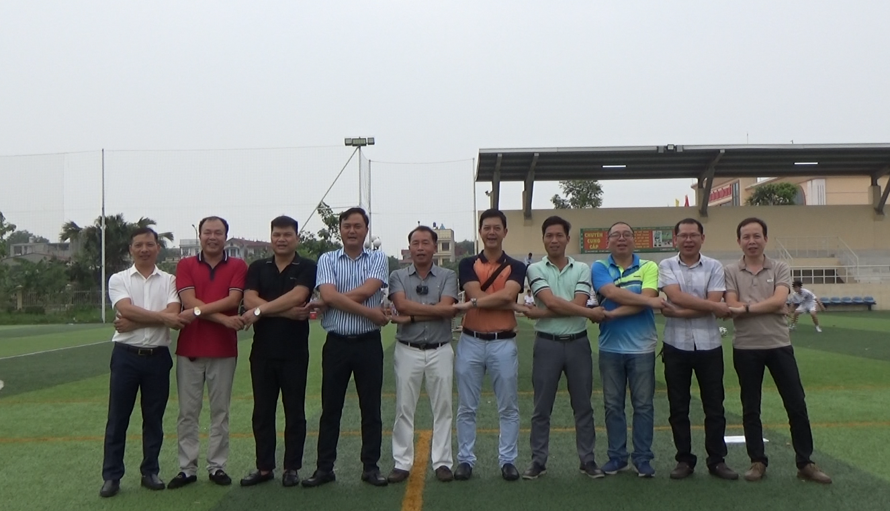
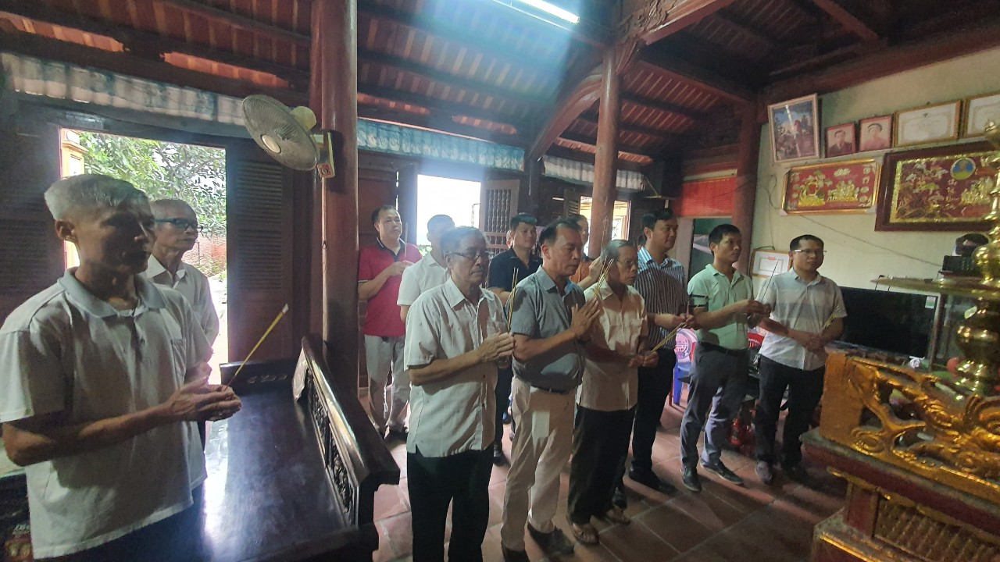
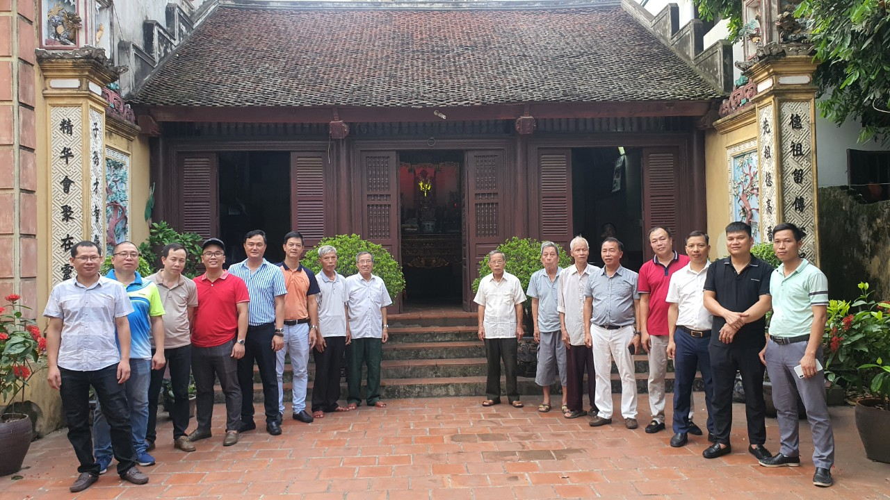
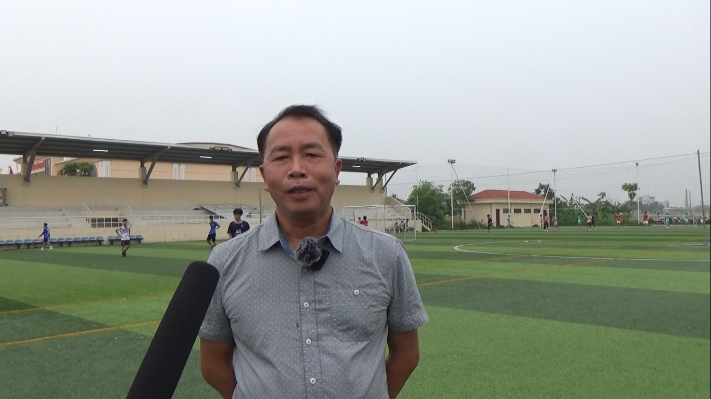
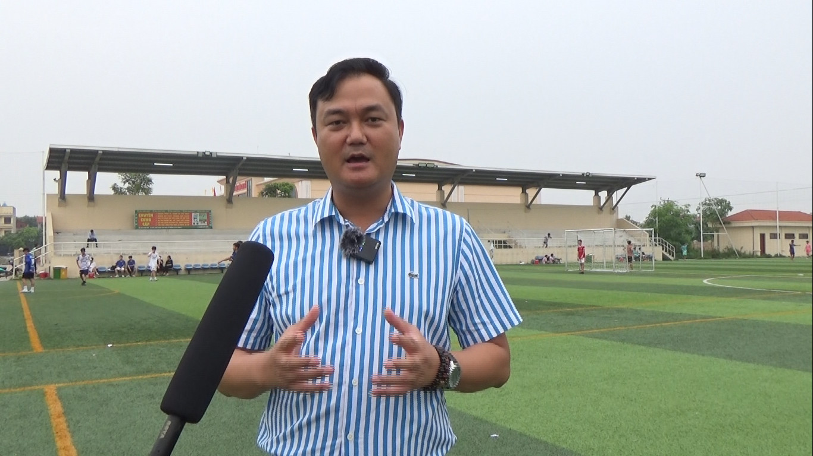
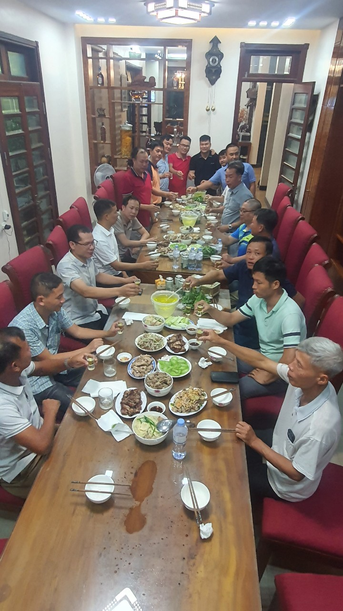

Đoàn BTC tham gia công tác khảo sát bao gồm: Ông Lại Trọng Tâm (Trưởng ban chỉ đạo), Ông Lại Mạnh Quân (Trưởng BTC), Ông Lại Hoàng Dương (Phó BTC), Ông Lại Văn Đức (Phó ban tài chính), Ông Lại Thế Long (Phó ban truyền thông), Ông Lại Duy Tuân (Phó ban hậu cần), Ông Lại Đắc Tuyền (Trưởng tiểu ban Cờ Tướng, Ban hậu cần tỉnh Bắc Ninh), Ông Lại Văn Tư (Trưởng tiểu ban xin tài trợ), Ông Lại Thành Trung (Trưởng tiểu ban Kéo co), Ông Lại Mạnh Tuấn (Trưởng tiểu ban Cầu Lông), Ông Lại Văn Bính (Trưởng tiểu ban Tennis), Cùng các uỷ viên trong BTC và các cụ các ông trong chi Họ Lại Tân Chi cũng đã tham gia công tác khảo sát cùng đoàn.

**BTC Dâng hương tại Nhà Thờ chi Tân Chi-Bắc Ninh**

Trước khi khảo sát sân bãi, BTC đã tới dâng hương nhà thờ Họ Lại Tân Chi-Bắc Ninh để báo cáo tổ tiên công tác tổ chức và xin tiên tổ phù hộ cho thời tiết thuận hoà, con cháu Họ Lại các tỉnh về dự Hội Thao đông đủ, đoàn kết.  
 

**BTC chụp ảnh lưu niệm cùng các cụ tại nhà thờ chi Tân Chi - Bắc Ninh**

Trong chuyến khảo sát, BTC đánh giá cao sự chuẩn bị của đơn vị chủ nhà đăng cai là Chi Họ Lại Hoàn Sơn Chi Họ Lại Tân Chi tỉnh Bắc Ninh. Về điều kiện sân bãi thi đấu đều đạt tiêu chuẩn tốt, Sân thi đấu bóng đá và kéo co hiện đại có mái che cho khán giả, sân cầu lông và cơ tướng trong nhà. Đặc biệt, hội thao Năm nay các Doanh Nghiệp Họ Lại Bắc Ninh đã tiên phong đi đầu trong việc tài trợ kinh phí cho Hội Thao, tiêu biểu là Ông Lại Trọng Tâm (Chủ tịch tập đoàn Hải Quân) ứng trước 30.000.000 vnđ, Ông Lại Đắc Tuyền (Chi Tân Chi) 15.000.000 vnđ, Ông Lại Đắc Cường (Chi Tân Chi) 5.000.000 Vnđ. Chính vì vậy, các đoàn thể thao các tỉnh cũng vơi đi một phần gánh nặng kinh phí tham dự và là tiền đề để các VĐV tham gia đông đủ hơn.

**Ông Lại Trọng Tâm (Trưởng ban chỉ đạo) trả lời phỏng vấn của Ban truyền thông Họ Lại**

**Ông Lại Mạnh Quân (Trưởng BTC) Trả lời phỏng vấn Ban truyền thông Họ Lại**

Kết thúc chương trình Khảo sát, BTC đã tới dâng hương tại nhà thờ Họ Lại chi Hoàn Sơn-Tiên Du-Bắc Ninh và họp và rà soát lại công việc, chốt công tác tổ chức tại nhà trưởng ban tổ chức ông Lại Trọng Tâm. Cuối chương trình, đoàn cũng đã nhận lời giao lưu bữa cơm thân mật đoàn kết cùng các Cụ các anh em Họ Lại Tân Chi, mọi người đều hoan hỉ trong sự chờ đón ngày diễn ra hội thao.

**BTC giao lưu bữa cơm thân mật tại nhà Trưởng ban chỉ đạo Lại Trọng Tâm**

 

Ảnh: Duy Tuân  
*Bài viết: Tony Lại (Tổng biên tập ban truyền thông Họ Lại Việt Nam)*
