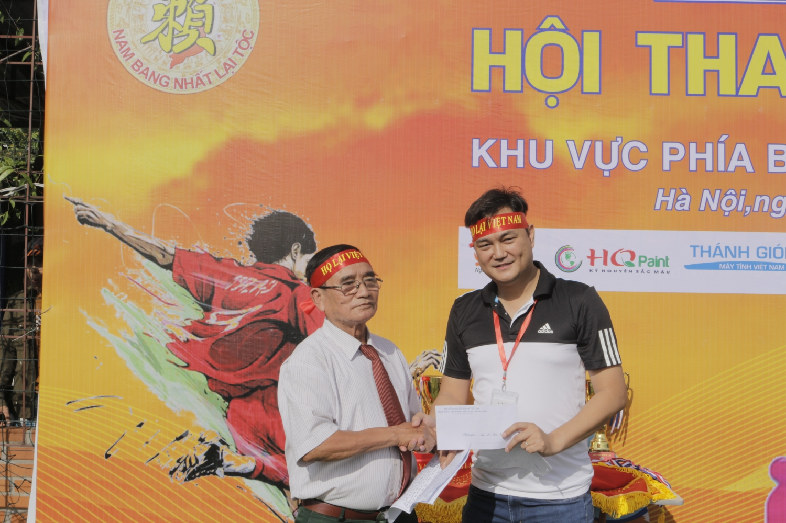

**QUYẾT ĐỊNH**

Về việc tổ chức Hội thao Họ Lại Việt Nam lần thứ 4 năm 2022

 

- Căn cứ Điều lệ hoạt động của Hội đồng Gia tộc Họ Lại Việt Nam;
- Xét đề nghị của Ban Thường trực Hội đồng Gia tộc Họ Lại Việt Nam;
- Xét mong muốn và nguyện vọng của các đoàn thể thao các chi họ Lại,

**QUYẾT ĐỊNH**

**Điều 1.** Thành lập Ban tổ chức Hội thao Họ Lại Việt Nam lần thứ 4 năm 2022 (có danh sách kèm theo trong điều lệ Hội thao).  **Điều 2.** Ban tổ chức có nhiệm vụ tổ chức và điều hành giải theo Điều lệ, đảm bảo khách quan, an toàn và tự giải thể sau khi hoàn thành nhiệm vụ.  **Điều 3.** Quyết định này có hiệu lực từ ngày ký. Các Ông (Bà) có tên ở Điều 1 chiểu Quyết định thi hành./.  

 

| ***Nơi nhận:***    - Như điều 3;    - Chủ tịch Hội đồng Gia tộc (để báo cáo);    - Lưu: Ban truyền thông Họ Lại Việt Nam. | **TM. HỘI ĐỒNG GIA TỘC HỌ LẠI VIỆT NAM**    **CHỦ TỊCH**                     **Lại Thế Tác** |
| --- | --- |
