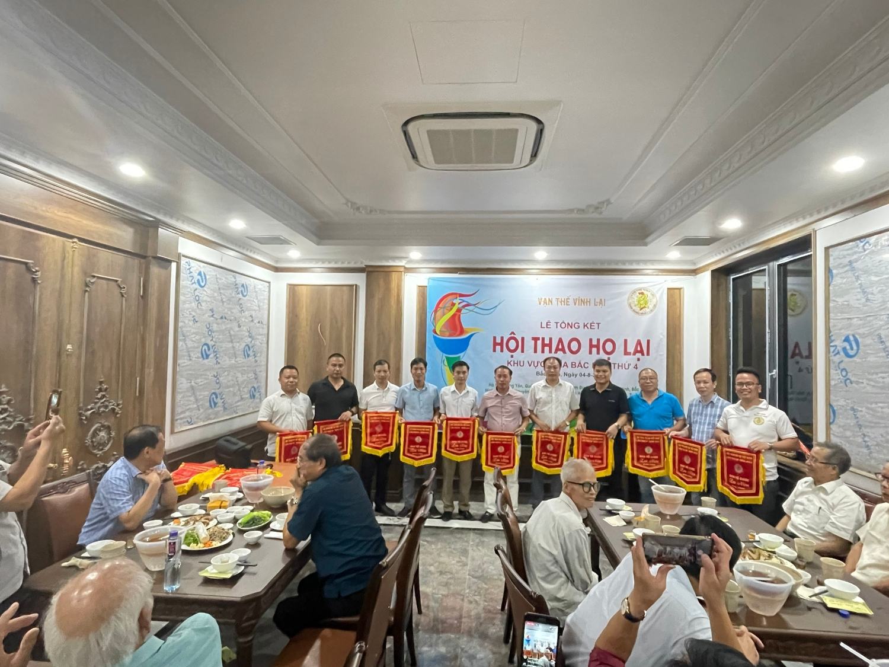
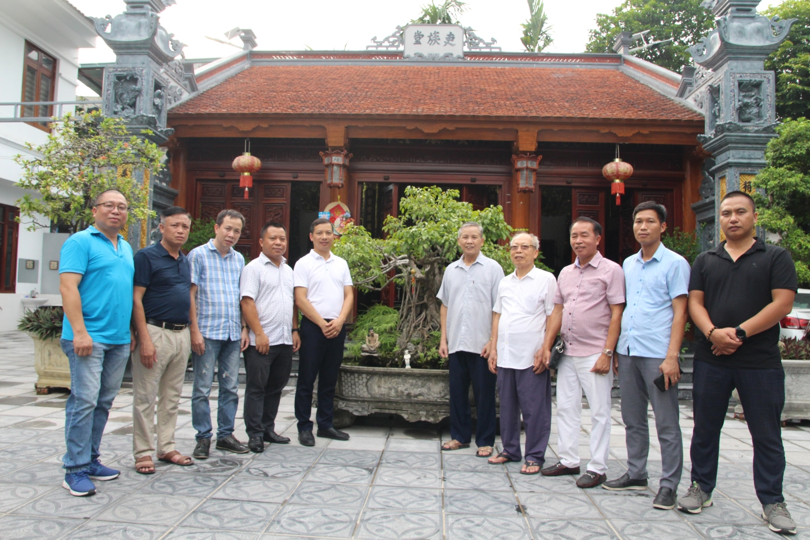
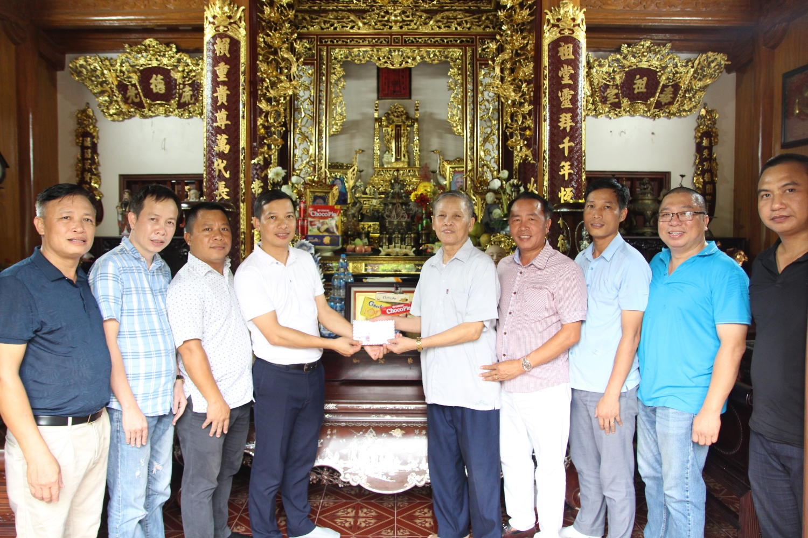
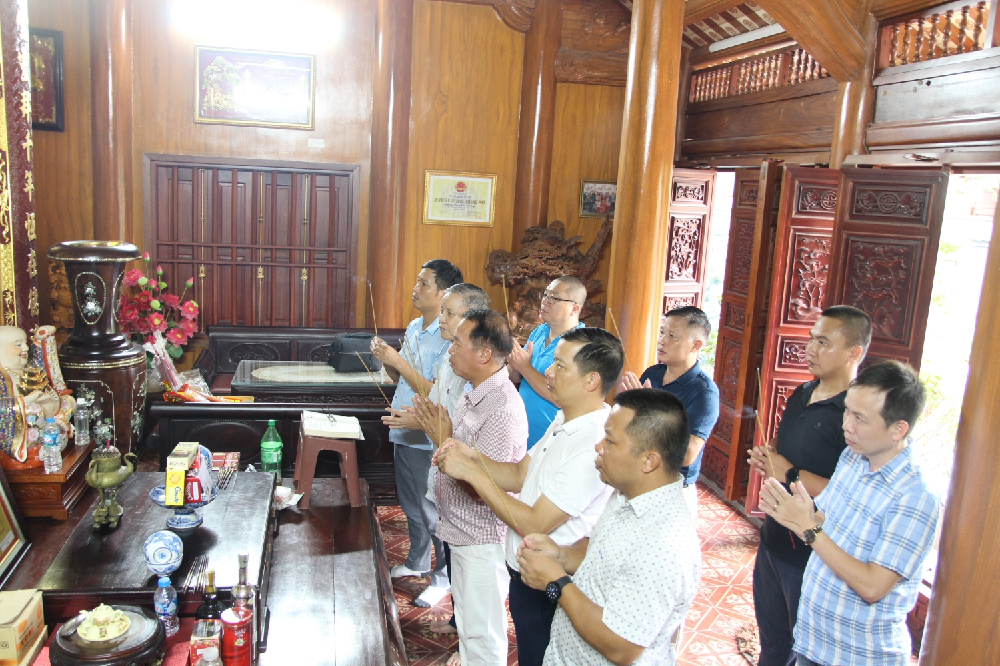
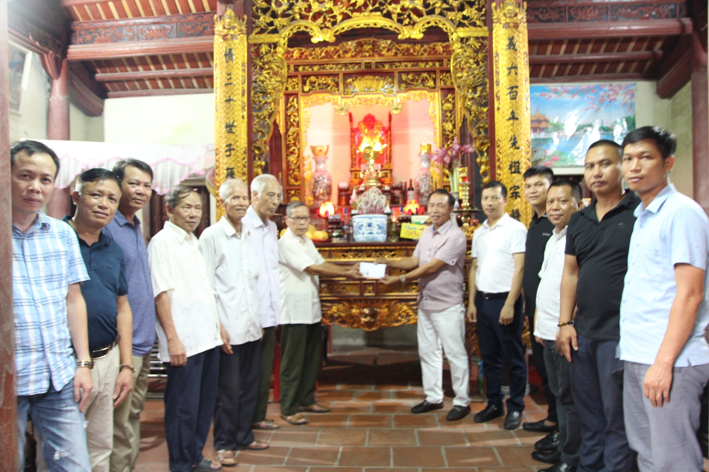
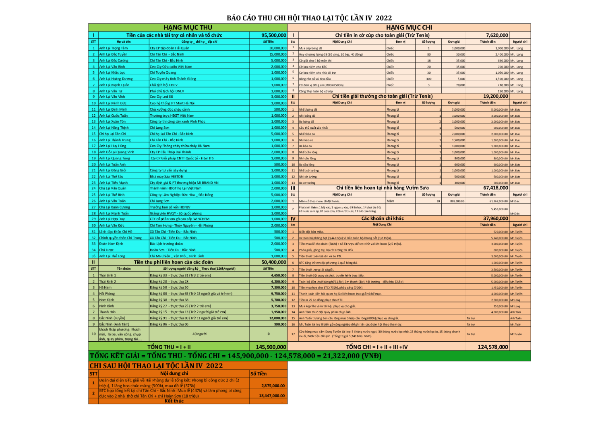
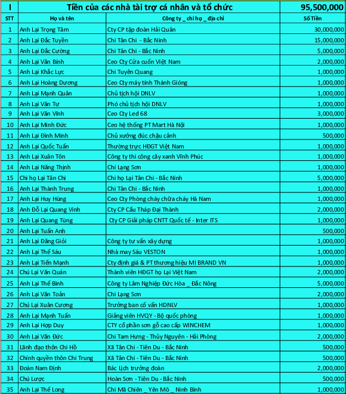

Vào 18h, ngày 4/8/2022, BTC Hội thao đã tổ chức lễ tổng kết rút kinh nghiệm sau khi hội thao Họ Lại Việt Nam lần thứ 4 được tổ chức vào ngày 17/7/2022 đã kết thúc. Về tham dự lễ tổng kết BTC vinh dự khi được đón tiếp các đồng chí Đảng Uỷ, HĐND, UBND xã Tân Chi cũng các Ông trưởng chi Họ Lại tại Bắc Ninh cũng đã về tham dự và có nhiều đóng góp cho BTC.  

Trước khi diễn ra lễ tổng kết, BTC đã thắp hương lễ tạ tiên tổ và trao tiền công đức cho nhà thờ chi Họ Lại Hoàn Sơn và Chi Trung, Huyện Tiên Du, Tỉnh Bắc Ninh. (Tổng 18.447.000 Vnđ, đây là số tiền dư sau khi tổ chức hội thao).

**BTC chụp ảnh lưu niệm tại nhà thờ họ Lại chi Hoàn Sơn**

**BTC trao tiền công đức cho đại diện chi Hoàn Sơn**

 

**BTC trao tiền công đức cho đại diện Chi Họ Lại Tân Chi**

Sau khi đoàn BTC dâng hương lễ tạ cáo tổ và trao tiền công đức đoàn đã nhận lời mời tham dự liên hoan của Chi họ Lại Xã Tân Chi. Trong buổi liên Hoan, BTC đã nhận được nhiều sự đóng góp ý kiến quý báu từ các đồng chí lãnh đạo địa phương và các thành viên BTC đơn vị chủ nhà, đặc biệt là các cụ các bác tham dự sự kiện. Bên cạnh một số góp ý nhỏ, phần lớn mọi người đều hoan hỷ, vui mừng gửi lời chúc và lời cảm ơn tới BTC đã vất vả và nỗ lực tạo nên một sự kiện thành công tốt đẹp. Hội thao đã để lại dư âm về tinh thần đoàn kết, sự tự hào Họ Lại Việt Nam và tinh thần thể thao tươi đẹp giữa những người con mang trong mình dòng máu họ Lại.

**Trưởng BCĐ trao cờ lưu niệm cho các thành viên BTC**

Trưởng BCĐ Hội thao đã trao cờ lưu niệm thay cho sự ghi nhận đóng góp của các thành viên trong BTC cho sự kiện cũng như cho các phong trào của Họ Lại Việt Nam. Các cụ và các ông tham dự sự kiện cũng mong rằng BTC nói riêng, thanh niên họ Lại nói chung hãy luôn giữ được ngọn lửa nhiệt huyết và tinh thần NAM BANG NHẤT LẠI để cùng chung tay đoàn kết xây họ Lại - Kết nối vì một Họ Lại Việt Nam phát triển trường tồn.  

Cùng nhìn lại một số con số của Hội thao:  " Hội thao năm nay thu hút 7 tỉnh tham dự, với 5 môn thi đấu là Bóng đá, Tennis, Cầu Lông, Cờ Tướng, Kéo Co. Trong đó có 8 đội bóng đại diện cho 7 tỉnh tham dự là: Bắc Ninh, Thái Bình, Nam Định, Hà Nam, Ninh Bình, Hải Phòng, Thanh Hoá. Các Vận động viên đã có một tinh thân thi đấu nhiệt huyết, cao thượng, trung thực, fair-play. Tình đoàn kết, sự nhiệt huyết cống hiến hết mình của các VĐV đã tạo nên một hội thao hấp dẫn. Cống hiến cho khán giả, người hâm mộ những trận đấu bóng đá, cầu lông, Tennis hay nhất, những trận đấu trí cờ tưởng cam go và màn đọ sức kéo co đầy sức mạnh. Đặc biệt môn bóng đá có nhiều bàn thắng đẹp mắt từ các pha: sút bóng sút xa, đánh đầu, tình huống cố định, phối hợp nhóm. Chúng ta đã có những phút giây hạnh phúc, thăng hoa, đồng hành cùng các vận động viên và xen lẫn cả những giọt nước mắt, cả sự tiết nuối.  Những hơn tất cả, Hội thao Họ Lại lần thứ 4 năm 2022 đã tăng cường nâng cao sức khỏe, tạo sân chơi lành mạnh cho các vận động viên, các chi Họ Lại có cơ hội giao lưu, học tập lẫn nhau, tăng cường sức khỏe, tình đoàn kết, là tiền đề để xây dựng mỗi gia đình, dòng họ Lại và đất nước Việt Nam phát triển." Trích bài phát biểu tổng kết của Trưởng ban chỉ đạo Lại Trọng Tâm.  
 

**Báo cáo tài chính Hội Thao**

 

**Danh sách nhà tài trợ Hội Thao**
