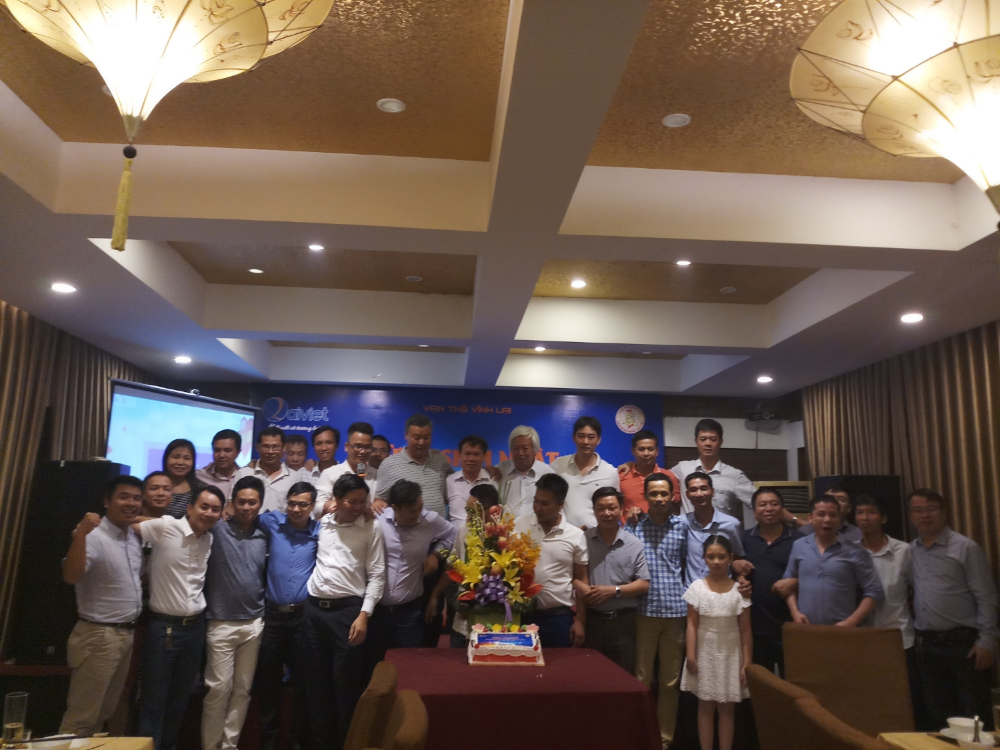

**THƯ CHÚC MỪNG** **HDN** **LẠI VIỆT CỦA** **BAN CỐ VẤN HỘI**  
**NHÂN NGÀY DOANH NHÂN VIỆT NAM 13/10/20****22**

___________________

*Thân gửi**: Hội doanh nhân Lại Việt!***

Nhân dịp kỷ niệm 14 năm ngày Doanh nhân Việt Nam (13/10/2004 – 13/10/2022), thay mặt Ban cố vấn HDNLV, tôi gửi tới toàn thể doanh nhân LẠI VIỆT lời chúc mừng tốt đẹp nhất.  Trong công cuộc xây dựng đất nước và đổi mới, hội nhập kinh tế quốc tế, các doanh nhân Việt nam nói chung, trong đó có doanh nhân LẠI VIỆT nói riêng đã nỗ lực hoàn thành thắng lợi các kế hoạch, mục tiêu sản xuất kinh doanh, đóng góp tích cực, quan trọng vào sự phát triển kinh tế - xã hội. Tôi đánh giá cao và biểu dương những thành tích mà cộng đồng doanh nhân Lại Việt đạt được trong thời gian qua. Doanh nhân Lại Việt chúng ta cùng với doanh nhân Việt Nam đã chủ động vươn ra thị trường trong nước, thế giới, tiếp cận công nghệ hiện đại, tiên tiến, từng bước xây dựng vị thế của mình trên thị trường trong nước và quốc tế; đồng thời doanh nhân Lại Việt còn chú trọng xây dựng tình đoàn kết trong dòng họ, tương trợ lẫn nhau cùng phát triển bền vững; tích cực tham gia các hoạt động mang tính cộng đồng dòng họ, xã hội.       
Nhân kỷ niệm ngày Doanh nhân VN, chúng ta cũng đồng thời điểm lại kỷ niệm ngày Doanh nhân LV (03/6/2017 – 03/6/2022), tôi ghi nhận rằng, Hội doanh nhân Lại việt tuy mới được thành lập hơn 05 năm qua, nhưng đã thực hiện nhiều việc cụ thể, thiết thực, có hiệu quả cao như, phối hợp với Ban liên lạc con cháu Họ Lại VN… giúp HĐGTHLVN tổ chức thành công Đại Lễ cầu an cầu siêu Tổ Tiên, Mẹ VN Anh hùng, anh hùng các Liệt sỹ Họ Lại VN; 04 lần tổ chức thành công Hội thao Họ Lại; sáu lần tổ chức Ngày Hội Xuân tại Hà Nội và tại các địa phương. Hội doanh nhân Lại việt đã chủ động tổ chức thăm và động viên một số DN tiêu biểu thuộc Hội; tổ chức thành công tọa đàm với chủ đề Cơ hội phục hồi hậu COVID và giải pháp cho doanh nghiệp Lại Việt; giao lưu với một số chi họ... Đặc biệt là Hội đã phát động hai đợt đóng góp công đức Nhà thờ Tổ để mua đất bổ sung cho khuôn viên Nhà thờ và nâng cấp Lăng mộ tổ tại Hà Dương, Hà Trung, Thanh Hóa, tổng cộng là trên 280 triệu VN đồng...  

Tuy nhiên, bên cạnh những thành tích đạt được, cũng cần thẳng thắn thừa nhận rằng, chúng ta, Hội doanh nhân mới thành lập, trên 05 năm, từ không đến có, các hội viên có thâm niên nhiều năm, cũng như hội viên mới lập nghiệp, không sao tránh khỏi những tồn tại như chưa phát huy ưu thế việc liên doanh liên kết giữa các doanh nghiệp, chưa hỗ trợ nhau trong việc khởi nghiệp, chưa thiết lập được các chuỗi sản xuất khu vực, trên cả nước. Doanh nhân Lại Việt chưa triển khai rõ nét nội dung Chiến lươc, cũng như Điều lệ Hội đã được phê duyệt.           
Để hoàn thành nhiệm vụ mà Đảng, Nhà nước và Chính phủ tin tưởng giao cho đội ngũ doanh nhân Việt Nam nói chung, cũng như nhiệm vụ mà HĐGTHLVN tin tưởng giao Hội DNLV nói riêng là đổi mới, khởi nghiệp, tôi đề nghị và mong muốn các doanh nhân Lại Việt sẽ luôn phát huy tính năng động, sáng tạo, tự chủ, khắc phục những tồn tại để đưa doanh nghiệp Họ Lại vượt qua mọi thử thách, hoàn thành xuất sắc các mục tiêu đề ra, đóng góp vào sự nghiệp công nghiệp hóa, hiện đại hóa đất nước, cũng như tăng cường sự đoàn kết phát triển Hội doanh nhân Lại Việt, dòng Họ Lại.  

Nhân dịp này, tội cũng xin thông báo Kế hoạch Ngày Giỗ Tổ năm 2023 (ngày 15/01 âm lịch, năm 2023) của HĐGT để Hội Doanh nhân Lại Việt biết: HĐGT đã có chủ trương tổ chức Ngày Giỗ Tổ, kết hợp Tổng kết sau 32 năm hoàn thành việc quy hoạch tổng thể Nhà thờ, nâng cấp Lăng mộ Tổ, xây dựng mới một số hạng mục công trình trong khuôn viên Nhà thờ, như: Nhà bái đường; Nhà thờ Mẫu; Nhà ăn; Bãi đỗ xe; lát sân; cổng Tam Quan; nâng cấp đường điện... Thường trực HĐGT sẽ có Giấy mời gửi các tổ chức, doanh nghiệp, các chi họ, con cháu trong nước và nước ngoài, trong đó có Hội Doanh nhân Lại Việt, mong Hội thông báo đến các thành viên tham dự.  

Nhân ngày 13/10/2022, ngày vui của cộng đồng Doanh nhân Việt Nam nói chung, Hội Doanh nhân Lại Việt nói riêng, thay mặt Ban Cố vấn Hội doanh nhân Lại Việt tôi xin chúc toàn thể các doanh nhân Lại Việt sức khỏe, thành công, sự bình an, thịnh vượng.

 **TM.****BCVHDN** **LẠI VIỆT**  **TRƯỞNG BAN**                                                     
 **Lại** **Xuân Cương**
