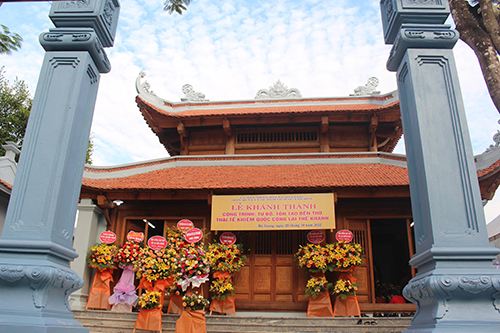

Dự lễ có đồng chí Lại Thế Nguyên, Phó Bí thư Thường trực Tỉnh ủy, Trưởng đoàn Đại biểu Quốc Hội tỉnh Thanh Hóa; Đồng chí Nguyễn Văn Khiêm, TUV, Giám đốc Sở GTVT; Đồng chí Trần Duy Bình, TUV, Bí thư huyện ủy; Đồng chí Nguyễn Ngọc Thức, Phó bí thư, Chủ tịch UBND huyện; Đồng chí Lê Thanh Hải, Chủ tịch UBND huyện Hoằng Hóa, Nguyên Chủ tịch UBND huyện Hà Trung; Các đồng chí trong BTV Huyện hủy; Lãnh đạo các huyện Hậu Lộc, Hoằng Hóa; Hội đồng Gia tộc Họ Lại Việt Nam, Họ Lại các Tỉnh, Thành Phố trong cả nước; Lãnh đạo xã Hà Giang cùng bà con nhân dân trong xã.

                                            
***Các đại biểu dự lễ.***

Đền thờ Lại Thế Khanh được xây dựng ở làng Quan Chiêm - xã Hà Giang, huyện Hà Trung. Đây là vùng đất Bán Sơn địa - nơi chuyển tiếp từ miền núi xuống đồng bằng. Cảnh quan ở đây vừa có núi, đồi, sông lại vừa có cả những cánh đồng thấp trũng. Đứng từ Cầu Cừ (địa danh nằm trên đường quốc lộ 1A), từ xa chúng ta chỉ thấy có màu trắng của nước và màu xanh sẫm của núi, còn xóm làng thì ẩn mình dày đặc và chi chít ngay chân núi. So với nhiều làng Việt cổ xứ đồng chiêm trũng khác, dân cư của từng làng ở đây sống quây quần trên những “bái” đất cao mà xung quanh là nước. Hầu hết các làng đều lấy thế núi để dựa lưng và hướng mặt về phía sông Hoạt. Nếu có đến đây thì mới nhận rõ tính chất quàn cư lâu đời của các làng Việt xứ đồng chiêm trũng.

Lại Thế Khanh người làng Quang Lãng, huyện Tống Sơn, nay là làng Đông Thôn, xã Hà Dương, huyện Hà Trung, tỉnh Thanh Hóa. Họ Lại ở đây đã nhiều đời làm quan phò tá nhà Lê. Vốn dòng dõi Công hầu khanh tướng, vừa là bậc tôi trung, Lại Thế Khanh có tâm nguyện phò Lê, diệt Mạc. Tôi luyện qua thử thách, ông và các bậc hào kiệt họ Lại được nhà Lê tin dùng. Với tư chất thông minh, trí dũng danh tướng họ Lại đã lập nhiều chiến công lừng lẫy, được vua Lê ân sủng. Lại Thế Khanh được phong tước hầu, An quận công, rồi Thiếu phó và Thái phó, khi mất được phong tước Thái tể khiêm quốc công.

 

 

**Một số hình ảnh Đền thờ Lại Thế Khanh**

Vào năm đầu Quang Hưng (1578), Lại Thế Khanh qua đời, được vua truy tặng Thái tể Khiêm Quốc công, tên thụy là Công Thuận và ngày 27 tháng 9 âm lịch là ngày giỗ ông. Cũng chính vì vậy, tại vùng đất vua ban này mà đền thờ ông được xây dựng nên. Với vị trí ý nghĩa và giá trị lịch sử của nó, Đền thờ Thái tể Khiêm Quốc công Lại Thế Khanh đã được tỉnh Thanh Hóa xếp hạng là “Di tích lịch sử văn hóa” (QĐ số 4073, ngày 09/12/2011).

Từ xưa đến nay, vùng đất thiêng ở xã Hà Giang - nơi có Đền thờ, Lăng mộ Thái tể Khiêm Quốc công Lại Thế Khanh và vợ ông là bà Hoàng Thị Từ Nghiêm yên nghỉ vĩnh hằng trên khu đồi Rú Chè (đường Thanh Quan xưa) phía bắc làng Quan Chiêm. Trước đây mộ xây bằng gạch, có tường rào bao quanh; hiện tại con cháu tôn tạo nâng cấp lăng mộ hình trụ bát giác với 5 tầng tháp chót vót... Nhiều năm gần đây và hàng năm, trong ngày giỗ ông (27/9 âm lịch) con cháu hậu duệ dòng họ Lại ở xã Hà Giang và nhân dân địa phương đã tổ chức lễ giỗ tri ân tiên tổ, tưởng nhớ về một bậc công thần - một danh tướng tài giỏi có những đóng góp quan trọng trong sự nghiệp trung hưng nhà hậu Lê cách đây gần 5 thế kỷ.

Ngôi Đền có lịch sử tồn tại hơn 500 năm, qua biến cố thăng trầm của lịch sử, thời gian Đền thờ Thái tế Khiêm Quốc công Lại Thế Khanh bị hư hỏng hoàn toàn. Năm 2000 con cháu họ Lại đóng góp tôn tạo lại một số hạng mục để dâng hương giỗ Ngài vào các dịp lễ tết. Năm 2022, Được sự quan tâm của Chính quyền tỉnh Thanh Hóa, Đền thờ Thái tế Khiêm Quốc công Lại Thế Khanh đã được khởi công xây dựng, Đầu tư Tu bổ, tôn tạo di tích lịch sử Đền thờ Lại Thế Khanh, làng Quan Chiêm, xã Hà Giang, huyện Hà Trung phỏng theo kiến trúc gỗ của đền thờ truyền thống trên nền đất mở rộng. Dự án Tu bổ, tôn tạo với quy mô: Tôn tạo cổng tứ trụ, Tôn tạo Đền thờ,Tôn tạo mái nhà Mẫu, Tôn tạo nhà sắp lễ,Tôn tạo nhà vệ sinh,Tôn tạo am hóa vàng, Tôn tạo sân lát gạch, sân lát đá,Tôn tạo hệ thống tường rào, Tôn tạo cây xanh, sân vườn. Tổng mức đầu tư 5.123.003.000 đồng từ nguồn Ngân sách tỉnh hỗ trợ, Ngân sách huyện và nguồn huy động hợp pháp khác.

 

 

**Lãnh đạo tỉnh, huyện, xã và nhân dân Dâng hương tại Đền thờ**

Di tích lịch sử Đền thờ Lại Thế Khanh mang đậm bản sắc văn hóa của địa phương, phát huy yếu tố lịch sử bền vững và tạo nên một không gian mang đậm yếu tố tâm linh là chỗ dựa tinh thần cho người dân địa phương. Đây là một khu du lịch sinh thái văn hóa, tâm linh, là nơi tổ chức các hoạt động lễ hội cho nhân dân địa phương. Là trung tâm du lịch góp phần vào sự hình thành và phát triển chuỗi các di tích danh thắng trên địa bàn huyện.

 

**Lãnh đạo tỉnh, huyện và đại diện dòng họ Lại cắt băng khánh thành**

Tại buổi lễ các đồng chí lãnh đạo tỉnh, lãnh đạo huyện, Lãnh đạo xã Hà Giang đã cắt băng khánh thành công trình tu bổ, tôn tạo Đền thờ Lại Thế Khanh, tại Di tích LSVH cấp tỉnh Đền thờ Lại Thế Khanh, xã Hà Giang, đáp ứng tâm tư nguyện vọng của con cháu Họ Lại nói riêng và nhân dân trong xã, trong huyện nói chung tưởng nhớ công lao to lớn của ông, giúp cho hậu duệ hương khói phụng thờ tri ân người anh hùng hào kiệt Xứ Thanh thuở nào.  

Nguồn: [https://hatrung.thanhhoa.gov.vn/portal/Pages/2022-10-24/Khanh-thanh-cong-trinh-tu-bo-ton-tao-Den-tho-Lai-T4k1po5.aspx](https://hatrung.thanhhoa.gov.vn/portal/Pages/2022-10-24/Khanh-thanh-cong-trinh-tu-bo-ton-tao-Den-tho-Lai-T4k1po5.aspx)
